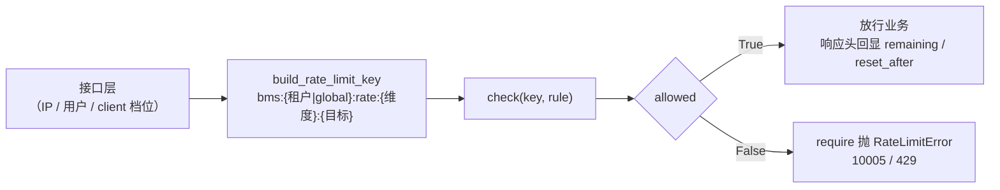
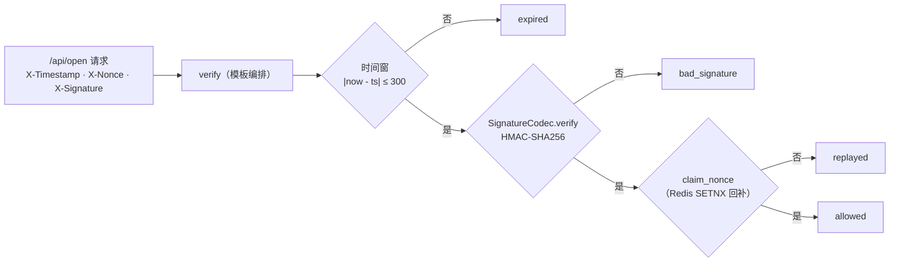

# 限流幂等防重放中间层详细设计

> 项目骨架 · 02 后端基座 · 03 core 横切基座 · 10 限流幂等防重放中间层 · 详细设计

[文档首页](../../../../../../../文档首页.md) › [02-3-10 限流幂等防重放中间层](../02_后端基座_03_core横切基座_10_限流幂等防重放中间层.md) › 01 详细设计　|　[← 父任务](../02_后端基座_03_core横切基座_10_限流幂等防重放中间层.md)

## 1. 概述 <a id="overview"></a>

- **目标**：落地写接口防护三组契约与占位实现——`app/ratelimit/base.py` 的 `BaseRateLimiter`（配额判定）+ `NullRateLimiter`（恒定放行）；`app/idempotency/base.py` 的 `IdempotencyStore`（前置去重 + 首次结果复用）+ `NullIdempotencyStore`（恒定首次）；`app/replay/base.py` 的 `BaseReplayGuard`（时间窗 + 签名 + nonce 去重编排）+ `NullReplayGuard`；并在 `core/security.py` 落签名原语 `SignatureCodec`、在 `core/exceptions.py` 落限流异常 `RateLimitError`（10005 / 429）、三个依赖注入提供者与 `create_app` 装配。
- **范围**：`app/ratelimit/`、`app/idempotency/`、`app/replay/`（新增）、`core/security.py`（签名原语 + 签名头 / 算法常量）、`core/exceptions.py` 与 `core/error_codes.py`（限流错误码）、`app/api/deps.py`（提供者导出）、`app/main.py`（装配）、单测。
- **不含**（归后续阶段）：真实限流实现（slowapi / limits + Redis 后端、IP / 用户 / client 维度就近接入、Redis 故障降级 memory 后端）→ **性能与安全阶段**；真实幂等存储（Redis SETNX 前置拦截 + 首次结果缓存 + 幂等键字段唯一约束兜底）→ **性能与安全阶段**；真实 nonce 去重（Redis SETNX、TTL 与窗口对齐）与开放接口 ingress 接入（`/api/open` 请求头解析、IP 白名单、Client Credentials）→ **性能与安全 / 开放接口阶段**；配额超限告警与 `sys_tenant_quota` 联动 → 租户管理阶段。
- **依据**：需求 [02-25](../../../../../需求/02_需求_后端基座.md#r02-25)、《[架构设计 · 性能与安全](../../../../../../../设计/架构设计/30_架构设计_性能与安全.md)》「限流与降级」节、《[架构设计 · 接口与集成](../../../../../../../设计/架构设计/09_架构设计_接口与集成.md)》「对外 API」节、《[架构设计 · 数据架构](../../../../../../../设计/架构设计/07_架构设计_数据架构.md)》「key 空间规划」节、《[架构设计 · 后端基础类体系](../../../../../../../设计/架构设计/04_架构设计_后端基础类体系.md)》「阶段落地（地基波 + 回补）」节、《[后端开发规范](../../../../../../../规范/后端开发规范.md)》「后端基座体系（强制）」节、《[API接口规范](../../../../../../../规范/API接口规范.md)》「幂等 / 限流 / 审计」节。

## 2. 现状与差距 <a id="gap"></a>

| 现状 | 差距 |
| --- | --- |
| 全库无 `BaseRateLimiter` / `IdempotencyStore` / 防重放契约（检索零命中）；无 `app/ratelimit/`、`app/idempotency/`、`app/replay/` 目录 | 写接口幂等键、接口限流、开放接口防重放无统一入口；各模块自研会让策略与 Redis key 口径发散 |
| 限流矩阵、幂等键、防重放口径已定案（架构 30「限流与降级」、架构 09「对外 API」、架构 07「key 空间规划」、规范「幂等 / 限流 / 审计」） | 无契约承载「是否放行（配额）」「是否首次（去重）」「是否重放（时间窗 + 签名 + nonce）」 |
| `core/security.py` 已有安全原语族（`PasswordHasher` / `TokenCodec` / `SessionSecurity`，占位）；**无请求签名原语**，签名串料全库无定案 | 开放接口 `X-Signature`（HMAC）无统一实现，出站 Webhook 亦需复用同一算法工具 |
| `core/error_codes.py` 通用段码位至 10004（参数 / 不存在 / 冲突 / 并发冲突）；无「限流」码位 | 限流拒绝无专用错误码，接口层无法区分于其他通用错误 |
| `app/api/deps.py` 已汇总 11 个能力域提供者 | 三个新能力域无提供者，「依赖注入可解析」无落点 |

## 3. 交付物清单 <a id="tree"></a>

```text
backend/
├── app/ratelimit/__init__.py             # 新增：能力域包（docstring 口径）
├── app/ratelimit/base.py                 # 新增：RATE_LIMIT_DIMENSIONS / RateLimitRule / RateLimitDecision / BaseRateLimiter / NullRateLimiter / build_rate_limit_key / get_rate_limiter
├── app/idempotency/__init__.py           # 新增：能力域包（docstring 口径）
├── app/idempotency/base.py               # 新增：IDEMPOTENCY_HEADER / IdempotencyStore / NullIdempotencyStore / build_idempotency_key / get_idempotency_store
├── app/replay/__init__.py                # 新增：能力域包（docstring 口径）
├── app/replay/base.py                    # 新增：TIMESTAMP_HEADER / NONCE_HEADER / REPLAY_WINDOW / ReplayReason / ReplayDecision / BaseReplayGuard / NullReplayGuard / get_replay_guard
├── app/core/security.py                  # 修改：SIGNATURE_HEADER / SIGNATURE_ALGORITHM + SignatureCodec（真实实现）
├── app/core/error_codes.py               # 修改：ErrorCode.RATE_LIMIT = 10005
├── app/core/exceptions.py                # 修改：RateLimitError（10005 / 429）
├── app/api/deps.py                       # 修改：导出 get_rate_limiter / get_idempotency_store / get_replay_guard
├── app/main.py                           # 修改：装配 app.state.rate_limiter / idempotency_store / replay_guard
└── tests/
    ├── ratelimit/test_ratelimit.py       # 新增：Kiwi 43（契约 / 规则与维度 / key / 占位放行 / 拒绝语义 / 依赖解析）
    ├── idempotency/test_idempotency.py   # 新增：Kiwi 43（契约 / 常量 / 占位恒定首次 / 依赖解析）
    ├── replay/test_replay.py             # 新增：Kiwi 43（编排顺序 / 超窗 / 签名 / nonce 去重 / 占位语义 / 依赖解析）
    └── core/test_security.py             # 修改：Kiwi 43（签名常量 / 串料 / 往返与容错比对）

bms文档/
├── 设计/架构设计/04_架构设计_后端基础类体系.md    # 修改：§4 基类清单 + §6 core 横切（安全基座补签名原语、异常补 10005）+ §8 跨阶段基座契约表
├── 设计/架构设计/09_架构设计_接口与集成.md        # 修改：错误码分段说明补限流码位登记口径
├── 后端基类清单.md                                # 修改：§2 分层总览 + §9 跨阶段基座 + §10 继承链与代码位置
├── 规范/后端开发规范.md                            # 修改：§3.1 强制用法（限流 / 幂等 / 防重放口径）
├── 项目/01_项目骨架/计划/01_计划_项目骨架.md      # 修改：§3.1 后续阶段待办登记回补窗口
├── 项目/01_项目骨架/需求/02_需求_后端基座.md      # 修改：需求 02-25 补实现期要点注块（回补对齐依据）
└── 项目/01_项目骨架/任务/02_后端基座/02_后端基座_04_跨阶段基座/02_后端基座_04_跨阶段基座_06_出站集成基座/02_后端基座_04_跨阶段基座_06_出站集成基座.md   # 修改：补「前置契约（已交付）」条目（签名工具复用）
```

## 4. 限流能力域（`app/ratelimit/base.py`） <a id="ratelimit"></a>

| 成员 | 形态 | 说明 |
| --- | --- | --- |
| `RATE_LIMIT_DIMENSIONS` | `tuple[str, ...]` 常量 | 限流维度清单：`("ip", "user", "client")`（内部接口按 IP / 用户、开放接口按 client） |
| `DEFAULT_RATE_WINDOW` | `int` 常量 | 默认窗口 60 秒；`RateLimitRule.limit` 必填由调用方按接口档位给出 |
| `RateLimitRule` | frozen dataclass | 限流规则：`limit`（窗口内最大次数）/ `window`（窗口秒） |
| `RateLimitDecision` | frozen dataclass | 判定结果：`allowed` / `limit` / `remaining` / `reset_after`（供 `X-RateLimit-Limit` / `-Remaining` / `-Reset` 响应头） |
| `BaseRateLimiter(BaseCapability, ABC)` | 能力域契约中间层 | `key: str = "rate_limiter"` |
| `check(key, rule) -> RateLimitDecision` | 抽象方法（async） | 判定配额（不抛错、返回决策） |
| `require(key, rule) -> RateLimitDecision` | 具体方法（async） | 接口层一行接入：不放行抛 `RateLimitError`（10005 / 429） |
| `NullRateLimiter(BaseRateLimiter, BaseNullObject)` | 占位实现 | **恒定放行**：`remaining = limit`、`reset_after = 0`（不连 Redis、不计数） |
| `build_rate_limit_key(*, dimension, target, tenant=None)` | 模块函数 | 限流 key 统一拼接 `bms:{租户\|global}:rate:{维度}:{目标}` |
| `get_rate_limiter(request) -> BaseRateLimiter` | 模块函数（提供者） | 取应用级单例（`request.app.state.rate_limiter`） |



**口径**：

| 情形 | 处置 |
| --- | --- |
| 返回形态 | **配额判定结果**（`RateLimitDecision`）——基座不接管调用链、不写响应头（响应头由接口层按 decision 回写） |
| 占位语义 | `NullRateLimiter` 恒定放行＝**不限流**（占位期不改现状行为） |
| `check` 与 `require` | `check` 供需要自行处置（如告警 / 降级）的调用方；`require` 供接口层一行接入，共用同一次 `check` 判定，不建第二套逻辑 |
| 维度取值 | 建议取 `RATE_LIMIT_DIMENSIONS` 之一；占位不校验（真实实现按维度取档位规则） |
| 降级 | Redis 故障降级 memory 后端属**限流实现内部策略**（回补阶段），与全局降级矩阵口径对齐见 [02-3-8 降级与熔断基座](../../02_后端基座_03_core横切基座_08_降级与熔断基座/02_后端基座_03_core横切基座_08_降级与熔断基座.md)「降级动作取用」条 |

## 5. 幂等能力域（`app/idempotency/base.py`） <a id="idempotency"></a>

| 成员 | 形态 | 说明 |
| --- | --- | --- |
| `IDEMPOTENCY_HEADER` | `str` 常量 | 幂等键请求头 `Idempotency-Key`（写接口 POST / PUT 统一携带） |
| `DEFAULT_IDEMPOTENCY_TTL` | `int` 常量 | 幂等键默认 TTL 86400 秒（24 小时） |
| `IdempotencyStore(BaseCapability, ABC)` | 能力域契约中间层 | `key: str = "idempotency"` |
| `begin(key, *, ttl) -> bool` | 抽象方法（async） | 前置去重：True＝首次（继续执行业务）；False＝重复（取首次结果返回、**不再执行业务**） |
| `load(key) -> dict[str, object] \| None` | 抽象方法（async） | 取首次结果的序列化载荷 |
| `save(key, payload, *, ttl) -> None` | 抽象方法（async） | 写首次结果（供重复请求复用） |
| `NullIdempotencyStore(IdempotencyStore, BaseNullObject)` | 占位实现 | **恒定首次**：`begin` 恒 True、`load` 恒 None、`save` 空操作（不连 Redis） |
| `build_idempotency_key(*, key, tenant=None)` | 模块函数 | 幂等 key 统一拼接 `bms:{租户\|global}:idem:{键}` |
| `get_idempotency_store(request) -> IdempotencyStore` | 模块函数（提供者） | 取应用级单例（`request.app.state.idempotency_store`） |

**口径**：

| 情形 | 处置 |
| --- | --- |
| 调用序列 | ① `begin` → ② False 时 `load` 取首次结果直接回响应 / True 时执行业务 → ③ `save` 首次结果 |
| 并发穿透 | 前置去重为**第一道**，幂等键字段唯一约束为**第二道兜底**（并发穿透时拒绝重复提交）；约束落库归落库阶段 |
| 占位语义 | `NullIdempotencyStore` 恒定首次＝**不拦截重复**（占位期不改现状行为） |
| 键来源 | 请求头 `Idempotency-Key`（`IDEMPOTENCY_HEADER`）；缺失时由接口层决定是否强制（回补阶段随写接口接入定稿） |
| 载荷形态 | `dict[str, object]`（响应体序列化结果，JSON 友好）；大响应体与二进制不由本基座缓存 |

## 6. 防重放能力域（`app/replay/base.py`） <a id="replay"></a>

| 成员 | 形态 | 说明 |
| --- | --- | --- |
| `TIMESTAMP_HEADER` / `NONCE_HEADER` / `SIGNATURE_HEADER` | `str` 常量 | `X-Timestamp`（Unix 秒）/ `X-Nonce`（随机唯一串）/ `X-Signature`（HMAC hex 小写；从 `core/security.py` 再导出） |
| `REPLAY_WINDOW` | `int` 常量 | 时间窗 300 秒（架构「对外 API」节 ±5 分钟）；nonce TTL 与之对齐 |
| `ReplayReason` | `StrEnum` | 拒绝原因：`expired`（超窗）/ `bad_signature`（签名不符）/ `replayed`（nonce 重复） |
| `ReplayDecision` | frozen dataclass | 判定结果：`allowed` / `reason`（放行为 None） |
| `BaseReplayGuard(BaseCapability, ABC)` | 能力域契约中间层 | `key: str = "replay_guard"`；构造可注入 `SignatureCodec`（缺省标准库实现） |
| `verify(*, method, path, timestamp, nonce, signature, secret, body="", window=REPLAY_WINDOW, now=None) -> ReplayDecision` | **模板方法**（async，具体） | 固定编排「时间窗 → HMAC 签名 → nonce 去重」，任一不通过即**短路**返回 |
| `claim_nonce(nonce, *, ttl=REPLAY_WINDOW) -> bool` | 抽象方法（async） | 占用 nonce：True＝首次；False＝窗口内重复 |
| `require(...)` | 具体方法（async） | 接口层一行接入：不通过抛 `AuthError`（20001 / 401） |
| `NullReplayGuard(BaseReplayGuard, BaseNullObject)` | 占位实现 | `claim_nonce` **恒定 True**（不连 Redis＝不拦截重复 nonce）；**时间窗与签名占位期即真实生效** |
| `get_replay_guard(request) -> BaseReplayGuard` | 模块函数（提供者） | 取应用级单例（`request.app.state.replay_guard`） |



**签名口径（开放接口对接契约）**：

| 项 | 口径 |
| --- | --- |
| 算法 | `HMAC-SHA256`（`SIGNATURE_ALGORITHM = "sha256"`），摘要 hex 小写 |
| 串料 | `{method}\n{path}\n{timestamp}\n{nonce}\n{body}`——**方法统一大写**；`path` 不含查询串；`body` 为**原始请求体**（无体传空串，不重新序列化） |
| 请求头 | `X-Timestamp`（Unix 秒）/ `X-Nonce` / `X-Signature` |
| 密钥 | 调用方凭证（开放接口为 `sys_client` secret，只存哈希）；由调用方传入，基座**不读库、不落日志、不入镜像** |
| 比对 | `hmac.compare_digest` 恒定时间比对；签名入参做 `strip().lower()` 容错 |

**口径**：

| 情形 | 处置 |
| --- | --- |
| 编排顺序 | 时间窗 → 签名 → nonce（**短路**）：时间窗不过不校验签名、签名不过不占用 nonce（避免用无效请求耗尽 nonce 空间） |
| `now` 入参 | 供测试注入服务器时间（缺省系统时间），保证用例确定性与边界可测 |
| 失败语义 | `verify` 只返回决策不抛错；`require` 失败抛 `AuthError`（20001 / 401）——与 02-3-8「基座给判定、异常由接口层统一抛」口径一致 |
| 占位语义（**混合口径**） | 时间窗与签名是**纯计算**（零外部依赖、零存储）→ **占位期即真实生效**；nonce 去重依赖 Redis → `NullReplayGuard` 恒定通过（不拦截）。即占位期防护非空转，但不含跨实例去重 |
| 与 OAuth2 scope | scope 为授权面收敛（第三方可访问范围），防重放为请求真实性；两者叠加（先鉴权 → 再防重放）→ [02-3-13 开放接口 OAuth2 服务端与 scope 基座](../../02_后端基座_03_core横切基座_13_开放接口OAuth2服务端与scope基座/02_后端基座_03_core横切基座_13_开放接口OAuth2服务端与scope基座.md) |
| 与出站 Webhook 签名 | 出站 `sha256(secret, body)`（架构 15 事件总线 / 概要设计 Webhook 管理）**复用本任务 `SignatureCodec`** 的算法工具，串料差异在 02_04 出站集成基座落地时对齐 |

## 7. core 侧变更 <a id="core"></a>

| 落点 | 变更 | 说明 |
| --- | --- | --- |
| `core/security.py` | `SIGNATURE_HEADER = "X-Signature"` / `SIGNATURE_ALGORITHM = "sha256"` + **`SignatureCodec`**（原语类，与 `PasswordHasher` / `TokenCodec` / `SessionSecurity` 并列，继承 `BaseSecurity`） | `build_payload` / `sign` / `verify` 三方法；**真实实现**（标准库 `hmac` + `hashlib`）——签名是纯计算、无密钥托管、无外部依赖，不属「需随阶段回补」的占位范畴；供防重放域与出站 Webhook 复用 |
| `core/error_codes.py` | `ErrorCode.RATE_LIMIT = 10005` | 通用段（1xxxx）内顺延；架构「错误码分段」节已明确 1xxxx 覆盖「限流」 |
| `core/exceptions.py` | `RateLimitError(GeneralError)`（10005 / HTTP 429） | 供 `BaseRateLimiter.require` 与接口层接入；全局处理器统一转 `{code, message, data}` |

> 口径注：`SignatureCodec` 归 `BaseSecurity`（安全原语族）但为**真实实现**——`BaseStub` 仅提供统一 `_not_implemented()` 入口，本类不使用；这与 02-3-3 安全基座「密码哈希 / JWT / 会话原语占位」不冲突（后者需密钥托管与策略，随认证阶段回补）。

## 8. 应用装配与依赖注入 <a id="di"></a>

| 位置 | 变更 |
| --- | --- |
| `app/api/deps.py` | 导出 `get_rate_limiter`（`app/ratelimit/base.py`）、`get_idempotency_store`（`app/idempotency/base.py`）、`get_replay_guard`（`app/replay/base.py`） |
| `app/main.py` `create_app()` | 装配 `app.state.rate_limiter = NullRateLimiter()`、`app.state.idempotency_store = NullIdempotencyStore()`、`app.state.replay_guard = NullReplayGuard()` |

三个提供者均为普通同步函数（取 `app.state` 单例，无上下文变量、无 IO），构造即解析；真实实现替换为 Redis 后端时调用面零改动。

## 9. 继承与分层 <a id="base"></a>

- `BaseRateLimiter → BaseCapability → BaseObject`；`NullRateLimiter → BaseRateLimiter + BaseNullObject → BasePlaceholder → BaseObject`。
- `IdempotencyStore → BaseCapability → BaseObject`；`NullIdempotencyStore → IdempotencyStore + BaseNullObject → BasePlaceholder → BaseObject`。
- `BaseReplayGuard → BaseCapability → BaseObject`；`NullReplayGuard → BaseReplayGuard + BaseNullObject → BasePlaceholder → BaseObject`。
- `RateLimitRule` / `RateLimitDecision` / `ReplayDecision` 为能力域数据契约（frozen dataclass，同 `MaskRule` 风格）；`ReplayReason` 为能力域枚举（同 `FallbackAction` / `CircuitState` 风格）。
- `SignatureCodec → BaseSecurity → BaseStub → BasePlaceholder → BaseObject`（安全原语族）。
- 与进程内 / 跨实例原语的分工：限流与幂等的**跨实例**语义由 Redis 实现（回补）；`app/core/locking.py` 的进程内锁原语仍归并发保护，幂等临界区可叠加 `BaseDistributedLock`（02-3-6）。

## 10. 登记落点 <a id="register"></a>

| 落点 | 登记内容 |
| --- | --- |
| 《架构设计 · 后端基础类体系》§4 基类清单 | 新增三行（`BaseRateLimiter` / `NullRateLimiter`、`IdempotencyStore` / `NullIdempotencyStore`、`BaseReplayGuard` / `NullReplayGuard`）+ `SignatureCodec` 行 + 继承链补四条 |
| 《架构设计 · 后端基础类体系》§6 core 横切基座 | 「安全基座」补签名原语；「异常与错误码」补 `RateLimitError` 10005 |
| 《架构设计 · 后端基础类体系》§8 跨阶段基座契约表 | 新增「限流」「幂等」「防重放」三行（代码位置、契约、回补阶段＝性能与安全） |
| 《架构设计 · 接口与集成》「错误码分段」节 | 补通用段限流码位登记口径（10005 → HTTP 429） |
| 《后端基类清单》 | §2 分层总览补 `app/ratelimit/` / `app/idempotency/` / `app/replay/`；§9 跨阶段基座补三行；§10 继承链与目录补四条 |
| 《后端开发规范》「后端基座体系」节 | §3.1 补口径：限流一律走 `BaseRateLimiter`（`require` 接入）、幂等键一律走 `IdempotencyStore`（`begin` / `load` / `save`）、开放接口防重放一律走 `BaseReplayGuard`（签名取 `SignatureCodec`）；禁止各模块自研限流 / 自拼幂等 key / 自实现签名 |
| 计划《01_计划_项目骨架》「后续阶段待办」节 | 登记「限流 / 幂等 / 防重放真实实现」回补行（性能与安全：slowapi Redis + IP/用户/client 档位、SETNX 前置拦截 + 首次结果缓存 + 唯一约束兜底、nonce Redis 去重 + `/api/open` ingress 接入） |
| 需求 [02-25](../../../../../需求/02_需求_后端基座.md#r02-25) | 参考文档后补 `> 注：实现期要点` 块；实施完成后回写状态 / 完成日期 |
| 02_04 出站集成基座任务文档 | 补「前置契约（已交付）」条目：签名算法与串料工具取 `core/security.py`（本任务交付），出站 HMAC 串料差异对齐 |

## 11. 测试设计（Kiwi 先行） <a id="tests"></a>

用例**先登记 Kiwi TCMS 再编码**（《[测试规范](../../../../../../../规范/测试规范.md)》「用例管理（Kiwi TCMS）」节）；本任务新分配 **Kiwi 43**：

| Kiwi | 用例 | 断言要点 | 自动化文件 |
| --- | --- | --- | --- |
| 43 | 限流契约继承与能力域标识 | `NullRateLimiter → BaseRateLimiter → BaseCapability → BaseObject`；`placeholder` / `describe()`；`key == "rate_limiter"` | `tests/ratelimit/test_ratelimit.py` |
| 43 | 限流规则与维度清单 | `RATE_LIMIT_DIMENSIONS` 三项；`DEFAULT_RATE_WINDOW == 60`；`RateLimitRule` 默认窗口与覆盖 | 同上 |
| 43 | 限流 key 口径 | 租户维度 `bms:t1:rate:user:1001`；全局维度 `bms:global:rate:client:app-1` | 同上 |
| 43 | 占位恒定放行 | `check` 放行且 `remaining == limit`、`reset_after == 0`；`require` 不抛错 | 同上 |
| 43 | 限流拒绝语义 | 拒绝实现下 `require` 抛 `RateLimitError`（`code 10005` / `http_status 429`） | 同上 |
| 43 | 限流依赖解析 | `create_app()` 装配 `NullRateLimiter`；路由经 `Depends(get_rate_limiter)` 取到同一实例 | 同上 |
| 43 | 幂等契约继承与常量 | 继承链 / `key == "idempotency"`；`IDEMPOTENCY_HEADER`、`DEFAULT_IDEMPOTENCY_TTL == 86400` | `tests/idempotency/test_idempotency.py` |
| 43 | 幂等 key 口径 | `bms:t1:idem:abc-1` / `bms:global:idem:abc-1` | 同上 |
| 43 | 占位恒定首次 | `begin` 两次均 True；`load` 恒 None；`save` 空操作不抛错 | 同上 |
| 43 | 幂等依赖解析 | `create_app()` 装配 `NullIdempotencyStore`；路由经 `Depends(get_idempotency_store)` 取到同一实例 | 同上 |
| 43 | 防重放契约与常量 | 继承链 / `key == "replay_guard"`；`REPLAY_WINDOW == 300`；三请求头常量；`ReplayReason` 三值 | `tests/replay/test_replay.py` |
| 43 | 时间窗超窗拒绝 | `now ± (window+1)` 均 `expired`，且**短路**（未调用 `claim_nonce`） | 同上 |
| 43 | 签名不符拒绝 | 错密钥 / 改体 / 改路径均 `bad_signature`，且未调用 `claim_nonce` | 同上 |
| 43 | nonce 重复拒绝 | 首次 `allowed`、同 nonce 再次 `replayed`（进程内去重守卫模拟 SETNX） | 同上 |
| 43 | 占位守卫语义 | 窗口内合法请求放行；超窗 `expired`、错签名 `bad_signature`；**重复 nonce 仍放行**（不连 Redis） | 同上 |
| 43 | `require` 失败语义 | 失败抛 `AuthError`（`code 20001` / `http_status 401`）；合法签名不抛 | 同上 |
| 43 | 防重放依赖解析 | `create_app()` 装配 `NullReplayGuard`；路由经 `Depends(get_replay_guard)` 取到同一实例并校验通过 | 同上 |
| 43 | 签名常量与串料 | `SIGNATURE_HEADER` / `SIGNATURE_ALGORITHM`；串料 = `METHOD\nPATH\nTS\nNONCE\nBODY`（方法大写、无体空串） | `tests/core/test_security.py` |
| 43 | 签名往返与容错 | 与标准库独立复算一致；64 位 hex 小写；大写签名可校验；错密钥 / 改体失败 | 同上 |

回归：Kiwi 33（安全基座原语）随本任务把 `SignatureCodec` 纳入继承 / 可构造断言；全量 `pytest` 无回归。

## 12. 实施步骤 <a id="steps"></a>

1. `core/error_codes.py` 登记 `RATE_LIMIT = 10005`；`core/exceptions.py` 落 `RateLimitError`（429）。
2. `core/security.py` 落 `SIGNATURE_HEADER` / `SIGNATURE_ALGORITHM` + `SignatureCodec`（真实实现）。
3. 新增 `app/ratelimit/`（`RATE_LIMIT_DIMENSIONS` / `RateLimitRule` / `RateLimitDecision` / `BaseRateLimiter` / `NullRateLimiter` / `build_rate_limit_key` / `get_rate_limiter`）。
4. 新增 `app/idempotency/`（`IDEMPOTENCY_HEADER` / `IdempotencyStore` / `NullIdempotencyStore` / `build_idempotency_key` / `get_idempotency_store`）。
5. 新增 `app/replay/`（请求头 / 窗口 / `ReplayReason` / `ReplayDecision` / `BaseReplayGuard`（模板方法）+ `claim_nonce` / `NullReplayGuard` / `get_replay_guard`）。
6. `app/api/deps.py` 导出三提供者；`app/main.py` 装配三个 `app.state` 单例。
7. 测试：先登记 Kiwi 43 用例，再写三个能力域用例文件 + 安全基座签名用例。
8. 登记：架构 04 §4 / §6 / §8、架构 09 错误码分段、《后端基类清单》§2 / §9 / §10、《后端开发规范》§3.1；计划「后续阶段待办」补回补行；需求 02-25 补实现期要点注块；02_04 任务文档补前置契约条（第 10 节）。
9. 验证：`uv run pytest --cov=app -q`、`uv run ruff check .`、`uv run ruff format --check .`、`uv run pyright` 全绿；`python3 scripts/tools/base-check/check-base.py` 五项通过。
10. 回写：实施 / 测试记录 + 任务（02-3-10、02_03 core 横切基座）与需求 02-25 状态、计划表。
11. 遗留处理与提交推送：按「处理偏差与遗留」套路闭环后提交推送。

## 13. 验收映射 <a id="accept-map"></a>

| 完成标准（需求 02-25 / 任务 02-3-10） | 验证方式 |
| --- | --- |
| 接口 / 抽象声明就位、可被上层引用 | 三契约落地 + 继承断言 + Kiwi 43 |
| 依赖注入可解析、应用可启动不报错 | `create_app` 装配三个单例 + 三提供者解析用例 + 应用冒烟 |
| 占位实现恒定通过（不连 Redis） | `NullRateLimiter` 恒放行（且带决策载荷）、`NullIdempotencyStore` 恒首次、`NullReplayGuard` nonce 不拦截 |
| 限流拒绝语义明确 | `RateLimitError`（10005 / 429）用例 |
| 幂等「重复键返回首次结果」链路可表达 | `begin` / `load` / `save` 三段式契约 + 占位用例（真实缓存随回补） |
| 防重放签名口径定稿且可对接 | 串料 / 算法 / 请求头常量 + 签名往返与容错用例 |
| 登记齐备 | 架构 04 §4 / §6 / §8、架构 09 错误码分段、《后端基类清单》§2 / §9 / §10、《后端开发规范》§3.1、计划「后续阶段待办」 |
| 不实现真实能力 | 无 Redis / slowapi 依赖、无跨实例 nonce 去重、无唯一约束落库；仅签名纯计算生效 |
| 无 lint / 类型错误 | `uv run ruff check .`、`uv run ruff format --check .`、`uv run pyright` |

## 14. 边界与开放项 <a id="boundary"></a>

- **真实限流**（slowapi / limits + Redis 后端、维度档位配置、Redis 故障降级 memory 后端、配额告警与 `sys_tenant_quota` 联动）→ 性能与安全 / 租户管理阶段；已登记计划「后续阶段待办」表。
- **真实幂等存储**（Redis SETNX 前置拦截、首次结果缓存与 TTL、幂等键字段唯一约束兜底）→ 性能与安全阶段；约束落库随首个落库阶段。
- **真实 nonce 去重**（Redis SETNX、TTL 与窗口对齐）与 `/api/open` ingress 接入（请求头解析、IP 白名单、Client Credentials、按 client 限流）→ 性能与安全 / 开放接口阶段；同 [02-3-13 开放接口 OAuth2 服务端与 scope 基座](../../02_后端基座_03_core横切基座_13_开放接口OAuth2服务端与scope基座/02_后端基座_03_core横切基座_13_开放接口OAuth2服务端与scope基座.md)（任务文档已标注「协同契约（scope 与权限码分工）」）。
- **登录限流联动**：登录失败限流（5 次锁 15 分钟）与「连续失败 3 次强制图形验证码」的计数窗口由本中间层提供（任务文档已有「登录侧联动（口径）」条）；验证码取 [02-3-7 验证码与密码策略基座](../../02_后端基座_03_core横切基座_07_验证码与密码策略基座/02_后端基座_03_core横切基座_07_验证码与密码策略基座.md) 契约。
- **幂等临界区**：需要跨实例互斥的幂等场景可叠加 [02-3-6 分布式锁基座](../../02_后端基座_03_core横切基座_06_分布式锁基座/02_后端基座_03_core横切基座_06_分布式锁基座.md) 的 `BaseDistributedLock`（任务文档已有「前置契约（已交付）」条）。
- **出站 Webhook 签名**：算法工具取 `core/security.py`（本任务交付），出站串料 `sha256(secret, body)` 差异与推送/重试归 02_04 出站集成基座（任务文档已标注前置契约条）。
- **签名密钥轮换**：`sys_client` secret 重置后的双密钥过渡窗口（旧密钥可校验期）随开放接口阶段定稿。
- **测试**：真实限流 / 幂等 / nonce 去重用例（窗口滑窗、并发穿透唯一约束、Redis 故障降级）随回补阶段补充。

## 15. 对齐记录 <a id="align"></a>

| # | 事项 | 结论 |
| --- | --- | --- |
| 1 | 代码落点 | 三目录：`app/ratelimit/base.py`、`app/idempotency/base.py`、`app/replay/base.py`（一域一目录） |
| 2 | 限流签名 | `check(key, rule) -> RateLimitDecision`；`RateLimitRule`（frozen）+ `RateLimitDecision`（allowed / limit / remaining / reset_after） |
| 3 | 幂等签名 | 三段式 `begin` / `load` / `save`（重复键直接返回首次结果） |
| 4 | 防重放编排 | `verify` 模板方法（时间窗 → 签名 → nonce，短路）+ 抽象 `claim_nonce`；`require` 便捷方法 |
| 5 | 签名口径 | HMAC-SHA256；串料 `{method}\n{path}\n{timestamp}\n{nonce}\n{body}`（**含方法 + 路径**）；头 `X-Signature` |
| 6 | 失败语义 | 决策 + `require` 双口径；防重放失败抛 `AuthError`（20001 / 401） |
| 7 | 常量 | `REPLAY_WINDOW = 300`（nonce TTL 对齐）、`DEFAULT_IDEMPOTENCY_TTL = 86400`、`DEFAULT_RATE_WINDOW = 60` |
| 8 | core 工具形态 | **原语类** `SignatureCodec`（与 `PasswordHasher` / `TokenCodec` 并列，继承 `BaseSecurity`），**真实实现** |
| 9 | 限流错误码 | 新增 `RateLimitError`（10005 / 429）+ `ErrorCode.RATE_LIMIT`，同步架构「错误码分段」节 |
| 10 | 占位语义 | **混合口径**：时间窗 + 签名占位期真实生效（纯计算），nonce 去重 `NullReplayGuard` 恒定通过（不连 Redis） |
| 11 | 与 02_04 划界 | 签名算法工具归 core 复用；02_04 任务文档补「前置契约（已交付）」条 |
| 12 | 依赖注入 | `get_rate_limiter` / `get_idempotency_store` / `get_replay_guard` + 三个 `app.state` 单例 |
| 13 | 异步口径 | 三域全部 async（与 lock / masking / captcha / password / fallback / circuit 统一） |
| 14 | 登记落点 | 架构 04 §4 / §6 / §8、架构 09 错误码分段、《后端基类清单》§2 / §9 / §10、《后端开发规范》§3.1、计划「后续阶段待办」 |
| 15 | 测试 | 新分配 Kiwi 43（平台登记 + `@pytest.mark.kiwi_id(43)`）；Kiwi 33 随本任务扩充签名断言 |
| 16 | 交付范围 | 一条龙（设计 / 实施 / 测试 / 登记 / 记录 / 提交推送）+ 随后独立「处理偏差与遗留」 |
| 17 | 工时 / 窗口 | 1h；02_03 core 横切基座窗口（2026-09-14 ~ 09-20） |

> 本文档依《文档生成规范》编写 · 关键决策逐项确认
