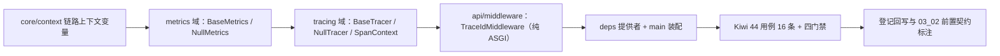

# 可观测性基座实施记录

> 项目骨架 · 02 后端基座 · 03 core 横切基座 · 11 可观测性基座（指标与链路） · 实施记录

[文档首页](../../../../../../../文档首页.md) › [02-3-11 可观测性基座](../02_后端基座_03_core横切基座_11_可观测性基座（指标与链路）.md) › 01 实施　|　[← 父任务](../02_后端基座_03_core横切基座_11_可观测性基座（指标与链路）.md)

## 1. 实施信息 <a id="meta"></a>

| 项 | 值 |
| --- | --- |
| 任务 | [11 可观测性基座（指标与链路）](../02_后端基座_03_core横切基座_11_可观测性基座（指标与链路）.md) |
| 对应需求 | [02-26](../../../../../需求/02_需求_后端基座.md#r02-26) |
| 详细设计 | [11_详细设计_01_可观测性基座](../设计/11_详细设计_01_可观测性基座.md) |
| 实施日期 | 2026-09-14 |
| 实施人 | minjian |
| 实施环境 | 开发机（Ubuntu，Python 3.14 / uv） |
| 提交 | 待提交 |
| 结论 | 完成 |

## 2. 实施概览 <a id="overview"></a>



结果小结：指标与链路两组契约与占位实现落地（`BaseMetrics` / `NullMetrics`、`BaseTracer` / `NullTracer`），`core/context.py` 新增链路上下文变量，入站链路 id 中间件（纯 ASGI）就位并回写 `X-Trace-Id`，应用可启动、两提供者可解析；`pytest` / `ruff` / `pyright` 全绿，新增模块覆盖率 100%。

## 3. 实施过程 <a id="process"></a>

1. **core 上下文**：`app/core/context.py` 新增 `current_trace_id` / `current_span_id` 两个 `ContextVar`（默认 `None`）+ `set/get/reset` 六个辅助（字符串类型，不引入能力域依赖）；模块 docstring 同步补链路变量说明。
2. **指标能力域**：新增 `app/metrics/`——`METRIC_KINDS`（`counter` / `gauge` / `histogram`）、`METRIC_NAMES`（六类，`bms_` 前缀）、`MetricLabels = Mapping[str, str]`、依赖清单 `DEPENDENCIES` 从 `app/fallback/base.py` **单向复用**（模块 `__all__` 显式再导出）、`BaseMetrics(BaseCapability)`（`key = "metrics"`；异步 `counter` / `gauge` / `histogram`）、`NullMetrics`（空操作）、提供者 `get_metrics`。
3. **链路能力域**：新增 `app/tracing/`——`TRACE_ID_HEADER = "X-Trace-Id"`、长度常量（32 / 16）、`new_trace_id` / `new_span_id`（`uuid4` hex）、`SpanContext`（frozen：`trace_id` / `span_id` / `name` / `parent_span_id` / `attributes`）、`BaseTracer(BaseCapability)`（`key = "tracer"`；具体模板方法 `span` 编排「取父 → 开启 → 写上下文 → yield → 结束 → 复位」，抽象 `start_span` / `end_span`）、`NullTracer`（占位 ID + 父链、不上报）、`current_span` / `current_trace_id` 模块函数、提供者 `get_tracer`。
4. **入站中间件**：新增 `app/api/middleware.py` 的 `TraceIdMiddleware`（**纯 ASGI**）——非 HTTP 作用域直通；读 `X-Trace-Id`（缺失生成 32 位 hex）→ 写 `current_trace_id` → 包装 `send` 在 `http.response.start` 回写响应头 → `finally` 令牌复位。
5. **依赖注入装配**：`app/api/deps.py` 导出 `get_metrics` / `get_tracer`；`app/main.py` 在异常处理器与路由之前 `app.add_middleware(TraceIdMiddleware)`，并装配 `app.state.metrics = NullMetrics()`、`app.state.tracer = NullTracer()`。
6. **测试**：新增 `tests/metrics/test_metrics.py`（5 条）、`tests/tracing/test_tracing.py`（6 条）、`tests/api/test_middleware.py`（4 条），并在 `tests/core/test_context.py` 补链路上下文用例（1 条）——共 **16 条 Kiwi 44 用例**。
7. **Kiwi 登记**：在 mjbk Kiwi TCMS（分类「平台骨架」、P2、CONFIRMED、标签「自动化」）登记用例 **44「可观测性基座（指标契约与命名 / 链路 span 与上下文 / 入站 trace_id 中间件）」**，与 `@pytest.mark.kiwi_id(44)` 一致。
8. **登记回写**：架构 04 §4 / §6 / §8、《后端基类清单》§2 / §9 / §10、《后端开发规范》§3.1、计划「后续阶段待办」（链路追踪行补出处 + 新增 Prometheus 接入行）、需求 02-26 注块、02_03 任务 04 日志基座接入点任务文档（03_02 日志体系接入点）前置契约条；任务 / 父任务 / 需求 / 计划状态回写。

关键命令：

```bash
uv run pytest --cov=app -q
uv run ruff check .
uv run ruff format --check .
uv run pyright
python3 scripts/tools/base-check/check-base.py    # 需在 bms 根目录执行
```

## 4. 问题与处置 <a id="issues"></a>

| 问题 / 现象 | 原因 | 处置与落点 |
| --- | --- | --- |
| ruff `UP037`：`_current_span` 注解 `ContextVar["SpanContext \| None"]` 需去引号 | Python 3.14 注解惰性求值（PEP 649），`target-version = py314` 下引号冗余（与 02-3-5 `current_masker` 同款） | `ruff check --fix` 去引号后复跑全绿 |
| 首轮 `app/api/middleware.py` 覆盖率 90%（2 行未覆盖） | 非 HTTP 作用域直通分支无用例 | 补 `test_non_http_scope_passthrough`（直接以 `lifespan` 作用域调用中间件），覆盖率回到 100% |
| 首轮 pyright 1 项 `reportUnknownArgumentType`（中间件用例） | 测试内 `send` 形参声明为 `object`，索引取值类型未知 | 形参改用 `starlette.types.Message` 并在用例内移除 `pyright: ignore` |
| 用例 `test_dependency_provider_resolves` 初版写成同步函数内定义协程再 `return` | 结构不当（pytest 不会 await 返回值） | 改为 `async def` 用例并内联客户端调用 |

## 5. 验证结果 <a id="verify"></a>

| 完成标准 | 验证方法 | 实测结果 |
| --- | --- | --- |
| 接口 / 抽象声明就位、可被上层引用 | 两契约落地 + 继承断言用例 | 通过 |
| 依赖注入可解析、应用可启动不报错 | `create_app` 装配两单例 + 两提供者解析用例 + 应用冒烟（含中间件） | 通过 |
| 占位实现固定返回（不连 Prometheus / OTel） | `NullMetrics` 空操作用例；`NullTracer` 仅生成 ID、无网络 / SDK 依赖 | 通过 |
| 指标命名与依赖标签口径统一 | `METRIC_NAMES` / `METRIC_KINDS` 用例 + `DEPENDENCIES is fallback.DEPENDENCIES` | 通过 |
| 链路上下文贯穿（占位期即生效） | 父子链 / 上下文读写 / 复用入站链路 / 异常复位用例 | 通过 |
| 入站链路 id 透传生效 | 中间件生成 / 回显 / 复位 / 非 HTTP 直通用例 | 通过 |
| 登记齐备 | 架构 04 §4 / §6 / §8、《后端基类清单》§2 / §9 / §10、《后端开发规范》§3.1、计划「后续阶段待办」 | 已登记 |
| 不实现真实能力 | 无 prometheus-client / opentelemetry 依赖、无 `/metrics` 端点、无上报 | 通过 |
| 无 lint / 类型错误 | `uv run pytest -q` / `ruff check` / `ruff format --check` / `uv run pyright` | 252 passed, 2 skipped / All checks passed / 156 files already formatted / 0 errors |

## 6. 偏差与遗留 <a id="deviations"></a>

- **偏差**：
  - 范围扩大：本任务顺带落下**入站链路 id 中间件**（原计划只交契约 + 占位），属用户拍板（对齐记录第 8 项）；中间件只做链路贯穿，不含采样 / 上报。
  - 占位语义为**混合口径**：`NullTracer` 生成真实形态 ID 并维护上下文（占位期即生效），但不上报——与 02-3-10 防重放同款。
- **遗留归口（已登记，随对应阶段销项）**：
  - 真实 Prometheus 接入（prometheus-client、`/metrics` 端点、标签维度与分位、Grafana 面板；AI 成本 / 连接数 / 积压取数）→ **分布式与监控阶段**；已登记计划「后续阶段待办」表新增「Prometheus 指标接入」行；实现期要点见需求 02-26 `> 注：` 块。
  - 真实 OpenTelemetry 接入（otel-collector 上报、Jaeger 展示、采样策略、出站 `X-Trace-Id` 透传）→ 同阶段；计划「链路追踪与 OpenTelemetry 接入」行已补出处 02-3-11。
  - 日志关联（structlog JSON + `trace_id` 关联）→ **03_02 日志体系**（本阶段已排期）；已在 [02-3-4 日志基座接入点](../../02_后端基座_03_core横切基座_04_日志基座接入点/02_后端基座_03_core横切基座_04_日志基座接入点.md) 任务文档补「前置契约（已交付）」条（trace 上下文变量取 `core/context.py`，`X-Trace-Id` 由本任务中间件生成 / 透传）。
  - 告警（Alertmanager / 企业微信钉钉 / 短信）→ 运维阶段。
  - 协同契约（任务文档已有条目）：降级 / 熔断状态与权限拒绝计数接指标时由本任务契约承载，依赖标识取 `DEPENDENCIES`。
  - 真实指标 / 链路用例（分位、`/metrics` 快照、采样、上报链路）→ 回补阶段补充。
- **处理偏差与遗留（2026-09-14 闭环）**：
  - 计划 §3.1「链路追踪与 OpenTelemetry 接入」行已补出处 02-3-11、新增「Prometheus 指标接入」行；需求 02-26 `> 注：` 块（分布式与监控阶段回补）已就位。
  - 消费方标注：[02-3-4 日志基座接入点](../../02_后端基座_03_core横切基座_04_日志基座接入点/02_后端基座_03_core横切基座_04_日志基座接入点.md) 已补「前置契约（已交付）」（`trace_id` 取 `core/context.py` 的 `current_trace_id` / `current_span_id`，入站由 `TraceIdMiddleware` 生成 / 透传）；[02-3-12 健康检查项注册表基座](../../02_后端基座_03_core横切基座_12_健康检查项注册表基座/02_后端基座_03_core横切基座_12_健康检查项注册表基座.md) 任务文档已标注依赖状态指标数据源（`bms_dependency_up` 取检查项 `name`）。
  - 无任务文档的消费方（分布式与监控阶段、03_02 日志体系已排期、运维告警）已在计划 §3.1 与需求 02-26 注块登记去向，待其阶段建任务后回引。
- **结论**：本任务遗留已全部登记去向，偏差与遗留处理完成。

> 本文档依《文档生成规范》编写
