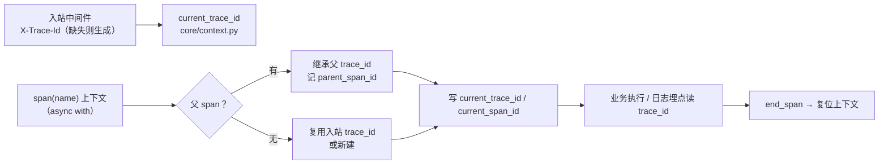

# 可观测性基座详细设计

> 项目骨架 · 02 后端基座 · 03 core 横切基座 · 11 可观测性基座（指标与链路） · 详细设计

[文档首页](../../../../../../../文档首页.md) › [02-3-11 可观测性基座](../02_后端基座_03_core横切基座_11_可观测性基座（指标与链路）.md) › 01 详细设计　|　[← 父任务](../02_后端基座_03_core横切基座_11_可观测性基座（指标与链路）.md)

## 1. 概述 <a id="overview"></a>

- **目标**：落地可观测性两组契约与占位实现——`app/metrics/base.py` 的 `BaseMetrics`（计数器 / 瞬时值 / 直方图）+ `NullMetrics`（空操作）；`app/tracing/base.py` 的 `BaseTracer`（span 上下文）+ `NullTracer`（生成占位 ID、维护父链与上下文、不上报）；`core/context.py` 新增链路上下文变量；`app/api/middleware.py` 落入站链路 id 中间件（生成 / 透传 / 回写）；两个依赖注入提供者与 `create_app` 装配。
- **范围**：`app/metrics/`、`app/tracing/`（新增）、`app/api/middleware.py`（新增）、`core/context.py`（链路上下文变量）、`app/api/deps.py`（提供者导出）、`app/main.py`（中间件注册 + 装配）、单测。
- **不含**（归后续阶段）：真实 Prometheus 接入（prometheus-client、`/metrics` 采集端点、标签维度与分位口径、Grafana 面板）→ **分布式与监控阶段**；真实 OpenTelemetry 接入（otel-collector 上报、Jaeger 存储展示、采样策略、出站透传 `X-Trace-Id`）→ 同阶段；structlog 结构化 JSON 日志与 trace_id 关联落日志 → **03_02 日志体系**（本阶段已排期）；告警（Alertmanager / 企业微信钉钉 / 短信）→ 运维阶段；AI 成本、Socket.IO 连接数、RocketMQ 积压等指标取数 → 各自模块阶段。
- **依据**：需求 [02-26](../../../../../需求/02_需求_后端基座.md#r02-26)、《[架构设计 · 可观测性](../../../../../../../设计/架构设计/27_架构设计_子系统_可观测性.md)》「指标采集」「链路追踪」节、《[架构设计 · 后端基础类体系](../../../../../../../设计/架构设计/04_架构设计_后端基础类体系.md)》「阶段交付与跨阶段基座契约」节、《[后端开发规范](../../../../../../../规范/后端开发规范.md)》「后端基座体系（强制）」节、《[命名规范](../../../../../../../规范/命名规范.md)》「后端命名」节。

## 2. 现状与差距 <a id="gap"></a>

| 现状 | 差距 |
| --- | --- |
| 全库无 `BaseMetrics` / `BaseTracer`（检索零命中）；无 `app/metrics/`、`app/tracing/` 目录 | 指标与链路无统一入口；各模块自埋会让指标命名、标签与链路 id 口径发散 |
| 日志门面已就位（`core/logging.py` 的 `BaseLogger` + `StdoutLogger`，structlog 归 03-2） | 「日志 / 指标 / 链路」三合一缺后两者；`request_id` 之外无 trace 贯穿 |
| 指标与链路口径已定案（架构 26：Prometheus `/metrics` 六类指标、OTel → otel-collector → Jaeger、`trace_id` 与 `request_id` 关联） | 无契约承载「数值采集」与「调用链上下文」 |
| `core/context.py` 已有上下文变量（租户 / 只读 / 掩码器 / 用户 id） | 无链路 id / span id 上下文变量，日志关联与链路贯穿无落点 |
| 应用无中间件（中间件注册位预留但未注册） | 入站 `trace_id` 无生成 / 透传入口，跨实例链路串不起来 |
| `api/deps.py` 已汇总 14 个能力域提供者 | 两个新能力域无提供者，「依赖注入可解析」无落点 |

## 3. 交付物清单 <a id="tree"></a>

```text
backend/
├── app/metrics/__init__.py                # 新增：能力域包（docstring 口径）
├── app/metrics/base.py                    # 新增：METRIC_KINDS / METRIC_NAMES / BaseMetrics / NullMetrics / MetricLabels / DEPENDENCIES 再导出 / get_metrics
├── app/tracing/__init__.py                # 新增：能力域包（docstring 口径）
├── app/tracing/base.py                    # 新增：TRACE_ID_HEADER / new_trace_id / new_span_id / SpanContext / BaseTracer / NullTracer / current_span / current_trace_id / get_tracer
├── app/api/middleware.py                  # 新增：TraceIdMiddleware（纯 ASGI）
├── app/core/context.py                    # 修改：新增 current_trace_id / current_span_id 与读写辅助
├── app/api/deps.py                        # 修改：导出 get_metrics / get_tracer
├── app/main.py                            # 修改：注册中间件 + 装配 app.state.metrics / app.state.tracer
└── tests/
    ├── metrics/test_metrics.py            # 新增：Kiwi 44（契约 / 常量 / 清单复用 / 占位空操作 / 依赖解析）
    ├── tracing/test_tracing.py            # 新增：Kiwi 44（契约 / id 口径 / 父链与上下文 / 异常复位 / 复用入站链路 / 依赖解析）
    ├── api/test_middleware.py             # 新增：Kiwi 44（生成 / 回显 / 复位 / 非 HTTP 直通）
    └── core/test_context.py               # 修改：Kiwi 44（链路上下文设置 / 读取 / 复位）

bms文档/
├── 设计/架构设计/04_架构设计_后端基础类体系.md    # 修改：§4 基类清单 + §6 core 横切 + §8 跨阶段基座契约表
├── 后端基类清单.md                                # 修改：§2 分层总览 + §9 跨阶段基座 + §10 继承链与代码位置
├── 规范/后端开发规范.md                            # 修改：§3.1 强制用法（指标与链路口径）
├── 项目/01_项目骨架/计划/01_计划_项目骨架.md      # 修改：§3.1 后续阶段待办（链路追踪行补出处 + 新增 Prometheus 接入行）
├── 项目/01_项目骨架/需求/02_需求_后端基座.md      # 修改：需求 02-26 补实现期要点注块
└── 项目/01_项目骨架/任务/03_后端基础能力/…日志体系.md   # 修改：补「前置契约（已交付）」条（trace_id 上下文读取）
```

## 4. 指标能力域（`app/metrics/base.py`） <a id="metrics"></a>

| 成员 | 形态 | 说明 |
| --- | --- | --- |
| `METRIC_KINDS` | `tuple[str, ...]` 常量 | 指标类型：`("counter", "gauge", "histogram")`（计数器单调增 / 瞬时值可增可减 / 直方图分布） |
| `METRIC_NAMES` | `tuple[str, ...]` 常量 | 候选指标名六类（架构「指标采集」节）：`bms_request_total` / `bms_request_duration_seconds` / `bms_dependency_up` / `bms_ws_connections` / `bms_mq_backlog` / `bms_ai_cost`；前缀 `bms_` 统一，**占位期仅登记不校验** |
| `MetricLabels` | 类型别名 | 指标标签集 `Mapping[str, str]`（维度键值，如 `{"route": "/api/v1/users"}`） |
| `DEPENDENCIES` | 再导出常量 | **单向复用** `app/fallback/base.py`（metrics → fallback，与 circuit 同款；模块 `__all__` 显式再导出），使依赖状态类指标的 `dependency` 标签口径与降级矩阵 / 熔断域一致 |
| `BaseMetrics(BaseCapability, ABC)` | 能力域契约中间层 | `key: str = "metrics"` |
| `counter(name, *, value=1.0, labels=None)` | 抽象方法（async） | 计数器增量记录 |
| `gauge(name, *, value, labels=None)` | 抽象方法（async） | 瞬时值记录 |
| `histogram(name, *, value, labels=None)` | 抽象方法（async） | 直方图观测值记录（如请求耗时） |
| `NullMetrics(BaseMetrics, BaseNullObject)` | 占位实现 | **空操作**（不连 Prometheus、不采集） |
| `get_metrics(request) -> BaseMetrics` | 模块函数（提供者） | 取应用级单例（`request.app.state.metrics`） |

**口径**：

| 情形 | 处置 |
| --- | --- |
| 返回形态 | 三入口均返回 `None`（Fire-and-forget）——基座只**记录**数值，不聚合、不查询、不判定 |
| 指标名 | 建议取 `METRIC_NAMES` 之一；占位不校验（真实实现按登记清单 + 自定义扩展） |
| 标签维度 | 调用方自给；依赖状态类标签 `dependency` 取 `DEPENDENCIES` 之一（口径统一到单一清单） |
| 采集端点 | **本任务不落 `/metrics` 端点**（属真实能力，随回补阶段挂 prometheus-client 与 ASGI app） |
| 与降级 / 熔断 | 依赖状态指标与降级矩阵、熔断三态共用同一依赖标识清单；熔断状态读取见 02-3-11 任务文档「协同契约（已交付）」条（任务自身文档已登记，本设计不再重复） |

## 5. 链路能力域（`app/tracing/base.py`） <a id="tracing"></a>

| 成员 | 形态 | 说明 |
| --- | --- | --- |
| `TRACE_ID_HEADER` | `str` 常量 | 链路 id 请求头 `X-Trace-Id`（入站读取 / 响应回写 / 出站透传） |
| `TRACE_ID_LENGTH` / `SPAN_ID_LENGTH` | `int` 常量 | 32 位 hex（128 位）/ 16 位 hex（64 位），与 OTel 形态一致 |
| `new_trace_id()` / `new_span_id()` | 模块函数 | 生成链路 id / span id（标准库 `uuid4`） |
| `SpanContext` | frozen dataclass | `trace_id` / `span_id` / `name` / `parent_span_id`（链路起点为 None）/ `attributes` |
| `BaseTracer(BaseCapability, ABC)` | 能力域契约中间层 | `key: str = "tracer"` |
| `start_span(name, *, attributes=None, parent=None) -> SpanContext` | 抽象方法（async） | 开启 span（实现决定 ID 与上报） |
| `end_span(span) -> None` | 抽象方法（async） | 结束 span（上报 / 补全耗时） |
| `span(name, *, attributes=None)` | **具体方法**（`@asynccontextmanager`） | 模板式：取父 span → `start_span` → 写上下文变量 → yield → `end_span` → 复位（异常路径亦保证） |
| `NullTracer(BaseTracer, BaseNullObject)` | 占位实现 | 生成真实形态占位 ID、维护父子链与上下文变量，**不上报**（不连 OTel） |
| `current_span() -> SpanContext \| None` | 模块函数 | 读当前 span（本域私有上下文变量） |
| `current_trace_id() -> str \| None` | 模块函数 | 读当前链路 id（读 `core/context.py` 的 `current_trace_id`） |
| `get_tracer(request) -> BaseTracer` | 模块函数（提供者） | 取应用级单例（`request.app.state.tracer`） |



**口径**：

| 情形 | 处置 |
| --- | --- |
| 链路 id 取值顺序 | 父 span 的 `trace_id` → 上下文已有 `current_trace_id`（入站中间件设置）→ 新生成 |
| 嵌套 | `parent_span_id` 记录父 span；退出逐层复位（`span id` 与 `trace id` 均按令牌复位） |
| 占位语义 | `NullTracer` **生成 ID 并维护上下文**（链路贯穿占位期即生效），但**不上报**——与 02-3-10 防重放「时间窗 + 签名占位期真实生效」同为混合口径 |
| 属性值类型 | `attributes: Mapping[str, object]`（贴 OTel `AttributeValue`，允许 int / bool / float / 序列）；**与指标标签 `Mapping[str, str]` 类型不同**，回补时按各自规范转换（已在本设计第 5 节与对齐记录第 9 项明写） |
| 采样 / 上报 | 采样策略、otel-collector 上报、Jaeger 展示随回补阶段；契约与调用面不变 |
| 与日志 | 03_02 日志体系落地时读 `current_trace_id` 与 structlog `request_id` 关联（任务文档补前置契约条） |

## 6. core 侧变更与入站中间件 <a id="middleware"></a>

**core/context.py**：新增 `current_trace_id` / `current_span_id` 两个 `ContextVar`（默认 `None`）+ `set/get/reset` 六个辅助（与 `current_masker` 同款落点：链路 id 属跨切面上下文，日志与审计要读）。链路 id / span id 为**字符串**，不引入能力域类型依赖（无循环导入）。

**app/api/middleware.py**：`TraceIdMiddleware`（**纯 ASGI**）：

| 步骤 | 行为 |
| --- | --- |
| 非 HTTP 作用域（`lifespan` / `websocket`） | 直通下游，不进链路上下文 |
| 读入站 `X-Trace-Id` | 有则沿用、无则 `new_trace_id()` 生成 |
| 写上下文 | `set_current_trace_id(trace_id)`，请求结束 `reset`（令牌复位，避免跨请求泄漏） |
| 回写响应头 | 包装 `send`，在 `http.response.start` 写入 `X-Trace-Id` |

> **为什么必须纯 ASGI**：`BaseHTTPMiddleware` 把下游应用放在独立任务中执行，中间件内设置的上下文变量传不到接口内（与 02-3-5「同步生成器依赖经线程池执行导致 `Token was created in a different Context`」同类问题）。本中间件以 `async def __call__(scope, receive, send)` 实现，与接口同任务上下文。

## 7. 应用装配与依赖注入 <a id="di"></a>

| 位置 | 变更 |
| --- | --- |
| `app/api/deps.py` | 导出 `get_metrics`（`app/metrics/base.py`）、`get_tracer`（`app/tracing/base.py`） |
| `app/main.py` `create_app()` | `app.add_middleware(TraceIdMiddleware)`（异常处理器之前、路由之前）；装配 `app.state.metrics = NullMetrics()`、`app.state.tracer = NullTracer()` |

两个提供者为普通同步函数（取 `app.state` 单例，无 IO）；真实实现替换为 Prometheus / OTel 时调用面零改动。

## 8. 继承与分层 <a id="base"></a>

- `BaseMetrics → BaseCapability → BaseObject`；`NullMetrics → BaseMetrics + BaseNullObject → BasePlaceholder → BaseObject`。
- `BaseTracer → BaseCapability → BaseObject`；`NullTracer → BaseTracer + BaseNullObject → BasePlaceholder → BaseObject`。
- `SpanContext` 为能力域数据契约（frozen dataclass，同 `RateLimitDecision` / `ReplayDecision` 风格）。
- 中间件不纳入能力域体系（属 api 层传输机制，只做链路 id 贯穿）。
- 与日志门面的分工：`BaseLogger`（core/logging.py）管**日志输出**；trace 上下文变量供日志携带 `trace_id`；指标与链路各自独立契约域，互不替代。

## 9. 登记落点 <a id="register"></a>

| 落点 | 登记内容 |
| --- | --- |
| 《架构设计 · 后端基础类体系》§4 基类清单 | 新增两行（`BaseMetrics` / `NullMetrics`、`BaseTracer` / `NullTracer` / `SpanContext`）+ 继承链补两条 |
| 《架构设计 · 后端基础类体系》§6 core 横切基座 | 「core 层请求上下文」补链路上下文变量；「日志基座」补 trace 关联口径（03-2 落地） |
| 《架构设计 · 后端基础类体系》§8 跨阶段基座契约表 | 新增「指标」「链路」两行（代码位置、契约、回补阶段＝分布式与监控） |
| 《后端基类清单》 | §2 分层总览补 `app/metrics/`、`app/tracing/`；§9 跨阶段基座补两行；§10 继承链与目录补两条 |
| 《后端开发规范》「后端基座体系」节 | §3.1 补口径：指标一律走 `BaseMetrics`（`counter` / `gauge` / `histogram`），链路一律走 `BaseTracer`（`span` 异步上下文），`trace_id` 一律读 `core/context.py` 上下文；禁止各模块自埋指标或自生成链路 id |
| 计划《01_计划_项目骨架》「后续阶段待办」节 | 「链路追踪与 OpenTelemetry 接入」行补出处 02-3-11；新增「Prometheus 指标接入（`/metrics` 端点与采集口径）」行 |
| 需求 [02-26](../../../../../需求/02_需求_后端基座.md#r02-26) | 参考文档后补 `> 注：实现期要点` 块；实施完成后回写状态 / 完成日期 |
| 02_03 任务 04 日志基座接入点任务文档（03_02 日志体系的基座接入点） | 补「前置契约（已交付）」条：trace 上下文变量取 `core/context.py`（本任务交付），structlog 落地时读该变量与 `request_id` 关联 |

## 10. 测试设计（Kiwi 先行） <a id="tests"></a>

用例**先登记 Kiwi TCMS 再编码**；本任务新分配 **Kiwi 44**（16 条）：

| Kiwi | 用例 | 断言要点 | 自动化文件 |
| --- | --- | --- | --- |
| 44 | 指标契约继承与能力域标识 | `NullMetrics → BaseMetrics → BaseCapability → BaseObject`；`placeholder` / `describe()`；`key == "metrics"` | `tests/metrics/test_metrics.py` |
| 44 | 指标类型与候选名清单 | `METRIC_KINDS` 三项；`METRIC_NAMES` 六类无重复且全带 `bms_` 前缀 | 同上 |
| 44 | 依赖清单单向复用 | `metrics.DEPENDENCIES is fallback.DEPENDENCIES`（同一对象，七项） | 同上 |
| 44 | 占位恒定空操作 | 三入口（含带 `labels` / `value`）均返回 `None`、不抛错 | 同上 |
| 44 | 指标依赖解析 | `create_app()` 装配 `NullMetrics`；路由经 `Depends(get_metrics)` 取到同一实例 | 同上 |
| 44 | 链路契约继承与能力域标识 | `NullTracer → BaseTracer → BaseCapability → BaseObject`；`key == "tracer"` | `tests/tracing/test_tracing.py` |
| 44 | 请求头常量与 id 口径 | `X-Trace-Id`；trace 32 位 / span 16 位 hex 且不重复 | 同上 |
| 44 | 父子链与上下文贯穿 | 起点 `parent_span_id is None`；嵌套继承 `trace_id` 且记 `parent_span_id`；进入可见、退出复位 | 同上 |
| 44 | 复用入站链路 id | 上下文已有 trace id 时 span 沿用（不被新建覆盖） | 同上 |
| 44 | 异常路径复位 | `span` 内抛错仍结束并复位（上下文不泄漏） | 同上 |
| 44 | 链路依赖解析 | `create_app()` 装配 `NullTracer`；接口内 span 的 trace id 与响应头 `X-Trace-Id` 一致 | 同上 |
| 44 | 中间件生成与贯穿 | 无入站头时响应头回写 32 位 hex，接口内上下文可见同一值 | `tests/api/test_middleware.py` |
| 44 | 中间件回显入站头 | 带入站 `X-Trace-Id` 时原样沿用并回写 | 同上 |
| 44 | 中间件复位语义 | 各请求链路 id 独立；请求结束恢复到中间件之前的值 | 同上 |
| 44 | 非 HTTP 作用域直通 | `lifespan` 作用域下游照常执行、不写链路上下文 | 同上 |
| 44 | 链路上下文变量 | `current_trace_id` / `current_span_id` 设置 / 读取 / 复位 | `tests/core/test_context.py` |

回归：全量 `pytest`（含 Kiwi 36 租户上下文用例与全部接口冒烟）。

## 11. 实施步骤 <a id="steps"></a>

1. `core/context.py` 新增 `current_trace_id` / `current_span_id` 与六个读写辅助。
2. 新增 `app/metrics/`（`METRIC_KINDS` / `METRIC_NAMES` / `MetricLabels` / `BaseMetrics` / `NullMetrics` / `DEPENDENCIES` 再导出 / `get_metrics`）。
3. 新增 `app/tracing/`（`TRACE_ID_HEADER` / id 长度常量 / `new_trace_id` / `new_span_id` / `SpanContext` / `BaseTracer`（`span` 模板上下文 + 抽象 `start_span` / `end_span`）/ `NullTracer` / `current_span` / `current_trace_id` / `get_tracer`）。
4. 新增 `app/api/middleware.py`（纯 ASGI `TraceIdMiddleware`）。
5. `app/api/deps.py` 导出两提供者；`app/main.py` 注册中间件并装配 `app.state.metrics` / `app.state.tracer`。
6. 测试：先登记 Kiwi 44，再写三个用例文件 + 补充 `tests/core/test_context.py` 链路上下文用例。
7. 登记：架构 04 §4 / §6 / §8、《后端基类清单》§2 / §9 / §10、《后端开发规范》§3.1、计划「后续阶段待办」（补出处 + 新增 Prometheus 接入行）、需求 02-26 注块、03_02 日志体系任务文档前置契约条。
8. 验证：`uv run pytest --cov=app -q`、`uv run ruff check .`、`uv run ruff format --check .`、`uv run pyright` 全绿；`python3 scripts/tools/base-check/check-base.py` 五项通过。
9. 回写：实施 / 测试记录 + 任务（02-3-11、02_03 core 横切基座）与需求 02-26 状态、计划表。
10. 遗留处理与提交推送：按「处理偏差与遗留」套路闭环后提交推送。

## 12. 验收映射 <a id="accept-map"></a>

| 完成标准（需求 02-26 / 任务 02-3-11） | 验证方式 |
| --- | --- |
| 接口 / 抽象声明就位、可被上层引用 | 两契约落地 + 继承断言 + Kiwi 44 |
| 依赖注入可解析、应用可启动不报错 | `create_app` 装配两单例 + 两提供者解析用例 + 应用冒烟（含中间件） |
| 占位实现固定返回（不连 Prometheus / OTel） | `NullMetrics` 空操作用例、`NullTracer` 仅生成 ID 不上报（无网络 / 无 SDK 依赖） |
| 指标命名与依赖标签口径统一 | `METRIC_NAMES` / `METRIC_KINDS` 用例 + `DEPENDENCIES` 同一性断言 |
| 链路上下文贯穿可用（占位期即生效） | span 父子链 / 上下文读写 / 复用入站链路 / 异常复位用例 |
| 入站链路 id 透传生效 | 中间件生成 / 回显 / 复位 / 非 HTTP 直通用例 |
| 登记齐备 | 架构 04 §4 / §6 / §8、《后端基类清单》§2 / §9 / §10、《后端开发规范》§3.1、计划「后续阶段待办」 |
| 不实现真实能力 | 无 prometheus-client / opentelemetry 依赖、无 `/metrics` 端点、无上报；仅契约、占位与链路贯穿 |
| 无 lint / 类型错误 | `uv run ruff check .`、`uv run ruff format --check .`、`uv run pyright` |

## 13. 边界与开放项 <a id="boundary"></a>

- **真实 Prometheus 接入**（prometheus-client、`/metrics` 端点、标签维度与分位、Grafana 面板、AI 成本 / 连接数 / 积压取数）→ 分布式与监控阶段；已登记计划「后续阶段待办」。
- **真实 OpenTelemetry 接入**（otel-collector 上报、Jaeger 展示、采样策略、出站 `X-Trace-Id` 透传）→ 同阶段；计划「链路追踪与 OpenTelemetry 接入」行已补出处 02-3-11。
- **日志关联**：structlog 结构化 JSON 与 `trace_id` 关联 → 03_02 日志体系（本阶段已排期，任务文档补前置契约条）。
- **告警**（Alertmanager / 企业微信钉钉 / 短信）→ 运维阶段；指标只提供数据源。
- **协同契约（任务文档已有条目）**：降级 / 熔断状态（`BaseCircuitBreaker.state`、`BaseFallbackPolicy.resolve`）与权限拒绝计数（02-3-9 判定结果）接指标时，由本任务指标 / 链路契约承载，依赖标识取 `DEPENDENCIES`。
- **占位期 trace_id 与真实 OTel trace id 的一致性**：占位 ID 为本地 `uuid4` hex，真实接入后由 OTel 生成；形态一致但来源不同，切换后链路不可跨阶段比对（已知、可接受）。
- **测试**：真实指标 / 链路用例（分位、`/metrics` 快照、采样、上报链路）随回补阶段补充。

## 14. 对齐记录 <a id="align"></a>

| # | 事项 | 结论 |
| --- | --- | --- |
| 1 | 代码落点 | 两目录：`app/metrics/base.py`、`app/tracing/base.py`（一域一目录） |
| 2 | 指标签名 | 异步分型三方法 `counter` / `gauge` / `histogram`（`labels: Mapping[str, str] \| None`） |
| 3 | 指标常量 | `METRIC_KINDS` 三项 + `METRIC_NAMES` 六类（`bms_` 前缀，占位仅登记不校验） |
| 4 | 依赖标识 | metrics **单向复用** `app/fallback/base.py` 的 `DEPENDENCIES`（`__all__` 再导出，与 circuit 同款） |
| 5 | 链路签名 | `span(name, *, attributes=None)`（`@asynccontextmanager` 模板方法）+ 抽象 `start_span` / `end_span` + `current_span()` / `current_trace_id()` |
| 6 | 占位语义 | `NullTracer` 生成真实形态占位 ID 并维护上下文与父链，**不上报**（混合口径，与 02-3-10 同） |
| 7 | 上下文落点 | `core/context.py` 新增 `current_trace_id` / `current_span_id`（字符串，无能力域类型依赖）；span 对象存本域私有变量 |
| 8 | 入站中间件 | **一并落** `TraceIdMiddleware`（纯 ASGI）：读 `X-Trace-Id` → 缺省生成 → 写上下文 → 回写响应头（超出 02-3-11 原定「仅契约」范围，用户拍板） |
| 9 | 属性值类型 | `SpanContext.attributes: Mapping[str, object]`（贴 OTel）；指标标签 `Mapping[str, str]`（两域类型不同，回补各按规范转换，已明写） |
| 10 | id 口径 | trace 32 位 hex / span 16 位 hex（`uuid4`） |
| 11 | 依赖注入 | `get_metrics` / `get_tracer` + 两个 `app.state` 单例；中间件在异常处理器与路由之前注册 |
| 12 | 异步口径 | 两域全部 async（与 lock / masking / ratelimit / replay 统一） |
| 13 | 登记落点 | 架构 04 §4 / §6 / §8、《后端基类清单》§2 / §9 / §10、《后端开发规范》§3.1、计划「后续阶段待办」（补出处 + 新增 Prometheus 行）、需求 02-26 注块、03_02 日志体系前置契约条 |
| 14 | 测试 | 新分配 Kiwi 44（平台登记 + `@pytest.mark.kiwi_id(44)`），16 条；Kiwi 36 随本任务扩充链路上下文断言 |
| 15 | 交付范围 | 一条龙（设计 / 实施 / 测试 / 登记 / 记录 / 提交推送）+ 随后独立「处理偏差与遗留」 |
| 16 | 工时 / 窗口 | 1h；02_03 core 横切基座窗口（2026-09-14 ~ 09-20） |

> 本文档依《文档生成规范》编写 · 关键决策逐项确认
