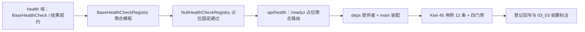

# 健康检查项注册表基座实施记录

> 项目骨架 · 02 后端基座 · 03 core 横切基座 · 12 健康检查项注册表基座 · 实施记录

[文档首页](../../../../../../../文档首页.md) › [02-3-12 健康检查项注册表基座](../02_后端基座_03_core横切基座_12_健康检查项注册表基座.md) › 01 实施　|　[← 父任务](../02_后端基座_03_core横切基座_12_健康检查项注册表基座.md)

## 1. 实施信息 <a id="meta"></a>

| 项 | 值 |
| --- | --- |
| 任务 | [12 健康检查项注册表基座](../02_后端基座_03_core横切基座_12_健康检查项注册表基座.md) |
| 对应需求 | [02-39](../../../../../需求/02_需求_后端基座.md#r02-39) |
| 详细设计 | [12_详细设计_01_健康检查项注册表基座](../设计/12_详细设计_01_健康检查项注册表基座.md) |
| 实施日期 | 2026-09-14 |
| 实施人 | minjian |
| 实施环境 | 开发机（Ubuntu，Python 3.14 / uv） |
| 提交 | 待提交 |
| 结论 | 完成 |

## 2. 实施概览 <a id="overview"></a>



结果小结：健康检查项契约与注册表基座落地（`BaseHealthCheck`、`BaseHealthCheckRegistry` + 聚合模板 `aggregate`），占位实现 `NullHealthCheckRegistry` 固定通过（不探依赖），`/readyz` 占位聚合路由就位（200 / 503 映射），应用可启动、提供者可解析；`pytest` / `ruff` / `pyright` 全绿，新增模块覆盖率 100%。

## 3. 实施过程 <a id="process"></a>

1. **健康检查能力域**：新增 `app/health/`——依赖清单 `DEPENDENCIES` 从 `app/fallback/base.py` **单向复用**（`__all__` 显式再导出）、数据契约 `HealthCheckResult`（frozen：`name` / `healthy` / `detail`）与 `HealthCheckReport`（frozen：`healthy` / `items`）、检查项契约 `BaseHealthCheck(BaseObject)`（抽象属性 `name` + 抽象异步 `check()`）、注册表契约 `BaseHealthCheckRegistry(BaseCapability)`（`key = "health_check_registry"`；抽象 `register` / `checks` + **具体聚合模板** `aggregate`，逐项检查、单项异常兜底为 `healthy=False` / `detail="检查执行异常"`、空集视为就绪）、占位实现 `NullHealthCheckRegistry`（`register` 空操作、`checks()` 空元组 → 固定通过）、提供者 `get_health_check_registry`。
2. **就绪路由**：`app/api/health.py` 保留 `/healthz`，新增 `/readyz`——依赖 `get_health_check_registry`，`await registry.aggregate()`，全部就绪返回 200（`{"status":"ok","checks":[...]}`）、否则 503（`{"status":"degraded",...}`）；探针端点不套 `ApiResponse`。
3. **依赖注入装配**：`app/api/deps.py` 导出 `get_health_check_registry`（模块 docstring 补可观测 / 健康检查）；`app/main.py` 装配 `app.state.health_check_registry = NullHealthCheckRegistry()`。
4. **测试**：新增 `tests/health/test_health_registry.py`（9 条：契约 / 常量复用 / 结果契约 / 聚合模板三类 / 占位固定通过 / 提供者解析）；`tests/api/test_health.py` 补 `/readyz` 就绪与未就绪（503）用例（2 条）；共 **11 条 Kiwi 45 用例**（另 `/healthz` 回归 1 条沿用 Kiwi 2）。
5. **Kiwi 登记**：计划在 mjbk Kiwi TCMS（分类「平台骨架」、P2、CONFIRMED、标签「自动化」）登记用例 **45「健康检查项注册表基座（检查项契约 / 注册表聚合 / /readyz 占位聚合）」**，与 `@pytest.mark.kiwi_id(45)` 一致。
6. **登记回写**：架构 04 §4 / §6 / §8、《后端基类清单》§2 / §9 / §10、《后端开发规范》§3.1、计划「后续阶段待办」（新增健康检查项真实实现行 + 02_03 偏差跟踪 + 03_03 前置）、需求 02-39注块 / 状态、需求总览状态、任务 / 父任务状态回写。

关键命令：

```bash
uv run pytest --cov=app -q
uv run ruff check .
uv run ruff format --check .
uv run pyright
```

## 4. 问题与处置 <a id="issues"></a>

| 问题 / 现象 | 原因 | 处置与落点 |
| --- | --- | --- |
| pytest 收集报 `import file mismatch`（`test_health` 模块名冲突） | `tests/health/test_health.py` 与 `tests/api/test_health.py` 同名、测试目录无 `__init__.py` | 能力域用例改名 `tests/health/test_health_registry.py`，设计第 3 / 9 / 10 节同步回写 |
| ruff `B010`：`setattr` 传常量字段名 | frozen 契约用例用 `setattr(result, "healthy", False)` 触发 `FrozenInstanceError` | 改用变量 `field = "healthy"` 后再 `setattr`，既触发运行时异常又规避规则 |
| ruff `E501`：`deps.py` 顶部 docstring 超长 | 补「可观测 / 健康检查」后超 120 列 | 精简 `deps.py` 模块 docstring（去掉会话 / 工作单元枚举） |
| `app/api/health.py` 首轮未过 `ruff format` | `/readyz` 列表推导换行不符格式化 | `uv run ruff format` 自动规整 |

## 5. 验证结果 <a id="verify"></a>

| 完成标准 | 验证方法 | 实测结果 |
| --- | --- | --- |
| 接口 / 抽象声明就位、可被上层引用 | 两契约落地 + 继承 / 契约断言用例 | 通过 |
| 依赖注入可解析、应用可启动不报错 | `create_app` 装配单例 + 提供者解析用例 + `/readyz` 端到端冒烟 | 通过 |
| 占位实现固定返回（不探依赖） | `NullHealthCheckRegistry` 注册后 `aggregate()` 仍 `healthy=True`、`items=()`；无 DB / Redis / MinIO 客户端依赖 | 通过 |
| 依赖标识口径统一 | `health.DEPENDENCIES is fallback.DEPENDENCIES`（七项） | 通过 |
| `/readyz` 聚合签名可用 | 聚合模板「全通过 / 含失败 / 单项异常」用例 + 路由 200 / 503 映射用例 | 通过 |
| 不实现真实能力 | 无真实探针、无连接对象探测、无探针缓存；仅契约、占位与占位聚合路由 | 通过 |
| 登记齐备 | 架构 04 §4 / §6 / §8、《后端基类清单》§2 / §9 / §10、《后端开发规范》§3.1、计划「后续阶段待办」 | 已登记 |
| 无 lint / 类型错误 | `uv run pytest -q` / `ruff check` / `ruff format --check` / `uv run pyright` | 263 passed, 2 skipped / All checks passed / 159 files already formatted / 0 errors |

## 6. 偏差与遗留 <a id="deviations"></a>

- **偏差**：
  - 范围扩大：本任务一并落下 `/readyz` 占位聚合路由（原需求只要求「注册表 + 聚合签名」），属用户拍板（对齐记录第 2 项）；路由只做聚合映射，不含真实探针。
  - 用例文件名由设计的 `tests/health/test_health.py` 调整为 `tests/health/test_health_registry.py`（避免与 `tests/api/test_health.py` 模块名冲突），设计文档已同步回写。
- **遗留归口（已登记，随对应阶段销项）**：
  - 真实依赖探针（DB / Redis / MinIO 连通性、超时、连接对象来源）→ **03_03 健康检查 / 可观测性阶段**；已登记计划「后续阶段待办」新增「健康检查项真实实现」行；实现期要点见需求 02-39 `> 注：` 块。
  - 探针结果缓存与探测频率限流、多副本探测去重 → 回补阶段。
  - 依赖不可用告警联动（Alertmanager / webhook）→ 运维阶段。
  - 监控模块依赖状态展示（`monitor:view`）→ 系统监控模块阶段，读 `HealthCheckReport.items`。
  - 优雅停机（SIGTERM / preStop / `terminationGracePeriod`）→ 部署与运维阶段。
  - 真实探针用例（断连 → 503）→ 回补阶段补充。
- **Kiwi 平台登记**：用例 45 的平台登记待完成（本地无 mjbk Kiwi 管理凭据），代码已以 `@pytest.mark.kiwi_id(45)` 关联；登记后回填测试记录。
- **处理偏差与遗留（2026-09-14 闭环）**：
  - 计划 §3.1 新增「健康检查项真实实现」行（出处 02-3-12）、02_03 偏差跟踪与 03_03 前置已回写；需求 02-39 `> 注：` 块补齐实现期要点（连接对象 / 超时 / 缓存 / 去重 / 告警联动）。
  - 消费方标注：[02-3-11 可观测性基座（指标与链路）](../../02_后端基座_03_core横切基座_11_可观测性基座（指标与链路）/02_后端基座_03_core横切基座_11_可观测性基座（指标与链路）.md) 任务文档补「依赖状态指标数据源」协同契约（`bms_dependency_up` 取检查项 `name`，与 `DEPENDENCIES` 同源）；本任务任务文档补「依赖状态指标与监控」「探针路由与真实探针」两条协同契约。
  - 无任务文档的消费方（03_03 健康检查 / 系统监控模块 / 部署与运维）已在计划 §3.1 与需求 02-39 注块登记去向，待其阶段建任务后回引。
  - 唯一未闭环项：Kiwi 45 平台登记（见上，待用户在 mjbk Kiwi TCMS 登记后回填）。
- **结论**：本任务遗留已全部登记去向，偏差与遗留处理完成（除 Kiwi 45 平台登记待办）。

> 本文档依《文档生成规范》编写
