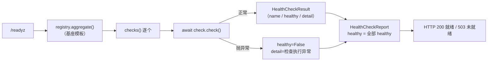

# 健康检查项注册表基座详细设计

> 项目骨架 · 02 后端基座 · 03 core 横切基座 · 12 健康检查项注册表基座 · 详细设计

[文档首页](../../../../../../../文档首页.md) › [02-3-12 健康检查项注册表基座](../02_后端基座_03_core横切基座_12_健康检查项注册表基座.md) › 01 详细设计　|　[← 父任务](../02_后端基座_03_core横切基座_12_健康检查项注册表基座.md)

## 1. 概述 <a id="overview"></a>

- **目标**：落地健康检查能力域契约与占位实现——`app/health/base.py` 的数据契约 `HealthCheckResult` / `HealthCheckReport`、检查项契约 `BaseHealthCheck`（`name` + 异步 `check`）、注册表契约 `BaseHealthCheckRegistry`（`register` / `checks` + `aggregate` 聚合模板）、占位实现 `NullHealthCheckRegistry`（固定通过、不探依赖）；`app/api/health.py` 新增 `/readyz` 占位聚合路由（走注册表聚合，HTTP 200）；`app/api/deps.py` 新增提供者 `get_health_check_registry`；`app/main.py` 装配 `app.state.health_check_registry`。
- **范围**：`app/health/`（新增）、`app/api/health.py`（新增 `/readyz`）、`app/api/deps.py`（提供者导出）、`app/main.py`（装配）、单测；架构 04 / 《后端基类清单》/《后端开发规范》/ 计划 / 需求登记。
- **不含**（归后续阶段）：真实 DB / Redis / MinIO 探针（连接对象探测、超时与降级）→ **03_03 健康检查 / 可观测性阶段**；优雅停机（SIGTERM 停止接新、等待在途、preStop / `terminationGracePeriod`）→ **部署与运维阶段**；系统监控模块依赖状态展示（`monitor:view`）→ **系统监控模块阶段**；探针结果缓存与探测频率限流 → 回补阶段；依赖不可用告警联动 → 运维阶段。
- **依据**：需求 [02-39](../../../../../需求/02_需求_后端基座.md#r02-39)、《[架构设计 · 可观测性](../../../../../../../设计/架构设计/27_架构设计_子系统_可观测性.md)》「健康检查与优雅停机」节、《[架构设计 · 后端基础类体系](../../../../../../../设计/架构设计/04_架构设计_后端基础类体系.md)》「阶段交付与跨阶段基座契约」节、《[后端开发规范](../../../../../../../规范/后端开发规范.md)》「后端基座体系（强制）」节、《[命名规范](../../../../../../../规范/命名规范.md)》「后端命名」节。

## 2. 现状与差距 <a id="gap"></a>

| 现状 | 差距 |
| --- | --- |
| 全库无 `BaseHealthCheck` / `BaseHealthCheckRegistry`（检索零命中）；无 `app/health/` 目录 | 依赖就绪检查无统一入口；各依赖自拼探针会让检查项命名、聚合口径与响应形态发散 |
| 存活探针已就位（`app/api/health.py` 的 `/healthz` 固定 200） | 只有存活、**无就绪**（`/readyz`），编排滚动发布缺依赖就绪判定落点 |
| `DEPENDENCIES` 依赖标识清单已就位（`app/fallback/base.py`，降级矩阵行；熔断 / 指标单向复用） | 就绪检查项与降级 / 熔断 / 指标的依赖命名无统一取值口径 |
| 指标 / 链路基座已就位（02-3-11：`BaseMetrics` / `BaseTracer`） | 依赖状态指标 `bms_dependency_up` 无数据来源（依赖就绪判定无承载契约） |
| `api/deps.py` 已汇总 15 个能力域提供者 | 新能力域无提供者，「依赖注入可解析」无落点 |
| `/healthz` `/readyz` 已列入租户豁免路径（`app/db/tenant.py`），`/readyz` 路由尚未实现 | 豁免路径已预留但无端点；实现后无需再改豁免清单 |

## 3. 交付物清单 <a id="tree"></a>

```text
backend/
├── app/health/__init__.py                 # 新增：能力域包（docstring 口径）
├── app/health/base.py                     # 新增：DEPENDENCIES 再导出 / HealthCheckResult / HealthCheckReport / BaseHealthCheck / BaseHealthCheckRegistry / NullHealthCheckRegistry / get_health_check_registry
├── app/api/health.py                      # 修改：新增 /readyz 占位聚合路由（保留 /healthz）
├── app/api/deps.py                        # 修改：导出 get_health_check_registry
├── app/main.py                            # 修改：装配 app.state.health_check_registry = NullHealthCheckRegistry()
└── tests/
    ├── health/test_health_registry.py     # 新增：Kiwi 45（契约 / 常量复用 / 结果契约 / 聚合模板 / 占位固定通过 / 依赖解析）
    └── api/test_health.py                 # 修改：Kiwi 45（/readyz 占位 200 / 聚合响应 / 未就绪 503 映射；/healthz 回归）

bms文档/
├── 设计/架构设计/04_架构设计_后端基础类体系.md      # 修改：§4 基类清单 + §6 core 横切 + §8 跨阶段基座契约表
├── 后端基类清单.md                                  # 修改：§2 分层总览 + §9 跨阶段基座 + §10 继承链与代码位置
├── 规范/后端开发规范.md                              # 修改：§3.1 强制用法（健康检查口径）
├── 项目/01_项目骨架/计划/01_计划_项目骨架.md        # 修改：§3.1 后续阶段待办（新增健康检查项真实实现行）+ 02_03 偏差跟踪 + 03_03 前置
├── 项目/01_项目骨架/需求/02_需求_后端基座.md        # 修改：需求 02-39 补实现期要点注块
├── 项目/01_项目骨架/需求/00_需求_项目骨架.md        # 修改：需求总览 02-39 状态 / 完成日期回写
└── 项目/01_项目骨架/任务/02_后端基座/…12…/…12….md   # 修改：参考文档补本设计 / 实施 / 测试链接，实施后回写状态
```

## 4. 健康检查能力域（`app/health/base.py`） <a id="health"></a>

| 成员 | 形态 | 说明 |
| --- | --- | --- |
| `DEPENDENCIES` | 再导出常量 | **单向复用** `app/fallback/base.py`（health → fallback，与 circuit / metrics 同款；模块 `__all__` 显式再导出），使依赖类检查项命名与降级矩阵 / 熔断 / 指标口径统一 |
| `HealthCheckResult` | frozen dataclass（数据契约） | 单项检查结果：`name: str` / `healthy: bool` / `detail: str \| None = None` |
| `HealthCheckReport` | frozen dataclass（数据契约） | 聚合报告：`healthy: bool` / `items: tuple[HealthCheckResult, ...] = ()` |
| `BaseHealthCheck(BaseObject, ABC)` | 检查项契约 | 抽象属性 `name: str` + 抽象异步方法 `check() -> HealthCheckResult` |
| `BaseHealthCheckRegistry(BaseCapability, ABC)` | 能力域契约中间层 | `key: str = "health_check_registry"`；抽象 `register(check)` / `checks()` + **具体聚合模板** `aggregate()` |
| `register(check: BaseHealthCheck) -> None` | 抽象方法（同步） | 注册检查项（启动期注册，无 IO）；同名以 `name` 为键、后注册覆盖（真实实现口径） |
| `checks() -> tuple[BaseHealthCheck, ...]` | 抽象方法（同步） | 返回已注册检查项（注册顺序，稳定） |
| `aggregate() -> HealthCheckReport` | **具体方法**（async 模板） | 固定编排「遍历 `checks()` → `await check.check()` → 收集结果 → 汇总就绪」；单项异常不中断聚合 |
| `NullHealthCheckRegistry(BaseHealthCheckRegistry, BaseNullObject)` | 占位实现 | `register` 空操作、`checks()` 空元组 → 继承模板得「固定通过」（`healthy=True`、`items=()`）；**不探依赖** |
| `get_health_check_registry(request) -> BaseHealthCheckRegistry` | 模块函数（提供者） | 取应用级单例（`request.app.state.health_check_registry`） |

**口径**：

| 情形 | 处置 |
| --- | --- |
| `name` 声明 | 抽象属性（同 `BaseEventWorker.event_type` / `BaseTask.name` 款）；实现按用途取 `"redis"` / `"database"` / `"minio"` 等 |
| 依赖标识 | 依赖类检查项的 `name` **取 `DEPENDENCIES` 之一**（如 `"database"` / `"redis"` / `"minio"`）；非依赖类检查项（如磁盘、迁移版本）可自定义名 |
| 检查结果 | `check()` 返回 `HealthCheckResult(name=self.name, healthy=..., detail=...)`；`detail` 为可选人类可读说明 |
| 聚合顺序 | 按 `checks()` 返回顺序（注册顺序），**不排序**（贴注册可视顺序，`/readyz` 输出稳定） |
| 单项异常 | `aggregate()` 捕获 `Exception` → 该项 `healthy=False`、`detail="检查执行异常"`（**不泄露异常消息与堆栈**）；其余检查项照常执行 |
| 空注册表 | `all([])` 为真 → `healthy=True`（占位「固定通过」即由此保证） |
| 同步 / 异步 | `register` / `checks` 同步（启动期注册，无 IO）；`check` / `aggregate` 异步（真实探测为 IO，与 lock / masking / ratelimit / replay 全异步口径统一） |
| 与降级 / 熔断 | 依赖命名与 `DEPENDENCIES` 同源（单一落点），就绪判定与故障应对解耦——本域只回答「依赖是否就绪」，不执行降级动作 |
| 与指标 | 依赖状态指标 `bms_dependency_up` 的 `dependency` 标签取检查项 `name`（口径对齐，真实采集随回补阶段） |
| 与监控模块 | 系统监控「依赖状态（DB/Redis/MinIO）」展示读 `HealthCheckReport.items`（回补阶段接入） |
| 探针响应 | `/readyz` **不套 `ApiResponse`**（探针为基础设施端点，贴 K8s 探针与编排语义，避免全局处理器 / 统一响应干扰）；就绪 200 / 未就绪 503（架构「健康检查与优雅停机」节） |

## 5. 注册表与聚合模板 <a id="aggregate"></a>

`aggregate()` 为**具体模板方法**（同 02-3-10 `BaseReplayGuard.verify` 款），固定编排「遍历 → 逐项检查 → 收集 → 汇总」，真实 / 占位实现只提供 `register` / `checks` 的存储差异，聚合与就绪判定口径单点收敛：



**为什么用模板方法**：`/readyz` 的聚合与就绪判定是**公共逻辑**（上百依赖场景下若各注册表各自实现，异常兜底、空集语义、顺序口径会发散）；把 `aggregate` 放基座，回补真实注册表时只落存储与真实检查项，聚合面零改动。

## 6. `/readyz` 路由与依赖注入 <a id="route"></a>

**`app/api/health.py`**：保留 `/healthz`（固定 200），新增 `/readyz`：

| 步骤 | 行为 |
| --- | --- |
| 依赖解析 | `registry: Annotated[BaseHealthCheckRegistry, Depends(get_health_check_registry)]` |
| 聚合 | `report = await registry.aggregate()` |
| 状态码 | `report.healthy` → 200；否则 503（编排滚动发布据此阻断流量） |
| 响应体 | `{"status": "ok" | "degraded", "checks": [{"name", "healthy", "detail"}]}`；占位期固定 `{"status": "ok", "checks": []}` |
| 序列化 | 显式构造 payload（字段顺序稳定，避免依赖 `dataclasses.asdict` 的键序） |

> **为什么直接落路由**：需求只要求「注册表 + `/readyz` 聚合签名」，本任务一并落占位路由（与 02-3-11 一并落 `TraceIdMiddleware` 同款，用户拍板）——使「依赖注入可解析」有端到端落点、`/readyz` 豁免路径即时生效；真实依赖探针仍随 03_03 回补，调用面不变。

**应用装配与提供者**：

| 位置 | 变更 |
| --- | --- |
| `app/api/deps.py` | 导出 `get_health_check_registry`（`app/health/base.py`） |
| `app/main.py` `create_app()` | 装配 `app.state.health_check_registry = NullHealthCheckRegistry()`（置于能力域基座装配段，与 `metrics` / `tracer` 并列） |

提供者为普通同步函数（取 `app.state` 单例，无 IO）；真实实现替换为零改动。

## 7. 继承与分层 <a id="base"></a>

- `BaseHealthCheck → BaseObject`（检查项为可注册组件，非 DI 解析的能力域，故不挂 `BaseCapability`）。
- `BaseHealthCheckRegistry → BaseCapability → BaseObject`；`NullHealthCheckRegistry → BaseHealthCheckRegistry + BaseNullObject → BasePlaceholder → BaseObject`。
- `HealthCheckResult` / `HealthCheckReport` 为能力域数据契约（frozen dataclass，同 `SpanContext` / `RateLimitDecision` 风格），不改动即不可变。
- 与探针路由分工：`app/api/health.py` 只做 HTTP 传输（解析注册表 → 序列化 → 状态码）；就绪判定与聚合归能力域基座，路由不含检查逻辑。

## 8. 登记落点 <a id="register"></a>

| 落点 | 登记内容 |
| --- | --- |
| 《架构设计 · 后端基础类体系》§4 基类清单 | 新增行（`BaseHealthCheck` / `HealthCheckResult`、`BaseHealthCheckRegistry` / `NullHealthCheckRegistry` / `HealthCheckReport`）+ 继承链补两条 |
| 《架构设计 · 后端基础类体系》§6 core 横切基座 | 「日志基座」附近补健康检查口径：检查项一律实现 `BaseHealthCheck` 并注册 `BaseHealthCheckRegistry`，`/readyz` 走注册表聚合，依赖标识取 `DEPENDENCIES` |
| 《架构设计 · 后端基础类体系》§8 跨阶段基座契约表 | 新增「健康检查项注册表」行（代码位置、契约、回补阶段＝**03 后端基础能力（03_03 健康检查）/ 可观测性**） |
| 《后端基类清单》 | §2 分层总览补 `app/health/`；§9 跨阶段基座补一行；§10 继承链与目录补两条 |
| 《后端开发规范》「后端基座体系」节 §3.1 | 补口径：依赖就绪检查一律实现 `BaseHealthCheck`（`name` + 异步 `check`）并注册到 `BaseHealthCheckRegistry`，`/readyz` 一律走 `aggregate` 聚合；禁止在探针路由内硬编码依赖检查或另起聚合 |
| 计划《01_计划_项目骨架》§3.1「后续阶段待办」 | 新增「健康检查项真实实现（DB / Redis / MinIO 探针与超时降级、探针缓存与频率限流）」行，出处 02-3-12；02_03 表「偏差与遗留」补 02-3-12；03_03 健康检查行补前置契约（注册表已就位） |
| 需求 [02-39](../../../../../需求/02_需求_后端基座.md#r02-39) | 参考文档后补 `> 注：实现期要点` 块；实施完成后回写状态 / 完成日期 |
| 需求总览《00_需求_项目骨架》 | 02-39 行状态 / 完成日期随实施回写 |
| 02-3-12 任务文档 | 参考文档补本设计 / 实施 / 测试链接；实施完成后回写状态 / 完成日期 |

## 9. 测试设计（Kiwi 45 先行） <a id="tests"></a>

用例**先登记 Kiwi TCMS 再编码**；本任务新分配 **Kiwi 45**（平台登记后回填编号，题面与平台一致）：

| Kiwi | 用例 | 断言要点 | 自动化文件 |
| --- | --- | --- | --- |
| 45 | 注册表契约继承与能力域标识 | `NullHealthCheckRegistry → BaseHealthCheckRegistry → BaseCapability → BaseObject`；`placeholder` / `describe()`；`key == "health_check_registry"` | `tests/health/test_health_registry.py` |
| 45 | 检查项契约可引用 | 测试用检查项实现 `name` + `await check()`；`BaseHealthCheck → BaseObject` 继承成立 | 同上 |
| 45 | 依赖清单单向复用 | `health.DEPENDENCIES is fallback.DEPENDENCIES`（同一对象，七项） | 同上 |
| 45 | 结果 / 报告数据契约 | `HealthCheckResult` / `HealthCheckReport` 为 frozen（不可赋值）；`detail` / `items` 默认值正确 | 同上 |
| 45 | 聚合模板（全通过） | 测试用注册表注册两个通过项 → `healthy is True`、`items` 顺序＝注册顺序、`name` 对应 | 同上 |
| 45 | 聚合模板（含失败项） | 一项 `healthy=False` → `report.healthy is False`、其余项仍在 `items` | 同上 |
| 45 | 聚合模板（单项抛异常） | 检查项抛错 → 该项 `healthy=False`、`detail="检查执行异常"`、`report.healthy=False`、不影响其他项 | 同上 |
| 45 | 占位固定通过（不探依赖） | `NullHealthCheckRegistry` 注册任意检查项后 `aggregate()` 仍 `healthy=True`、`items=()` | 同上 |
| 45 | 注册表依赖解析 | `create_app()` 装配 `NullHealthCheckRegistry`；探针路由经 `Depends(get_health_check_registry)` 取到同一实例 | 同上 |
| 45 | `/readyz` 占位就绪 | GET `/readyz` → 200、`{"status":"ok","checks":[]}` | `tests/api/test_health.py` |
| 45 | `/readyz` 未就绪映射 | 以测试用注册表替换 `app.state.health_check_registry`（含失败项）→ 503、`status="degraded"`、`checks` 明细 | 同上 |
| 45 | `/healthz` 回归 | GET `/healthz` → 200、`{"status":"ok"}`（占位路由并存不互扰） | 同上 |

回归：全量 `pytest`（含 Kiwi 2 存活探针与全部接口冒烟）。

## 10. 实施步骤 <a id="steps"></a>

1. 新增 `app/health/`（`DEPENDENCIES` 再导出 / `HealthCheckResult` / `HealthCheckReport` / `BaseHealthCheck` / `BaseHealthCheckRegistry`（`aggregate` 模板）/ `NullHealthCheckRegistry` / `get_health_check_registry`）。
2. `app/api/health.py` 新增 `/readyz`（依赖 `get_health_check_registry`，映射 200 / 503）。
3. `app/api/deps.py` 导出 `get_health_check_registry`；`app/main.py` 装配 `app.state.health_check_registry`。
4. 测试：先登记 Kiwi 45，再写 `tests/health/test_health_registry.py` + 补 `tests/api/test_health.py`（含测试用注册表 / 检查项双桩）。
5. 登记：架构 04 §4 / §6 / §8、《后端基类清单》§2 / §9 / §10、《后端开发规范》§3.1、计划「后续阶段待办」+ 02_03 偏差跟踪 + 03_03 前置、需求 02-39 注块、需求总览状态。
6. 验证：`uv run pytest --cov=app -q`、`uv run ruff check .`、`uv run ruff format --check .`、`uv run pyright` 全绿。
7. 回写：实施 / 测试记录 + 任务（02-3-12、02_03 core 横切基座）与需求 02-39 状态、计划表。
8. 遗留处理与提交推送：按「处理偏差与遗留」套路闭环后提交推送。

## 11. 验收映射 <a id="accept-map"></a>

| 完成标准（需求 02-39 / 任务 02-3-12） | 验证方式 |
| --- | --- |
| 接口 / 抽象声明就位、可被上层引用 | `BaseHealthCheck` / `BaseHealthCheckRegistry` 落地 + 继承 / 契约断言 + Kiwi 45 |
| 依赖注入可解析、应用可启动不报错 | `create_app` 装配单例 + 提供者解析用例 + `/readyz` 端到端冒烟 |
| 占位实现固定返回（不探依赖） | `NullHealthCheckRegistry` 注册后仍 `healthy=True`、`items=()`；无 DB / Redis / MinIO 客户端依赖 |
| 依赖标识口径统一 | `DEPENDENCIES` 同一性断言（与 fallback / circuit / metrics 同源） |
| `/readyz` 聚合签名可用 | 聚合模板「全通过 / 含失败 / 单项异常」用例 + 路由 200、503 映射用例 |
| 不实现真实能力 | 无真实探针、无连接对象探测、无探针缓存；仅契约、占位与占位聚合路由 |
| 登记齐备 | 架构 04 §4 / §6 / §8、《后端基类清单》§2 / §9 / §10、《后端开发规范》§3.1、计划「后续阶段待办」 |
| 无 lint / 类型错误 | `uv run ruff check .`、`uv run ruff format --check .`、`uv run pyright` |

## 12. 边界与开放项 <a id="boundary"></a>

- **真实依赖探针**（DB / Redis / MinIO 连通性与超时、连接对象来源 `engine_registry` / Redis 客户端 / MinIO 客户端）→ 03_03 健康检查 / 可观测性阶段；已登记计划「后续阶段待办」。真实注册表替换 `NullHealthCheckRegistry`，聚合与路由零改动。
- **优雅停机**（SIGTERM 停止接新请求、等待在途、`preStop` / `terminationGracePeriod`）→ 部署与运维阶段；本任务不落。
- **监控模块依赖状态展示**（`monitor:view` / `monitor:cache`）→ 系统监控模块阶段，读 `HealthCheckReport.items`。
- **探针缓存与频率限流**（避免高频探测打依赖 / 多副本同时探测）→ 回补阶段；契约不变。
- **告警联动**（依赖不可用触发告警）→ 运维阶段（Alertmanager / webhook）；本域只提供就绪数据源。
- **占位语义已知项**：占位 `/readyz` 恒 200（不反映真实依赖状态），编排在占位期按存活探针滚动；真实判定随 03_03 生效——已知、可接受。
- **测试**：真实探针用例（DB / Redis / MinIO 断连 → 503）随回补阶段补充。

## 13. 对齐记录 <a id="align"></a>

| # | 事项 | 结论 |
| --- | --- | --- |
| 1 | 代码落点 | `app/health/base.py`（一域一目录；与 `app/api/health.py` 路由分属不同层，命名不冲突）（用户拍板） |
| 2 | `/readyz` 路由归属 | **一并落占位聚合路由**（超出需求原定「仅契约」范围，用户拍板；与 02-3-11 一并落中间件同款） |
| 3 | 注册表形态 | `BaseHealthCheckRegistry` 契约 + `NullHealthCheckRegistry` 占位（能力域同构）（用户拍板） |
| 4 | 结果契约 | `HealthCheckResult`（name / healthy / detail）+ `HealthCheckReport`（healthy / items）（用户拍板） |
| 5 | 依赖标识 | `DEPENDENCIES` **单向复用** `app/fallback/base.py`（health → fallback，`__all__` 再导出）（用户拍板） |
| 6 | `check` 签名 | 异步 `check() -> HealthCheckResult`（与全异步能力域口径统一）（用户拍板） |
| 7 | 检查项继承 | `BaseHealthCheck → BaseObject`（可注册组件，非 DI 能力域；能力域挂在注册表） |
| 8 | 聚合形态 | `aggregate()` 为基座**具体模板方法**（遍历 → 逐项 check → 收集 → 汇总），异常兜底与空集语义单点收敛 |
| 9 | 单项异常兜底 | 捕获 `Exception` → `healthy=False`、`detail="检查执行异常"`（不泄露异常消息 / 堆栈） |
| 10 | 占位语义 | `NullHealthCheckRegistry` `register` 空操作、`checks()` 空 → 继承模板固定通过；不探依赖（混合口径同 02-3-11） |
| 11 | 路由响应 | 探针端点不套 `ApiResponse`；`status` 取 `ok` / `degraded`；HTTP 200 / 503 |
| 12 | 依赖注入 | `get_health_check_registry` + `app.state.health_check_registry` 单例 |
| 13 | 登记落点 | 架构 04 §4 / §6 / §8、《后端基类清单》§2 / §9 / §10、《后端开发规范》§3.1、计划「后续阶段待办」+ 02_03 偏差 + 03_03 前置、需求 02-39 注块、需求总览 |
| 14 | 测试 | 新分配 Kiwi 45（平台登记 + `@pytest.mark.kiwi_id(45)`），12 条；聚合模板以测试用注册表 / 检查项双桩覆盖 |
| 15 | 交付范围 | 一条龙（设计 / 实施 / 测试 / 登记 / 记录 / 提交推送）+ 随后独立「处理偏差与遗留」 |
| 16 | 工时 / 窗口 | 1h；02_03 core 横切基座窗口（2026-09-14 ~ 09-20） |

> 本文档依《文档生成规范》编写 · 关键决策逐项确认
