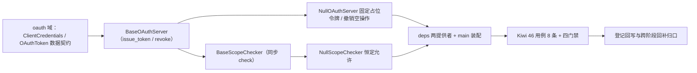

# 开放接口 OAuth2 服务端与 scope 基座实施记录

> 项目骨架 · 02 后端基座 · 03 core 横切基座 · 13 开放接口OAuth2服务端与scope基座 · 实施记录

[文档首页](../../../../../../../文档首页.md) › [02-3-13 开放接口OAuth2服务端与scope基座](../02_后端基座_03_core横切基座_13_开放接口OAuth2服务端与scope基座.md) › 01 实施　|　[← 父任务](../02_后端基座_03_core横切基座_13_开放接口OAuth2服务端与scope基座.md)

## 1. 实施信息 <a id="meta"></a>

| 项 | 值 |
| --- | --- |
| 任务 | [13 开放接口OAuth2服务端与scope基座](../02_后端基座_03_core横切基座_13_开放接口OAuth2服务端与scope基座.md) |
| 对应需求 | [02-41](../../../../../需求/02_需求_后端基座.md#r02-41) |
| 详细设计 | [13_详细设计_01_开放接口OAuth2服务端与scope基座](../设计/13_详细设计_01_开放接口OAuth2服务端与scope基座.md) |
| 实施日期 | 2026-09-14 |
| 实施人 | minjian |
| 实施环境 | 开发机（Ubuntu，Python 3.14 / uv） |
| 提交 | 待提交 |
| 结论 | 完成 |

## 2. 实施概览 <a id="overview"></a>



结果小结：开放接口服务端两组契约与占位实现落地（`BaseOAuthServer` / `NullOAuthServer`、`BaseScopeChecker` / `NullScopeChecker`），`ClientCredentials` / `OAuthToken` 数据契约与 `GRANT_TYPES` / `TOKEN_TYPE_BEARER` 常量就位，应用可启动、两提供者可解析；`pytest` / `ruff` / `pyright` 全绿，新增模块覆盖率 100%。

## 3. 实施过程 <a id="process"></a>

1. **开放接口能力域**：新增 `app/oauth/`——常量 `GRANT_TYPES`（`client_credentials` / `authorization_code` / `refresh_token`）、`TOKEN_TYPE_BEARER`、`NULL_ACCESS_TOKEN`；数据契约 `ClientCredentials`（frozen：`client_id` / `client_secret` / `scopes`）与 `OAuthToken`（frozen：`access_token` / `token_type` / `expires_in` / `scopes`）；服务端契约 `BaseOAuthServer(BaseCapability)`（`key = "oauth_server"`；异步 `issue_token(ClientCredentials) -> OAuthToken` / `revoke(token)`）；占位实现 `NullOAuthServer`（固定返回占位令牌、不签发、`revoke` 空操作）；scope 契约 `BaseScopeChecker(BaseCapability)`（`key = "scope_checker"`；同步 `check(granted, required) -> bool`）；占位实现 `NullScopeChecker`（恒定允许）；提供者 `get_oauth_server` / `get_scope_checker`。
2. **依赖注入装配**：`app/api/deps.py` 导出两提供者（模块 docstring 补「开放接口」）；`app/main.py` 装配 `app.state.oauth_server = NullOAuthServer()`、`app.state.scope_checker = NullScopeChecker()`。
3. **不落路由**：按设计不落 `/api/open` 路由（真实开放接口路由归系统集成 / 认证阶段），无中间件与路由改动。
4. **测试**：新增 `tests/oauth/test_oauth.py`（8 条 Kiwi 46：契约 / 标识 / 常量 / 数据契约 / 占位固定返回 / 撤销空操作 / 恒定允许 / 提供者解析）。
5. **Kiwi 登记**：计划在 mjbk Kiwi TCMS（分类「平台骨架」、P2、CONFIRMED、标签「自动化」）登记用例 **46「开放接口 OAuth2 服务端与 scope 基座（签发 / 撤销 / scope 校验占位）」**，与 `@pytest.mark.kiwi_id(46)` 一致（平台登记待完成）。
6. **登记回写**：架构 04 §4 / §6 / §8、《后端基类清单》§2 / §9 / §10、《后端开发规范》§3.1、计划「后续阶段待办」（新增 OAuth2 服务端 / scope 真实实现行 + 02_03 偏差跟踪）、需求 02-41 注块 / 状态、需求总览状态、任务 / 父任务状态回写。

关键命令：

```bash
uv run pytest --cov=app -q
uv run ruff check .
uv run ruff format --check .
uv run pyright
python3 scripts/tools/base-check/check-base.py    # 需在 bms 根目录执行
```

## 4. 问题与处置 <a id="issues"></a>

| 问题 / 现象 | 原因 | 处置与落点 |
| --- | --- | --- |
| `ruff format` 报告 1 个文件待格式化 | 新增用例含多行调用换行不符格式化 | `uv run ruff format .` 自动规整后复跑全绿 |
| 与既有 `app/scope/`（`DataScope` 数据范围）命名接近 | OAuth scope 与数据范围 scope 语义不同 | 本域落 `app/oauth/`；docstring 与设计第 5 / 7 节明写两者分工，登记口径「scope（授权面）→ 权限码 → 数据范围」 |

## 5. 验证结果 <a id="verify"></a>

| 完成标准 | 验证方法 | 实测结果 |
| --- | --- | --- |
| 接口 / 抽象声明就位、可被上层引用 | 三契约（server / scope + 数据契约）落地 + 继承 / 契约断言 | 通过 |
| 依赖注入可解析、应用可启动不报错 | `create_app` 装配两单例 + 两提供者解析用例 + 应用冒烟 | 通过 |
| 占位实现固定返回（不签发 / 恒定允许） | `NullOAuthServer.issue_token` 固定占位令牌、`revoke` 空操作；`NullScopeChecker.check` 恒 True；无 authlib / Redis 依赖 | 通过 |
| 常量清单登记 | `GRANT_TYPES` 三项无重复 + `TOKEN_TYPE_BEARER` | 通过 |
| 不实现真实能力 | 无 authlib 依赖、无 `/api/open` 路由、无令牌存储 / 黑名单 / 审计落库 | 通过 |
| 登记齐备 | 架构 04 §4 / §6 / §8、《后端基类清单》§2 / §9 / §10、《后端开发规范》§3.1、计划「后续阶段待办」 | 已登记 |
| 无 lint / 类型错误 | `uv run pytest -q` / `ruff check` / `ruff format --check` / `uv run pyright` | 271 passed, 2 skipped / All checks passed / 162 files already formatted / 0 errors |

## 6. 偏差与遗留 <a id="deviations"></a>

- **偏差**：无（按详细设计实施；`issue_token` 以 `ClientCredentials` 对象传参、`check` 同步、不落路由，均按用户拍板）。
- **遗留归口（已登记，随对应阶段销项）**：
  - 真实 authlib 服务端（OIDC Provider 授权码流程 + Client Credentials 自签 JWT、scope 分配 / 回收、独立撤销黑名单、`sys_open_log` 调用审计）→ **系统集成 / 认证阶段**；已登记计划「后续阶段待办」新增「开放接口 OAuth2 服务端 / scope 真实实现」行；实现期要点见需求 02-41 `> 注：` 块。
  - `/api/open` 路由与 ingress 防护（前缀隔离、防重放、IP 白名单、按 client 限流）→ 系统集成阶段；复用 02-3-10 `BaseReplayGuard` / `BaseRateLimiter` / `SignatureCodec`。
  - 用户 access / refresh 双 token 与会话踢出 → 认证阶段（架构 13 §2）。
  - 客户端 IdP 适配与会话存储（`BaseIdentityProvider` / `BaseSessionStore`）→ 02-4-8（需求 02-27）。
  - 开放接口管理模块（scope 分配回收、IP 白名单、客户端注册 `sys_client`）→ 系统集成阶段；`sys_client` / `sys_open_log` 落库 → 落库阶段。
  - 真实签发 / scope 校验 / 撤销用例（JWT 校验、scope 最小化、撤销后拒绝）→ 回补阶段补充。
- **Kiwi 平台登记**：用例 46 的平台登记待完成（本地无 mjbk Kiwi 管理凭据），代码已以 `@pytest.mark.kiwi_id(46)` 关联；登记后回填测试记录。
- **处理偏差与遗留（2026-09-14 闭环）**：
  - 计划 §3.1 新增「开放接口 OAuth2 服务端 / scope 真实实现」行（出处 02-3-13）；需求 02-41 `> 注：` 块补齐实现期要点（authlib 签发 / scope 最小化 / 撤销黑名单 / `sys_open_log` 审计 / `/api/open` ingress 防护）。
  - 消费方 / 边界标注：[02-4-8 IdP 与会话存储扩展基座](../../../02_后端基座_04_跨阶段基座/02_后端基座_04_跨阶段基座_08_IdP与会话存储扩展基座/02_后端基座_04_跨阶段基座_08_IdP与会话存储扩展基座.md) 任务文档补「协同契约（边界口径）」（**客户端侧** IdP 归 02-4-8、**服务端** OIDC Provider / Client Credentials 归 02-3-13，两侧不重复建设）。
  - 无任务文档的消费方（`/api/open` 路由与 ingress 防护、开放接口管理模块、`sys_client` / `sys_open_log` 落库）已在计划 §3.1 与需求 02-41 注块登记去向，待其阶段建任务后回引。
- **结论**：本任务遗留已全部登记去向，偏差与遗留处理完成（除 Kiwi 46 平台登记待办）。

> 本文档依《文档生成规范》编写
