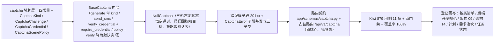

# 验证码渠道扩展基座实施记录

> 项目骨架 · 02 后端基座 · 03 core 横切基座 · 14 验证码渠道扩展基座 · 实施记录

[文档首页](../../../../../../../文档首页.md) › [02-3-14 验证码渠道扩展基座](../02_后端基座_03_core横切基座_14_验证码渠道扩展基座.md) › 01 实施　|　[← 父任务](../02_后端基座_03_core横切基座_14_验证码渠道扩展基座.md)

## 1. 实施信息 <a id="meta"></a>

| 项 | 值 |
| --- | --- |
| 任务 | [02-3-14 验证码渠道扩展基座](../02_后端基座_03_core横切基座_14_验证码渠道扩展基座.md) |
| 对应需求 | [02-42](../../../../../需求/02_需求_后端基座.md#r02-42) |
| 详细设计 | [14_详细设计_01_验证码渠道扩展基座](../设计/14_详细设计_01_验证码渠道扩展基座.md) |
| 实施日期 | 2026-09-20 |
| 实施人 | minjian |
| 实施环境 | 开发机（Ubuntu，Python 3.14 / uv） |
| 提交 | 见「收尾」 |
| 结论 | 完成 |

## 2. 实施概览 <a id="overview"></a>



结果小结：在 `02-31` 验证码域上**同插件键**扩展图形 / 滑块 / 短信三形态契约（形态、凭证与场景策略数据契约 + 手机号脱敏入口 + 出题 / 短信发送 / 双入口校验 / 场景策略五入口），图形码既有契约与 key 空间保持向后兼容；验证码错误码落**认证段内子段 `201xx`**（校验失败 / 不存在或已过期 / 发送过于频繁）；占位实现三形态无状态恒定通过，四端点占位路由免登录挂载 `/api/v1/captcha`；应用可启动、提供者可解析；`pytest` / `ruff` / `pyright` 与基座护栏全绿，新增模块覆盖率 100%。

## 3. 实施过程 <a id="process"></a>

1. **契约扩展（`app/captcha/base.py`）**：增常量 `SMS_CAPTCHA_TTL`（300）/ `SMS_COOLDOWN`（60）/ `CAPTCHA_FAIL_THRESHOLD`（3）/ `SLIDER_TOLERANCE`（10）/ `NULL_CAPTCHA_PAYLOAD`（`"{}"`）；`CAPTCHA_SCENES` 由三项扩为五项（补 `unbind` / `register`）；新增形态枚举 `CaptchaKind`（`image` / `slider` / `sms`）、凭证契约 `CaptchaCredential`（`captcha_id` / `kind` / `code` / `trace` 三元轨迹点 `(x, y, 相对起点毫秒)` / `scene`）、策略契约 `CaptchaScenePolicy`（`scene` / `required` / `fail_threshold` / `ttl` / `cooldown`）、平台默认策略表 `CAPTCHA_SCENE_POLICIES`（顺序与场景枚举一致、仅 `login` 非强制）与通用默认 `DEFAULT_CAPTCHA_SCENE_POLICY`；新增 `default_scene_policy` / `mask_phone`；`CaptchaChallenge` 尾部追加 `kind` / `payload` / `target` / `cooldown`（均带默认值，既有位置参数构造不变）。
2. **契约方法面（`BaseCaptcha`）**：`generate(scene="login", *, kind=CaptchaKind.IMAGE)` 统一出题（仅关键字入参，调用方兼容）；新增抽象 `send_sms(phone, scene)` / `verify_credential(credential)` / `policy(scene)`；新增默认实现 `require_credential(credential)`（判定失败抛 `CaptchaVerifyError`）与 `verify(captcha_id, code)`（由抽象**降为默认实现**，委托凭证校验，图形码语义不变）；`build_captcha_key`、插件键、配置分区、`app.state.captcha` 均不变（无新增能力域与插件键）。
3. **占位实现（`app/captcha/null.py`）**：`NullCaptcha` 扩展为三形态**无状态恒定通过**——`generate` 按形态回带有效期（图形取 `CAPTCHA_TTL`、短信取 `SMS_CAPTCHA_TTL`）与冷却（图形 0 / 短信 `SMS_COOLDOWN`）、`payload` 固定占位串；`send_sms` 回 `kind=sms` 挑战且 `target` 经 `mask_phone` 脱敏（不真发）；`verify_credential` 恒定 `True`；`policy` 取平台默认表（未知场景回落通用默认）。
4. **错误码（`app/core/error_codes.py` + `app/core/exceptions.py`）**：增 `CAPTCHA_VERIFY_FAILED`（20101）/ `CAPTCHA_EXPIRED`（20102）/ `CAPTCHA_TOO_FREQUENT`（20103）；新增 `CaptchaError`（认证段内验证码子段基类，继承 `AuthError`）与三个码位子类（构造时预置码位与 HTTP 状态：200 / 404 / 429，写法同 `PluginError` 对 `ConfigError`）；模块 docstring 补「段内子段基类」口径。
5. **路由契约（`app/schemas/captcha.py`）**：新增 `CaptchaChallengeRequest` / `CaptchaSmsRequest` / `CaptchaVerifyRequest` / `CaptchaChallengeResponse` / `CaptchaVerifyResponse` / `CaptchaPolicyResponse`（与能力域契约字段一一对应；`trace` 经 `default_factory=list[tuple[int, int, int]]` 声明，避开 pyright `reportUnknownVariableType`）。
6. **占位路由（`app/api/captcha.py`）**：`BaseRouter(key="captcha", prefix="/captcha", tags=["captcha"])`——`POST /challenges`（出题，`kind` 区分图形 / 滑块）、`POST /sms`（短信发送，回脱敏目标）、`POST /verify`（委托强制校验入口，失败 20101）、`GET /scenes/{scene}/policy`（场景策略）；**不挂登录态依赖**（登录前场景）；`_ensure_scene` 对未登记场景抛 `ParamError`（10001）；图片字节在路由面转 base64。`app/api/router.py` 登记 `captcha`（统一挂载 `/api/v1`）。
7. **测试**：先在 mjbk Kiwi TCMS 登记用例（返回 **879**），再新增 `tests/captcha/test_captcha_channel.py`（11 条断言组，代码内统一标注 `@pytest.mark.kiwi_id(879)`）；同步既有断言两处——`tests/captcha/test_captcha.py` 的 `CAPTCHA_SCENES` 五项、`tests/api/test_router_base.py` 默认登记表键补 `captcha`。
8. **登记回写**：《后端基类清单》§2 分层总览（验证码行补渠道扩展）/ §9 跨阶段基座（「验证码渠道」行由「待定」改为落点 + 契约 + 状态）/ §10 继承链与代码位置（数据契约 + 错误码子段两条）；《后端开发规范》§3.1 补验证码渠道强制口径（只写语义与强制口径）；架构 09 §2.2「平台已发布码位」行追加 `20101`~`20103`；架构 14 §5 按本次落地口径校准验证码渠道登记；计划 §1 / §2 / §3 / §3.1 / §4 甘特 / §5 门禁与需求 02-42 `> 注：` 块；任务 02-3-14 与父任务 02_03 / 02 后端基座状态回写。

关键命令：

```bash
uv run pytest --cov=app -q
uv run ruff check .
uv run ruff format --check .
uv run pyright
python3 scripts/tools/base-check/check-base.py          # 需在 bms 根目录执行
python3 scripts/tools/base-check/check-backend-base.py  # 需在 bms 根目录执行
```

## 4. 问题与处置 <a id="issues"></a>

| 问题 / 现象 | 原因 | 处置与落点 |
| --- | --- | --- |
| 需求 02-42 原文要求「新增验证码专用错误码**段位**」，但 9 个平台段已被占满且 `2xxxx` 认证段已覆盖验证码 | 段表由《命名规范》§8 与架构 09 §2.2 固定（平台段 1xxxx~9xxxx，产品段自 10xxxx 起），新开段需重排段表并改 CI 校验 | **向用户报冲突并重确认**，取「认证段内子段 `201xx`」（与检索 `101xx` / 组织 `301xx` / 字典 `401xx` 同构）；已登记详细设计 §6 / §15 与计划 §2「偏差与遗留」列 |
| `pyright` 报 `app/schemas/captcha.py` 的 `trace` 类型部分未知 | `Field(default_factory=list, …)` 未参数化，类型推断为 `list[Unknown]` | 按仓库既有写法改用 `default_factory=list[tuple[int, int, int]]`（同 `app/schemas/filters.py` / `chat.py`） |
| 模块 docstring 超长（E501 126 > 120） | 测试文件 docstring 一次性列举过多 | 缩短为「三形态契约 / 常量与场景 / 数据契约 / 策略 / 脱敏 / 双入口 / 占位四端点」 |
| `check-backend-base.py` 报清单对账 2 项不通过 | 新增 `CaptchaCredential` / `CaptchaScenePolicy` 直接继承 `BaseObject` 未登记 | 按预期在《后端基类清单》§9 / §10 登记后通过（护栏生效，非缺陷） |
| 占位实现下「不存在或已过期 / 发送过于频繁」两类错误码分支不可达 | 占位恒定通过（无状态、不真发） | 以**测试替身**（`verify_credential` 恒定 `False`，仅继承端口基类、登记名为空不污染插件注册表）覆盖 `require_credential` 抛错路径；两个码位子类直接实例化断言码位与 HTTP 状态 |

## 5. 验证结果 <a id="verify"></a>

| 完成标准 | 验证方法 | 实测结果 |
| --- | --- | --- |
| 滑块 / 短信接口签名就位 | 三形态契约 + 五入口 + Kiwi 879 用例 | 通过 |
| 图形码契约保持向后兼容 | `verify(captcha_id, code)` 默认实现仍可用；挑战尾部追加默认字段；key 空间 / 插件键 / 装配不变；既有 `test_captcha.py` 主体验证不变 | 通过 |
| 场景枚举与策略下发 | `CAPTCHA_SCENES` 五项 + 默认策略表 + `policy` 契约 + 策略查询端点 | 通过 |
| 手机号脱敏 | `send_sms` 回脱敏目标 + `mask_phone` 用例 | 通过 |
| 验证码专用错误码 | `20101`~`20103` + `CaptchaError` 子段 + 架构 09 §2.2 登记 + 路由 / 替身分支用例 | 通过 |
| 依赖注入可解析、应用可启动不报错 | 装配单例 + 提供者解析用例 + 应用冒烟 + 占位四端点 | 通过 |
| 占位实现恒定通过 | 出题 / 短信 / 判定 / 强制校验 / 策略恒定返回用例 | 通过 |
| 不实现真实能力 | 无 Pillow 出图与轨迹判定、无短信通道调用、无 Redis 计数、无 `sys_config` 读取、无脱敏基座调用 | 通过 |
| 登记齐备 | 《后端基类清单》§2 / §9 / §10、《后端开发规范》§3.1、架构 09 §2.2、架构 14 §5、计划 §1~§5、需求 02-42 注块 | 已登记 |
| 无 lint / 类型错误 | `uv run ruff check .` / `uv run ruff format --check .` / `uv run pyright` | All checks passed / 333 files already formatted / 0 errors |
| 基座护栏 | `check-base.py` / `check-backend-base.py` | 均通过 |
| 新增模块覆盖率 | `pytest --cov=app.captcha --cov=app.schemas.captcha --cov=app.api.captcha --cov=app.core.error_codes --cov=app.core.exceptions` | 各模块均 100% |

> 全量 `pytest`：**664 passed, 8 skipped, 0 failed**（8 skipped 为真实 Redis 集成用例，环境未配置）。

## 6. 偏差与遗留 <a id="deviations"></a>

- **偏差**：
  - 需求 02-42 原文「新增验证码专用错误码段位」→ 取「认证段内子段 `201xx`」：9 个平台段已占满、新开段需重排段表并改 CI 校验，已按冲突报备并经用户重确认；回写详细设计 §6 / §15、计划 §2「偏差与遗留」列与需求 02-42 注块。
  - `generate` 由「仅 `scene`」扩为「`scene` + 仅关键字 `kind`」：调用方兼容、实现方需同步签名（当期仅占位实现一个），属已知契约变更并随本任务登记。
  - `CAPTCHA_SCENES` 由三项扩为五项，既有场景断言同步（`test_captcha.py` 一处）。
- **遗留归口（已登记，随对应阶段销项）**：
  - 真实出题（Pillow 图形码经线程池、滑块背景图与缺口生成、轨迹相似度与人类行为判定、校验后单次失效）、真实短信下发（模板渲染 + 阿里云 / 腾讯云渠道）、Redis 冷却与频次计数、失败计数与「连续失败 N 次强制」、`sys_config` 场景策略按租户覆盖、手机号脱敏改经脱敏基座、渠道不可用降级 → **六 认证与安全**（短信模板与下发归通知公告阶段）；已登记计划 §3.1「验证码渠道真实实现」行与需求 02-42 `> 注：` 块。
  - 登录前接口的防滥用限流与风控（IP + 场景维度）→ 认证阶段（经 02-25 限流基座）；占位路由当前免登录。
  - 图片传输形态若改为直连取图地址，按「只增字段不删字段」扩展路由响应 → 认证阶段定稿（详细设计 §12 开放项）。
- **Kiwi 平台登记**：已完成（2026-09-20）：用例 **879** 登记于 mjbk Kiwi TCMS（分类「平台骨架」、P2、CONFIRMED、标签「自动化」），与 `@pytest.mark.kiwi_id(879)` 一致；平台自增号已被 CI 自动导入用例推进（登记时最新为 878），按《AI开发规范》「编号以平台自增主键为准、既有编号不得复用」取登记返回值。
- **处理偏差与遗留（2026-09-20 闭环）**：计划 §3.1 新增「验证码渠道真实实现」行（出处 02-3-14）；需求 02-42 `> 注：` 块补齐实现期要点（契约面 / 三类渠道职责边界 / 场景与策略 / 错误码子段 / 占位语义 / 占位路由 / 消费方）；消费方（六 认证与安全、通知公告阶段、前端 `06_04` 验证码字段）已在计划 §3.1 与需求注块登记去向。
- **结论**：本任务遗留已全部登记去向，偏差与遗留处理完成。

> 本文档依《文档生成规范》编写
