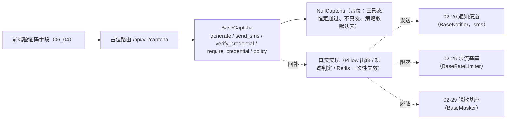

# 验证码渠道扩展基座详细设计

> 项目骨架 · 02 后端基座 · 03 core 横切基座 · 14 验证码渠道扩展基座 · 详细设计

[文档首页](../../../../../../../文档首页.md) › [02-3-14 验证码渠道扩展基座](../02_后端基座_03_core横切基座_14_验证码渠道扩展基座.md) › 01 详细设计　|　[← 父任务](../02_后端基座_03_core横切基座_14_验证码渠道扩展基座.md)

## 1. 概述 <a id="overview"></a>

- **目标**：在 `02-31` 验证码域上扩展**滑块与短信渠道**契约与占位实现——`app/captcha/base.py` 增常量（短信有效期 / 冷却 / 失败阈值 / 滑块容差）、形态与场景策略数据契约（`CaptchaKind` / `CaptchaCredential` / `CaptchaScenePolicy`）、出题与凭证校验契约扩展（`generate` 带形态入参、新增 `send_sms` / `verify_credential` / `require_credential` / `policy`）、手机号脱敏入口 `mask_phone`、错误码子段（认证段 `201xx`）；`app/captcha/null.py` 的 `NullCaptcha` 扩展为**无状态恒定通过**（滑块不出题、短信不真发）；占位路由 `/api/v1/captcha` 四端点与路由契约 `app/schemas/captcha.py`。
- **范围**：`app/captcha/`（`__init__.py` / `base.py` / `null.py`）、`app/core/error_codes.py`、`app/core/exceptions.py`、`app/schemas/captcha.py`（新增）、`app/api/captcha.py`（新增）、`app/api/router.py`、单测；架构 09 §2.2 已发布码位、架构 14 §5、《后端基类清单》§2 / §9 / §10、《后端开发规范》§3.1、计划 §3.1、需求 02-42 注块。
- **不含**（归相邻任务 / 后续阶段）：真实出题（Pillow 图形码、滑块背景图与缺口生成、轨迹相似度与人类行为判定）、真实短信下发（模板渲染 + 阿里云 / 腾讯云渠道，经 `02-20` `BaseNotifier`）、冷却与频次计数的真实存储（Redis 计数器，经 `02-25` `BaseRateLimiter`）、失败计数与「连续失败 N 次强制」的计数落库、手机号脱敏改经 `02-29` `BaseMasker`、场景策略真实读取（`sys_config` 按租户覆盖）、渠道不可用降级 → **六 认证与安全**（需求 02-31 / 02-42 口径，同一任务文档不重复立项）；前端验证码字段真实数据通路（前端 `06_04`，只换数据通路、不改对外契约）。
- **依据**：需求 [02-42](../../../../../需求/02_需求_后端基座.md#r02-42)、《[架构设计 · 子系统_认证与会话](../../../../../../../设计/架构设计/14_架构设计_子系统_认证与会话.md)》「密码与账号策略」节、《[架构设计 · 子系统_通知公告](../../../../../../../设计/架构设计/22_架构设计_子系统_通知公告.md)》「短信通知」节、《[架构设计 · 接口与集成](../../../../../../../设计/架构设计/09_架构设计_接口与集成.md)》「错误码分段」「公共约定」节、《[架构设计 · 后端基础类体系](../../../../../../../设计/架构设计/04_架构设计_后端基础类体系.md)》「能力收口与强制口径（语义）」节、《[后端基类清单](../../../../../../../后端基类清单.md)》「跨阶段基座」节、《[后端开发规范](../../../../../../../规范/后端开发规范.md)》「后端基座体系（强制）」节、《[命名规范](../../../../../../../规范/命名规范.md)》「API 命名」节。

## 2. 现状与差距 <a id="gap"></a>

| 现状 | 差距 |
| --- | --- |
| `BaseCaptcha`（`02-3-7`）只有图形码两入口：`generate(scene) -> CaptchaChallenge`（编号 / 图片字节 / 有效期 / 场景）与 `verify(captcha_id, code) -> bool` | 无**挑战类型**维度、无滑块轨迹凭证校验入口、无短信发送入口；三类渠道若各自实现，挑战契约、一次性失效与「验证码 ↔ 限流 ↔ 通知渠道」协作边界必然分散（需求 02-42 背景） |
| `CAPTCHA_SCENES` 仅三项（`login` / `reset_password` / `bind`） | 注册与解绑手机同样需要验证码，场景枚举不全；且**无场景策略**载体（是否强制、失败阈值、有效期、冷却） |
| 常量只有 `CAPTCHA_TTL=300`；`build_captcha_key` 已就位 | 短信有效期、重发冷却、连续失败阈值、滑块轨迹容差四项口径无统一落点 |
| 架构 14 §5 已于 2026-09-20 登记「验证码渠道」职责边界（基座只出题与一次性校验；短信下发经通知渠道、限次经限流基座、渠道不可用按策略降级） | 《后端基类清单》§9「验证码渠道」行仍为「待定（详细设计定）」——无代码落点、契约与状态 |
| 错误码段位表（架构 09 §2.2）中 `2xxxx` 认证段**已覆盖验证码**，段位基 `AuthError` 已就位 | 验证码校验失败 / 过期 / 发送过频三类失败无专用码位，上层只能笼统用 `10001` / `10002` / `10005`，前端无法区分「重输」与「重取」 |
| 接口路由基座（`02-6-1`）已就位，补充基座普遍落占位路由 | 验证码域无占位路由，前端 `06_04` 验证码字段与联调侧无统一入口基线 |
| 前端 `06_01` 已冻结验证码字段对外契约（形态 `image` / `slider` / `sms`，`refresh` / `send` 事件，倒计时默认 60s） | 后端契约无对应形态与冷却口径（前端倒计时只能自行约定） |

## 3. 交付物清单 <a id="tree"></a>

```text
backend/
├── app/captcha/__init__.py                # 修改：包 docstring 口径（图形 / 滑块 / 短信）
├── app/captcha/base.py                    # 修改：四常量 / CaptchaKind / CaptchaCredential / CaptchaScenePolicy /
│                                          #       CAPTCHA_SCENE_POLICIES / default_scene_policy / mask_phone /
│                                          #       CaptchaChallenge 扩展 / BaseCaptcha 扩展（generate 带 kind、
│                                          #       send_sms、verify_credential、require_credential、policy、
│                                          #       verify 降为默认实现）
├── app/captcha/null.py                    # 修改：NullCaptcha 扩展（三形态恒定通过、短信回脱敏目标、策略取默认表）
├── app/core/error_codes.py                # 修改：ErrorCode 增验证码码位 CAPTCHA_VERIFY_FAILED / CAPTCHA_EXPIRED / CAPTCHA_TOO_FREQUENT
├── app/core/exceptions.py                 # 修改：增 CaptchaError（认证段 + 验证码子段基类）与三个码位子类
├── app/schemas/captcha.py                 # 新增：CaptchaChallengeRequest / CaptchaSmsRequest / CaptchaVerifyRequest /
│                                          #       CaptchaChallengeResponse / CaptchaVerifyResponse / CaptchaPolicyResponse
├── app/api/captcha.py                     # 新增：占位路由 /captcha（challenges / sms / verify / scenes/{scene}/policy）
├── app/api/router.py                      # 修改：登记 captcha 路由（统一挂载 /api/v1）
└── tests/
    ├── captcha/test_captcha_channel.py    # 新增：Kiwi 新编号（契约 / 常量 / 数据契约 / 占位三形态 / 双入口与错误码 /
    │                                      #       场景策略 / 脱敏 / 依赖解析 / 四端点与异常分支）
    ├── captcha/test_captcha.py            # 修改：仅同步 CAPTCHA_SCENES 断言（五项）；历史用例语义不动
    └── api/test_router_base.py            # 修改：默认登记表键期望值补 captcha（02-6-1 用例，路由表增长属预期）

bms文档/
├── 设计/架构设计/09_架构设计_接口与集成.md        # 修改：§2.2「平台已发布码位」行追加验证码码位
├── 设计/架构设计/14_架构设计_子系统_认证与会话.md  # 修改：「密码与账号策略」节按本次落地口径校准（契约边界与登记）
├── 后端基类清单.md                                # 修改：§2 分层总览 / §9 验证码渠道行（原「待定」落点 + 契约 + 状态）/ §10 继承链
├── 规范/后端开发规范.md                            # 修改：§3.1 补验证码渠道强制口径（只写语义与强制口径，不写实现侧标识）
├── 项目/01_项目骨架/计划/01_计划_项目骨架.md      # 修改：§3.1 后续阶段待办（验证码渠道真实实现行）+ 02_03 偏差跟踪
├── 项目/01_项目骨架/需求/02_需求_后端基座.md      # 修改：需求 02-42 补实现期要点注块（需求文档不承载进度）
├── 项目/…/02_后端基座_03_core横切基座/…14….md     # 修改：参考文档补本设计 / 实施 / 测试链接，实施后回写状态
└── 项目/…/02_后端基座_03_core横切基座.md          # 修改：子任务清单 14 状态 / 完成日期回写
```

## 4. 挑战类型与凭证契约（`app/captcha/base.py`） <a id="contract"></a>

| 成员 | 形态 | 说明 |
| --- | --- | --- |
| `SMS_CAPTCHA_TTL` | `int` 常量，`300` | 短信验证码有效期（秒，5 分钟；与图形码同窗，架构 14 §5） |
| `SMS_COOLDOWN` | `int` 常量，`60` | 短信重发冷却（秒）；同时作为前端倒计时口径（前端字段默认 60s 一致） |
| `CAPTCHA_FAIL_THRESHOLD` | `int` 常量，`3` | 连续失败阈值（平台默认，架构 14 §5「连续失败 3 次后强制要求」），作场景策略默认表基准 |
| `SLIDER_TOLERANCE` | `int` 常量，`10` | 滑块轨迹终点容差（像素下限）；真实实现只收紧不重定 |
| `CaptchaKind` | `StrEnum` | 挑战类型：`image`（图形）/ `slider`（滑块）/ `sms`（短信）；与前端字段形态取值同源 |
| `CaptchaChallenge` | `@dataclass(frozen=True)`，继承 `BaseObject` | 现有四字段（`captcha_id` / `image` / `expires_in` / `scene`）**后追加**：`kind`（默认 `image`）/ `payload`（形态参数 JSON 字符串，默认空串）/ `target`（脱敏目标，默认空串）/ `cooldown`（重发冷却秒数，默认 0） |
| `CaptchaCredential` | `@dataclass(frozen=True)`，继承 `BaseObject` | 统一凭证：`captcha_id` / `kind`（默认 `image`）/ `code`（校验码，默认空串）/ `trace`（滑块轨迹点序列，默认空元组；每点 `(x, y, 相对起点毫秒)`）/ `scene`（默认 `login`） |
| `CaptchaScenePolicy` | `@dataclass(frozen=True)`，继承 `BaseObject` | 场景策略：`scene` / `required`（是否强制，默认 `True`）/ `fail_threshold`（默认 `CAPTCHA_FAIL_THRESHOLD`）/ `ttl`（默认 `CAPTCHA_TTL`）/ `cooldown`（默认 `SMS_COOLDOWN`） |
| `CAPTCHA_SCENE_POLICIES` | `tuple[CaptchaScenePolicy, ...]` | 平台默认策略表，覆盖 `CAPTCHA_SCENES` 全量场景、顺序与之一致 |
| `default_scene_policy(scene)` | 模块函数 | 取平台默认策略；未登记场景回落**通用默认**（不抛错，占位期不改契约行为） |
| `mask_phone(phone)` | 模块函数 | 手机号脱敏（保留前 3 后 4）；短信脱敏的**基座内唯一入口** |
| `BaseCaptcha` | 能力域契约（`key = plugin_key = "captcha"`） | 见下表方法面 |

**契约方法面**：

| 方法 | 形态 | 说明 |
| --- | --- | --- |
| `generate(scene="login", *, kind=CaptchaKind.IMAGE)` | 抽象（async） | 统一出题入口：图形 / 滑块按 `kind` 分派（短信不走此入口，见 `send_sms`） |
| `send_sms(phone, scene) -> CaptchaChallenge` | 抽象（async） | 短信验证码发送（返回挑战：`kind=sms` / `target` 脱敏手机号 / 有效期 / 冷却）；真实实现经 `02-20` 通知渠道下发、`02-25` 限流基座限次 |
| `verify_credential(credential) -> bool` | 抽象（async） | 统一凭证校验（判定入口，不抛错）：图形 / 短信用 `code`、滑块用 `trace`；真实实现校验后即失效（**单次有效**）、过期或不存在返回 `False` |
| `require_credential(credential) -> None` | 默认实现（async） | 强制校验（接口层一行接入）：判定失败抛 `CaptchaVerifyError`（`20101`）；与权限域 `check` / `require`、限流域 `check` / `require` 同构 |
| `policy(scene) -> CaptchaScenePolicy` | 抽象（async） | 取场景策略（是否强制 / 失败阈值 / 有效期 / 冷却）；真实实现读 `sys_config` 按租户覆盖、缺省回落平台默认表 |
| `verify(captcha_id, code) -> bool` | **默认实现**（由抽象降为具体，async） | 图形码兼容入口：委托 `verify_credential(CaptchaCredential(captcha_id=..., code=...))`；既有调用方（传两参）零改动、语义不变 |

**口径**：

| 情形 | 处置 |
| --- | --- |
| 向后兼容 | ① 挑战值对象只在**尾部追加**带默认值字段，既有位置参数与断言不变；② `verify(captcha_id, code)` 由抽象降为默认实现（委托新入口），调用面与图形码语义不变；③ `build_captcha_key` 与 key 空间（`bms:global:captcha:{uuid}`）**不变**——三类渠道共用同一份挑战编号空间，不新增 key 形态；④ 插件键 `captcha`、配置分区 `[captcha]`、`app.state.captcha` 均不变（无新增能力域、无新增插件键、`_EXPECTED_PLUGIN_KEYS` 不动）。 |
| `generate` 签名变更 | 新增**仅关键字**入参 `kind`（默认图形）；调用方兼容，实现方需同步签名（当期仅 `NullCaptcha` 一个实现，属已知契约变更并随本任务登记）。 |
| 同步 / 异步 | 新增四入口**全异步**（真实实现有 Redis / 网络 IO；与既有 `generate` / `verify` 一致，回补时调用面零改动）。 |
| `payload` 语义 | 承载**形态相关参数**（JSON 字符串）：滑块为背景与缺口参数、图形可带图片尺寸；占位期统一为固定占位串 `NULL_CAPTCHA_PAYLOAD`（`"{}"`）。取值格式由形态定义、**只增字段不删字段**。 |
| `target` 语义 | 仅短信渠道使用，恒为**脱敏手机号**（见 §5）；图形 / 滑块为空串。 |
| `cooldown` 语义 | 重发冷却秒数（短信取 `SMS_COOLDOWN`）；图形 / 滑块为 0（刷新不受冷却约束的逻辑由上层决定）。 |
| `trace` 语义 | 每个点为 `(x, y, 相对起点毫秒)`——位置与时间维度一次预留在点内，避免后续把二元点改三元点的**破坏性扩展**。 |
| 一次性失效 | 真实实现 `verify_credential` 成功后即失效（与 `02-31` 口径一致）；占位无状态、恒定通过。 |
| 失败计数与强制策略 | 计数落库与「连续失败 N 次强制要求」由登录侧按 `policy(scene)` 的 `fail_threshold` / `required` 执行（架构 14 §5）；**基座只给策略与校验能力、不落计数**。 |
| 渠道不可用降级 | 归实现侧（通知渠道告警降级，架构 22 §5）；本基座不承载降级分支。 |



## 5. 短信渠道与场景策略 <a id="sms"></a>

**发送口径**（契约层只定口径、不接线）：

| 项 | 口径 |
| --- | --- |
| 发送入口 | `send_sms(phone, scene) -> CaptchaChallenge`；挑战携带 `target`（脱敏手机号）/ `expires_in`（`SMS_CAPTCHA_TTL`）/ `cooldown`（`SMS_COOLDOWN`） |
| 下发通道 | 真实实现经 `02-20` `BaseNotifier`（`NotifyChannel.SMS`）下发；**基座不直连厂商 SDK**（能力收口强制） |
| 限次与防滥用 | 真实实现经 `02-25` `BaseRateLimiter` 按维度计数（手机号 + 场景），冷却窗取 `cooldown`；占位不计数 |
| 手机号脱敏 | 一律经 `mask_phone`（保留前 3 后 4，如 `138****5678`）；真实实现把该入口内部取值改经 `02-29` `BaseMasker`，**函数签名与调用口径不变**（调用方拿到的永远是脱敏值） |
| 失败分支 | 冷却未到 / 频次超限 → `CaptchaTooFrequentError`（`20103` / 429）；真实实现抛、占位不抛 |

**场景与策略**：

| 场景 | `required`（是否强制） | `fail_threshold` | `ttl` | `cooldown` |
| --- | --- | --- | --- | --- |
| `login` 登录 | 否（连续失败达阈值后由登录侧强制，架构 14 §5） | 3 | 300 | 60 |
| `reset_password` 找回密码 | 是 | 3 | 300 | 60 |
| `bind` 绑定手机 | 是 | 3 | 300 | 60 |
| `unbind` 解绑手机 | 是 | 3 | 300 | 60 |
| `register` 注册 | 是 | 3 | 300 | 60 |

- 上表为**平台默认表**（`CAPTCHA_SCENE_POLICIES`）；真实实现由 `policy(scene)` 读 `sys_config` 按租户覆盖、缺省回落本表（架构 14 §5「sys_config 可配」）。
- 场景枚举 `CAPTCHA_SCENES` 由三项扩为**五项**（补 `unbind` / `register`），顺序与默认表一致。
- 未知场景：`default_scene_policy` 回落通用默认（不抛错）；**路由层**对未知场景抛 `ParamError`（`10001`），保证接口面参数校验可断言。

## 6. 错误码（认证段 `201xx` 子段） <a id="errors"></a>

**段位形态（冲突项已重确认）**：架构 09 §2.2 与《命名规范》§8 已定 9 个平台段，其中 `2xxxx` **已覆盖验证码**，段位基 `AuthError` 已存在；故以「**认证段内开验证码子段 `201xx`**」落实验证码专用错误码——与检索 `101xx`、组织 `301xx`、字典 `401xx` 同构，不新开段位、不改段表、不改 CI 校验脚本（码位仍为 5 位平台码、万位仍在平台段）。

| 码位 | `ErrorCode` 成员 | 异常类 | HTTP | 触发 |
| --- | --- | --- | --- | --- |
| `20101` | `CAPTCHA_VERIFY_FAILED` | `CaptchaVerifyError` | 200（业务失败统一 200） | 校验不通过（`require_credential` 强制入口） |
| `20102` | `CAPTCHA_EXPIRED` | `CaptchaExpiredError` | 404 | 挑战不存在或已过期 |
| `20103` | `CAPTCHA_TOO_FREQUENT` | `CaptchaTooFrequentError` | 429 | 发送过于频繁（冷却未到 / 频次超限） |

继承链：`CaptchaVerifyError` / `CaptchaExpiredError` / `CaptchaTooFrequentError` → `CaptchaError` → `AuthError` → `BizError` →（`BaseObject` + `Exception`）；码位由子类构造时预置（同 `PluginError` 对 `ConfigError` 的写法），`http_status` 按上表传入。

**登记范围**：`app/core/error_codes.py`（单一登记点）+ 架构 09 §2.2「平台已发布码位」行追加；《命名规范》§8 与 `check-backend-base.py` **零改动**（段位与位数均未变）。

## 7. 占位路由（`app/api/captcha.py`） <a id="route"></a>

`router = BaseRouter(key="captcha", prefix="/captcha", tags=["captcha"])`——基于 `02-6-1` 路由基座，统一挂载到 `/api/v1`；**不挂 `require_auth`**：验证码用于登录 / 找回密码等**登录前**场景，要求登录态与语义相背（防滥用限流随认证阶段接入）。

| 方法 | 路径 | 请求 | 响应 | 口径 |
| --- | --- | --- | --- | --- |
| POST | `/api/v1/captcha/challenges` | `CaptchaChallengeRequest`（`scene` / `kind`） | `CaptchaChallengeResponse` | 委托 `generate`；图形出图字节、滑块出背景与缺口参数（占位均按固定返回） |
| POST | `/api/v1/captcha/sms` | `CaptchaSmsRequest`（`phone` / `scene`） | `CaptchaChallengeResponse` | 委托 `send_sms`；`phone` 只做非空校验（格式校验归真实实现），`target` 回脱敏手机号 |
| POST | `/api/v1/captcha/verify` | `CaptchaVerifyRequest`（`kind` / `captcha_id` / `code` / `trace` / `scene`） | `CaptchaVerifyResponse`（`verified`） | 委托 `require_credential`（**失败抛 `20101`**）；占位恒定通过 |
| GET | `/api/v1/captcha/scenes/{scene}/policy` | 路径参数 `scene` | `CaptchaPolicyResponse` | 委托 `policy`；`scene` 不在 `CAPTCHA_SCENES` → `ParamError`（`10001`） |

**路由契约**（`app/schemas/captcha.py`，字段与能力域契约一一对应、路由内显式映射）：

| 契约 | 字段 | 说明 |
| --- | --- | --- |
| `CaptchaChallengeRequest` | `scene` / `kind` | `scene` 默认 `login`；`kind` 默认 `image`（枚举校验非法形态） |
| `CaptchaSmsRequest` | `phone` / `scene` | `phone` 非空（`min_length=1`） |
| `CaptchaVerifyRequest` | `kind` / `captcha_id` / `code` / `trace` / `scene` | `captcha_id` 非空；`trace` 为三元点序列（默认空） |
| `CaptchaChallengeResponse` | `captcha_id` / `kind` / `image` / `expires_in` / `scene` / `payload` / `target` / `cooldown` | `image` 为 **base64** 字符串（占位空串；前端可拼 `data:image/png;base64,`） |
| `CaptchaVerifyResponse` | `verified` | 校验通过恒 `true`（失败走业务错误码） |
| `CaptchaPolicyResponse` | `scene` / `required` / `fail_threshold` / `ttl` / `cooldown` | 场景策略视图 |

**口径**：

- 能力域契约字段与路由契约字段**字段名一致**，路由内显式构造响应（不隐式透传对象），保证 OpenAPI 契约稳定。
- 图片字节在路由面转 base64（能力域契约只返回字节，传输形态由接口层决定）；真实实现改造为直连取图 URL 属开放项（见 §12）。
- 四端点写操作（出题 / 发送 / 校验）统一 `ApiResponse` 包裹（`{code, message, data}`），业务失败走码位、HTTP 状态由异常类决定。

## 8. 应用装配与依赖注入 <a id="di"></a>

| 位置 | 变更 |
| --- | --- |
| `app/core/config.py` | **零改动**：沿用 `captcha` 分区（`settings.captcha.provider`） |
| `app/core/assembly.py` | **零改动**：`app.captcha.null` 已在 `_NULL_MODULES`；`PLUGIN_WIRINGS` 已有 `captcha` 接线 |
| `app/api/deps.py` | **零改动**：`get_captcha` 已导出（模块 docstring 补「验证码」口径描述可选） |
| `app/api/router.py` | 模块列表增 `captcha`（登记路由 → 统一挂载 `/api/v1`） |

- 提供者仍为普通同步函数（取装配 settings 解析单例，无 IO、无上下文变量）；真实实现按同键登记新实现名，**调用面零改动**。
- 不新增插件键、不新增配置分区 → 两处前置契约断言（默认路由登记表、`_EXPECTED_PLUGIN_KEYS`）中**只有路由登记表需补 `captcha`**，端口清单不动。

## 9. 继承与分层 <a id="base"></a>

- `BaseCaptcha → BasePluggable → BaseCapability (+ BaseAsyncResource) → BaseObject`（不变）。
- `NullCaptcha → BaseCaptcha + BaseNullObject → BasePlaceholder → BaseObject`（不变）。
- 数据契约 `CaptchaChallenge` / `CaptchaCredential` / `CaptchaScenePolicy`（frozen dataclass）→ `BaseObject`；`CaptchaKind` 为 `StrEnum`（同 `NotifyChannel`）。
- 异常 `CaptchaVerifyError` / `CaptchaExpiredError` / `CaptchaTooFrequentError` → `CaptchaError` → `AuthError` → `BizError`。
- 路由契约 `CaptchaChallengeRequest` / `CaptchaSmsRequest` / `CaptchaVerifyRequest` / `CaptchaChallengeResponse` / `CaptchaVerifyResponse` / `CaptchaPolicyResponse` → `BaseSchema`。
- 与 `02-31` 的关系：**同一域、同一插件键的向后兼容扩展**（图形码语义与 key 空间不变）；与 `02-20` / `02-25` / `02-29` 的关系为**实现期单向依赖**（契约层不持依赖、不反向依赖）。

## 10. 登记落点 <a id="register"></a>

| 落点 | 登记内容 |
| --- | --- |
| 《架构设计 · 接口与集成》§2.2 | 「平台已发布码位」行追加验证码码位（`20101`~`20103`，校验失败 / 不存在或过期 / 发送过频，含 HTTP 状态） |
| 《架构设计 · 认证与会话》§5 | 按本次落地口径校准验证码渠道登记（挑战类型 / 轨迹凭证 / 短信发送与校验 / 场景策略由配置下发 / 三者职责边界；契约边界与命名指向《后端基类清单》「跨阶段基座」节，不写实现侧标识） |
| 《后端基类清单》§2 分层总览 | 验证码行补「渠道扩展」口径（形态 / 凭证 / 策略 / 脱敏入口） |
| 《后端基类清单》§9 跨阶段基座 | 「验证码渠道」行由「待定（详细设计定）」改为**代码位置 + 契约 + 状态**（`已交付（02-3-14，2026-09-20；真实出题 / 轨迹判定 / 短信下发 / 限次计数 / 策略读取随六 认证与安全阶段）`）+ 占位路由 |
| 《后端基类清单》§10 继承链与目录 | 补验证码渠道数据契约与错误码子段的继承链（`CaptchaError → AuthError`；三数据契约 → 根系） |
| 《后端开发规范》§3.1 | 补验证码渠道强制口径（**只写语义与强制口径，不写实现侧标识**）：三类验证码（图形 / 滑块 / 短信）一律经验证码基座出口，禁止各模块自研出题 / 自建轨迹判定 / 直连短信厂商；场景策略一律经基座策略入口读取，禁止登录侧自读配置拼默认值；短信目标一律脱敏后回显；挑战编号空间与图形码共用 |
| 计划《01_计划_项目骨架》§3.1 | 新增「验证码渠道真实实现（Pillow 出题 / 滑块背景与缺口生成 / 轨迹相似度与行为判定 / 短信模板与渠道下发 / Redis 冷却与频次计数 / 失败计数与强制策略 / `sys_config` 场景策略 / 手机号脱敏改经脱敏基座 / 渠道降级）」行，出处 `02-3-14`；02_03 表「偏差与遗留」补 `02-3-14` |
| 需求 [02-42](../../../../../需求/02_需求_后端基座.md#r02-42) | 参考文档后补 `> 注：实现期要点` 块（契约方法面 / 三类渠道与协作边界 / 场景策略口径 / 错误码子段 / 占位语义 / 占位路由 / 前端消费方）；**需求文档不承载进度** |
| 02-3-14 任务文档 / 02_03 父任务 | 参考文档补本设计 / 实施 / 测试链接；实施后回写状态 / 完成日期与子任务清单 |

## 11. 测试设计（Kiwi 先登记） <a id="tests"></a>

用例**先登记 Kiwi TCMS 再编码**（《[测试规范](../../../../../../../规范/测试规范.md)》「用例管理（Kiwi TCMS）」节）；本任务新分配 **Kiwi 1 条**（分类「平台骨架」、优先级 P2、状态 CONFIRMED、标签「自动化」；**编号以平台自增返回值为准**，登记后回填本表与代码内 `@pytest.mark.kiwi_id(...)`）：

| Kiwi | 用例 | 断言要点 | 自动化文件 |
| --- | --- | --- | --- |
| 待登记 | 契约继承与能力域标识 | `NullCaptcha → BaseCaptcha → BasePluggable → BaseCapability → BaseObject`；`key == plugin_key == "captcha"`；`placeholder` / `describe()`；插件键未新增（清单不变） | `tests/captcha/test_captcha_channel.py` |
| 待登记 | 常量与场景枚举 | `SMS_CAPTCHA_TTL == 300` / `SMS_COOLDOWN == 60` / `CAPTCHA_FAIL_THRESHOLD == 3` / `SLIDER_TOLERANCE == 10`；`CAPTCHA_TTL == 300` 不变；`CAPTCHA_SCENES` 五项且顺序稳定；`build_captcha_key` 不变 | 同上 |
| 待登记 | 数据契约与向后兼容 | `CaptchaChallenge` 追加字段默认值（`kind=image` / `payload=""` / `target=""` / `cooldown=0`）、既有位置参数构造不变、值对象不可变；`CaptchaCredential`（`trace` 三元点序列）/ `CaptchaScenePolicy` 字段与默认值 | 同上 |
| 待登记 | 场景策略默认表与回落 | `CAPTCHA_SCENE_POLICIES` 覆盖 `CAPTCHA_SCENES` 且顺序一致；仅 `login` 非强制；`default_scene_policy` 命中表 / 未登记场景回落通用默认（不抛错） | 同上 |
| 待登记 | 手机号脱敏 | `mask_phone("13812345678") == "138****5678"`；短号码边界（长度不足时保留可保留位、不抛错） | 同上 |
| 待登记 | 占位出题（三形态） | `generate("login")` 默认图形；`generate(scene, kind=slider)` / `kind=sms` 回带形态；`image == b""`；图形取 `CAPTCHA_TTL`、短信取 `SMS_CAPTCHA_TTL`；`cooldown` 图形 0 / 短信 `SMS_COOLDOWN`；`payload` 固定占位串 | 同上 |
| 待登记 | 占位短信发送 | `send_sms(phone, scene)` 回挑战：`kind=sms` / `target` 为脱敏手机号 / `cooldown == SMS_COOLDOWN` / `expires_in == SMS_CAPTCHA_TTL`；不真发（无通道调用面） | 同上 |
| 待登记 | 双入口校验与错误码 | `verify_credential(credential)` 恒定 `True`（含滑块轨迹凭证）；兼容入口 `verify(captcha_id, code)` 委托新入口且恒定 `True`；`require_credential` 恒定通过；**替身返回 `False` 时 `require_credential` 抛 `CaptchaVerifyError`（20101）**；三个错误类码位 / HTTP 状态（10001 / 404 / 429 语义）与继承链 | 同上 |
| 待登记 | 依赖解析与占位策略 | 应用装配缺省 `NullCaptcha`（`app.state.captcha`）；路由经 `Depends(get_captcha)` 取到同一实例；`policy(scene)` 经占位取平台默认 | 同上 |
| 待登记 | 四端点与异常分支 | `POST /api/v1/captcha/challenges`（三种 `kind`）；`POST /captcha/sms` 回脱敏目标；`POST /captcha/verify` 回 `{verified: true}`；`GET /captcha/scenes/login/policy` 回策略；未知场景 → `10001`；非法 `kind` → 参数错误响应；四端点免登录（无 `require_auth` 依赖） | 同上 |

回归：全量 `pytest`（含接口冒烟）；**前置契约协同适配**——`tests/api/test_router_base.py` 默认登记表期望键补 `captcha`（登记表随路由增长属预期，不改断言语义）；`tests/captcha/test_captcha.py` 仅同步 `CAPTCHA_SCENES` 五项断言。

## 12. 实施步骤 <a id="steps"></a>

1. `app/captcha/base.py`：增四常量、`CaptchaKind` / `CaptchaCredential` / `CaptchaScenePolicy` / `CAPTCHA_SCENE_POLICIES` / `default_scene_policy` / `mask_phone` / `NULL_CAPTCHA_PAYLOAD`；扩展 `CaptchaChallenge` 与 `BaseCaptcha`（`generate` 带 `kind`、`send_sms` / `verify_credential` / `require_credential` / `policy`、`verify` 降为默认实现）；更新模块 docstring 口径。
2. `app/captcha/__init__.py`：包 docstring 补三形态口径。
3. `app/captcha/null.py`：`NullCaptcha` 扩展（三形态出题 / 短信回脱敏目标 / 校验恒定通过 / 策略取默认表）。
4. `app/core/error_codes.py` + `app/core/exceptions.py`：验证码码位 `20101`~`20103` 与 `CaptchaError` 子段基类 + 三个码位子类。
5. `app/schemas/captcha.py`：路由请求 / 响应契约六个。
6. `app/api/captcha.py` + `app/api/router.py`：占位路由（四端点、免登录）与登记。
7. 测试：**先登记 Kiwi 取得编号**，再写 `tests/captcha/test_captcha_channel.py`（代码内标注用例编号）；同步 `tests/captcha/test_captcha.py` 场景断言与 `tests/api/test_router_base.py` 登记表期望键。
8. 验证：`uv run pytest --cov=app -q`、`uv run ruff check .`、`uv run ruff format --check .`、`uv run pyright`、`python3 scripts/tools/base-check/check-base.py`、`check-backend-base.py` 全绿；新增模块覆盖率 100%。
9. 登记：架构 09 §2.2 / 架构 14 §5、《后端基类清单》§2 / §9 / §10、《后端开发规范》§3.1、计划 §3.1 + 02_03 偏差跟踪、需求 02-42 注块、任务 / 父任务状态。
10. 收尾：实施 / 测试记录 + 偏差与遗留闭环（消费方标注）后提交（推送另议）。

## 13. 验收映射 <a id="accept-map"></a>

| 完成标准（需求 02-42 / 任务 02-3-14） | 验证方式 |
| --- | --- |
| 滑块 / 短信接口签名就位 | `CaptchaKind` / `CaptchaCredential` 契约 + `generate(kind)` / `send_sms` / `verify_credential` / `require_credential` / `policy` 五入口 + Kiwi 用例 |
| 图形码契约保持向后兼容 | `verify(captcha_id, code)` 降为默认实现仍可用；`CaptchaChallenge` 仅尾部追加默认字段；`CaptchaChallenge` 既有断言与 `test_captcha.py` 主体验证不变；key 空间与插件键不变 |
| 场景枚举与策略下发 | `CAPTCHA_SCENES` 五项 + `CAPTCHA_SCENE_POLICIES` 默认表 + `policy(scene)` 契约 + 策略查询端点 |
| 手机号脱敏 | `send_sms` 返回 `target` 为脱敏手机号 + `mask_phone` 用例 |
| 验证码专用错误码 | `20101`~`20103` 码位 + `CaptchaError` 子段 + 架构 09 §2.2 登记 + 路由校验失败分支用例 |
| 依赖注入可解析、应用可启动不报错 | 装配单例 + 提供者解析用例 + 应用冒烟 + 占位四端点 |
| 占位实现恒定通过 | `generate` / `send_sms` / `verify_credential` / `require_credential` / `policy` 恒定返回用例 |
| 登记齐备 | 架构 09 §2.2、架构 14 §5、《后端基类清单》§2 / §9 / §10、《后端开发规范》§3.1、计划 §3.1 |
| 不实现真实能力 | 无 Pillow 出题 / 无滑块图形与轨迹判定、无短信通道调用、无 Redis 计数、无 `sys_config` 读取、无脱敏基座调用 |
| 无 lint / 类型错误 | `uv run ruff check .` / `uv run ruff format --check .` / `uv run pyright` |
| 新增模块覆盖率 100% | `pytest --cov=app.captcha --cov=app.schemas.captcha --cov=app.api.captcha --cov=app.core.error_codes --cov=app.core.exceptions` |

## 14. 边界与开放项 <a id="boundary"></a>

- **真实出题与轨迹判定**（Pillow 图形码、滑块背景图与缺口生成、轨迹相似度与人类行为判定、单次失效）→ **六 认证与安全**；已登记计划 §3.1。
- **真实短信下发**（模板入库与渲染、阿里云 / 腾讯云渠道、发送记录 `sys_sms_log`）→ **通知公告阶段**（经 `02-20` 通知渠道出口）；冷却与频次计数（Redis）→ **认证阶段**（经 `02-25` 限流基座）。
- **失败计数与「连续失败 N 次强制」**（`sys_account_lock` 联动、登录侧计数器）→ **认证阶段**；基座只提供策略与校验能力。
- **场景策略真实读取**（`sys_config` 键位 / 按租户覆盖 / 管理界面）→ **认证 / 系统配置阶段**；占位期返回平台默认表。
- **手机号脱敏改经 `02-29`**：占位期 `mask_phone` 内固定规则；回补时改内部取值，**签名与调用口径不变**。
- **图片传输形态**：占位与首版按 base64 承载；若真实实现改为直连取图 URL（预签名 / 一次性地址），须按「只增字段不删字段」扩展路由响应（`image` 保留、新增地址字段），并在认证阶段定稿。
- **渠道不可用降级**：按策略降级（告警降级企业微信 / 钉钉）归通知公告阶段实现侧；本基座不落降级分支。
- **登录前接口的防滥用**：占位路由免登录（登录前场景），真实环境的限流 / 风控（IP + 场景维度）随认证阶段接入（`02-25`）。
- **占位语义已知项**：无状态恒定通过——校验恒 `True`、不校验场景与形态合法性；「挑战不存在 / 已过期 / 发送过频」在占位期不可由真实实现触发（以替身用例覆盖 `require_credential` 抛错路径），随真实实现销项。
- **前端消费方**：`06_04` 验证码字段（阶段六窗口）只换数据通路，`06_01` 冻结的对外契约（形态 `image` / `slider` / `sms`、`refresh` / `send` 事件、倒计时）不变；本任务为其提供入口基线。
- **测试**：真实出题 / 短信下发 / 冷却计数 / 策略读取 / 轨迹判定用例随对应阶段补充。

## 15. 对齐记录 <a id="align"></a>

| # | 事项 | 结论 |
| --- | --- | --- |
| 1 | 代码落点 | 扩展既有 `app/captcha/`（`base.py` 契约 / `null.py` 占位）；不新增能力域与插件键（用户拍板） |
| 2 | 图形码向后兼容 | `verify(captcha_id, code)` 降为**默认实现**（委托新入口）+ 新增抽象 `verify_credential`（用户拍板） |
| 3 | 凭证契约 | 新增统一 `CaptchaCredential`（形态 / 编号 / 校验码 / 轨迹点序列 / 场景）（用户拍板） |
| 4 | 挑战值对象 | 尾部追加 `kind` / `payload` / `target` / `cooldown`（均带默认值）（用户拍板） |
| 5 | 出题与短信入口 | `generate(scene, *, kind)` 统一出题 + `send_sms(phone, scene)` 单列（用户拍板） |
| 6 | 场景策略下发 | 策略数据契约 + 平台默认表 + 抽象 `policy(scene)`（占位返回默认、真实读 `sys_config`）（用户拍板） |
| 7 | 场景枚举 | 五项：`login` / `reset_password` / `bind` / `unbind` / `register`（用户拍板；既有断言同步） |
| 8 | 渠道接线程度 | 契约层不持依赖，仅定冷却 / 限频口径与「真实实现经 `02-20` / `02-25`」登记（用户拍板） |
| 9 | 常量 | `SMS_CAPTCHA_TTL=300` / `SMS_COOLDOWN=60` / `CAPTCHA_FAIL_THRESHOLD=3` / `SLIDER_TOLERANCE=10`（用户拍板） |
| 10 | 占位路由 | `/api/v1/captcha` 四端点 + 路由契约 `app/schemas/captcha.py`；**免登录**（不挂 `require_auth`）（用户拍板） |
| 11 | 错误码段位形态 | **认证段内子段 `201xx`** + 段内错误子类；不新开段位（与检索 `101xx` / 组织 `301xx` / 字典 `401xx` 同构）（用户拍板；原「新开段位」选项经冲突报备后重确认） |
| 12 | 码位清单 | `20101` 校验失败（200）/ `20102` 不存在或已过期（404）/ `20103` 发送过于频繁（429）（用户拍板） |
| 13 | 失败表达语义 | 双入口：`verify_credential` 返回布尔 + `require_credential` 抛错（对齐权限 / 限流域 `check` / `require`）（用户拍板） |
| 14 | 码位登记范围 | `app/core/error_codes.py` + 架构 09 §2.2 已发布码位行；《命名规范》§8 与 CI 脚本零改动（用户拍板） |
| 15 | 手机号脱敏 | 挑战 `target` 回脱敏手机号；占位期基座内固定规则（保留前 3 后 4），真实实现改经 `02-29`（用户拍板） |
| 16 | 占位语义 | 无状态恒定通过；异常分支以替身用例覆盖（用户拍板） |
| 17 | 测试口径 | 新增 `tests/captcha/test_captcha_channel.py` + **新登记 Kiwi 编号**（预期 846，以平台自增为准）；既有用例仅同步场景断言（用户拍板） |
| 18 | 工时 / 窗口 / 范围 | 4h；阶段一补做窗口序 9（2026-09-20）；一条龙交付（用户拍板） |
| 19 | 轨迹点形态 | 每个点取 `(x, y, 相对起点毫秒)`——位置与时间维度一次预留，避免后续破坏性扩展（设计补充） |
| 20 | 未知场景处置 | 策略入口回落通用默认（不抛错，沿用「占位不校验场景」口径）；**路由层**抛 `ParamError`（10001）（设计补充） |

> 本文档依《文档生成规范》编写 · 关键决策逐项确认
