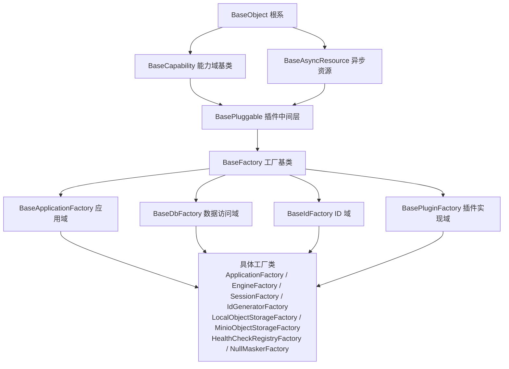

# 工厂基类详细设计

> 项目骨架 · 02 后端基座 · 03 core 横切基座 · 15 工厂基类 · 详细设计

[文档首页](../../../../../../../文档首页.md) › [02-3-15 工厂基类](../02_后端基座_03_core横切基座_15_工厂基类.md) › 01 详细设计　|　[← 父任务](../02_后端基座_03_core横切基座_15_工厂基类.md)

## 1. 概述 <a id="overview"></a>

- **目标**：把后端创建逻辑纳入基类体系，与前端 `BaseFactory` 同构——新增工厂基类 `BaseFactory`（`app/core/factory.py`，中间层，继承 `BasePluggable`）；层级 `BaseFactory → 各域工厂基类 → 具体工厂类`；既有类工厂改挂工厂链、既有函数式创建类化为具体工厂类。
- **契约**（对齐前端）：`create(options)` 抽象 + `validate(options)` 默认空实现；创建入口标识取 `BasePluggable` 的 `key` / `plugin_name` / `contract_version`；产出物释放经 `ResourceManager` 登记（`aclose`）。
- **范围**：`app/core/factory.py`（新增）、`app/db/engine.py`、`app/db/session.py`、`app/main.py`、`app/core/assembly.py`、`app/core/id.py`（迁移）、`app/api/deps.py`（按需）、单测与契约用例。
- **不含**：键拼接工具（`build_lock_key` / `build_captcha_key` / `build_cache_key` / `build_idempotency_key` / `build_rate_limit_key`）、注册表构建入口 `build_plugin_registry`、FastAPI 依赖 `get_db` / `get_uow`、装配编排 `register_platform_plugins` / `assemble_plugins`——它们不是「创建对象」语义，本次不类化。
- **依据**：需求 [02-54](../../../../../需求/02_需求_后端基座.md#r02-54)、《[架构设计 · 后端基础类体系](../../../../../../../设计/架构设计/04_架构设计_后端基础类体系.md)》「基座分层」「能力收口与强制口径」节、《[架构设计 · 子系统 · 扩展点与插件化](../../../../../../../设计/架构设计/10_架构设计_子系统_扩展点与插件化.md)》、《[后端基类清单](../../../../../../../后端基类清单.md)》「中间层基类」节、《[前端基类清单](../../../../../../../前端基类清单.md)》「中间层基类」节、《[后端开发规范](../../../../../../../规范/后端开发规范.md)》「架构铁律」「后端基座体系（强制）」节。

## 2. 现状与差距 <a id="gap"></a>

| 现状 | 差距 |
| --- | --- |
| 前端已有 `BaseFactory`（`mechanisms/factory.ts`，继承 `BasePluggable`；`validate` 默认空 + `create` 抽象），层级 `BaseFactory → 各域工厂基类 → 具体工厂类`，已在《前端基类清单》登记 | 后端**无工厂基类**，双端基座不对称 |
| 后端类工厂仅 `EngineFactory`（`app/db/engine.py`，现父类 `BaseAsyncResource`），创建逻辑直接写在类内 | 无工厂层公共落点（创建入口标识 / 参数校验 / 释放登记），新工厂各自为政 |
| 函数式创建散落：`create_app`（`app/main.py`）、`build_session_factory`（`app/db/session.py`）、装配层闭包 `_local_storage_factory` / `_minio_storage_factory` / `_health_check_registry_factory` / `_null_masker_factory`（`app/core/assembly.py`）、`configure_id_generator`（`app/core/id.py`） | 函数不是类，无法沿继承链统一与替换；扩展新创建入口无统一形态 |
| 插件注册表 `PluginImpl = type[BasePluggable] \| Callable[[], object]`（零参工厂） | 类化后的插件实现工厂需保持「可调用（零参）」以兼容注册表口径 |

## 3. 交付物清单 <a id="tree"></a>

```text
backend/
├── app/core/factory.py                    # 新增：BaseFactory / BaseApplicationFactory / BaseDbFactory / BaseIdFactory / BasePluginFactory
├── app/db/engine.py                       # 修改：EngineFactory → BaseDbFactory（并注册为可替换）
├── app/db/session.py                      # 修改：build_session_factory 移除，新增 SessionFactory（注册为可替换）
├── app/core/assembly.py                   # 修改：4 个插件实现工厂闭包类化 + 工厂登记时序
├── app/main.py                            # 修改：create_app 移除，新增 ApplicationFactory + 模块级 app
├── app/core/id.py                         # 修改：configure_id_generator / generate_id 移除，新增 IdGeneratorFactory + 默认生成器实例
├── app/models/base.py                     # 修改：id 默认值改指生成器 next_id
├── app/core/config.py                     # 修改：WorkerId 经 IdGeneratorFactory 重设
├── app/api/deps.py                        # 修改：导出调整
└── tests/
    ├── core/test_factory.py               # 新增：工厂基类契约用例（Kiwi 先登记）
    ├── crosscut/* i18n/* notify/* fallback/* storage/*  # 修改：create_app() → ApplicationFactory().create(None)
    ├── db/test_data_access.py             # 修改：build_session_factory → SessionFactory
    └── core/test_config.py / models/test_base_model.py  # 修改：ID 生成接口变更

bms文档/
├── 设计/架构设计/04_架构设计_后端基础类体系.md      # 已改：§3 中间层语义 + §8 工厂语义
├── 后端基类清单.md                                  # 已改：§6 中间层 + §9 跨端对照 + §10 继承链
└── 项目/01_项目骨架/计划/01_计划_项目骨架.md        # 已改：排期（工厂基座首个）
```

## 4. 工厂基类设计（`app/core/factory.py`） <a id="factory"></a>

```python
class BaseFactory[OptionsT, ProductT](BasePluggable, ABC):
    """工厂基类：一切工厂类之根（与前端 BaseFactory 同构）。

    只负责创建与装配，不承载业务判定。
    """

    key: str = "factory"                     # 创建入口标识（能力键；plugin_key 未声明时回退本键）
    contract_version: str = DEFAULT_CONTRACT_VERSION

    def validate(self, options: OptionsT) -> None:
        """创建前参数校验（默认空实现；子类按需覆写，违规抛 BusinessError 子类）。"""

    @abstractmethod
    def create(self, options: OptionsT) -> ProductT:
        """创建产出物（子类实现；创建前应由调用方/模板先调 validate）。"""
```

- **创建入口模板**：`create` 为抽象，**公共编排（先 `validate` 再创建）不在基类强制**——与前端一致（前端 `BaseFactory` 亦只声明 `validate` 与 `create`，由子类在 `create` 内自行调用 `validate`）。是否提供 `create_checked(options)` 模板方法作为**开放项**（见第 13 节）。
- **失败分支**：`validate` 违规 → 子类抛业务异常（`GeneralError` 段位，错误码按需）；`create` 失败 → 原样向上传播（装配期由 `_resolve_or_reject` 统一捕获转 `PluginError` 拒启，现状不变）；`aclose` 幂等（继承 `BasePluggable`，经 `ResourceManager` 逆序回收）。
- **可替换语义**：`BaseFactory` 继承 `BasePluggable`，天然带 `key` / `plugin_name` / `contract_version`；工厂本身可经插件注册表解析（与「能力可替换」一致），但**本轮只为内建工厂提供继承落点、不注册具体工厂为插件**（开放项）。

## 5. 各域工厂基类 <a id="domain"></a>

层级 `BaseFactory → 各域工厂基类 → 具体工厂类`；本次设**四个**域工厂基类（均在 `app/core/factory.py`）：

| 域工厂基类 | 覆盖具体工厂 | 域内公共职责 |
| --- | --- | --- |
| `BaseApplicationFactory` | `ApplicationFactory` | 应用构造编排（中间件 / 异常处理器 / 路由 / 状态挂载）；引导工厂 |
| `BaseDbFactory` | `EngineFactory` / `SessionFactory` | 连接配置解析（数据源键 → 目标配置）、异步资源释放约定 |
| `BaseIdFactory` | `IdGeneratorFactory` | WorkerId 装配与生成器重置约定 |
| `BasePluginFactory[ProductT]` | `LocalObjectStorageFactory` / `MinioObjectStorageFactory` / `HealthCheckRegistryFactory` / `NullMaskerFactory` | 注入 `settings`（+ 可选 `app` / `resources`）、延迟导入实现模块；实现 `__call__` 以兼容 `PluginImpl` 零参可调口径 |

- 公共创建逻辑只在对应域工厂基类维护，具体工厂只写差异部分；工厂只创建与装配、不承载业务判定。

## 6. 既有工厂迁移映射 <a id="migration"></a>

> 拍板口径：**函数入口彻底移除、不保留兼容薄封装**；数据访问与 ID 工厂**注册为可替换**。

| 现形式 | 类化后（父类） | 位置 | 调用面与处置 |
| --- | --- | --- | --- |
| `EngineFactory`（父 `BaseAsyncResource`） | `EngineFactory(BaseDbFactory)` | `app/db/engine.py` | `create` 签名保留 `db_key`（经 `EngineOptions` 包装）；`drop` / `aclose` 保留；`app.state.engine_factory` 不变；**注册为可替换插件**（键 `engine_factory`，配置选择 provider，缺省 `default`） |
| `build_session_factory(engine)` 函数 | `SessionFactory(BaseDbFactory)` | `app/db/session.py` | **函数移除**；`get_db` 改经 `SessionFactory` 实例；`app/api/deps.py` 导出与 `tests/db/test_data_access.py` 同步改；**注册为可替换插件**（键 `session_factory`） |
| `create_app()` 函数 | `ApplicationFactory(BaseApplicationFactory)` | `app/main.py` | **函数移除**；ASGI 入口改**模块级** `app = ApplicationFactory().create(None)`（`app.main:app`）；`lifespan` 保留于 `app/main.py`（工厂内引用）；**约 15 个测试文件**的 `create_app()` 改 `ApplicationFactory().create(None)` |
| `_local_storage_factory(settings)` 闭包 | `LocalObjectStorageFactory(BasePluginFactory[BaseObjectStorage])` | `app/core/assembly.py`（或 `app/storage/factories.py`） | 工厂实例可调用；`register_platform_plugins` 改登记工厂实例 |
| `_minio_storage_factory(settings)` 闭包 | `MinioObjectStorageFactory(BasePluginFactory[BaseObjectStorage])` | 同上 | 同上 |
| `_health_check_registry_factory(settings, app, resources)` 闭包 | `HealthCheckRegistryFactory(BasePluginFactory[HealthCheckRegistry])` | 同上 | 同上（构造注入 `settings` / `app` / `resources`） |
| `_null_masker_factory(settings)` 闭包 | `NullMaskerFactory(BasePluginFactory[BaseMasker])` | 同上 | 同上 |
| `configure_id_generator(worker_id)` + `generate_id()` + 模块级 `_generator` | `IdGeneratorFactory(BaseIdFactory)` | `app/core/id.py` | **两函数移除**；模块级默认生成器实例（`IdGeneratorFactory` 产出）供装配重设；`app/models/base.py` 的 `id` 默认值由 `generate_id` 改指默认生成器的 `next_id`（零参 callable）；`app/core/config.py` 经工厂重设；`tests/core/test_config.py` / `tests/models/test_base_model.py` 同步改；**注册为可替换插件**（键 `id_generator`） |

- **不变**：`build_*_key` 系列键拼接、`build_plugin_registry` / `resolve_plugin` / `register_plugin`（插件注册表入口）、`get_db` / `get_uow`（请求级依赖）、`register_platform_plugins` / `assemble_plugins`（装配编排，仅把内部闭包替换为工厂实例）。
- **命名**：具体工厂类一律 `XxxFactory`（《命名规范》「类 PascalCase」）；工厂基类 `Base` 打头。

### 6.1 调用面改动清单（实施时逐项核对） <a id="callers"></a>

| 调用点 | 现状 | 改动 |
| --- | --- | --- |
| `app/models/base.py` | `id` 默认值 `generate_id` | 改指默认 `IdGeneratorFactory` 产出生成器的 `next_id` |
| `app/core/config.py` | `configure_id_generator(settings.app.worker_id)` | 改经 `IdGeneratorFactory` 重设模块级默认生成器 |
| `app/api/deps.py` | 导出 `build_session_factory` | 导出 `SessionFactory`（或移除该导出） |
| `app/main.py` | `create_app()` | `ApplicationFactory`；模块级 `app` 实例作 ASGI 入口 |
| `tests/crosscut/*`（`test_plugin_assembly` / `test_plugin_providers` / `test_plugin_registration` / `test_plugin_validation`）、`tests/i18n/test_i18n.py`、`tests/notify/test_notify.py`、`tests/fallback/test_fallback.py`、`tests/storage/test_storage.py` 等 | `create_app()` / `from app.main import create_app` | 改 `ApplicationFactory().create(None)` |
| `tests/db/test_data_access.py` | `build_session_factory(engine)` | 改 `SessionFactory()` 实例 |
| `tests/core/test_config.py`、`tests/models/test_base_model.py` | `generate_id()` / `configure_id_generator(...)` | 改默认生成器实例 / `IdGeneratorFactory` |

## 7. 应用装配与依赖注入 <a id="di"></a>

- **引导构造**：`ApplicationFactory.create(None)` 构造 FastAPI（中间件 / 异常处理器 / 路由 / `app.state`）；ASGI 入口为模块级 `app = ApplicationFactory().create(None)`（`app.main:app`）。
- **关键工厂可替换（engine / session / id）**：三工厂实现 `BasePluggable` 并经显式登记进插件注册表（键 `engine_factory` / `session_factory` / `id_generator`），由配置（`PluginSelection`）选定 provider、缺省 `default`；装配期经 `resolve_plugin` 解析（同 provider 复用唯一实例）。
- **登记与解析时序（实施注意）**：插件注册表**构建后只读**——须保证「全部工厂登记先于首次解析」。设计口径：工厂登记集中在装配入口的**早段**（应用构造早期 / lifespan 起始），工厂解析在其后；`register_platform_plugins` 的能力域实现登记与 `assemble_plugins` 仍在 lifespan 内。若时序无法保证，退化为「工厂经配置直选（不经插件注册表）」——列为开放项（§13-7）。
- **插件实现工厂**：类化后 `register_platform_plugins` 登记的是**工厂实例**（可调用），注册表 `bucket[name]()` 时经 `__call__` → `create(None)`，与现状「闭包工厂」行为一致；`assemble_plugins` 不改。
- **ID 生成**：`IdGeneratorFactory` 产出模块级默认生成器实例；`app/core/config.py` 经工厂按 WorkerId 重设；`app/models/base.py` 的 `id` 默认值取该实例的 `next_id`（零参 callable）；无 `generate_id()` / `configure_id_generator()` 函数。

## 8. 继承与分层 <a id="base"></a>



- 与前端一致：`BaseFactory → 各域工厂基类 → 具体工厂类`；公共创建逻辑只在工厂基类维护，**工厂只创建与装配、不承载业务判定**。

## 9. 登记落点 <a id="register"></a>

| 落点 | 内容 |
| --- | --- |
| 《[架构设计 · 后端基础类体系](../../../../../../../设计/架构设计/04_架构设计_后端基础类体系.md)》 | §3 中间层语义补「工厂」；§8 补「工厂语义」收口原则（已回写） |
| 《[后端基类清单](../../../../../../../后端基类清单.md)》 | §6 中间层基类补 `BaseFactory`；§9 跨端命名对照补 `BaseFactory`；§10 继承链补工厂链（已回写） |
| 《[架构设计 · 扩展点与插件化](../../../../../../../设计/架构设计/10_架构设计_子系统_扩展点与插件化.md)》 | 插件实现工厂（`BasePluginFactory`）与注册表「零参可调用」协作口径（实施时按需补登记） |
| 需求 / 任务 / 计划 | 需求 02-54、任务 `02-3-15`、计划剩余排期（**首个**）已回写 |
| 实施 / 测试记录 | 任务目录 `实施/`、`测试/`（实施阶段产） |

## 10. 测试设计（Kiwi 先行） <a id="tests"></a>

- **先登记 Kiwi TCMS 用例取得编号**，再写自动化并标注 `@pytest.mark.kiwi_id(N)`。
- **工厂基类契约用例**（`tests/core/test_factory.py`）：
  1. `BaseFactory` 可继承、`create` 抽象（直接实例化拒）；`validate` 默认空实现不抛错；
  2. 创建入口标识：`key` / `plugin_name` / `contract_version` 可读，`describe()` 输出 `key:name@version`；
  3. 释放登记：产出物为异步资源时经 `ResourceManager` 逆序回收（`aclose` 幂等）；
  4. `BasePluginFactory` 零参可调用（`__call__` → `create`）且产出类型正确；依赖缺失 / 配置不全时抛 `PluginError`（沿用 `minio` 口径）。
- **迁移回归用例**：
  1. 应用启动：`ApplicationFactory().create(None)` 可构造应用、`/healthz` 200；模块级 `app` 可被 ASGI 入口加载；
  2. 引擎 / 会话：`EngineFactory` / `SessionFactory` 产出可用（SQLite）；
  3. 装配：`assemble_plugins` 的 providers 与现状一致、注册表解析工厂实现成功；关键工厂（engine / session / id）经配置 provider 解析；
  4. ID：模块级默认生成器与 WorkerId 重设生效、`BaseModel` 插入主键可生成（Kiwi 30 回归）。

## 11. 实施步骤 <a id="steps"></a>

1. 新增 `BaseFactory` + `BasePluginFactory` + 工厂契约用例（Kiwi 先登记）；
2. `EngineFactory` / `SessionFactory` 迁移（保留 `build_session_factory` 薄封装）；
3. 装配层 4 个插件实现工厂类化（保留 `PluginImpl` 可调用兼容）；
4. `ApplicationFactory` / `IdGeneratorFactory` 类化（保留 `create_app` / `generate_id` 兼容入口）；
5. 回归（应用启动 / 引擎会话 / 装配 / ID）+ `pytest` / `ruff` / `pyright` 全绿；
6. 登记回写（架构 / 基类清单 / 计划 / 任务与父任务状态）+ 实施与测试记录。

## 12. 验收映射 <a id="accept-map"></a>

| 需求 02-54 完成标准 | 验证 |
| --- | --- |
| `BaseFactory` 与各域工厂基类就位 | 工厂契约用例（§10-1）；清单 §6 登记 |
| 既有工厂全部改挂工厂链（无游离创建入口） | 代码检索无游离创建；迁移回归用例（§10-2） |
| 依赖注入可解析、应用可启动不报错 | 应用启动回归（`create_app` + `/healthz`） |
| 工厂契约用例通过 | `tests/core/test_factory.py` |
| `pytest` / `ruff` / `pyright` 全绿 | 门禁命令 |

## 13. 边界与开放项 <a id="boundary"></a>

**已拍板（2026-09-20）**：

| # | 事项 | 结论 |
| --- | --- | --- |
| 1 | 各域工厂基类粒度 | 补设**四个**域工厂基类：`BaseApplicationFactory` / `BaseDbFactory` / `BaseIdFactory` / `BasePluginFactory` |
| 2 | `build_*_key` 命名 | 不动（键拼接工具，非工厂） |
| 3 | 函数入口兼容薄封装 | **彻底移除**（`create_app` / `build_session_factory` / `generate_id` / `configure_id_generator` 全移除，调用面同步改） |
| 4 | 工厂可替换 | `EngineFactory` / `SessionFactory` / `IdGeneratorFactory` **注册为可替换**（插件键 + 配置选择）；`ApplicationFactory` 为引导工厂不注册 |
| 5 | `create_checked` 模板方法 | 不提供（对齐前端：子类自行 `validate`） |
| 6 | 产出物释放登记 | 统一经 `ResourceManager` |

**待实施确认**：

| # | 事项 | 说明 |
| --- | --- | --- |
| 7 | 工厂登记与解析时序 | 插件注册表「构建后只读」与「引导期解析关键工厂」存在耦合：须保证「全部工厂登记先于首次解析」；若不成立，退化为工厂经配置直选（不经插件注册表）。实施时确认 |
| 8 | ASGI 入口 import 期构造 | 模块级 `app = ApplicationFactory().create(None)` 在 import 期加载配置；若与测试导入期环境冲突，调整构造时机（实施时确认） |

## 14. 对齐记录 <a id="align"></a>

- **2026-09-20（用户拍板）**：`BaseFactory` 继承 `BasePluggable`；契约对齐前端（`validate` 默认空 + `create` 抽象 + 创建入口标识 + 释放登记）；**含函数式工厂类化**（不止 `EngineFactory`）；**排阶段一补做窗口首个实施**（为补充三新建基座的前置）；本次**设计先行**，详细设计定稿后停下待确认再实施。
- **2026-09-20（用户拍板 · 第二轮）**：补设四个域工厂基类（`BaseApplicationFactory` / `BaseDbFactory` / `BaseIdFactory` / `BasePluginFactory`）；函数入口**彻底移除**（`create_app` / `build_session_factory` / `generate_id` / `configure_id_generator`），调用面与测试同步改；`EngineFactory` / `SessionFactory` / `IdGeneratorFactory`**注册为可替换**；工时 12h；`build_*_key` 不改名、不提供 `create_checked`、释放统一经 `ResourceManager`。
- **2026-09-20（设计先行回写）**：需求 02-54、`00_需求_项目骨架`（67 条）、`文档首页`、`04 架构`、`后端基类清单` §6/§9/§10、任务 `02-3-15`、计划剩余排期（首个）已同步。
- **2026-09-20（实施回写）**：已交付。关键偏差：关键工厂改为**工厂专用注册表**（`register_factory` / `resolve_factory`，按次新建）而非能力插件注册表（保能力注册表不变量与避免跨应用单例共享）；引擎 / 会话解析前移进 `ApplicationFactory.create`；`NullMaskerFactory` 改名 `DefaultMaskerFactory`；ASGI 入口 `app/asgi.py`（`uvicorn app.asgi:app`）。实施记录与测试记录见任务目录 `实施/`、`测试/`。

> 本文档依《文档生成规范》编写
