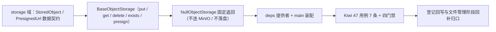

# 文件存储基座实施记录

> 项目骨架 · 02 后端基座 · 04 跨阶段基座 · 01 文件存储基座 · 实施记录

[文档首页](../../../../../../../文档首页.md) › [02-4-1 文件存储基座](../02_后端基座_04_跨阶段基座_01_文件存储基座.md) › 01 实施　|　[← 父任务](../02_后端基座_04_跨阶段基座_01_文件存储基座.md)

## 1. 实施信息 <a id="meta"></a>

| 项 | 值 |
| --- | --- |
| 任务 | [01 文件存储基座](../02_后端基座_04_跨阶段基座_01_文件存储基座.md) |
| 对应需求 | [02-17](../../../../../需求/02_需求_后端基座.md#r02-17) |
| 详细设计 | [01_详细设计_01_文件存储基座](../设计/01_详细设计_01_文件存储基座.md) |
| 实施日期 | 2026-09-14 |
| 实施人 | minjian |
| 实施环境 | 开发机（Ubuntu，Python 3.14 / uv） |
| 提交 | 待提交 |
| 结论 | 完成 |

## 2. 实施概览 <a id="overview"></a>



结果小结：对象存储能力域契约与占位实现落地（`BaseObjectStorage` / `NullObjectStorage`），`StoredObject` / `PresignedUrl` 数据契约与 `STORAGE_BUCKET` / `DEFAULT_PRESIGN_TTL` 常量就位，应用可启动、提供者可解析；`pytest` / `ruff` / `pyright` 全绿，新增模块覆盖率 100%。

## 3. 实施过程 <a id="process"></a>

1. **对象存储能力域**：新增 `app/storage/`——常量 `STORAGE_BUCKET`（`bms-files`）/ `DEFAULT_PRESIGN_TTL`（3600）/ `NULL_ETAG` / `NULL_PRESIGNED_URL`；数据契约 `StoredObject`（frozen：`key` / `size` / `content_type` / `etag`）与 `PresignedUrl`（frozen：`url` / `expires_in` / `method`）；契约 `BaseObjectStorage(BaseCapability)`（`key = "object_storage"`；异步 `put` / `get` / `delete` / `exists` / `presign`）；占位实现 `NullObjectStorage`（put 回显元数据、get 空字节、delete 空操作、exists 恒 True、presign 固定返回；不连 MinIO / 不落盘）；提供者 `get_object_storage`。
2. **依赖注入装配**：`app/api/deps.py` 导出提供者（模块 docstring 补「对象存储」）；`app/main.py` 装配 `app.state.object_storage = NullObjectStorage()`。
3. **不落路由**：按设计不落上传 / 下载 / 预览 / 分片路由（归文件管理阶段），无路由与中间件改动。
4. **测试**：新增 `tests/storage/test_storage.py`（7 条 Kiwi 47：契约 / 标识 / 常量 / 数据契约 / 占位 put 回显 / get 与 exists / presign 固定返回 / 提供者解析）。
5. **Kiwi 登记**：已在 mjbk Kiwi TCMS（分类「平台骨架」、P2、CONFIRMED、标签「自动化」）登记用例 **47「文件存储基座（对象存储契约 / 数据契约与常量 / 占位固定返回 / 依赖解析）」**（2026-09-14），与 `@pytest.mark.kiwi_id(47)` 一致。
6. **登记回写**：架构 04 §4 / §8、《后端基类清单》§2 / §9 / §10、《后端开发规范》§3.1、计划「后续阶段待办」（新增文件存储真实实现行 + 02_04 偏差跟踪）、需求 02-17 注块 / 状态、需求总览状态、任务 / 父任务状态回写。

关键命令：

```bash
uv run pytest --cov=app -q
uv run ruff check .
uv run ruff format --check .
uv run pyright
python3 scripts/tools/base-check/check-base.py    # 需在 bms 根目录执行
```

## 4. 问题与处置 <a id="issues"></a>

| 问题 / 现象 | 原因 | 处置与落点 |
| --- | --- | --- |
| `ruff` `E501`：`deps.py` 顶部 docstring 超长 | 补「对象存储」后超 120 列 | 改写为两行 docstring（提供者清单另起一段） |
| `get` docstring 引用 `NotFoundError` 但抽象方法无实现体 | 直接 import 会触发 `F401` 未使用 | 不在模块内 import（仅在 docstring 注明语义），由真实实现抛出 |

## 5. 验证结果 <a id="verify"></a>

| 完成标准 | 验证方法 | 实测结果 |
| --- | --- | --- |
| 接口 / 抽象声明就位、可被上层引用 | 契约 + 两数据契约落地 + 继承 / 契约断言 | 通过 |
| 依赖注入可解析、应用可启动不报错 | `create_app` 装配单例 + 提供者解析用例 + 应用冒烟 | 通过 |
| 占位实现固定返回（不连 MinIO / 不落盘） | `NullObjectStorage` 五入口固定返回；无 MinIO / S3 SDK 依赖、无文件 IO | 通过 |
| 常量清单登记 | `STORAGE_BUCKET` / `DEFAULT_PRESIGN_TTL` 用例 | 通过 |
| 不实现真实能力 | 无 MinIO / boto3 依赖、无上传下载路由、无分片状态机、无配额联动 | 通过 |
| 登记齐备 | 架构 04 §4 / §8、《后端基类清单》§2 / §9 / §10、《后端开发规范》§3.1、计划「后续阶段待办」 | 已登记 |
| 无 lint / 类型错误 | `uv run pytest -q` / `ruff check` / `ruff format --check` / `uv run pyright` | 278 passed, 2 skipped / All checks passed / 165 files already formatted / 0 errors |

## 6. 偏差与遗留 <a id="deviations"></a>

- **偏差**：无（按详细设计实施；presign 返回 `PresignedUrl`、get 未命中抛 `NotFoundError`、不落路由，均按用户拍板）。
- **遗留归口（已登记，随对应阶段销项）**：
  - 真实对象存储实现（MinIO S3 SDK / 本地文件系统、私有桶、按租户前缀隔离、预签名 URL）→ **文件管理阶段**；已登记计划「后续阶段待办」新增「文件存储真实实现」行；实现期要点见需求 02-17 `> 注：` 块。
  - 上传 / 下载 / 预览路由与分片状态机、类型白名单与大小上限、SHA256 校验、租户存储配额、孤儿分片回收 → 文件管理阶段 / 多租户路由 / 任务调度。
  - Excel 导入导出、归档 / 备份经本契约存取 → 导入导出基座（02-4-10）/ 导入导出阶段 / 部署与运维。
  - 真实存取用例（写入后读回、预签名 URL 可访问、删除后不存在）→ 回补阶段补充。
- **Kiwi 平台登记**：已完成（2026-09-14）：用例 47 登记于 mjbk Kiwi TCMS（分类「平台骨架」、P2、CONFIRMED、标签「自动化」），与 `@pytest.mark.kiwi_id(47)` 一致。
- **结论**：本任务遗留已全部登记去向（收尾「处理偏差与遗留」步骤复核）。

> 本文档依《文档生成规范》编写
