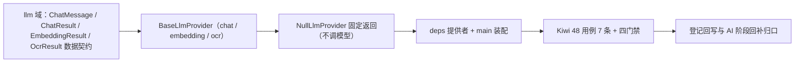

# LLM 适配基座实施记录

> 项目骨架 · 02 后端基座 · 04 跨阶段基座 · 02 LLM适配基座 · 实施记录

[文档首页](../../../../../../../文档首页.md) › [02-4-2 LLM适配基座](../02_后端基座_04_跨阶段基座_02_LLM适配基座.md) › 01 实施　|　[← 父任务](../02_后端基座_04_跨阶段基座_02_LLM适配基座.md)

## 1. 实施信息 <a id="meta"></a>

| 项 | 值 |
| --- | --- |
| 任务 | [02 LLM适配基座](../02_后端基座_04_跨阶段基座_02_LLM适配基座.md) |
| 对应需求 | [02-18](../../../../../需求/02_需求_后端基座.md#r02-18) |
| 详细设计 | [02_详细设计_01_LLM适配基座](../设计/02_详细设计_01_LLM适配基座.md) |
| 实施日期 | 2026-09-14 |
| 实施人 | minjian |
| 实施环境 | 开发机（Ubuntu，Python 3.14 / uv） |
| 提交 | 待提交 |
| 结论 | 完成 |

## 2. 实施概览 <a id="overview"></a>



结果小结：LLM 适配能力域契约与占位实现落地（`BaseLlmProvider` / `NullLlmProvider`），`ChatMessage` / `ChatResult` / `EmbeddingResult` / `OcrResult` 数据契约与 `LLM_PROVIDER_TYPES` / `NULL_EMBEDDING_DIM` 常量就位，应用可启动、提供者可解析；`pytest` / `ruff` / `pyright` 全绿，新增模块覆盖率 100%。

## 3. 实施过程 <a id="process"></a>

1. **LLM 适配能力域**：新增 `app/llm/`——常量 `LLM_PROVIDER_TYPES`（`llm` / `embedding` / `ocr`，对应 `sys_ai_provider.type`）、`NULL_EMBEDDING_DIM`（1024）、`NULL_CHAT_REPLY`、`NULL_OCR_TEXT`；数据契约 `ChatMessage`（frozen：`content` / `role`）与 `ChatResult` / `EmbeddingResult` / `OcrResult`（frozen）；契约 `BaseLlmProvider(BaseCapability)`（`key = "llm_provider"`；异步 `chat` / `embedding` / `ocr`，均带可选 `provider_key` / `model`）；占位实现 `NullLlmProvider`（chat 占位回复、embedding 固定维度零向量、ocr 占位文本，`provider_key` / `model` 回显；不调模型）；提供者 `get_llm_provider`。
2. **依赖注入装配**：`app/api/deps.py` 导出提供者（模块 docstring 补「LLM 适配」）；`app/main.py` 装配 `app.state.llm_provider = NullLlmProvider()`。
3. **不落路由**：按设计不落 AI 对话 / 向量化路由（归 AI 阶段），无路由与中间件改动。
4. **测试**：新增 `tests/llm/test_llm.py`（7 条 Kiwi 48：契约 / 标识 / 常量 / 数据契约 / 占位 chat / 占位 embedding 零向量 / 占位 ocr / 提供者解析）。
5. **Kiwi 登记**：已在 mjbk Kiwi TCMS（分类「平台骨架」、P2、CONFIRMED、标签「自动化」）登记用例 **48「LLM 适配基座（Provider 契约 / 数据契约与常量 / 占位固定返回与零向量 / 依赖解析）」**（2026-09-14），与 `@pytest.mark.kiwi_id(48)` 一致。
6. **登记回写**：架构 04 §4 / §8、《后端基类清单》§2 / §9 / §10、《后端开发规范》§3.1、计划「后续阶段待办」（新增 LLM 适配真实实现行 + 02_04 偏差跟踪）、需求 02-18 注块 / 状态、需求总览状态、任务 / 父任务状态回写。

关键命令：

```bash
uv run pytest --cov=app -q
uv run ruff check .
uv run ruff format --check .
uv run pyright
python3 scripts/tools/base-check/check-base.py    # 需在 bms 根目录执行
```

## 4. 问题与处置 <a id="issues"></a>

| 问题 / 现象 | 原因 | 处置与落点 |
| --- | --- | --- |
| `ruff` `I001`：`deps.py` import 块未排序 | `app.llm` 应排在 `app.lock` 之前（字母序） | `uv run ruff check --fix` 自动规整后复跑全绿 |
| `ChatMessage` 字段序 | `role` 带默认值、`content` 必填，dataclass 要求必填在前 | 字段改为 `content: str` / `role: str = "user"`，详细设计同步回写 |

## 5. 验证结果 <a id="verify"></a>

| 完成标准 | 验证方法 | 实测结果 |
| --- | --- | --- |
| 接口 / 抽象声明就位、可被上层引用 | 契约 + 四数据契约落地 + 继承 / 契约断言 | 通过 |
| 依赖注入可解析、应用可启动不报错 | `create_app` 装配单例 + 提供者解析用例 + 应用冒烟 | 通过 |
| 占位实现固定返回（不调模型） | `NullLlmProvider` 三入口固定返回（占位回复 / 零向量 / 占位文本）；无模型 SDK / 网络依赖 | 通过 |
| 常量清单登记 | `LLM_PROVIDER_TYPES` / `NULL_EMBEDDING_DIM` 用例 | 通过 |
| 不实现真实能力 | 无模型 SDK / httpx 调用、无 `sys_ai_provider` 读取、无 RAG / 审计 / 安全闸门 | 通过 |
| 登记齐备 | 架构 04 §4 / §8、《后端基类清单》§2 / §9 / §10、《后端开发规范》§3.1、计划「后续阶段待办」 | 已登记 |
| 无 lint / 类型错误 | `uv run pytest -q` / `ruff check` / `ruff format --check` / `uv run pyright` | 285 passed, 2 skipped / All checks passed / 168 files already formatted / 0 errors |

## 6. 偏差与遗留 <a id="deviations"></a>

- **偏差**：无（按详细设计实施；三方法带 `provider_key` / `model`、占位固定返回、不落路由，均按用户拍板；`ChatMessage` 字段序按 dataclass 规则微调并回写设计）。
- **遗留归口（已登记，随对应阶段销项）**：
  - 真实 Provider 实现（外部 API DeepSeek / Qwen、私有化端点 Ollama / vLLM、`sys_ai_provider` 端点与模型配置、API key Secret、超时 / 重试 / 熔断）→ **AI 阶段（十七）**；已登记计划「后续阶段待办」新增「LLM 适配真实实现」行；实现期要点见需求 02-18 `> 注：` 块。
  - RAG 管线与八项 AI 能力（分段 / embedding 事件驱动 / Milvus / OCR 衔接 / 语义检索 / NL2SQL 等）→ AI 阶段；embedding 经本契约 `embedding` 调用。
  - 交互审计（`ai_chat_log` 按月分片）、安全闸门（`ai.auto_execute` / `ai.auto_approve`）、prompt 注入防护、AI 接口独立限流与预算控制 → AI 阶段。
  - 真实调用用例（外部 / 私有化端点连通、向量维度与语义、OCR 识别）→ 回补阶段补充。
- **Kiwi 平台登记**：已完成（2026-09-14）：用例 48 登记于 mjbk Kiwi TCMS（分类「平台骨架」、P2、CONFIRMED、标签「自动化」），与 `@pytest.mark.kiwi_id(48)` 一致。
- **处理偏差与遗留（2026-09-14 闭环）**：
  - 计划 §3.1 新增「LLM 适配真实实现」行（出处 02-4-2）；需求 02-18 `> 注：` 块补齐实现期要点（`sys_ai_provider` / Secret / 超时重试熔断 / RAG / 审计 / 安全闸门）。
  - 消费方标注：[02-4-3 全文检索基座](../../02_后端基座_04_跨阶段基座_03_全文检索基座/02_后端基座_04_跨阶段基座_03_全文检索基座.md) 任务文档补「前置契约（已交付）」（语义检索 embedding 与扫描件 OCR 取 02-4-2 `BaseLlmProvider`，不另接模型端点）。
  - 无任务文档的消费方（RAG 管线、八项 AI 能力、AI 接口限流 / 预算、文件管理 OCR）已在计划 §3.1 与需求 02-18 注块登记去向，待其阶段建任务后回引。
- **结论**：本任务遗留已全部登记去向，偏差与遗留处理完成。

> 本文档依《文档生成规范》编写
