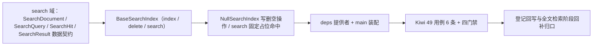

# 全文检索基座实施记录

> 项目骨架 · 02 后端基座 · 04 跨阶段基座 · 03 全文检索基座 · 实施记录

[文档首页](../../../../../../../文档首页.md) › [02-4-3 全文检索基座](../02_后端基座_04_跨阶段基座_03_全文检索基座.md) › 01 实施　|　[← 父任务](../02_后端基座_04_跨阶段基座_03_全文检索基座.md)

## 1. 实施信息 <a id="meta"></a>

| 项 | 值 |
| --- | --- |
| 任务 | [03 全文检索基座](../02_后端基座_04_跨阶段基座_03_全文检索基座.md) |
| 对应需求 | [02-19](../../../../../需求/02_需求_后端基座.md#r02-19) |
| 详细设计 | [03_详细设计_01_全文检索基座](../设计/03_详细设计_01_全文检索基座.md) |
| 实施日期 | 2026-09-14 |
| 实施人 | minjian |
| 实施环境 | 开发机（Ubuntu，Python 3.14 / uv） |
| 提交 | 待提交 |
| 结论 | 完成 |

## 2. 实施概览 <a id="overview"></a>



结果小结：全文检索能力域契约与占位实现落地（`BaseSearchIndex` / `NullSearchIndex`），`SearchDocument` / `SearchQuery` / `SearchHit` / `SearchResult` 数据契约与 `SEARCH_INDEX_PREFIX` / `DEFAULT_SEARCH_SIZE` 常量就位，租户隔离与数据权限过滤口径在契约声明，应用可启动、提供者可解析；`pytest` / `ruff` / `pyright` 全绿，新增模块覆盖率 100%。

## 3. 实施过程 <a id="process"></a>

1. **全文检索能力域**：新增 `app/search/`——常量 `SEARCH_INDEX_PREFIX`（`bms-`）/ `DEFAULT_SEARCH_SIZE`（20）/ `NULL_SEARCH_HIT_ID`；数据契约 `SearchDocument`（frozen：`index` / `doc_id` / `fields`）与 `SearchQuery`（frozen）/ `SearchHit`（frozen）/ `SearchResult`（frozen）；契约 `BaseSearchIndex(BaseCapability)`（`key = "search_index"`；异步 `index(SearchDocument)` / `delete(index, doc_id)` / `search(SearchQuery)`）；占位实现 `NullSearchIndex`（写 / 删空操作、`search` 固定返回单条占位命中；不连 ES）；提供者 `get_search_index`。
2. **依赖注入装配**：`app/api/deps.py` 导出提供者（模块 docstring 补「全文检索」）；`app/main.py` 装配 `app.state.search_index = NullSearchIndex()`。
3. **不落路由**：按设计不落全局搜索路由（归全文检索阶段），无路由与中间件改动。
4. **测试**：新增 `tests/search/test_search.py`（6 条 Kiwi 49：契约 / 标识 / 常量 / 数据契约 / 占位写删空操作 / 占位 search 固定命中 / 提供者解析）。
5. **Kiwi 登记**：已在 mjbk Kiwi TCMS（分类「平台骨架」、P2、CONFIRMED、标签「自动化」）登记用例 **49「全文检索基座（统一索引契约 / 数据契约与常量 / 占位固定命中 / 依赖解析）」**（2026-09-14），与 `@pytest.mark.kiwi_id(49)` 一致。
6. **登记回写**：架构 04 §4 / §8、《后端基类清单》§2 / §9 / §10、《后端开发规范》§3.1、计划「后续阶段待办」（新增全文检索真实实现行 + 02_04 偏差跟踪）、需求 02-19 注块 / 状态、需求总览状态、任务 / 父任务状态回写。

关键命令：

```bash
uv run pytest --cov=app -q
uv run ruff check .
uv run ruff format --check .
uv run pyright
python3 scripts/tools/base-check/check-base.py    # 需在 bms 根目录执行
```

## 4. 问题与处置 <a id="issues"></a>

| 问题 / 现象 | 原因 | 处置与落点 |
| --- | --- | --- |
| `ruff` `E501`：`deps.py` / `search/base.py` 顶部 docstring 超长 | 补「全文检索」后超 120 列 | `deps.py` 拆两行、`search/base.py` 精简说明；复跑全绿 |
| `SearchDocument.fields` 初版拟用 `field(default_factory=...)` 给默认空映射 | 待索引文档字段应显式给出，空映射易掩盖漏填 | 去掉默认值，`fields` 改为必填（移除 `field` 导入），详细设计同步回写 |

## 5. 验证结果 <a id="verify"></a>

| 完成标准 | 验证方法 | 实测结果 |
| --- | --- | --- |
| 接口 / 抽象声明就位、可被上层引用 | 契约 + 四数据契约落地 + 继承 / 契约断言 | 通过 |
| 依赖注入可解析、应用可启动不报错 | `create_app` 装配单例 + 提供者解析用例 + 应用冒烟 | 通过 |
| 占位实现固定返回（不连 ES） | `NullSearchIndex` 写 / 删空操作、`search` 固定占位命中；无 ES 依赖 | 通过 |
| 租户隔离与数据权限过滤约定就位 | 契约 docstring / 设计明写（实现读上下文强制注入） | 通过 |
| 常量清单登记 | `SEARCH_INDEX_PREFIX` / `DEFAULT_SEARCH_SIZE` 用例 | 通过 |
| 不实现真实能力 | 无 elasticsearch 依赖、无索引映射 / DSL、无同步管线 / 重建 / 降级 | 通过 |
| 登记齐备 | 架构 04 §4 / §8、《后端基类清单》§2 / §9 / §10、《后端开发规范》§3.1、计划「后续阶段待办」 | 已登记 |
| 无 lint / 类型错误 | `uv run pytest -q` / `ruff check` / `ruff format --check` / `uv run pyright` | 291 passed, 2 skipped / All checks passed / 171 files already formatted / 0 errors |

## 6. 偏差与遗留 <a id="deviations"></a>

- **偏差**：无（按详细设计实施；契约对象传参、租户 / 权限实现注入、search 固定占位命中、不落路由，均按用户拍板）。
- **遗留归口（已登记，随对应阶段销项）**：
  - 真实 ES 实现（索引与映射、查询 DSL / 高亮、别名切换、多节点集群）→ **全文检索阶段（十六）**；已登记计划「后续阶段待办」新增「全文检索真实实现」行；实现期要点见需求 02-19 `> 注：` 块。
  - 同步管线与索引重建（事件驱动消费 / 事件重放 + 快照 + 别名切换）→ 全文检索阶段；文件内容文本解析 → 文件管理阶段。
  - ES 故障降级（库模糊查询兜底）→ 全文检索阶段上层。
  - 租户隔离与数据权限过滤真实实现 → 接 `core/context.py` 的 `current_tenant` 与 `DataScope` / `BasePermissionChecker`（RBAC 阶段起）。
  - 语义检索（Milvus）与扫描件 OCR → AI 阶段（十七）；embedding / OCR 取 02-4-2 `BaseLlmProvider`。
  - 真实检索用例（索引后命中、租户隔离、权限过滤、重建后查询）→ 回补阶段补充。
- **Kiwi 平台登记**：已完成（2026-09-14）：用例 49 登记于 mjbk Kiwi TCMS（分类「平台骨架」、P2、CONFIRMED、标签「自动化」），与 `@pytest.mark.kiwi_id(49)` 一致。
- **结论**：本任务遗留已全部登记去向（收尾「处理偏差与遗留」步骤复核）。

> 本文档依《文档生成规范》编写
