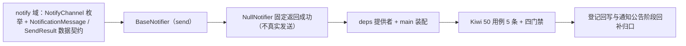

# 通知渠道基座实施记录

> 项目骨架 · 02 后端基座 · 04 跨阶段基座 · 04 通知渠道基座 · 实施记录

[文档首页](../../../../../../../文档首页.md) › [02-4-4 通知渠道基座](../02_后端基座_04_跨阶段基座_04_通知渠道基座.md) › 01 实施　|　[← 父任务](../02_后端基座_04_跨阶段基座_04_通知渠道基座.md)

## 1. 实施信息 <a id="meta"></a>

| 项 | 值 |
| --- | --- |
| 任务 | [04 通知渠道基座](../02_后端基座_04_跨阶段基座_04_通知渠道基座.md) |
| 对应需求 | [02-20](../../../../../需求/02_需求_后端基座.md#r02-20) |
| 详细设计 | [04_详细设计_01_通知渠道基座](../设计/04_详细设计_01_通知渠道基座.md) |
| 实施日期 | 2026-09-14 |
| 实施人 | minjian |
| 实施环境 | 开发机（Ubuntu，Python 3.14 / uv） |
| 提交 | 待提交 |
| 结论 | 完成 |

## 2. 实施概览 <a id="overview"></a>



结果小结：通知渠道能力域契约与占位实现落地（`BaseNotifier` / `NullNotifier`），`NotifyChannel` 渠道枚举与 `NotificationMessage` / `SendResult` 数据契约就位，应用可启动、提供者可解析；`pytest` / `ruff` / `pyright` 全绿，新增模块覆盖率 100%。

## 3. 实施过程 <a id="process"></a>

1. **通知渠道能力域**：新增 `app/notify/`——渠道枚举 `NotifyChannel`（`StrEnum`：`inbox` / `email` / `sms`）、常量 `NULL_MESSAGE_ID`、数据契约 `NotificationMessage`（frozen：`channel` / `recipient` / `content` / `title` / `biz_type` / `biz_id`）与 `SendResult`（frozen：`delivered` / `message_id` / `detail`）；契约 `BaseNotifier(BaseCapability)`（`key = "notifier"`；异步 `send(NotificationMessage)`）；占位实现 `NullNotifier`（固定返回成功、不真实发送）；提供者 `get_notifier`。
2. **依赖注入装配**：`app/api/deps.py` 导出提供者（模块 docstring 补「通知」）；`app/main.py` 装配 `app.state.notifier = NullNotifier()`。
3. **不落路由**：按设计不落通知接口（归通知公告阶段），无路由与中间件改动。
4. **测试**：新增 `tests/notify/test_notify.py`（5 条 Kiwi 50：契约 / 标识 / 渠道枚举 / 数据契约 / 占位固定成功 / 提供者解析）。
5. **Kiwi 登记**：已在 mjbk Kiwi TCMS（分类「平台骨架」、P2、CONFIRMED、标签「自动化」）登记用例 **50「通知渠道基座（统一发送契约 / 渠道枚举 / 数据契约 / 占位固定成功 / 依赖解析）」**（2026-09-14），与 `@pytest.mark.kiwi_id(50)` 一致。
6. **登记回写**：架构 04 §4 / §8、《后端基类清单》§2 / §9 / §10、《后端开发规范》§3.1、计划「后续阶段待办」（新增通知渠道真实实现行 + 02_04 偏差跟踪）、需求 02-20 注块 / 状态、需求总览状态、任务 / 父任务状态回写。

关键命令：

```bash
uv run pytest --cov=app -q
uv run ruff check .
uv run ruff format --check .
uv run pyright
python3 scripts/tools/base-check/check-base.py    # 需在 bms 根目录执行
```

## 4. 问题与处置 <a id="issues"></a>

| 问题 / 现象 | 原因 | 处置与落点 |
| --- | --- | --- |
| `ruff` `E501`：`notify/base.py` / `deps.py` 顶部 docstring 超长 | 补「通知」后超 120 列 | `notify/base.py` 口径段拆三行、`deps.py` 提供者清单精简（`对象存储 / LLM / 检索 / 通知`） |
| `ruff format` 1 文件待格式化 | 新增用例多行调用换行 | `uv run ruff format` 自动规整 |

## 5. 验证结果 <a id="verify"></a>

| 完成标准 | 验证方法 | 实测结果 |
| --- | --- | --- |
| 接口 / 抽象声明就位、可被上层引用 | 契约 + 渠道枚举 + 数据契约落地 + 继承 / 契约断言 | 通过 |
| 依赖注入可解析、应用可启动不报错 | `create_app` 装配单例 + 提供者解析用例 + 应用冒烟 | 通过 |
| 占位实现固定返回（不真实发送） | `NullNotifier.send` 固定成功；无 SMTP / 短信 SDK / 网络依赖 | 通过 |
| 渠道枚举登记 | `NotifyChannel` 三值用例 | 通过 |
| 不实现真实能力 | 无 aiosmtplib / 短信 SDK 依赖、无模板与发送记录落库、无偏好过滤、无降级 | 通过 |
| 登记齐备 | 架构 04 §4 / §8、《后端基类清单》§2 / §9 / §10、《后端开发规范》§3.1、计划「后续阶段待办」 | 已登记 |
| 无 lint / 类型错误 | `uv run pytest -q` / `ruff check` / `ruff format --check` / `uv run pyright` | 296 passed, 2 skipped / All checks passed / 174 files already formatted / 0 errors |

## 6. 偏差与遗留 <a id="deviations"></a>

- **偏差**：无（按详细设计实施；`send(NotificationMessage)` 契约对象传参、渠道枚举、占位固定成功、不落路由，均按用户拍板；占位语义「固定返回成功 / skipped」按用户拍板取成功）。
- **遗留归口（已登记，随对应阶段销项）**：
  - 真实渠道实现（站内信落库 + 实时推送、aiosmtplib 邮件、阿里 / 腾讯短信）→ **通知公告阶段**；已登记计划「后续阶段待办」新增「通知渠道真实实现」行；实现期要点见需求 02-20 `> 注：` 块。
  - 模板与发送记录（`sys_mail_template` / `sys_sms_template` + i18n、`sys_mail_log` / `sys_sms_log`）、渠道偏好过滤（`sys_user_preference`）、公告与已读回执（`sys_notice` / `sys_notice_read`）、通知生成事件消费、短信渠道故障降级 → 通知公告阶段 / 事件总线 / 运维。
  - 真实发送用例（站内信落库、SMTP、短信渠道）→ 回补阶段补充。
- **Kiwi 平台登记**：已完成（2026-09-14）：用例 50 登记于 mjbk Kiwi TCMS（分类「平台骨架」、P2、CONFIRMED、标签「自动化」），与 `@pytest.mark.kiwi_id(50)` 一致。
- **结论**：本任务遗留已全部登记去向（收尾「处理偏差与遗留」步骤复核）。

> 本文档依《文档生成规范》编写
