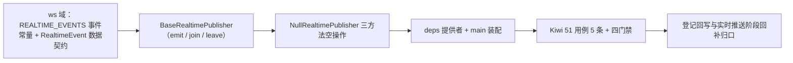

# 实时推送基座实施记录

> 项目骨架 · 02 后端基座 · 04 跨阶段基座 · 05 实时推送基座 · 实施记录

[文档首页](../../../../../../../文档首页.md) › [02-4-5 实时推送基座](../02_后端基座_04_跨阶段基座_05_实时推送基座.md) › 01 实施　|　[← 父任务](../02_后端基座_04_跨阶段基座_05_实时推送基座.md)

## 1. 实施信息 <a id="meta"></a>

| 项 | 值 |
| --- | --- |
| 任务 | [05 实时推送基座](../02_后端基座_04_跨阶段基座_05_实时推送基座.md) |
| 对应需求 | [02-21](../../../../../需求/02_需求_后端基座.md#r02-21) |
| 详细设计 | [05_详细设计_01_实时推送基座](../设计/05_详细设计_01_实时推送基座.md) |
| 实施日期 | 2026-09-14 |
| 实施人 | minjian |
| 实施环境 | 开发机（Ubuntu，Python 3.14 / uv） |
| 提交 | 待提交 |
| 结论 | 完成 |

## 2. 实施概览 <a id="overview"></a>



结果小结：实时推送能力域契约与占位实现落地（`BaseRealtimePublisher` / `NullRealtimePublisher`），`REALTIME_EVENTS` 事件常量与 `RealtimeEvent` 数据契约就位，应用可启动、提供者可解析；`pytest` / `ruff` / `pyright` 全绿，新增模块覆盖率 100%。

## 3. 实施过程 <a id="process"></a>

1. **实时推送能力域**：新增 `app/ws/base.py`——事件常量 `REALTIME_EVENTS`（`approval.todo` / `notification.new` / `session.revoked`）、数据契约 `RealtimeEvent`（frozen：`event` / `data` / `user_id` / `session_id` / `room`）；契约 `BaseRealtimePublisher(BaseCapability)`（`key = "realtime_publisher"`；异步 `emit` / `join` / `leave`）；占位实现 `NullRealtimePublisher`（三方法空操作；不连 Socket.IO / Redis）；提供者 `get_realtime_publisher`；`app/ws/__init__.py` docstring 口径同步。
2. **依赖注入装配**：`app/api/deps.py` 导出提供者（模块 docstring 补「推送」）；`app/main.py` 装配 `app.state.realtime_publisher = NullRealtimePublisher()`。
3. **不挂载 / 不落路由**：按设计不挂载 Socket.IO ASGI 应用、不落路由（归实时推送阶段），无路由与中间件改动。
4. **测试**：新增 `tests/ws/test_realtime.py`（5 条 Kiwi 51：契约 / 标识 / 事件常量 / 数据契约 / 占位空操作 / 提供者解析）。
5. **Kiwi 登记**：已在 mjbk Kiwi TCMS（分类「平台骨架」、P2、CONFIRMED、标签「自动化」）登记用例 **51「实时推送基座（统一推送契约 / 事件常量 / 数据契约 / 占位空操作 / 依赖解析）」**（2026-09-14），与 `@pytest.mark.kiwi_id(51)` 一致。
6. **登记回写**：架构 04 §4 / §8、《后端基类清单》§2 / §9 / §10、《后端开发规范》§3.1、计划「后续阶段待办」（新增实时推送真实实现行 + 02_04 偏差跟踪）、需求 02-21 注块 / 状态、需求总览状态、任务 / 父任务状态回写。

关键命令：

```bash
uv run pytest --cov=app -q
uv run ruff check .
uv run ruff format --check .
uv run pyright
python3 scripts/tools/base-check/check-base.py    # 需在 bms 根目录执行
```

## 4. 问题与处置 <a id="issues"></a>

无阻塞问题；`ruff` / `format` / `pyright` 首轮全绿。`deps.py` 顶部 docstring 提供者清单同步精简为「存储 / LLM / 检索 / 通知 / 推送」，未超长。

## 5. 验证结果 <a id="verify"></a>

| 完成标准 | 验证方法 | 实测结果 |
| --- | --- | --- |
| 接口 / 抽象声明就位、可被上层引用 | 契约 + 事件常量 + 数据契约落地 + 继承 / 契约断言 | 通过 |
| 依赖注入可解析、应用可启动不报错 | `create_app` 装配单例 + 提供者解析用例 + 应用冒烟 | 通过 |
| 占位实现固定返回（不连 Socket.IO / Redis） | `NullRealtimePublisher` 三方法空操作；无 socketio / Redis 依赖、无 ASGI 挂载 | 通过 |
| 事件常量登记 | `REALTIME_EVENTS` 三项用例 | 通过 |
| 不实现真实能力 | 无 socketio 依赖、无握手鉴权 / 连接注册表 / 跨实例广播 / 断线恢复 | 通过 |
| 登记齐备 | 架构 04 §4 / §8、《后端基类清单》§2 / §9 / §10、《后端开发规范》§3.1、计划「后续阶段待办」 | 已登记 |
| 无 lint / 类型错误 | `uv run pytest -q` / `ruff check` / `ruff format --check` / `uv run pyright` | 301 passed, 2 skipped / All checks passed / 176 files already formatted / 0 errors |

## 6. 偏差与遗留 <a id="deviations"></a>

- **偏差**：无（按详细设计实施；`emit` 契约对象传参、`join` / `leave` 按会话 + 房间、事件常量清单、三方法空操作、不挂载，均按用户拍板）。
- **遗留归口（已登记，随对应阶段销项）**：
  - 真实 python-socketio 服务端（ASGI 挂载、握手校验 token、连接确认）→ **实时推送阶段**；已登记计划「后续阶段待办」新增「实时推送真实实现」行；实现期要点见需求 02-21 `> 注：` 块。
  - 连接注册与跨实例广播（Redis 注册表、断线清理、RedisManager、nginx 亲和）→ 实时推送阶段。
  - 事件路由消费（`approval.todo` / `notification.new` / `session.revoked`）→ 通知公告 / 工作流 / 认证阶段接线；事件名已登记常量。
  - 断线恢复补偿、连接数指标（`bms_ws_connections`）→ 前端 / 可观测性 / 实时推送阶段。
  - 真实推送用例（握手鉴权、用户 / 会话 / 房间路由、跨实例广播、踢出关闭连接）→ 回补阶段补充。
- **Kiwi 平台登记**：已完成（2026-09-14）：用例 51 登记于 mjbk Kiwi TCMS（分类「平台骨架」、P2、CONFIRMED、标签「自动化」），与 `@pytest.mark.kiwi_id(51)` 一致。
- **结论**：本任务遗留已全部登记去向（收尾「处理偏差与遗留」步骤复核）。

> 本文档依《文档生成规范》编写
