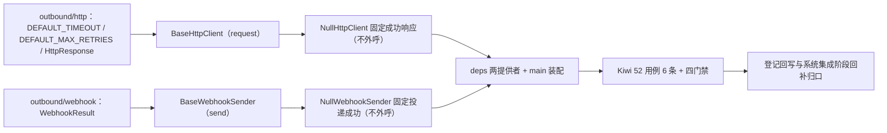

# 出站集成基座实施记录

> 项目骨架 · 02 后端基座 · 04 跨阶段基座 · 06 出站集成基座 · 实施记录

[文档首页](../../../../../../../文档首页.md) › [02-4-6 出站集成基座](../02_后端基座_04_跨阶段基座_06_出站集成基座.md) › 01 实施　|　[← 父任务](../02_后端基座_04_跨阶段基座_06_出站集成基座.md)

## 1. 实施信息 <a id="meta"></a>

| 项 | 值 |
| --- | --- |
| 任务 | [06 出站集成基座](../02_后端基座_04_跨阶段基座_06_出站集成基座.md) |
| 对应需求 | [02-22](../../../../../需求/02_需求_后端基座.md#r02-22) |
| 详细设计 | [06_详细设计_01_出站集成基座](../设计/06_详细设计_01_出站集成基座.md) |
| 实施日期 | 2026-09-14 |
| 实施人 | minjian |
| 实施环境 | 开发机（Ubuntu，Python 3.14 / uv） |
| 提交 | 待提交 |
| 结论 | 完成 |

## 2. 实施概览 <a id="overview"></a>



结果小结：出站集成两组契约与占位实现落地（`BaseHttpClient` / `NullHttpClient`、`BaseWebhookSender` / `NullWebhookSender`），`HttpResponse` / `WebhookResult` 数据契约与 `DEFAULT_TIMEOUT` / `DEFAULT_MAX_RETRIES` 常量就位，应用可启动、两提供者可解析；`pytest` / `ruff` / `pyright` 全绿，新增模块覆盖率 100%。

## 3. 实施过程 <a id="process"></a>

1. **出站 HTTP 能力域**：新增 `app/outbound/http.py`——常量 `DEFAULT_TIMEOUT`（10）/ `DEFAULT_MAX_RETRIES`（3）、数据契约 `HttpResponse`（frozen：`status_code` / `headers` / `content`）、契约 `BaseHttpClient(BaseCapability)`（`key = "http_client"`；异步 `request(method, url, *, headers, content, timeout)`）、占位实现 `NullHttpClient`（固定成功响应、不外呼）、提供者 `get_http_client`。
2. **Webhook 能力域**：新增 `app/outbound/webhook.py`——数据契约 `WebhookResult`（frozen：`delivered` / `status_code` / `attempts`）、契约 `BaseWebhookSender(BaseCapability)`（`key = "webhook_sender"`；异步 `send(url, payload, *, secret)`）、占位实现 `NullWebhookSender`（固定投递成功、不外呼）、提供者 `get_webhook_sender`。
3. **依赖注入装配**：`app/api/deps.py` 导出两提供者（模块 docstring 补「出站」）；`app/main.py` 装配 `app.state.http_client` / `app.state.webhook_sender`。
4. **不落路由**：按设计不落路由（出站为内部调用），无路由与中间件改动。
5. **测试**：新增 `tests/outbound/test_outbound.py`（6 条 Kiwi 52：契约 / 标识 / 常量 / 数据契约 / 占位 HTTP / 占位 Webhook / 提供者解析）。
6. **Kiwi 登记**：已在 mjbk Kiwi TCMS（分类「平台骨架」、P2、CONFIRMED、标签「自动化」）登记用例 **52「出站集成基座（HTTP 请求契约 / Webhook 投递契约 / 数据契约与常量 / 占位固定成功 / 依赖解析）」**（2026-09-14），与 `@pytest.mark.kiwi_id(52)` 一致。
7. **登记回写**：架构 04 §4 / §8、《后端基类清单》§2 / §9 / §10、《后端开发规范》§3.1、计划「后续阶段待办」（新增出站集成真实实现行 + 02_04 偏差跟踪）、需求 02-22 注块 / 状态、需求总览状态、任务 / 父任务状态回写。

关键命令：

```bash
uv run pytest --cov=app -q
uv run ruff check .
uv run ruff format --check .
uv run pyright
python3 scripts/tools/base-check/check-base.py    # 需在 bms 根目录执行
```

## 4. 问题与处置 <a id="issues"></a>

无阻塞问题；`ruff` / `format` / `pyright` 首轮全绿。

## 5. 验证结果 <a id="verify"></a>

| 完成标准 | 验证方法 | 实测结果 |
| --- | --- | --- |
| 接口 / 抽象声明就位、可被上层引用 | 两契约 + 两数据契约落地 + 继承 / 契约断言 | 通过 |
| 依赖注入可解析、应用可启动不报错 | `create_app` 装配两单例 + 两提供者解析用例 + 应用冒烟 | 通过 |
| 占位实现固定返回（不外呼） | `NullHttpClient.request` 固定 200 空响应、`NullWebhookSender.send` 固定成功；无 httpx 调用 / 网络 IO | 通过 |
| 常量清单登记 | `DEFAULT_TIMEOUT` / `DEFAULT_MAX_RETRIES` 用例 | 通过 |
| 不实现真实能力 | 无 httpx 调用、无签名计算 / 重试 / 熔断 / 失败记录 | 通过 |
| 登记齐备 | 架构 04 §4 / §8、《后端基类清单》§2 / §9 / §10、《后端开发规范》§3.1、计划「后续阶段待办」 | 已登记 |
| 无 lint / 类型错误 | `uv run pytest -q` / `ruff check` / `ruff format --check` / `uv run pyright` | 307 passed, 2 skipped / All checks passed / 180 files already formatted / 0 errors |

## 6. 偏差与遗留 <a id="deviations"></a>

- **偏差**：无（按详细设计实施；拆两模块、统一 `request`、`send(url, payload, secret)`、占位固定成功、不落路由，均按用户拍板）。
- **遗留归口（已登记，随对应阶段销项）**：
  - 真实 httpx 封装（超时 / 重试 / 熔断接 02-3-8、连接池、代理）→ **系统集成阶段**；已登记计划「后续阶段待办」新增「出站集成真实实现」行；实现期要点见需求 02-22 `> 注：` 块。
  - 真实 Webhook 投递（签名经 `SignatureCodec`、指数退避、`sys_webhook_log`、事件总线异步推送）→ 系统集成阶段。
  - 邮件 / 短信（经 02-4-4）、企业微信 / 钉钉、告警 webhook → 通知公告 / 系统集成 / 运维阶段。
  - 真实出站用例（超时 / 重试 / 熔断、Webhook 签名与失败重试）→ 回补阶段补充。
- **Kiwi 平台登记**：已完成（2026-09-14）：用例 52 登记于 mjbk Kiwi TCMS（分类「平台骨架」、P2、CONFIRMED、标签「自动化」），与 `@pytest.mark.kiwi_id(52)` 一致。
- **结论**：本任务遗留已全部登记去向（收尾「处理偏差与遗留」步骤复核）。

> 本文档依《文档生成规范》编写
