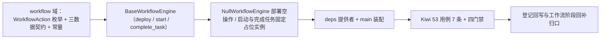

# 工作流引擎适配基座实施记录

> 项目骨架 · 02 后端基座 · 04 跨阶段基座 · 07 工作流引擎适配基座 · 实施记录

[文档首页](../../../../../../../文档首页.md) › [02-4-7 工作流引擎适配基座](../02_后端基座_04_跨阶段基座_07_工作流引擎适配基座.md) › 01 实施　|　[← 父任务](../02_后端基座_04_跨阶段基座_07_工作流引擎适配基座.md)

## 1. 实施信息 <a id="meta"></a>

| 项 | 值 |
| --- | --- |
| 任务 | [07 工作流引擎适配基座](../02_后端基座_04_跨阶段基座_07_工作流引擎适配基座.md) |
| 对应需求 | [02-23](../../../../../需求/02_需求_后端基座.md#r02-23) |
| 详细设计 | [07_详细设计_01_工作流引擎适配基座](../设计/07_详细设计_01_工作流引擎适配基座.md) |
| 实施日期 | 2026-09-14 |
| 实施人 | minjian |
| 实施环境 | 开发机（Ubuntu，Python 3.14 / uv） |
| 提交 | 待提交 |
| 结论 | 完成 |

## 2. 实施概览 <a id="overview"></a>



结果小结：工作流引擎适配契约与占位实现落地（`BaseWorkflowEngine` / `NullWorkflowEngine`），`WorkflowAction` 动作枚举、`ProcessDefinition` / `ProcessInstance` / `WorkflowTask` 数据契约与 `WORKFLOW_STATUS` / `NULL_INSTANCE_ID` / `NULL_TASK_ID` 常量就位，应用可启动、提供者可解析；`pytest` / `ruff` / `pyright` 全绿，新增模块覆盖率 100%。

## 3. 实施过程 <a id="process"></a>

1. **工作流能力域**：新增 `app/workflow/`——常量 `WORKFLOW_STATUS`（running / completed / rejected）/ `NULL_INSTANCE_ID` / `NULL_TASK_ID`、动作枚举 `WorkflowAction`（`StrEnum`：approve / reject / withdraw）、数据契约 `ProcessDefinition`（frozen）/ `ProcessInstance`（frozen）/ `WorkflowTask`（frozen）；契约 `BaseWorkflowEngine(BaseCapability)`（`key = "workflow_engine"`；异步 `deploy` / `start` / `complete_task`）；占位实现 `NullWorkflowEngine`（部署空操作、启动 / 完成任务固定返回占位实例；不连引擎）；提供者 `get_workflow_engine`。
2. **依赖注入装配**：`app/api/deps.py` 导出提供者（模块 docstring 补「工作流」）；`app/main.py` 装配 `app.state.workflow_engine = NullWorkflowEngine()`。
3. **不落路由**：按设计不落路由（工作流接口归工作流阶段），无路由与中间件改动。
4. **测试**：新增 `tests/workflow/test_workflow.py`（7 条 Kiwi 53：契约 / 标识 / 动作枚举 / 常量 / 数据契约 / 占位 deploy / 占位 start 与 complete_task / 提供者解析）。
5. **Kiwi 登记**：已在 mjbk Kiwi TCMS（分类「平台骨架」、P2、CONFIRMED、标签「自动化」）登记用例 **53「工作流引擎适配基座（部署 / 启动 / 完成任务契约 / 审批动作枚举 / 数据契约与常量 / 占位固定返回 / 依赖解析）」**（2026-09-14），与 `@pytest.mark.kiwi_id(53)` 一致。
6. **登记回写**：架构 04 §4 / §8、《后端基类清单》§2 / §9 / §10、《后端开发规范》§3.1、计划「后续阶段待办」（新增工作流引擎真实实现行 + 02_04 偏差跟踪）、需求 02-23 注块 / 状态、需求总览状态、任务 / 父任务状态回写。

关键命令：

```bash
uv run pytest --cov=app -q
uv run ruff check .
uv run ruff format --check .
uv run pyright
python3 scripts/tools/base-check/check-base.py    # 需在 bms 根目录执行
```

## 4. 问题与处置 <a id="issues"></a>

| 问题 / 现象 | 原因 | 处置与落点 |
| --- | --- | --- |
| `ruff` `E501`：`deps.py` 顶部 docstring 超长 | 补「工作流」后超 120 列 | 改写为两行（提供者清单 + 统一导出说明） |

## 5. 验证结果 <a id="verify"></a>

| 完成标准 | 验证方法 | 实测结果 |
| --- | --- | --- |
| 接口 / 抽象声明就位、可被上层引用 | 契约 + 动作枚举 + 三数据契约落地 + 继承 / 契约断言 | 通过 |
| 依赖注入可解析、应用可启动不报错 | `create_app` 装配单例 + 提供者解析用例 + 应用冒烟 | 通过 |
| 占位实现固定返回（不连引擎） | `deploy` 空操作、`start` / `complete_task` 固定返回占位实例；无 SpiffWorkflow 依赖 | 通过 |
| 枚举 / 常量登记 | `WorkflowAction` / `WORKFLOW_STATUS` 用例 | 通过 |
| 不实现真实能力 | 无 SpiffWorkflow / BPMN 依赖、无 `wf_*` 落库、无节点推进 / 会签 / 驳回 | 通过 |
| 登记齐备 | 架构 04 §4 / §8、《后端基类清单》§2 / §9 / §10、《后端开发规范》§3.1、计划「后续阶段待办」 | 已登记 |
| 无 lint / 类型错误 | `uv run pytest -q` / `ruff check` / `ruff format --check` / `uv run pyright` | 314 passed, 2 skipped / All checks passed / 183 files already formatted / 0 errors |

## 6. 偏差与遗留 <a id="deviations"></a>

- **偏差**：无（按详细设计实施；三方法契约对象传参、动作枚举、占位固定返回占位实例、不落路由，均按用户拍板；`ProcessInstance` 非主键字段给默认空值以便占位，已在设计对齐记录第 7 项注明）。
- **遗留归口（已登记，随对应阶段销项）**：
  - 真实 SpiffWorkflow 适配（BPMN 解析、线程池运行）→ **工作流阶段**；已登记计划「后续阶段待办」新增「工作流引擎真实实现」行；实现期要点见需求 02-23 `> 注：` 块。
  - 流程 / 实例 / 任务持久化（`wf_process` / `wf_instance` / `wf_task` / `wf_record`）、会签 / 或签、驳回、版本管理、待办 / 已办查询 → 工作流阶段。
  - 业务单据联动、Python 3.14 兼容验证 → 产品（biz）阶段 / 工作流阶段。
  - 真实引擎用例（部署 / 启动 / 推进 / 会签 / 驳回）→ 回补阶段补充。
- **Kiwi 平台登记**：已完成（2026-09-14）：用例 53 登记于 mjbk Kiwi TCMS（分类「平台骨架」、P2、CONFIRMED、标签「自动化」），与 `@pytest.mark.kiwi_id(53)` 一致。
- **结论**：本任务遗留已全部登记去向（收尾「处理偏差与遗留」步骤复核）。

> 本文档依《文档生成规范》编写
