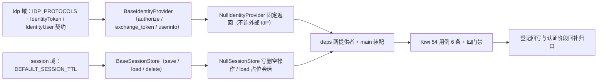

# IdP 与会话存储扩展基座实施记录

> 项目骨架 · 02 后端基座 · 04 跨阶段基座 · 08 IdP与会话存储扩展基座 · 实施记录

[文档首页](../../../../../../../文档首页.md) › [02-4-8 IdP与会话存储扩展基座](../02_后端基座_04_跨阶段基座_08_IdP与会话存储扩展基座.md) › 01 实施　|　[← 父任务](../02_后端基座_04_跨阶段基座_08_IdP与会话存储扩展基座.md)

## 1. 实施信息 <a id="meta"></a>

| 项 | 值 |
| --- | --- |
| 任务 | [08 IdP与会话存储扩展基座](../02_后端基座_04_跨阶段基座_08_IdP与会话存储扩展基座.md) |
| 对应需求 | [02-27](../../../../../需求/02_需求_后端基座.md#r02-27) |
| 详细设计 | [08_详细设计_01_IdP与会话存储扩展基座](../设计/08_详细设计_01_IdP与会话存储扩展基座.md) |
| 实施日期 | 2026-09-14 |
| 实施人 | minjian |
| 实施环境 | 开发机（Ubuntu，Python 3.14 / uv） |
| 提交 | 待提交 |
| 结论 | 完成 |

## 2. 实施概览 <a id="overview"></a>



结果小结：IdP 与会话存储两组契约与占位实现落地（`BaseIdentityProvider` / `NullIdentityProvider`、`BaseSessionStore` / `NullSessionStore`），`IdentityToken` / `IdentityUser` 数据契约与 `IDP_PROTOCOLS` / `DEFAULT_SESSION_TTL` 常量就位，应用可启动、两提供者可解析；`pytest` / `ruff` / `pyright` 全绿，新增模块覆盖率 100%。

## 3. 实施过程 <a id="process"></a>

1. **身份源能力域**：新增 `app/idp/`——协议常量 `IDP_PROTOCOLS`（oidc / cas / wecom / dingtalk）、数据契约 `IdentityToken`（frozen）/ `IdentityUser`（frozen）、契约 `BaseIdentityProvider(BaseCapability)`（`key = "identity_provider"`；异步 `authorize` / `exchange_token` / `userinfo`）、占位实现 `NullIdentityProvider`（固定返回、不连外部 IdP）、提供者 `get_identity_provider`。
2. **会话存储能力域**：新增 `app/session/`——常量 `DEFAULT_SESSION_TTL`（1209600）、契约 `BaseSessionStore(BaseCapability)`（`key = "session_store"`；异步 `save` / `load` / `delete`）、占位实现 `NullSessionStore`（写 / 删空操作、`load` 返回占位会话、不连 Redis）、提供者 `get_session_store`。
3. **依赖注入装配**：`app/api/deps.py` 导出两提供者（模块 docstring 补「身份源 / 会话」）；`app/main.py` 装配 `app.state.identity_provider` / `app.state.session_store`。
4. **不落路由**：按设计不落登录 / SSO 回调路由（归认证阶段），无路由与中间件改动。
5. **测试**：新增 `tests/idp/test_idp.py`（6 条 Kiwi 54：契约 / 标识 / 常量 / 数据契约 / 占位身份源 / 占位会话存储 / 提供者解析）。
6. **Kiwi 登记**：已在 mjbk Kiwi TCMS（分类「平台骨架」、P2、CONFIRMED、标签「自动化」）登记用例 **54「IdP 与会话存储扩展基座（身份源授权 / 换 token / 用户信息契约 + 会话存取契约 / 占位固定返回 / 依赖解析）」**（2026-09-14），与 `@pytest.mark.kiwi_id(54)` 一致。
7. **登记回写**：架构 04 §4 / §8、《后端基类清单》§2 / §9 / §10、《后端开发规范》§3.1、计划「后续阶段待办」（新增 IdP / 会话存储真实实现行 + 02_04 偏差跟踪）、需求 02-27 注块 / 状态、需求总览状态、任务 / 父任务状态回写。

关键命令：

```bash
uv run pytest --cov=app -q
uv run ruff check .
uv run ruff format --check .
uv run pyright
python3 scripts/tools/base-check/check-base.py    # 需在 bms 根目录执行
```

## 4. 问题与处置 <a id="issues"></a>

| 问题 / 现象 | 原因 | 处置与落点 |
| --- | --- | --- |
| `ruff` `E501`：`idp/base.py` 顶部 docstring 超长 | 契约说明行偏长 | 折行后复跑全绿 |

## 5. 验证结果 <a id="verify"></a>

| 完成标准 | 验证方法 | 实测结果 |
| --- | --- | --- |
| 接口 / 抽象声明就位、可被上层引用 | 两契约 + 两数据契约落地 + 继承 / 契约断言 | 通过 |
| 依赖注入可解析、应用可启动不报错 | `create_app` 装配两单例 + 两提供者解析用例 + 应用冒烟 | 通过 |
| 占位实现固定返回（不连外部 IdP / Redis） | IdP 三方法固定返回、会话 `save` / `delete` 空操作 / `load` 占位；无 authlib / redis 依赖 | 通过 |
| 常量清单登记 | `IDP_PROTOCOLS` / `DEFAULT_SESSION_TTL` 用例 | 通过 |
| 不实现真实能力 | 无 authlib / redis 依赖、无登录 / 回调路由、无 JIT 建号 / 踢出 | 通过 |
| 登记齐备 | 架构 04 §4 / §8、《后端基类清单》§2 / §9 / §10、《后端开发规范》§3.1、计划「后续阶段待办」 | 已登记 |
| 无 lint / 类型错误 | `uv run pytest -q` / `ruff check` / `ruff format --check` / `uv run pyright` | 320 passed, 2 skipped / All checks passed / 188 files already formatted / 0 errors |

## 6. 偏差与遗留 <a id="deviations"></a>

- **偏差**：无（按详细设计实施；拆两目录、三方法 + 会话三方法、两数据契约、占位 `load` 返回占位会话、不落路由，均按用户拍板）。
- **遗留归口（已登记，随对应阶段销项）**：
  - 真实多身份源适配（authlib OIDC / CAS、企业微信 / 钉钉免登、JIT 建号 `sys_user_identity`）→ **认证阶段**；已登记计划「后续阶段待办」新增「IdP / 会话存储真实实现」行；实现期要点见需求 02-27 `> 注：` 块。
  - 真实会话存储（`sys_session` + Redis 标记、强制踢出、多端上限）、双 token 签发 / 轮换、登录 / SSO 回调路由、IdP 配置管理（`sys_identity_provider`）→ 认证阶段。
  - 服务端 OIDC Provider / Client Credentials → 02-3-13；外部 IdP HTTP 调用 → 02-4-6 `BaseHttpClient`。
  - 真实身份源 / 会话用例（授权回调、换取令牌、建号映射、会话踢出）→ 回补阶段补充。
- **Kiwi 平台登记**：已完成（2026-09-14）：用例 54 登记于 mjbk Kiwi TCMS（分类「平台骨架」、P2、CONFIRMED、标签「自动化」），与 `@pytest.mark.kiwi_id(54)` 一致。
- **结论**：本任务遗留已全部登记去向（收尾「处理偏差与遗留」步骤复核）。

> 本文档依《文档生成规范》编写
