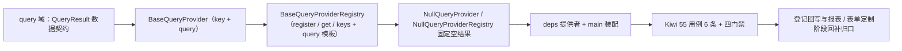

# 数据查询提供者基座实施记录

> 项目骨架 · 02 后端基座 · 04 跨阶段基座 · 09 数据查询提供者基座 · 实施记录

[文档首页](../../../../../../../文档首页.md) › [02-4-9 数据查询提供者基座](../02_后端基座_04_跨阶段基座_09_数据查询提供者基座.md) › 01 实施　|　[← 父任务](../02_后端基座_04_跨阶段基座_09_数据查询提供者基座.md)

## 1. 实施信息 <a id="meta"></a>

| 项 | 值 |
| --- | --- |
| 任务 | [09 数据查询提供者基座](../02_后端基座_04_跨阶段基座_09_数据查询提供者基座.md) |
| 对应需求 | [02-28](../../../../../需求/02_需求_后端基座.md#r02-28) |
| 详细设计 | [09_详细设计_01_数据查询提供者基座](../设计/09_详细设计_01_数据查询提供者基座.md) |
| 实施日期 | 2026-09-14 |
| 实施人 | minjian |
| 实施环境 | 开发机（Ubuntu，Python 3.14 / uv） |
| 提交 | 待提交 |
| 结论 | 完成 |

## 2. 实施概览 <a id="overview"></a>



结果小结：数据查询提供者能力域契约与占位实现落地（`BaseQueryProvider` / `BaseQueryProviderRegistry` / `NullQueryProvider` / `NullQueryProviderRegistry`），`QueryResult` 数据契约与注册表聚合模板（未命中抛 `NotFoundError`）就位，应用可启动、提供者可解析；`pytest` / `ruff` / `pyright` 全绿，新增模块覆盖率 100%。

## 3. 实施过程 <a id="process"></a>

1. **数据查询能力域**：新增 `app/query/`——数据契约 `QueryResult`（frozen：`rows` / `total`）；提供者契约 `BaseQueryProvider(BaseObject)`（抽象属性 `key` + 异步 `query(params)`，只读约束）；注册表契约 `BaseQueryProviderRegistry(BaseCapability)`（`key = "query_provider_registry"`；抽象 `register` / `get` / `keys` + **具体聚合模板** `query`，未命中抛 `NotFoundError`）；占位实现 `NullQueryProvider`（空结果）与 `NullQueryProviderRegistry`（注册空操作、`query` 固定返回空结果、不执行 SQL）；提供者 `get_query_provider_registry`。
2. **依赖注入装配**：`app/api/deps.py` 导出提供者（模块 docstring 补「查询」）；`app/main.py` 装配 `app.state.query_provider_registry = NullQueryProviderRegistry()`。
3. **不落路由**：按设计不落数据集 / 高级查询路由（归报表 / 表单定制阶段），无路由与中间件改动。
4. **测试**：新增 `tests/query/test_query.py`（6 条 Kiwi 55：契约 / 标识 / 结果契约 / 占位提供者 / 占位注册表 / 注册表模板解析与未命中 / 提供者解析）。
5. **Kiwi 登记**：已在 mjbk Kiwi TCMS（分类「平台骨架」、P2、CONFIRMED、标签「自动化」）登记用例 **55「数据查询提供者基座（提供者 + 注册表契约 / 结果契约 / 占位空结果 / 注册表模板 / 依赖解析）」**（2026-09-14），与 `@pytest.mark.kiwi_id(55)` 一致。
6. **登记回写**：架构 04 §4 / §8、《后端基类清单》§2 / §9 / §10、《后端开发规范》§3.1、计划「后续阶段待办」（新增查询提供者真实实现行 + 02_04 偏差跟踪）、需求 02-28 注块 / 状态、需求总览状态、任务 / 父任务状态回写。

关键命令：

```bash
uv run pytest --cov=app -q
uv run ruff check .
uv run ruff format --check .
uv run pyright
python3 scripts/tools/base-check/check-base.py    # 需在 bms 根目录执行
```

## 4. 问题与处置 <a id="issues"></a>

无阻塞问题；`ruff` / `format` / `pyright` 首轮全绿。

## 5. 验证结果 <a id="verify"></a>

| 完成标准 | 验证方法 | 实测结果 |
| --- | --- | --- |
| 接口 / 抽象声明就位、可被上层引用 | 两契约 + 数据契约落地 + 继承 / 契约断言 | 通过 |
| 依赖注入可解析、应用可启动不报错 | `create_app` 装配单例 + 提供者解析用例 + 应用冒烟 | 通过 |
| 占位实现固定返回（不执行 SQL） | `NullQueryProvider` 空结果、`NullQueryProviderRegistry` 固定空结果；无 DB 查询 | 通过 |
| 只读数据源约束声明 | 契约 docstring / 设计明写（实现保证） | 通过 |
| 注册表模板可用 | 解析 / 委托 / 未命中抛 `NotFoundError` 用例 | 通过 |
| 不实现真实能力 | 无数据集 / 字典查询实现、无 SQL 执行 | 通过 |
| 登记齐备 | 架构 04 §4 / §8、《后端基类清单》§2 / §9 / §10、《后端开发规范》§3.1、计划「后续阶段待办」 | 已登记 |
| 无 lint / 类型错误 | `uv run pytest -q` / `ruff check` / `ruff format --check` / `uv run pyright` | 326 passed, 2 skipped / All checks passed / 191 files already formatted / 0 errors |

## 6. 偏差与遗留 <a id="deviations"></a>

- **偏差**：无（按详细设计实施；提供者 + 注册表两契约、`QueryResult`、注册表模板未命中抛 `NotFoundError`、占位固定空结果、不落路由，均按用户拍板）。
- **遗留归口（已登记，随对应阶段销项）**：
  - 真实数据集查询（`rpt_dataset` SQL 建模、只读从库、白名单、超时 / 限流 / 慢查询）→ **报表 BI 阶段**；已登记计划「后续阶段待办」新增「数据查询提供者真实实现」行；实现期要点见需求 02-28 `> 注：` 块。
  - 字典高级查询 provider → 表单定制阶段；AI 问数 NL2SQL → AI 阶段。
  - 查询结果缓存 / 分页 / 导出 → 对应阶段。
  - 真实数据集 / 字典查询用例 → 回补阶段补充。
- **Kiwi 平台登记**：已完成（2026-09-14）：用例 55 登记于 mjbk Kiwi TCMS（分类「平台骨架」、P2、CONFIRMED、标签「自动化」），与 `@pytest.mark.kiwi_id(55)` 一致。
- **处理偏差与遗留（2026-09-14 闭环）**：
  - 计划 §3.1 新增「数据查询提供者真实实现」行（出处 02-4-9）；需求 02-28 `> 注：` 块补齐实现期要点（`rpt_dataset` / 只读从库 / 白名单 / 超时限流 / 字典高级查询 / NL2SQL）。
  - 消费方：报表 BI / 表单定制 / AI 阶段（均无任务文档）已在计划 §3.1 与需求 02-28 注块登记去向，待其阶段建任务后回引。
- **结论**：本任务遗留已全部登记去向，偏差与遗留处理完成。

> 本文档依《文档生成规范》编写
