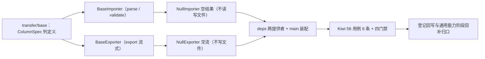

# 导入导出基座实施记录

> 项目骨架 · 02 后端基座 · 04 跨阶段基座 · 10 导入导出基座 · 实施记录

[文档首页](../../../../../../../文档首页.md) › [02-4-10 导入导出基座](../02_后端基座_04_跨阶段基座_10_导入导出基座.md) › 01 实施　|　[← 父任务](../02_后端基座_04_跨阶段基座_10_导入导出基座.md)

## 1. 实施信息 <a id="meta"></a>

| 项 | 值 |
| --- | --- |
| 任务 | [10 导入导出基座](../02_后端基座_04_跨阶段基座_10_导入导出基座.md) |
| 对应需求 | [02-33](../../../../../需求/02_需求_后端基座.md#r02-33) |
| 详细设计 | [10_详细设计_01_导入导出基座](../设计/10_详细设计_01_导入导出基座.md) |
| 实施日期 | 2026-09-14 |
| 实施人 | minjian |
| 实施环境 | 开发机（Ubuntu，Python 3.14 / uv） |
| 提交 | 待提交 |
| 结论 | 完成 |

## 2. 实施概览 <a id="overview"></a>



结果小结：导入导出两组契约与占位实现落地（`BaseImporter` / `NullImporter`、`BaseExporter` / `NullExporter`），`ColumnSpec` / `RowError` / `ImportResult` 数据契约就位，应用可启动、两提供者可解析；`pytest` / `ruff` / `pyright` 全绿，新增模块覆盖率 100%。

## 3. 实施过程 <a id="process"></a>

1. **共享列定义**：新增 `app/transfer/base.py`——`ColumnSpec`（frozen：`key` / `title` / `required`），导入解析与导出列定义共用。
2. **导入能力域**：新增 `app/transfer/importer.py`——数据契约 `RowError`（frozen）/ `ImportResult`（frozen）、契约 `BaseImporter(BaseCapability)`（`key = "importer"`；异步 `parse` / `validate`）、占位实现 `NullImporter`（空行 / 空结果、不读写文件）、提供者 `get_importer`。
3. **导出能力域**：新增 `app/transfer/exporter.py`——契约 `BaseExporter(BaseCapability)`（`key = "exporter"`；`export` 流式返回 `AsyncIterator[bytes]`）、占位实现 `NullExporter`（空流，私有 `_EmptyExporterStream`）、提供者 `get_exporter`。
4. **依赖注入装配**：`app/api/deps.py` 导出两提供者（模块 docstring 补「导入导出」）；`app/main.py` 装配 `app.state.importer` / `app.state.exporter`。
5. **不落路由**：按设计不落导入导出路由（归通用能力阶段），无路由与中间件改动。
6. **测试**：新增 `tests/transfer/test_transfer.py`（6 条 Kiwi 56：契约 / 标识 / 列契约 / 结果契约 / 占位导入 / 占位导出空流 / 提供者解析）。
7. **Kiwi 登记**：已在 mjbk Kiwi TCMS（分类「平台骨架」、P2、CONFIRMED、标签「自动化」）登记用例 **56「导入导出基座（导入解析 / 行校验 / 导出流式契约 / 列与结果契约 / 占位空结果与空流 / 依赖解析）」**（2026-09-14），与 `@pytest.mark.kiwi_id(56)` 一致。
8. **登记回写**：架构 04 §4 / §8、《后端基类清单》§2 / §9 / §10、《后端开发规范》§3.1、计划「后续阶段待办」（新增导入导出真实实现行 + 02_04 偏差跟踪）、需求 02-33 注块 / 状态、需求总览状态、任务 / 父任务状态回写。

关键命令：

```bash
uv run pytest --cov=app -q
uv run ruff check .
uv run ruff format --check .
uv run pyright
python3 scripts/tools/base-check/check-base.py    # 需在 bms 根目录执行
```

## 4. 问题与处置 <a id="issues"></a>

| 问题 / 现象 | 原因 | 处置与落点 |
| --- | --- | --- |
| `ruff` `UP037`：`_EmptyExporterStream.__aiter__` 返回注解引号冗余 | Python 3.14 注解惰性求值，引号多余 | `ruff check --fix` 去引号后复跑全绿 |

## 5. 验证结果 <a id="verify"></a>

| 完成标准 | 验证方法 | 实测结果 |
| --- | --- | --- |
| 接口 / 抽象声明就位、可被上层引用 | 两契约 + 三数据契约落地 + 继承 / 契约断言 | 通过 |
| 依赖注入可解析、应用可启动不报错 | `create_app` 装配两单例 + 两提供者解析用例 + 应用冒烟 | 通过 |
| 占位实现固定返回（不读写文件） | `NullImporter` 空结果、`NullExporter` 空流；无 openpyxl / 文件 IO | 通过 |
| 列定义契约就位 | `ColumnSpec` 用例 | 通过 |
| 不实现真实能力 | 无 openpyxl 依赖、无解析 / 写出 / 入库 | 通过 |
| 登记齐备 | 架构 04 §4 / §8、《后端基类清单》§2 / §9 / §10、《后端开发规范》§3.1、计划「后续阶段待办」 | 已登记 |
| 无 lint / 类型错误 | `uv run pytest -q` / `ruff check` / `ruff format --check` / `uv run pyright` | 332 passed, 2 skipped / All checks passed / 196 files already formatted / 0 errors |

## 6. 偏差与遗留 <a id="deviations"></a>

- **偏差**：无（按详细设计实施；拆两模块 + 共享 `ColumnSpec`、`parse` + `validate`、导出 `AsyncIterator`、占位空结果 / 空流、不落路由，均按用户拍板）。
- **遗留归口（已登记，随对应阶段销项）**：
  - 真实 openpyxl 导入导出（模板 / 解析 / 校验预览 / 批量入库幂等、导出流式与脱敏、大数据量分页）→ **通用能力阶段**；已登记计划「后续阶段待办」新增「导入导出真实实现」行；实现期要点见需求 02-33 `> 注：` 块。
  - 导入导出路由与前端交互 → 通用能力阶段；模板 / 结果文件存取 → 02-4-1；导出脱敏 → 02-3-5。
  - 真实解析 / 校验 / 导出用例 → 回补阶段补充。
- **Kiwi 平台登记**：已完成（2026-09-14）：用例 56 登记于 mjbk Kiwi TCMS（分类「平台骨架」、P2、CONFIRMED、标签「自动化」），与 `@pytest.mark.kiwi_id(56)` 一致。
- **处理偏差与遗留（2026-09-14 闭环）**：计划 §3.1 新增「导入导出真实实现」行（出处 02-4-10）；需求 02-33 `> 注：` 块补齐实现期要点（openpyxl / 解析校验 / 批量入库 / 流式导出 / 脱敏 / 分页）；消费方（通用能力阶段无任务文档、文件存取取 02-4-1、脱敏取 02-3-5）已在计划与需求注块登记去向。
- **结论**：本任务遗留已全部登记去向，偏差与遗留处理完成。

> 本文档依《文档生成规范》编写
