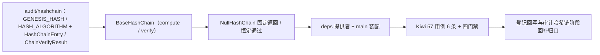

# 审计哈希链基座实施记录

> 项目骨架 · 02 后端基座 · 04 跨阶段基座 · 11 审计哈希链基座 · 实施记录

[文档首页](../../../../../../../文档首页.md) › [02-4-11 审计哈希链基座](../02_后端基座_04_跨阶段基座_11_审计哈希链基座.md) › 01 实施　|　[← 父任务](../02_后端基座_04_跨阶段基座_11_审计哈希链基座.md)

## 1. 实施信息 <a id="meta"></a>

| 项 | 值 |
| --- | --- |
| 任务 | [11 审计哈希链基座](../02_后端基座_04_跨阶段基座_11_审计哈希链基座.md) |
| 对应需求 | [02-34](../../../../../需求/02_需求_后端基座.md#r02-34) |
| 详细设计 | [11_详细设计_01_审计哈希链基座](../设计/11_详细设计_01_审计哈希链基座.md) |
| 实施日期 | 2026-09-14 |
| 实施人 | minjian |
| 实施环境 | 开发机（Ubuntu，Python 3.14 / uv） |
| 提交 | 待提交 |
| 结论 | 完成 |

## 2. 实施概览 <a id="overview"></a>



结果小结：审计哈希链能力域契约与占位实现落地（`BaseHashChain` / `NullHashChain`），`HashChainEntry` / `ChainVerifyResult` 数据契约与 `GENESIS_HASH` / `HASH_ALGORITHM` 常量就位，应用可启动、提供者可解析；`pytest` / `ruff` / `pyright` 全绿，新增模块覆盖率 100%。

## 3. 实施过程 <a id="process"></a>

1. **审计哈希链能力域**：新增 `app/audit/hashchain.py`——常量 `GENESIS_HASH`（64 位零 hex）/ `HASH_ALGORITHM`（`sha256`）、数据契约 `HashChainEntry`（frozen：`prev_hash` / `record` / `record_hash`）与 `ChainVerifyResult`（frozen：`valid` / `broken_index`）；契约 `BaseHashChain(BaseCapability)`（`key = "hash_chain"`；同步 `compute` / `verify`）；占位实现 `NullHashChain`（固定返回 / 恒定通过、不计算）；提供者 `get_hash_chain`。
2. **依赖注入装配**：`app/api/deps.py` 导出提供者（模块 docstring 补「审计链」）；`app/main.py` 装配 `app.state.hash_chain = NullHashChain()`。
3. **不落路由**：按设计不落审计 / 校验路由（归审计哈希链阶段），无路由与中间件改动。
4. **测试**：新增 `tests/audit/test_hashchain.py`（6 条 Kiwi 57：契约 / 标识 / 常量 / 数据契约 / 占位计算 / 占位校验 / 提供者解析）。
5. **Kiwi 登记**：已在 mjbk Kiwi TCMS（分类「平台骨架」、P2、CONFIRMED、标签「自动化」）登记用例 **57「审计哈希链基座（链计算 / 校验契约 / 链头与算法常量 / 数据契约 / 占位固定返回与恒定通过 / 依赖解析）」**（2026-09-14），与 `@pytest.mark.kiwi_id(57)` 一致。
6. **登记回写**：架构 04 §4 / §8、《后端基类清单》§2 / §9 / §10、《后端开发规范》§3.1、计划「后续阶段待办」（新增审计哈希链真实实现行 + 02_04 偏差跟踪）、需求 02-34 注块 / 状态、需求总览状态、任务 / 父任务状态回写。

关键命令：

```bash
uv run pytest --cov=app -q
uv run ruff check .
uv run ruff format --check .
uv run pyright
python3 scripts/tools/base-check/check-base.py    # 需在 bms 根目录执行
```

## 4. 问题与处置 <a id="issues"></a>

| 问题 / 现象 | 原因 | 处置与落点 |
| --- | --- | --- |
| `ruff` `E501`：`audit/hashchain.py` 顶部 docstring 超长 | 契约说明行偏长 | 精简措辞后复跑全绿 |

## 5. 验证结果 <a id="verify"></a>

| 完成标准 | 验证方法 | 实测结果 |
| --- | --- | --- |
| 接口 / 抽象声明就位、可被上层引用 | 契约 + 两数据契约落地 + 继承 / 契约断言 | 通过 |
| 依赖注入可解析、应用可启动不报错 | `create_app` 装配单例 + 提供者解析用例 + 应用冒烟 | 通过 |
| 占位实现固定返回（不计算） | `NullHashChain.compute` 固定哈希、`verify` 恒定通过；无 hashlib 计算 | 通过 |
| 常量清单登记 | `GENESIS_HASH` / `HASH_ALGORITHM` 用例 | 通过 |
| 不实现真实能力 | 无 SHA256 链计算 / 跨月衔接 / 捕获落库 / 巡检 | 通过 |
| 登记齐备 | 架构 04 §4 / §8、《后端基类清单》§2 / §9 / §10、《后端开发规范》§3.1、计划「后续阶段待办」 | 已登记 |
| 无 lint / 类型错误 | `uv run pytest -q` / `ruff check` / `ruff format --check` / `uv run pyright` | 338 passed, 2 skipped / All checks passed / 198 files already formatted / 0 errors |

## 6. 偏差与遗留 <a id="deviations"></a>

- **偏差**：无（按详细设计实施；落 `app/audit/hashchain.py`、同步 `compute` / `verify`、Entry + VerifyResult 契约、占位固定返回 / 恒定通过、不落路由，均按用户拍板）。
- **遗留归口（已登记，随对应阶段销项）**：
  - 真实哈希链计算（SHA256、跨月衔接、链头取上月末条）→ **审计哈希链阶段**；已登记计划「后续阶段待办」新增「审计哈希链真实实现」行；实现期要点见需求 02-34 `> 注：` 块。
  - 审计捕获与有序消费（`sys_data_audit_log`、RocketMQ 分区有序）→ 审计哈希链阶段 / 事件总线。
  - 链校验巡检、归档前强制校验、留存销毁 → 审计哈希链阶段 / 归档 / 任务调度；审计日志按月索引 → 02-4-3。
  - 真实哈希链用例（逐条计算、跨月衔接、篡改定位）→ 回补阶段补充。
- **Kiwi 平台登记**：已完成（2026-09-14）：用例 57 登记于 mjbk Kiwi TCMS（分类「平台骨架」、P2、CONFIRMED、标签「自动化」），与 `@pytest.mark.kiwi_id(57)` 一致。
- **结论**：本任务遗留已全部登记去向（收尾「处理偏差与遗留」步骤复核）。

> 本文档依《文档生成规范》编写
