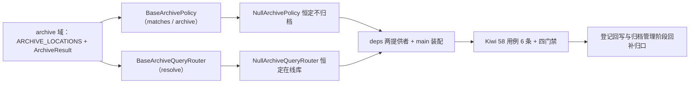

# 归档策略基座实施记录

> 项目骨架 · 02 后端基座 · 04 跨阶段基座 · 12 归档策略基座 · 实施记录

[文档首页](../../../../../../../文档首页.md) › [02-4-12 归档策略基座](../02_后端基座_04_跨阶段基座_12_归档策略基座.md) › 01 实施　|　[← 父任务](../02_后端基座_04_跨阶段基座_12_归档策略基座.md)

## 1. 实施信息 <a id="meta"></a>

| 项 | 值 |
| --- | --- |
| 任务 | [12 归档策略基座](../02_后端基座_04_跨阶段基座_12_归档策略基座.md) |
| 对应需求 | [02-35](../../../../../需求/02_需求_后端基座.md#r02-35) |
| 详细设计 | [12_详细设计_01_归档策略基座](../设计/12_详细设计_01_归档策略基座.md) |
| 实施日期 | 2026-09-14 |
| 实施人 | minjian |
| 实施环境 | 开发机（Ubuntu，Python 3.14 / uv） |
| 提交 | 待提交 |
| 结论 | 完成 |

## 2. 实施概览 <a id="overview"></a>



结果小结：归档能力域两组契约与占位实现落地（`BaseArchivePolicy` / `NullArchivePolicy`、`BaseArchiveQueryRouter` / `NullArchiveQueryRouter`），`ArchiveResult` 数据契约与 `ARCHIVE_LOCATIONS` 常量就位，应用可启动、两提供者可解析；`pytest` / `ruff` / `pyright` 全绿，新增模块覆盖率 100%。

## 3. 实施过程 <a id="process"></a>

1. **归档能力域**：新增 `app/archive/`——常量 `ARCHIVE_LOCATIONS`（online / archive）、数据契约 `ArchiveResult`（frozen：`matched` / `archived` / `detail`）；策略契约 `BaseArchivePolicy(BaseCapability)`（`key = "archive_policy"`；异步 `matches` / `archive`）、查询路由契约 `BaseArchiveQueryRouter(BaseCapability)`（`key = "archive_query_router"`；同步 `resolve`）；占位实现 `NullArchivePolicy`（恒定不归档）/ `NullArchiveQueryRouter`（恒定在线库）；提供者 `get_archive_policy` / `get_archive_query_router`。
2. **依赖注入装配**：`app/api/deps.py` 导出两提供者（模块 docstring 补「归档」）；`app/main.py` 装配 `app.state.archive_policy` / `app.state.archive_query_router`。
3. **不落路由**：按设计不落归档管理路由（归归档管理阶段），无路由与中间件改动。
4. **测试**：新增 `tests/archive/test_archive.py`（6 条 Kiwi 58：契约 / 标识 / 常量 / 结果契约 / 占位策略 / 占位查询路由 / 提供者解析）。
5. **Kiwi 登记**：已在 mjbk Kiwi TCMS（分类「平台骨架」、P2、CONFIRMED、标签「自动化」）登记用例 **58「归档策略基座（策略 matches / archive + 查询路由 resolve 契约 / 结果契约与常量 / 占位不归档与在线库 / 依赖解析）」**（2026-09-14），与 `@pytest.mark.kiwi_id(58)` 一致。
6. **登记回写**：架构 04 §4 / §8、《后端基类清单》§2 / §9 / §10、《后端开发规范》§3.1、计划「后续阶段待办」（新增归档策略真实实现行 + 02_04 偏差跟踪）、需求 02-35 注块 / 状态、需求总览状态、任务 / 父任务状态回写。

关键命令：

```bash
uv run pytest --cov=app -q
uv run ruff check .
uv run ruff format --check .
uv run pyright
python3 scripts/tools/base-check/check-base.py    # 需在 bms 根目录执行
```

## 4. 问题与处置 <a id="issues"></a>

| 问题 / 现象 | 原因 | 处置与落点 |
| --- | --- | --- |
| `ruff` `E501`：`deps.py` / `archive/base.py` docstring 超长 + 用例返回字典超长 | 补「归档」后超 120 列 | 精简 docstring 措辞、用例字典由 `ruff format` 折行后复跑全绿 |

## 5. 验证结果 <a id="verify"></a>

| 完成标准 | 验证方法 | 实测结果 |
| --- | --- | --- |
| 接口 / 抽象声明就位、可被上层引用 | 两契约 + 数据契约落地 + 继承 / 契约断言 | 通过 |
| 依赖注入可解析、应用可启动不报错 | `create_app` 装配两单例 + 两提供者解析用例 + 应用冒烟 | 通过 |
| 占位实现固定返回（不搬数据） | `NullArchivePolicy` 恒不归档、`NullArchiveQueryRouter` 恒在线库；无搬迁 / 冷化 | 通过 |
| 常量清单登记 | `ARCHIVE_LOCATIONS` 用例 | 通过 |
| 不实现真实能力 | 无 `bms_archive` 搬迁、无冷化 / 物理清理 / 回收站 | 通过 |
| 登记齐备 | 架构 04 §4 / §8、《后端基类清单》§2 / §9 / §10、《后端开发规范》§3.1、计划「后续阶段待办」 | 已登记 |
| 无 lint / 类型错误 | `uv run pytest -q` / `ruff check` / `ruff format --check` / `uv run pyright` | 344 passed, 2 skipped / All checks passed / 201 files already formatted / 0 errors |

## 6. 偏差与遗留 <a id="deviations"></a>

- **偏差**：无（按详细设计实施；策略 + 查询路由两契约、`ArchiveResult`、占位恒定不归档 / 在线库、不落路由，均按用户拍板）。
- **遗留归口（已登记，随对应阶段销项）**：
  - 真实归档流转（`sys_archive_policy` / `sys_archive_log`、Celery 调度、链校验后迁 `bms_archive`、在线查询路由）→ **归档管理阶段**；已登记计划「后续阶段待办」新增「归档策略真实实现」行；实现期要点见需求 02-35 `> 注：` 块。
  - 冷化与物理清理、回收站 → 归档管理阶段；跨归档链校验 / 哈希链导出 → 02-4-11；归档文件存取 → 02-4-1；在线查询访问只读库 → 数据访问与分片。
  - 真实归档用例 → 回补阶段补充。
- **Kiwi 平台登记**：已完成（2026-09-14）：用例 58 登记于 mjbk Kiwi TCMS（分类「平台骨架」、P2、CONFIRMED、标签「自动化」），与 `@pytest.mark.kiwi_id(58)` 一致。
- **处理偏差与遗留（2026-09-14 闭环）**：计划 §3.1 新增「归档策略真实实现」行（出处 02-4-12）；需求 02-35 `> 注：` 块补齐实现期要点（`sys_archive_policy` / Celery / 链校验 / `bms_archive` / 冷化 / 回收站）；消费方（归档管理阶段、数据访问与分片、任务调度、链校验取 02-4-11、文件存取取 02-4-1）已在计划与需求注块登记去向。
- **结论**：本任务遗留已全部登记去向，偏差与遗留处理完成。

> 本文档依《文档生成规范》编写
