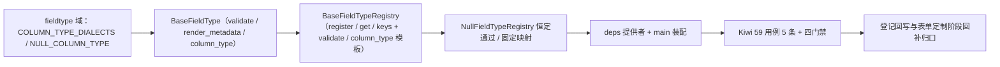

# 表单字段类型注册表基座实施记录

> 项目骨架 · 02 后端基座 · 04 跨阶段基座 · 13 表单字段类型注册表基座 · 实施记录

[文档首页](../../../../../../../文档首页.md) › [02-4-13 表单字段类型注册表基座](../02_后端基座_04_跨阶段基座_13_表单字段类型注册表基座.md) › 01 实施　|　[← 父任务](../02_后端基座_04_跨阶段基座_13_表单字段类型注册表基座.md)

## 1. 实施信息 <a id="meta"></a>

| 项 | 值 |
| --- | --- |
| 任务 | [13 表单字段类型注册表基座](../02_后端基座_04_跨阶段基座_13_表单字段类型注册表基座.md) |
| 对应需求 | [02-36](../../../../../需求/02_需求_后端基座.md#r02-36) |
| 详细设计 | [13_详细设计_01_表单字段类型注册表基座](../设计/13_详细设计_01_表单字段类型注册表基座.md) |
| 实施日期 | 2026-09-14 |
| 实施人 | minjian |
| 实施环境 | 开发机（Ubuntu，Python 3.14 / uv） |
| 提交 | 待提交 |
| 结论 | 完成 |

## 2. 实施概览 <a id="overview"></a>



结果小结：字段类型能力域契约与占位实现落地（`BaseFieldType` / `BaseFieldTypeRegistry` / `NullFieldTypeRegistry`），`COLUMN_TYPE_DIALECTS` / `NULL_COLUMN_TYPE` 常量与注册表聚合模板（未命中抛 `NotFoundError`）就位，应用可启动、提供者可解析；`pytest` / `ruff` / `pyright` 全绿，新增模块覆盖率 100%。

## 3. 实施过程 <a id="process"></a>

1. **字段类型能力域**：新增 `app/fieldtype/`——常量 `COLUMN_TYPE_DIALECTS`（mysql / postgresql / dm / sqlite）/ `NULL_COLUMN_TYPE`；提供者契约 `BaseFieldType(BaseObject)`（抽象属性 `key` + 同步 `validate` / `render_metadata` / `column_type`）；注册表契约 `BaseFieldTypeRegistry(BaseCapability)`（`key = "field_type_registry"`；抽象 `register` / `get` / `keys` + **具体聚合模板** `validate` / `column_type`，未命中抛 `NotFoundError`）；占位实现 `NullFieldTypeRegistry`（恒定通过 / 固定映射）；提供者 `get_field_type_registry`。
2. **依赖注入装配**：`app/api/deps.py` 导出提供者（模块 docstring 补「字段类型」）；`app/main.py` 装配 `app.state.field_type_registry = NullFieldTypeRegistry()`。
3. **不落路由**：按设计不落表单定制路由（归表单定制阶段），无路由与中间件改动。
4. **测试**：新增 `tests/fieldtype/test_fieldtype.py`（5 条 Kiwi 59：契约 / 标识 / 常量 / 注册表模板解析与未命中 / 占位恒定通过 / 提供者解析）。
5. **Kiwi 登记**：已在 mjbk Kiwi TCMS（分类「平台骨架」、P2、CONFIRMED、标签「自动化」）登记用例 **59「表单字段类型注册表基座（字段类型契约 / 注册表聚合模板 / 常量 / 占位恒定通过与固定映射 / 依赖解析）」**（2026-09-14），与 `@pytest.mark.kiwi_id(59)` 一致。
6. **登记回写**：架构 04 §4 / §8、《后端基类清单》§2 / §9 / §10、《后端开发规范》§3.1、计划「后续阶段待办」（新增字段类型注册表真实实现行 + 02_04 偏差跟踪）、需求 02-36 注块 / 状态、需求总览状态、任务 / 父任务状态回写。

关键命令：

```bash
uv run pytest --cov=app -q
uv run ruff check .
uv run ruff format --check .
uv run pyright
python3 scripts/tools/base-check/check-base.py    # 需在 bms 根目录执行
```

## 4. 问题与处置 <a id="issues"></a>

| 问题 / 现象 | 原因 | 处置与落点 |
| --- | --- | --- |
| `ruff` `E501`：`fieldtype/base.py` 方法签名 / `deps.py` docstring 超长 | 补「字段类型」后超 120 列 | `ruff format` 折行方法签名、`deps.py` docstring 拆两行后复跑全绿 |

## 5. 验证结果 <a id="verify"></a>

| 完成标准 | 验证方法 | 实测结果 |
| --- | --- | --- |
| 接口 / 抽象声明就位、可被上层引用 | 两契约落地 + 继承 / 契约断言 | 通过 |
| 依赖注入可解析、应用可启动不报错 | `create_app` 装配单例 + 提供者解析用例 + 应用冒烟 | 通过 |
| 占位实现固定返回（不校验 / 不映射） | `NullFieldTypeRegistry` 恒空违规 / 固定列类型；无类型校验 / 映射实现 | 通过 |
| 常量清单登记 | `COLUMN_TYPE_DIALECTS` / `NULL_COLUMN_TYPE` 用例 | 通过 |
| 不实现真实能力 | 无字段类型实现、无动态 DDL、无校验器落库 | 通过 |
| 登记齐备 | 架构 04 §4 / §8、《后端基类清单》§2 / §9 / §10、《后端开发规范》§3.1、计划「后续阶段待办」 | 已登记 |
| 无 lint / 类型错误 | `uv run pytest -q` / `ruff check` / `ruff format --check` / `uv run pyright` | 349 passed, 2 skipped / All checks passed / 204 files already formatted / 0 errors |

## 6. 偏差与遗留 <a id="deviations"></a>

- **偏差**：无（按详细设计实施；提供者 + 注册表两契约、同步三方法、聚合模板未命中抛 `NotFoundError`、占位恒定通过 / 固定映射、不落路由，均按用户拍板）。
- **遗留归口（已登记，随对应阶段销项）**：
  - 真实字段类型实现（各类型校验 / 渲染元数据 / 四库类型映射）→ **表单定制阶段**；已登记计划「后续阶段待办」新增「字段类型注册表真实实现」行；实现期要点见需求 02-36 `> 注：` 块。
  - 动态 DDL（`ext_*`、停用不删列、四库映射执行、分片表禁自建字段）→ 表单定制阶段 + 数据访问与分片；服务端动态校验接入、渲染器组件映射 → 表单定制 / 前端组件体系。
  - 真实字段类型用例 → 回补阶段补充。
- **Kiwi 平台登记**：已完成（2026-09-14）：用例 59 登记于 mjbk Kiwi TCMS（分类「平台骨架」、P2、CONFIRMED、标签「自动化」），与 `@pytest.mark.kiwi_id(59)` 一致。
- **结论**：本任务遗留已全部登记去向（收尾「处理偏差与遗留」步骤复核）。

> 本文档依《文档生成规范》编写
