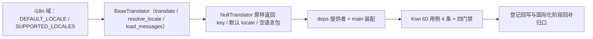

# 国际化翻译基座实施记录

> 项目骨架 · 02 后端基座 · 04 跨阶段基座 · 14 国际化翻译基座 · 实施记录

[文档首页](../../../../../../../文档首页.md) › [02-4-14 国际化翻译基座](../02_后端基座_04_跨阶段基座_14_国际化翻译基座.md) › 01 实施　|　[← 父任务](../02_后端基座_04_跨阶段基座_14_国际化翻译基座.md)

## 1. 实施信息 <a id="meta"></a>

| 项 | 值 |
| --- | --- |
| 任务 | [14 国际化翻译基座](../02_后端基座_04_跨阶段基座_14_国际化翻译基座.md) |
| 对应需求 | [02-37](../../../../../需求/02_需求_后端基座.md#r02-37) |
| 详细设计 | [14_详细设计_01_国际化翻译基座](../设计/14_详细设计_01_国际化翻译基座.md) |
| 实施日期 | 2026-09-14 |
| 实施人 | minjian |
| 实施环境 | 开发机（Ubuntu，Python 3.14 / uv） |
| 提交 | 待提交 |
| 结论 | 完成 |

## 2. 实施概览 <a id="overview"></a>



结果小结：国际化翻译能力域契约与占位实现落地（`BaseTranslator` / `NullTranslator`），`DEFAULT_LOCALE` / `SUPPORTED_LOCALES` 常量就位，应用可启动、提供者可解析；`pytest` / `ruff` / `pyright` 全绿，新增模块覆盖率 100%。

## 3. 实施过程 <a id="process"></a>

1. **国际化能力域**：新增 `app/i18n/base.py`（`app/i18n/__init__.py` 口径同步）——常量 `DEFAULT_LOCALE`（`zh-CN`）/ `SUPPORTED_LOCALES`（zh-CN / en-US）；契约 `BaseTranslator(BaseCapability)`（`key = "translator"`；异步 `translate` / `load_messages` + 同步 `resolve_locale`）；占位实现 `NullTranslator`（`translate` 原样返回 key、`resolve_locale` 返回默认、`load_messages` 返回空映射）；提供者 `get_translator`。
2. **依赖注入装配**：`app/api/deps.py` 导出提供者（模块 docstring 补「国际化」）；`app/main.py` 装配 `app.state.translator = NullTranslator()`。
3. **不落路由**：按设计不落语言包下发路由（归国际化阶段），无路由与中间件改动。
4. **测试**：新增 `tests/i18n/test_i18n.py`（4 条 Kiwi 60：契约 / 标识 / 常量 / 占位固定 / 提供者解析）。
5. **Kiwi 登记**：已在 mjbk Kiwi TCMS（分类「平台骨架」、P2、CONFIRMED、标签「自动化」）登记用例 **60「国际化翻译基座（translate / resolve_locale / load_messages 契约 / 常量 / 占位原样返回与默认 locale / 依赖解析）」**（2026-09-14），与 `@pytest.mark.kiwi_id(60)` 一致。
6. **登记回写**：架构 04 §4 / §8、《后端基类清单》§2 / §9 / §10、《后端开发规范》§3.1、计划「后续阶段待办」（新增国际化翻译真实实现行 + 02_04 偏差跟踪）、需求 02-37 注块 / 状态、需求总览状态、任务 / 父任务状态回写。

关键命令：

```bash
uv run pytest --cov=app -q
uv run ruff check .
uv run ruff format --check .
uv run pyright
python3 scripts/tools/base-check/check-base.py    # 需在 bms 根目录执行
```

## 4. 问题与处置 <a id="issues"></a>

| 问题 / 现象 | 原因 | 处置与落点 |
| --- | --- | --- |
| `ruff format` 1 文件待格式化 | 新增用例多行调用换行 | `uv run ruff format` 自动规整后复跑全绿 |

## 5. 验证结果 <a id="verify"></a>

| 完成标准 | 验证方法 | 实测结果 |
| --- | --- | --- |
| 接口 / 抽象声明就位、可被上层引用 | 契约落地 + 继承 / 契约断言 | 通过 |
| 依赖注入可解析、应用可启动不报错 | `create_app` 装配单例 + 提供者解析用例 + 应用冒烟 | 通过 |
| 占位实现固定返回（不翻译） | `NullTranslator.translate` 原样 key、`resolve_locale` 默认、`load_messages` 空；无语言包 / Babel |
| 常量清单登记 | `DEFAULT_LOCALE` / `SUPPORTED_LOCALES` 用例 | 通过 |
| 不实现真实能力 | 无 `sys_i18n_message` 读取、无 Redis 缓存、无 Babel 提取 | 通过 |
| 登记齐备 | 架构 04 §4 / §8、《后端基类清单》§2 / §9 / §10、《后端开发规范》§3.1、计划「后续阶段待办」 | 已登记 |
| 无 lint / 类型错误 | `uv run pytest -q` / `ruff check` / `ruff format --check` / `uv run pyright` | 353 passed, 2 skipped / All checks passed / 206 files already formatted / 0 errors |

## 6. 偏差与遗留 <a id="deviations"></a>

- **偏差**：无（按详细设计实施；复用 `app/i18n/`、三方法、混合同步性、占位原样返回 / 默认 locale / 空语言包、不落路由，均按用户拍板）。
- **遗留归口（已登记，随对应阶段销项）**：
  - 真实语言包实现（`sys_i18n_message` + Redis 缓存下发、语言清单动态扩展 `sys_i18n_locale`、Babel 开发期提取）→ **国际化阶段**；已登记计划「后续阶段待办」新增「国际化翻译真实实现」行；实现期要点见需求 02-37 `> 注：` 块。
  - i18n 附表查询与回退（`{主表}_i18n` 业务文案）、用户 locale / 时区偏好、错误码文案映射、前端语言包与 RTL → 国际化阶段 / 前端组件体系。
  - 真实取词 / 语言包用例 → 回补阶段补充。
- **Kiwi 平台登记**：已完成（2026-09-14）：用例 60 登记于 mjbk Kiwi TCMS（分类「平台骨架」、P2、CONFIRMED、标签「自动化」），与 `@pytest.mark.kiwi_id(60)` 一致。
- **处理偏差与遗留（2026-09-14 闭环）**：计划 §3.1 新增「国际化翻译真实实现」行（出处 02-4-14）；需求 02-37 `> 注：` 块补齐实现期要点（`sys_i18n_message` / Redis / `sys_i18n_locale` / Babel / i18n 附表 / locale 时区）；消费方（国际化阶段、前端组件体系、通知公告）已在计划与需求注块登记去向。
- **结论**：本任务遗留已全部登记去向，偏差与遗留处理完成。

> 本文档依《文档生成规范》编写
