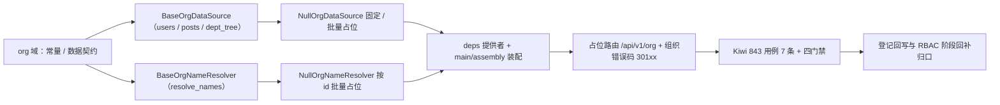

# 组织主数据查询基座实施记录

> 项目骨架 · 02 后端基座 · 04 跨阶段基座 · 16 组织主数据查询基座 · 实施记录

[文档首页](../../../../../../../文档首页.md) › [02-4-16 组织主数据查询基座](../02_后端基座_04_跨阶段基座_16_组织主数据查询基座.md) › 01 实施　|　[← 父任务](../02_后端基座_04_跨阶段基座_16_组织主数据查询基座.md)

## 1. 实施信息 <a id="meta"></a>

| 项 | 值 |
| --- | --- |
| 任务 | [16 组织主数据查询基座](../02_后端基座_04_跨阶段基座_16_组织主数据查询基座.md) |
| 对应需求 | [02-43](../../../../../需求/02_需求_后端基座.md#r02-43) |
| 详细设计 | [16_详细设计_01_组织主数据查询基座](../设计/16_详细设计_01_组织主数据查询基座.md) |
| 实施日期 | 2026-09-20 |
| 实施人 | minjian |
| 实施环境 | 开发机（Ubuntu，Python 3.14 / uv） |
| 提交 | 待提交 |
| 结论 | 完成 |

## 2. 实施概览 <a id="overview"></a>



结果小结：组织主数据能力域契约与占位实现落地（`BaseOrgDataSource` / `BaseOrgNameResolver`），`OrgUser` / `OrgPost` / `OrgDept` / `OrgNameRef` 数据契约、三常量、组织错误码 `30101`~`30103`、占位路由 `/api/v1/org` 就位；应用可启动、提供者可解析；`pytest` / `ruff` / `pyright` / 基座校验全绿，新增模块覆盖率 100%。

## 3. 实施过程 <a id="process"></a>

1. **组织主数据能力域**：新增 `app/org/`——常量 `ORG_STATUSES`（enabled / disabled）、`ORG_TARGETS`（user / post / dept）、`DEFAULT_ORG_PAGE_SIZE`（20）；数据契约 `OrgUser`（`masked_fields = {phone, email}`）/ `OrgPost` / `OrgDept`（嵌套 `children`）/ `OrgNameRef`；查询契约 `BaseOrgDataSource`（`key = plugin_key = "org_data_source"`；异步 `users` / `posts` / `dept_tree`）；回显契约 `BaseOrgNameResolver`（`key = plugin_key = "org_name_resolver"`；异步 `resolve_names`）；提供者 `get_org_data_source` / `get_org_name_resolver`。
2. **缺省实现**：`app/org/null.py`——`NullOrgDataSource`（users / posts 固定单条占位页、dept_tree 固定两节点树）、`NullOrgNameResolver`（按传入 ids 逐个返回占位名「占位#{id}」）；均不连库、不做数据范围与脱敏。
3. **错误码登记**：`app/core/error_codes.py` 增 `ORG_SOURCE_UNAVAILABLE=30101` / `ORG_TARGET_UNSUPPORTED=30102` / `ORG_DEPT_NOT_FOUND=30103`（用户与组织段 `3xxxx` 下 `301xx` 子段）。
4. **装配与依赖注入**：`app/core/config.py` 增 `org_data_source` / `org_name_resolver` 两 `PluginSelection`；`app/core/assembly.py` 的 `_NULL_MODULES` 增 `app.org.null`、`PLUGIN_WIRINGS` 增两条接线；`app/api/deps.py` 导出两提供者。
5. **占位路由**：新增 `app/api/org.py`——`BaseRouter(key="org", prefix="/org", …)`，`dependencies=[Depends(require_auth), Depends(get_masker)]`；`GET /org/users` / `/posts`（关键字 / 部门 / 含子级 / 状态 / 分页）、`GET /org/dept-tree`（不分页）、`GET /org/resolve-names`（`id_in` 逗号分隔 + `target`）；`app/api/router.py` 登记 `org`。
6. **测试**：新增 `tests/org/test_org.py`（7 条 Kiwi 843：契约 / 常量与数据契约 / 错误码 / 空实现 / 依赖解析 / 占位路由 / 内存实现 + 路由）。
7. **Kiwi 登记**：已在 mjbk Kiwi TCMS（分类「平台骨架」、P2、CONFIRMED、标签「自动化」）登记用例 **843「02-4-16 组织主数据查询基座（查询 / 回显两契约、固定 / 批量空实现、组织错误码、占位路由）」**（2026-09-20），与 `@pytest.mark.kiwi_id(843)` 一致。
8. **门禁伴随修正**：既有护栏用例清单补新能力域——`tests/crosscut/test_plugin_registration.py` 的 `_EXPECTED_PLUGIN_KEYS` 增 `org_data_source` / `org_name_resolver`；`tests/api/test_router_base.py` 的路由键断言增 `org`。
9. **登记回写**：架构 09「错误码分段」/ 15「权限模型」、《后端基类清单》§7 / §9 / §10、《后端开发规范》§3.1、计划 §2 / §3 / §3.1、需求 02-43 注块、任务 / 父任务状态回写。

关键命令：

```bash
uv run pytest --cov=app -q
uv run ruff check .
uv run ruff format --check .
uv run pyright
python3 scripts/tools/base-check/check-base.py .            # bms 根目录
python3 scripts/tools/base-check/check-backend-base.py .    # bms 根目录
```

## 4. 问题与处置 <a id="issues"></a>

| 问题 / 现象 | 原因 | 处置与落点 |
| --- | --- | --- |
| `tests/crosscut/test_plugin_registration.py` 与 `tests/api/test_router_base.py` 3 条用例失败 | 护栏用例维护「能力域插件键清单 / 路由键清单」，新能力域未纳入 | 两文件清单补 `org_data_source` / `org_name_resolver` / `org`（本任务随代码提交） |
| `tests/org/test_org.py` 1 行超 120 列 | 路由用例 params 单行过长 | 拆多行后 `ruff` 全绿 |

## 5. 验证结果 <a id="verify"></a>

| 完成标准 | 验证方法 | 实测结果 |
| --- | --- | --- |
| 接口 / 抽象声明就位、可被上层引用 | 两契约落地 + 继承 / 契约断言 | 通过 |
| 批量回显支持按 id 列表 | `resolve_names(target, ids)` + 空实现批量 + 路由 `id_in` | 通过 |
| 部门树一次性返回 | `dept_tree` 不分页 + 嵌套 `children` | 通过 |
| 数据范围与脱敏口径 | 契约 docstring 口径 + `OrgUser.masked_fields` + 路由 `get_masker` | 通过 |
| 错误码登记 | `ErrorCode` `30101`~`30103` + 架构 09 错误码段 | 通过 |
| 依赖注入可解析、应用可启动不报错 | `create_app` / `assembly` 装配两空实现 + 提供者解析用例 + 应用冒烟 + 占位路由 | 通过 |
| 占位实现固定 / 批量返回 | 两空实现；无组织表读写 / 分页 / 子树 / 脱敏实现 | 通过 |
| 登记齐备 | 架构 09 / 15、《后端基类清单》§7 / §9 / §10、《后端开发规范》§3.1、计划 §2 / §3 / §3.1 | 已登记 |
| 无 lint / 类型错误 | `pytest -q` / `ruff check` / `ruff format --check` / `pyright` | 629 passed, 8 skipped / All checks passed / 322 files already formatted / 0 errors |
| 基座校验 | `check-base.py` / `check-backend-base.py` | 均通过（跨层引用 0、清单一致、继承链 254 条对齐、错误码段位合规） |

## 6. 偏差与遗留 <a id="deviations"></a>

- **偏差**：无（按详细设计实施；拆两契约、显式具名参数 + `BasePageResponse`、`resolve_names(target, ids)`、嵌套部门树、固定 / 批量占位、`301xx` 三码、占位路由 `/api/v1/org`，均按用户拍板）。
- **遗留归口（已登记，随对应阶段销项）**：
  - 真实取数（`sys_user` / `sys_post` / `sys_dept` 查询、关键字命中列、分页、部门子树展开）→ **RBAC / 用户 / 岗位 / 部门模块阶段**；已登记计划 §3.1「组织主数据真实实现」行；实现期要点见需求 02-43 `> 注：` 块。
  - 数据范围过滤（02-13）、字段脱敏真实规则（02-29）、权限码 `user:query` / `post:query` / `dept:query`、错误码真实抛错分支 → **RBAC / 认证与安全阶段**。
  - 查询缓存与前端防抖（同关键词短缓存、已选对象常驻）→ 前端组件库 06_05 / 通用能力阶段。
  - 真实组织用例 → 回补阶段补充。
- **Kiwi 平台登记**：已完成（2026-09-20）：用例 843 登记于 mjbk Kiwi TCMS（分类「平台骨架」、P2、CONFIRMED、标签「自动化」），与 `@pytest.mark.kiwi_id(843)` 一致。
- **处理偏差与遗留（2026-09-20 闭环）**：计划 §3.1 新增「组织主数据真实实现」行（出处 02-4-16）；需求 02-43 `> 注：` 块补齐实现期要点（组织表 / 数据范围 / 脱敏 / 权限码 / 错误码）；消费方（RBAC、认证与安全、组织模块、前端 06_05、通用能力）已在计划与需求注块登记去向。
- **结论**：本任务遗留已全部登记去向，偏差与遗留处理完成。

> 本文档依《文档生成规范》编写
