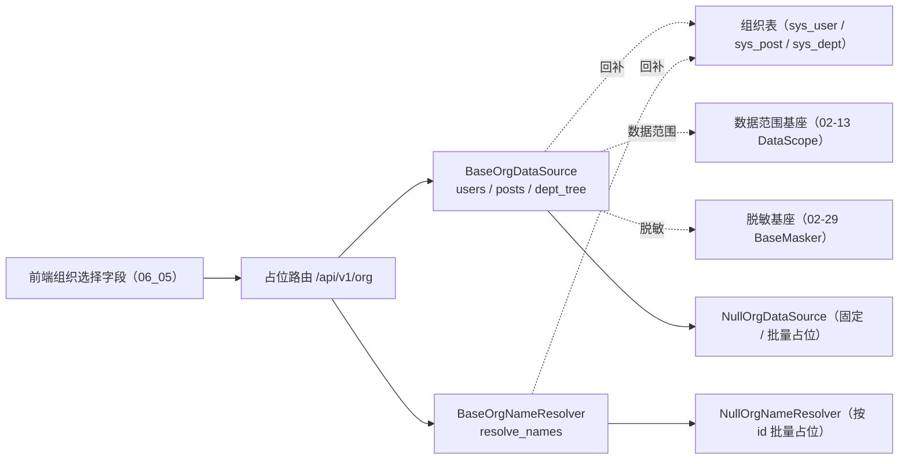

# 组织主数据查询基座详细设计

> 项目骨架 · 02 后端基座 · 04 跨阶段基座 · 16 组织主数据查询基座 · 详细设计

[文档首页](../../../../../../../文档首页.md) › [02-4-16 组织主数据查询基座](../02_后端基座_04_跨阶段基座_16_组织主数据查询基座.md) › 01 详细设计　|　[← 父任务](../02_后端基座_04_跨阶段基座_16_组织主数据查询基座.md)

## 1. 概述 <a id="overview"></a>

- **目标**：落地「组织主数据查询基座」——新建独立能力域 `app/org/`：查询契约 `BaseOrgDataSource`（`users` / `posts` / `dept_tree`）与回显契约 `BaseOrgNameResolver`（`resolve_names`）；两份缺省实现 `NullOrgDataSource` / `NullOrgNameResolver`（固定 / 批量占位数据）；数据契约 `OrgUser` / `OrgPost` / `OrgDept` / `OrgNameRef`；常量 `ORG_STATUSES` / `ORG_TARGETS` / `DEFAULT_ORG_PAGE_SIZE`；组织查询错误码 `30101`~`30103`；配置分区 `org_data_source` / `org_name_resolver`、装配接线与占位路由 `/api/v1/org`。
- **范围**：`app/org/`（新增）、`app/api/org.py`（新增占位路由）、`app/core/error_codes.py`、`app/core/config.py`、`app/core/assembly.py`、`app/api/deps.py`、`app/api/router.py`、单测；架构 09「错误码分段」/ 15「权限模型」、《后端基类清单》§7 / §9 / §10、《后端开发规范》§3.1、计划 §3 / §3.1、需求 02-43 登记。
- **不含**（归后续阶段）：真实取数（`sys_user` / `sys_post` / `sys_dept` 查询与分页、部门子树展开、关键字模糊）、数据范围过滤（经 02-13 `DataScope` 注入）、字段脱敏真实规则（经 02-29 `BaseMasker` 分派）、权限码 `user:query` / `post:query` / `dept:query` 与动作级数据范围 → **RBAC / 用户 / 岗位 / 部门模块阶段**；查询结果缓存与防抖 → 前端组件库 06_05 / 通用能力阶段。
- **依据**：需求 [02-43](../../../../../需求/02_需求_后端基座.md#r02-43)、《[架构设计 · 权限计算引擎](../../../../../../../设计/架构设计/15_架构设计_子系统_权限计算引擎.md)》「权限模型」节、《[架构设计 · 数据架构](../../../../../../../设计/架构设计/07_架构设计_数据架构.md)》「租户库表」节、《[架构设计 · 后端基础类体系](../../../../../../../设计/架构设计/04_架构设计_后端基础类体系.md)》「阶段交付与跨阶段基座契约」节、《[后端基类清单](../../../../../../../后端基类清单.md)》「跨阶段基座」节、《[后端开发规范](../../../../../../../规范/后端开发规范.md)》「后端基座体系」节、[《组件设计 · 组织选择字段》](../../../../../../../设计/组件设计/06_字段类/05_组件设计_组织选择字段/05_组件设计_组织选择字段.md)、前端冻结契约 [06_05 组织选择字段](../../../../../../04_前端组件库/任务/06_字段类/06_字段类_05_组织选择字段/06_字段类_05_组织选择字段.md)。

## 2. 现状与差距 <a id="gap"></a>

| 现状 | 差距 |
| --- | --- |
| 全库无 `BaseOrgDataSource` / `BaseOrgNameResolver` / `NullOrgDataSource`（检索零命中）；无 `app/org/` 目录 | 前端组织选择字段（06_05）需按关键字 / 部门 / 状态查询用户与岗位、按 id 批量取名称、部门树一次性返回；无统一出口则数据范围过滤与脱敏口径发散 |
| 数据范围（02-13 `DataScope`）、脱敏（02-29 `BaseMasker` / `BaseSchema.masked_fields`）已就位 | 组织读接口未收口到统一出口，数据可见范围与敏感字段的执行点无落点 |
| 架构 15「权限模型」已登记「组织主数据读出口」语义 | 读出口的契约拆分、方法签名与错误码未在代码层固化，前后端口径易漂 |
| 02-4-19 / 20 / 21 / 22 / 23 已交付占位路由与「一域一目录」范式 | 新能力域无提供者与占位路由，「依赖注入可解析」无落点 |

## 3. 交付物清单 <a id="tree"></a>

```text
backend/
├── app/org/__init__.py                     # 新增：能力域包（docstring 口径）
├── app/org/base.py                         # 新增：常量 / 数据契约 / 两契约 / 两提供者
├── app/org/null.py                         # 新增：NullOrgDataSource / NullOrgNameResolver
├── app/api/org.py                          # 新增：占位路由 /api/v1/org（BaseRouter）
├── app/core/error_codes.py                 # 修改：登记组织查询错误码 30101~30103
├── app/core/config.py                      # 修改：Settings 增 org_data_source / org_name_resolver 分区
├── app/core/assembly.py                    # 修改：_NULL_MODULES 增 app.org.null + PLUGIN_WIRINGS 增两条接线
├── app/api/deps.py                         # 修改：导出两提供者
├── app/api/router.py                       # 修改：登记 org 路由
└── tests/
    └── org/test_org.py                     # 新增：Kiwi（契约 / 常量 / 数据契约 / 空实现 / 错误码 / 依赖解析 / 占位路由）

bms文档/
├── 设计/架构设计/09_架构设计_接口与集成.md            # 修改：「错误码分段」3xxxx 行补 301xx 子段 + 已发布码位补三码
├── 设计/架构设计/15_架构设计_子系统_权限计算引擎.md    # 修改：「权限模型」组织主数据读出口补契约语义
├── 后端基类清单.md                                    # 修改：§7 目录 + §9 占位行改已交付 + §10 继承链
├── 规范/后端开发规范.md                                # 修改：「后端基座体系」§3.1 补组织主数据口径
├── 项目/01_项目骨架/计划/01_计划_项目骨架.md          # 修改：§2 已完成 + §3 剩余排期 + §3.1 后续阶段待办 + 进展统计
├── 项目/01_项目骨架/需求/02_需求_后端基座.md          # 修改：需求 02-43 补实现期要点注块 + 状态 / 完成日期
├── 项目/…/02_后端基座_04_跨阶段基座/…16….md           # 修改：参考文档补本设计 / 实施 / 测试链接，实施后回写状态
└── 项目/…/02_后端基座_04_跨阶段基座.md                # 修改：子任务清单 16 状态 / 完成日期回写
```

## 4. 组织主数据能力域（`app/org/`） <a id="contract"></a>

### 4.1 常量 <a id="constants"></a>

| 常量 | 值 | 说明 |
| --- | --- | --- |
| `ORG_STATUSES` | `("enabled", "disabled")` | 组织对象状态（用户 / 岗位 / 部门共用；对齐《数据架构》`status` 口径） |
| `ORG_TARGETS` | `("user", "post", "dept")` | 批量回显目标类型（用户 / 岗位 / 部门） |
| `DEFAULT_ORG_PAGE_SIZE` | `20` | 组织列表默认每页条数（对齐 06_05「下拉限制返回条数」） |

### 4.2 数据契约 <a id="data"></a>

| 契约 | 字段 |
| --- | --- |
| `OrgUser` | `id` / `username` / `nickname` / `dept_id`（可空） / `status` / `avatar`（可空） / `phone`（可空，脱敏） / `email`（可空，脱敏） |
| `OrgPost` | `id` / `code` / `name` / `dept_id`（可空） / `status` / `sort` |
| `OrgDept` | `id` / `parent_id`（可空＝根） / `name` / `sort` / `status` / `children`（嵌套子级） |
| `OrgNameRef` | `id` / `name` / `target` / `exists` / `status` |

- 全部继承 `BaseSchema`（JSON 友好、跨端易演进）；`OrgDept.children` 自引用嵌套树；`status` 取 `ORG_STATUSES`，`OrgNameRef.target` 取 `ORG_TARGETS`。
- `OrgUser.masked_fields = frozenset({"phone", "email"})`：手机号 / 邮箱经 02-29 掩码器序列化自动掩码（未注入掩码器时直通，占位期 `NullMasker` 原样返回）；持 `data:plain` 权限方可看明文（`BaseMasker.check_plain` 单点判定）。
- 只承载**展示所需最小字段**，不返全量实体（密码哈希、审计字段等不出口）。

### 4.3 契约 <a id="methods"></a>

| 契约 | 键 | 方法 | 语义 |
| --- | --- | --- | --- |
| `BaseOrgDataSource` | `org_data_source` | `async users(keyword=None, *, dept_id=None, include_children=False, status=None, page=1, size=DEFAULT_ORG_PAGE_SIZE) -> BasePageResponse[OrgUser]` | 用户查询：关键字模糊（用户名 / 昵称 / 手机号，实现侧定义命中列）/ 部门过滤（可选含子级）/ 状态过滤 / 分页 |
| `BaseOrgDataSource` | `org_data_source` | `async posts(keyword=None, *, dept_id=None, include_children=False, status=None, page=1, size=DEFAULT_ORG_PAGE_SIZE) -> BasePageResponse[OrgPost]` | 岗位查询：关键字 / 部门过滤（可选含子级）/ 状态过滤 / 分页 |
| `BaseOrgDataSource` | `org_data_source` | `async dept_tree(*, status=None) -> Sequence[OrgDept]` | 部门树一次性返回（**不分页**）；`children` 嵌套 |
| `BaseOrgNameResolver` | `org_name_resolver` | `async resolve_names(target, ids) -> Sequence[OrgNameRef]` | 按 id 批量回显名称（用户 / 岗位 / 部门）；已删除 / 停用以 `exists=False` / `status=disabled` 标记 |
| 提供者 | — | `get_org_data_source` / `get_org_name_resolver` | 依赖注入提供者（应用级单例；公共依赖经 `app/api/deps.py` 统一导出） |

### 4.4 口径 <a id="semantics"></a>

| 情形 | 处置 |
| --- | --- |
| 同步性 | 全部**异步**（真实实现为异步 DB 查询，回补时调用面零改动） |
| 数据范围 | 租户隔离 + 动作级数据范围过滤由**实现**从请求上下文与 02-13 `DataScope` 注入，**契约方法不显式传租户 / 数据范围参数、调用方不可绕过** |
| 脱敏 | 敏感字段（手机号 / 邮箱）由 `OrgUser.masked_fields` 经 02-29 掩码器序列化自动掩码；看明文走 `data:plain`（`BaseMasker.check_plain` 单点判定） |
| 部门过滤 | `dept_id` + `include_children` 仅作用于 `users` / `posts`；子树展开由实现依据 `sys_dept.ancestors` 完成 |
| 部门树 | 一次性返回整棵树、**不分页**；`status` 过滤由实现承载 |
| 已删除 / 停用 | 不回显为错误：`resolve_names` 以 `exists=False` / `status=disabled` 标记，前端回退展示 `id` 并加「已删除」标记（对齐 06_05 只读回显） |
| 批量回显 | 一次请求按 id 列表批量取名称（避免 N+1）；未命中 id 也在结果中占位（`exists=False`） |
| 错误码 | 组织查询错误码 `30101`~`30103` 统一登记于 `app/core/error_codes.py`；占位期**不抛**，真实抛错随 RBAC 阶段 |
| 不实现真实能力 | 不连库、不做数据范围过滤 / 脱敏 / 分页 / 子树展开；`NullOrgDataSource` / `NullOrgNameResolver` 固定 / 批量返回 |



## 5. 错误码登记（`app/core/error_codes.py`） <a id="errors"></a>

在 `ErrorCode` 增组织查询错误码（用户与组织段 `3xxxx` 下的 `301xx` 子段）：

| 码位 | 名称 | 说明 |
| --- | --- | --- |
| `30101` | `ORG_SOURCE_UNAVAILABLE` | 组织数据源不可用（取数失败 / 依赖不可达） |
| `30102` | `ORG_TARGET_UNSUPPORTED` | 不支持的回显目标类型（不在 `ORG_TARGETS` 内） |
| `30103` | `ORG_DEPT_NOT_FOUND` | 部门不存在（部门过滤 / 部门树根定位失败） |

- 本任务只登记码位常量，真实抛错分支随 RBAC 阶段；架构 09「错误码分段」同步登记 `301xx` 子段与码位。

## 6. 占位路由（`app/api/org.py`） <a id="route"></a>

`router = BaseRouter(key="org", prefix="/org", tags=["org"], dependencies=[Depends(require_auth), Depends(get_masker)])`——基于 02-6-1 路由基座，统一挂载到 `/api/v1`：

| 方法 | 路径 | 入参 | 响应 | 口径 |
| --- | --- | --- | --- | --- |
| GET | `/api/v1/org/users` | `keyword`、`dept_id`、`include_children`、`status`、`page` / `size` | 分页 `OrgUser` | 委托 `users(...)`；占位固定单条 |
| GET | `/api/v1/org/posts` | `keyword`、`dept_id`、`include_children`、`status`、`page` / `size` | 分页 `OrgPost` | 委托 `posts(...)`；占位固定单条 |
| GET | `/api/v1/org/dept-tree` | `status` | `OrgDept` 序列 | 委托 `dept_tree(...)`；占位固定两节点树；不分页 |
| GET | `/api/v1/org/resolve-names` | `target`（默认 `user`）、`id_in`（逗号分隔 id） | `OrgNameRef` 序列 | 解析 `id_in` 为 id 列表 → `resolve_names(target, ids)`；占位按 id 批量 |

- 结果契约（`BaseSchema`）直接作为响应体数据；无新增请求响应 schema（查询参数经 FastAPI `Query` 绑定）。
- **登录即可**（无权限码）：占位期经 `Depends(require_auth)`（恒定放行）；`user:query` / `post:query` / `dept:query` 与动作级数据范围随 RBAC 阶段。
- `Depends(get_masker)` 激活请求级掩码上下文，使 `OrgUser.masked_fields` 在序列化期生效（占位 `NullMasker` 原样返回；真实规则随 02-29 回补）。

## 7. 应用装配与依赖注入 <a id="di"></a>

| 位置 | 变更 |
| --- | --- |
| `app/core/config.py` | `Settings` 增 `org_data_source` / `org_name_resolver` 两个 `PluginSelection`（未配置 → 解析到 `null`） |
| `app/core/assembly.py` | `_NULL_MODULES` 增 `app.org.null`（导入即自动登记）；`PLUGIN_WIRINGS` 增两条接线（`state_attr` 同名） |
| `app/api/deps.py` | 导出 `get_org_data_source` / `get_org_name_resolver` |
| `app/api/router.py` | 模块列表增 `org`（登记路由 → 统一挂载 `/api/v1`） |

提供者为普通同步函数（取装配 settings 解析单例，无 IO）；真实实现替换占位时调用面零改动。

## 8. 继承与分层 <a id="base"></a>

- `BaseOrgDataSource` / `BaseOrgNameResolver` → `BasePluggable` → `BaseCapability`（+ `BaseAsyncResource`）→ `BaseObject`。
- `NullOrgDataSource` / `NullOrgNameResolver` → 对应契约 + `BaseNullObject` → `BasePlaceholder` → `BaseObject`。
- 数据契约 `OrgUser` / `OrgPost` / `OrgDept` / `OrgNameRef` → `BaseSchema`。

## 9. 登记落点 <a id="register"></a>

| 落点 | 登记内容 |
| --- | --- |
| 《架构设计 · 接口与集成》「错误码分段」节 | `3xxxx` 行补 `301xx` 组织主数据子段；「平台已发布码位」补 `30101`~`30103` |
| 《架构设计 · 权限计算引擎》「权限模型」节 | 组织主数据读出口补契约语义：查询与批量回显两个出口、数据范围与脱敏实现侧强制注入 |
| 《后端基类清单》§7 目录 | 横切扩展能力域补 `app/org/` |
| 《后端基类清单》§9 跨阶段基座 | 把「组织主数据查询（待实施）」行改为已交付行（两契约 / 空实现 / 常量 / 错误码 / 占位路由 / 状态） |
| 《后端基类清单》§10 继承链 | 补两条：`NullOrgDataSource` / `NullOrgNameResolver` → 对应契约 → `BasePluggable` → `BaseCapability` → `BaseObject` |
| 《后端开发规范》「后端基座体系」节 §3.1 | 补口径：组织主数据（用户 / 岗位 / 部门树 / 批量回显）一律经 `app/org/` 两契约，禁止各模块直连组织表或自建读出口；数据范围与脱敏由实现侧强制接入 |
| 计划《01_计划_项目骨架》§2 / §3 / §3.1 | 02-4-16 移入已完成（状态 / 日期）；§3.1 增「组织主数据真实实现」行 + 02_04 偏差跟踪；进展统计回写 |
| 需求 [02-43](../../../../../需求/02_需求_后端基座.md#r02-43) | 补 `> 注：实现期要点` 块；实施完成后回写状态 / 完成日期 |
| 02-4-16 任务文档 | 参考文档补本设计 / 实施 / 测试链接；实施后回写状态 / 完成日期 |

## 10. 测试设计（Kiwi 先行） <a id="tests"></a>

用例**先登记 Kiwi TCMS 再编码**；本任务新分配一条用例（分类「平台骨架」/ 优先级 `P2` / 状态 `CONFIRMED` / 标签「自动化」；平台登记后回填编号，题面与平台一致）：

| 用例 | 断言要点 | 自动化文件 |
| --- | --- | --- |
| 契约继承与能力域标识 | 两契约 → `BasePluggable` / `BaseCapability`；两空实现 → `BaseNullObject`；`key` / `plugin_key`（`org_data_source` / `org_name_resolver`）/ `placeholder` | `tests/org/test_org.py` |
| 常量与数据契约 | 三常量取值；四数据契约字段集与默认值；`OrgUser.masked_fields == {"phone","email"}`；`OrgDept` 嵌套树 | 同上 |
| 空实现固定 / 批量返回 | `users` / `posts` 固定单条页；`dept_tree` 两节点树；`resolve_names` 按 ids 批量（名称含 id、`exists` / `status`） | 同上 |
| 错误码登记 | `ErrorCode` 含 `30101`~`30103` 且取值正确 | 同上 |
| 依赖解析 | `create_app()` 装配两空实现；`resolve_plugin(...)` 同一实例 | 同上 |
| 占位路由 | `users` / `posts` / `dept-tree` / `resolve-names` 固定返回；`dept-tree` 不分页 | 同上 |
| 内存实现 + 路由 | 测试内存实现替换提供者：关键字 / 部门 / 状态透传、部门树、批量回显 | 同上 |

回归：全量 `pytest`（含接口冒烟）。

## 11. 实施步骤 <a id="steps"></a>

1. 新增 `app/org/`（常量 / 数据契约 / 两契约 / 两空实现 / 两提供者）。
2. `app/core/error_codes.py` 登记组织查询错误码 `30101`~`30103`。
3. `app/core/config.py` / `app/core/assembly.py` / `app/api/deps.py` / `app/api/org.py` / `app/api/router.py` 装配与占位路由。
4. 测试：先登记 Kiwi，再写 `tests/org/test_org.py`。
5. 登记：架构 09 / 15、《后端基类清单》§7 / §9 / §10、《后端开发规范》§3.1、计划 §2 / §3 / §3.1、需求 02-43 注块、任务 / 父任务状态。
6. 验证：`pytest --cov=app`、`ruff check` / `ruff format --check` / `pyright` 全绿；`check-base.py` / `check-backend-base.py` 通过。
7. 回写：实施 / 测试记录 + 任务（02-4-16、02_04）与需求 02-43 状态、计划表。
8. 收尾：按「处理偏差与遗留」套路闭环后提交（推送另议）。

## 12. 验收映射 <a id="accept-map"></a>

| 完成标准（需求 02-43 / 任务 02-4-16） | 验证方式 |
| --- | --- |
| 接口 / 抽象声明就位、可被上层引用 | `BaseOrgDataSource`（users / posts / dept_tree）+ `BaseOrgNameResolver`（resolve_names）+ Kiwi 用例 |
| 批量回显支持按 id 列表 | `resolve_names(target, ids) -> Sequence[OrgNameRef]` + 空实现批量 + 路由 `id_in` |
| 部门树一次性返回 | `dept_tree` 不分页 + 嵌套 `children` + 空实现两节点树 |
| 数据范围与脱敏口径 | 契约 docstring 口径 + `OrgUser.masked_fields` + 路由 `get_masker` 接入 |
| 错误码登记 | `ErrorCode` `30101`~`30103` + 架构 09 错误码段 |
| 依赖注入可解析、应用可启动不报错 | 装配两空实现 + 提供者解析用例 + 应用冒烟 + 占位路由 |
| 占位实现固定 / 批量返回 | 两空实现；无真实 DB / 数据范围 / 脱敏 / 子树展开 |
| 不实现真实能力 | 无组织表读写、无分页 / 子树 / 权限码实现 |
| 登记齐备 | 架构 09 / 15、《后端基类清单》§7 / §9 / §10、《后端开发规范》§3.1、计划 §2 / §3 / §3.1 |
| 无 lint / 类型错误 | `ruff check` / `ruff format --check` / `pyright` |

## 13. 边界与开放项 <a id="boundary"></a>

- **真实取数**（`sys_user` / `sys_post` / `sys_dept` 查询、关键字命中列、分页、子树展开）→ **RBAC / 用户 / 岗位 / 部门模块阶段**。
- **数据范围过滤**（02-13 `DataScope` 注入，租户强制 + 动作级规则）→ **RBAC 阶段**；本任务只固化「实现侧接入、调用方不可绕过」的契约口径。
- **字段脱敏真实规则**（02-29 掩码策略分派、`reveal` 解密、`data:plain` 权限查询）→ **认证与安全 / RBAC 阶段**；本任务只声明 `OrgUser.masked_fields` 与路由掩码上下文接入。
- **权限码 `user:query` / `post:query` / `dept:query`** → **RBAC 阶段**；占位 `require_auth` 恒定放行。
- **错误码真实抛错分支**（数据源不可用 / 目标不支持 / 部门不存在）→ RBAC 阶段；本任务只登记码位常量。
- **查询缓存与前端防抖**（同关键词短缓存、已选对象常驻）→ 前端组件库 06_05 / 通用能力阶段。
- **测试**：真实组织用例（关键字 / 部门 / 状态 / 子树 / 批量命中与缺失）随回补阶段补充。

## 14. 对齐记录 <a id="align"></a>

| # | 事项 | 结论 |
| --- | --- | --- |
| 1 | 代码落点 | 新建独立能力域 `app/org/`（用户拍板） |
| 2 | 契约结构 | **拆两契约**：查询 `BaseOrgDataSource` + 回显 `BaseOrgNameResolver`（用户拍板） |
| 3 | 契约命名 | `BaseOrgDataSource`（插件键 `org_data_source`）+ `BaseOrgNameResolver`（插件键 `org_name_resolver`）（用户拍板） |
| 4 | 查询入参 / 结果 | 显式具名参数（`keyword` / `dept_id` / `include_children` / `status` / `page` / `size`）+ `BasePageResponse[OrgUser\|OrgPost]`；`dept_tree` 不分页（用户拍板） |
| 5 | 批量回显 | `resolve_names(target, ids) -> Sequence[OrgNameRef]`（带 `target` + 存在 / 状态标记）（用户拍板） |
| 6 | 部门树形态 | 嵌套 `children`（用户拍板） |
| 7 | 数据契约字段 | 精简展示字段（`OrgUser` / `OrgPost` / `OrgDept` / `OrgNameRef`）（用户拍板） |
| 8 | 敏感字段脱敏 | `OrgUser.masked_fields = {"phone","email"}`（经 02-29）（用户拍板） |
| 9 | 数据范围 / 脱敏接入 | 占位不注入，契约 docstring 与实现侧设计登记（用户拍板） |
| 10 | 占位返回语义 | 固定 + 批量：users / posts 单条占位页、dept_tree 两节点树、resolve_names 按 ids 批量（用户拍板） |
| 11 | 占位路由 | `/api/v1/org`（users / posts / dept-tree / resolve-names）（用户拍板） |
| 12 | 表声明 | **不新增**（组织表归各组织模块，本基座只读出口）（用户拍板） |
| 13 | 错误码 | **新增** `301xx` 子段三码 `30101`~`30103`（用户拍板） |
| 14 | 常量 | 登记 `ORG_STATUSES` / `ORG_TARGETS` / `DEFAULT_ORG_PAGE_SIZE`（用户拍板） |
| 15 | 认证 | 占位路由经 `require_auth`（恒定放行）+ `get_masker`；权限码随 RBAC（用户拍板） |
| 16 | 测试 | 新登记一条 Kiwi 用例（平台登记 + `@pytest.mark.kiwi_id(<编号>)`） |
| 17 | 工时 / 窗口 | 4h；阶段一补做窗口序 6（2026-09-20） |
| 18 | 交付范围 | 一条龙（设计 / 实施 / 测试 / 登记 / 记录 / 提交 / 偏差遗留 / 收尾） |

> 本文档依《文档生成规范》编写 · 关键决策逐项确认
