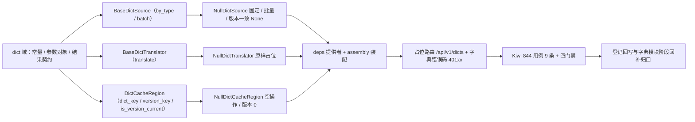

# 字典取数与缓存契约基座实施记录

> 项目骨架 · 02 后端基座 · 04 跨阶段基座 · 17 字典取数与缓存契约基座 · 实施记录

[文档首页](../../../../../../../文档首页.md) › [02-4-17 字典取数与缓存契约基座](../02_后端基座_04_跨阶段基座_17_字典取数与缓存契约基座.md) › 01 实施　|　[← 父任务](../02_后端基座_04_跨阶段基座_17_字典取数与缓存契约基座.md)

## 1. 实施信息 <a id="meta"></a>

| 项 | 值 |
| --- | --- |
| 任务 | [17 字典取数与缓存契约基座](../02_后端基座_04_跨阶段基座_17_字典取数与缓存契约基座.md) |
| 对应需求 | [02-44](../../../../../需求/02_需求_后端基座.md#r02-44) |
| 详细设计 | [17_详细设计_01_字典取数与缓存契约基座](../设计/17_详细设计_01_字典取数与缓存契约基座.md) |
| 实施日期 | 2026-09-20 |
| 实施人 | minjian |
| 实施环境 | 开发机（Ubuntu，Python 3.14 / uv） |
| 提交 | `feat(后端基座): 字典取数与缓存契约基座（取数/翻译/缓存域三契约、空实现、字典错误码、占位路由）` |
| 结论 | 完成 |

## 2. 实施概览 <a id="overview"></a>



结果小结：字典能力域三契约与占位实现落地（取数 `BaseDictSource` / 翻译 `BaseDictTranslator` / 缓存域 `DictCacheRegion`），参数对象与结果契约、四常量、字典错误码 `40101`~`40103`、占位路由 `/api/v1/dicts` 就位；应用可启动、提供者可解析；`pytest` / `ruff` / `pyright` / 基座校验全绿，新增模块覆盖率 100%。

## 3. 实施过程 <a id="process"></a>

1. **字典能力域**：新增 `app/dict/`——常量 `DICT_CACHE_DOMAIN`（dict）、`DICT_STATUSES`（enabled / disabled）、`DICT_PROBE_LIMIT`（2001）、`NULL_DICT_VERSION`（1），默认语言复用 i18n `DEFAULT_LOCALE`；参数对象 `DictQuery` / `DictBatchQuery` / `DictTranslateQuery`；结果契约 `DictItem`（`value` / `label` / `code` / `parent_id` / `sort` / `status` / `color`）/ `DictTypeResult`（`version` / `items` / `has_more` / `total`）/ `DictBatchResult`（`version` / `items`）。
2. **取数契约**：`BaseDictSource`（`key = plugin_key = "dict_source"`；异步 `by_type(DictQuery)`：版本比对 / 关键字 / 级联父值 / 按值子集 / 上限与 `has_more`；`batch(DictBatchQuery)`：多类型合并）。
3. **翻译契约**：`BaseDictTranslator`（`key = plugin_key = "dict_translator"`；异步 `translate(DictTranslateQuery)`，与取数共用同一份 L1 缓存）。
4. **缓存域契约**：`DictCacheRegion`（`key = plugin_key = "dict_cache_region"`，继承 `CacheRegion` 固定 `domain="dict"`）——`dict_key(tenant, locale, dict_type)`（`bms:{tenant}:dict:{locale}:{type}`）/ `version_key(tenant)`（`bms:{tenant}:dict:version`）/ `is_version_current(version, *, tenant)`；真实 L1 双 Region 随通用能力阶段继承本类回补。
5. **缺省实现**：`app/dict/null.py`——`NullDictSource`（固定两条条目、版本一致 `items=None`、按条件过滤与 `limit` 截断）、`NullDictTranslator`（value → 占位标签）、`NullDictCacheRegion`（读恒未命中 / 写删空操作 / 版本 0）；均不连库、不连 Redis。
6. **错误码登记**：`app/core/error_codes.py` 增 `DICT_SOURCE_UNAVAILABLE=40101` / `DICT_TYPE_NOT_FOUND=40102` / `DICT_LOCALE_UNSUPPORTED=40103`（系统配置段 `4xxxx` 下 `401xx` 子段）。
7. **装配与依赖注入**：`app/core/config.py` 增 `dict_source` / `dict_translator` / `dict_cache_region` 三 `PluginSelection`；`app/core/assembly.py` 的 `_NULL_MODULES` 增 `app.dict.null`、`PLUGIN_WIRINGS` 增三条接线；`app/api/deps.py` 导出三提供者。
8. **占位路由**：新增 `app/api/dict.py`——`BaseRouter(key="dict", prefix="/dicts", …)`，`dependencies=[Depends(require_auth)]`；`GET /dicts/{dict_type}`（版本 / 关键字 / 级联父值 / `values` 逗号分隔 / 上限）、`POST /dicts/batch`（`DictBatchQuery` 请求体）；`translate` 不暴露路由；`app/api/router.py` 登记 `dict`。
9. **测试**：新增 `tests/dict/test_dict.py`（9 条 Kiwi 844：契约 / 常量与数据契约 / 错误码 / 空实现固定批量翻译 / 缓存 key 与版本 / 依赖解析 / 占位路由 / 内存实现 + 路由）。
10. **Kiwi 登记**：已在 mjbk Kiwi TCMS（分类「平台骨架」、P2、CONFIRMED、标签「自动化」）登记用例 **844「02-4-17 字典取数与缓存契约基座（取数 / 翻译 / 缓存域三契约、空实现、错误码、占位路由）」**（2026-09-20），与 `@pytest.mark.kiwi_id(844)` 一致。
11. **门禁伴随修正**：既有护栏用例清单补新能力域——`tests/crosscut/test_plugin_registration.py` 的 `_EXPECTED_PLUGIN_KEYS` 增 `dict_cache_region` / `dict_source` / `dict_translator`；`tests/api/test_router_base.py` 的路由键断言增 `dict`。
12. **登记回写**：架构 09「错误码分段」/ 07「字典与系统参数管理」、《后端基类清单》§7 / §9 / §10、《后端开发规范》§3.1、计划 §2 / §3 / §3.1、需求 02-44 注块、任务 / 父任务状态回写。

关键命令：

```bash
uv run pytest --cov=app -q
uv run ruff check .
uv run ruff format --check .
uv run pyright
python3 scripts/tools/base-check/check-base.py .            # bms 根目录
python3 scripts/tools/base-check/check-backend-base.py .    # bms 根目录
```

## 4. 问题与处置 <a id="issues"></a>

| 问题 / 现象 | 原因 | 处置与落点 |
| --- | --- | --- |
| `tests/crosscut/test_plugin_registration.py` 与 `tests/api/test_router_base.py` 3 条用例失败 | 护栏用例维护「能力域插件键清单 / 路由键清单」，新能力域未纳入 | 两文件清单补 `dict_source` / `dict_translator` / `dict_cache_region` / `dict`（本任务随代码提交） |
| 三契约的 `dict_translator` / `dict_cache_region` 提供者与 `NullDictCacheRegion` 的 `set` / `delete` 无路由触达 | 仅取数契约被路由引用；翻译 / 缓存提供者与空缓存写删无入口 | 依赖解析用例显式调用三提供者（伪 `Request`）+ 缓存用例补 `get` / `set` / `delete` / `get_global_version` 断言，新增模块覆盖率回到 100% |
| `pyright` strict 下 `DictBatchResult.items` 的 `default_factory` 泛型字符串写法告警 | 泛型下标字符串在 `Field` 默认工厂处不被接受 | 改为 `default_factory=dict`，字段类型注解保留 `dict[str, DictTypeResult | None]` |

## 5. 验证结果 <a id="verify"></a>

| 完成标准 | 验证方法 | 实测结果 |
| --- | --- | --- |
| 接口 / 抽象声明就位、可被上层引用 | 三契约落地 + 继承 / 契约断言 | 通过 |
| 版本比对语义可核对 | `items=None`（版本一致）/ `()`（空字典）/ 非空三态 + 空实现 + 路由断言 | 通过 |
| 批量合并契约可核对 | `batch(DictBatchQuery)` → `DictBatchResult` + 空实现按类型 + 路由 | 通过 |
| 级联 / 按值子集 / 探针 | `DictQuery.parent_id` / `values` / `limit` + `DICT_PROBE_LIMIT` + `has_more` | 通过 |
| 缓存契约 | `DictCacheRegion` 固定 `domain="dict"` + key / 版本判定 + 02-13 承接 | 通过 |
| 错误码登记 | `ErrorCode` `40101`~`40103` + 架构 09 错误码段 | 通过 |
| 依赖注入可解析、应用可启动不报错 | `ApplicationFactory` / `assembly` 装配三空实现 + 提供者解析用例 + 应用冒烟 + 占位路由 | 通过 |
| 占位实现固定 / 批量 / 翻译 | 三空实现；无字典表读写 / Redis / L1 / 真实翻译 | 通过 |
| 登记齐备 | 架构 09 / 07、《后端基类清单》§7 / §9 / §10、《后端开发规范》§3.1、计划 §2 / §3 / §3.1 | 已登记 |
| 无 lint / 类型错误 | `pytest -q` / `ruff check` / `ruff format --check` / `pyright` | 641 passed, 8 skipped / All checks passed / 327 files already formatted / 0 errors |
| 基座校验 | `check-base.py` / `check-backend-base.py` | 均通过（跨层引用 0、清单一致、继承链 262 条对齐、错误码段位合规） |

## 6. 偏差与遗留 <a id="deviations"></a>

- **偏差**：无（按详细设计实施；拆两契约 + 独立缓存域契约、统一参数对象、包装结果契约、`items=None` 版本语义、`401xx` 三码、占位路由 `/api/v1/dicts`，均按用户拍板）。
- **遗留归口（已登记，随对应阶段销项）**：
  - 真实取数（`sys_dict_type` / `sys_dict_item` / `_i18n` 查询、关键字命中列、级联展开、按值子集、探针截断）→ **通用能力·字典模块阶段**；已登记计划 §3.1「字典真实取数与缓存」行；实现期要点见需求 02-44 `> 注：` 块。
  - 真实缓存（Redis 读写与三防、`INCR` 版本键、L1 双 Region 与版本惰性比对、写路径删 key + 版本递增）与后端翻译真实实现（缺失 values 批量 IN 回填）→ **通用能力阶段**（L1 承接取 02-13）。
  - 高级查询（`advanced-query` / `attrs` / `query-providers` / `query-schemes`、`sys_dict_attr` / `attr_json` / `sys_query_scheme`）→ 02-4-9 / 02-4-20 已交付契约，真实执行随表单定制 / 通用能力阶段。
  - 权限码 `dict:manage` / `dict:query-scheme`、接口级限流、错误码真实抛错分支 → **RBAC / 字典模块阶段**。
  - 真实字典用例（关键字 / 级联 / 按值 / 超大字典 / 版本失效）→ 回补阶段补充。
- **Kiwi 平台登记**：已完成（2026-09-20）：用例 844 登记于 mjbk Kiwi TCMS（分类「平台骨架」、P2、CONFIRMED、标签「自动化」），与 `@pytest.mark.kiwi_id(844)` 一致。
- **处理偏差与遗留（2026-09-20 闭环）**：计划 §3.1 新增「字典真实取数与缓存」行（出处 02-4-17）；需求 02-44 `> 注：` 块补齐实现期要点（字典表 / 缓存 / 版本 / 翻译 / 高级查询边界 / 权限码 / 错误码）；消费方（通用能力·字典模块、通用能力、表单定制、RBAC、前端 06_06 / 07_05）已在计划与需求注块登记去向。
- **结论**：本任务遗留已全部登记去向，偏差与遗留处理完成。

> 本文档依《文档生成规范》编写
