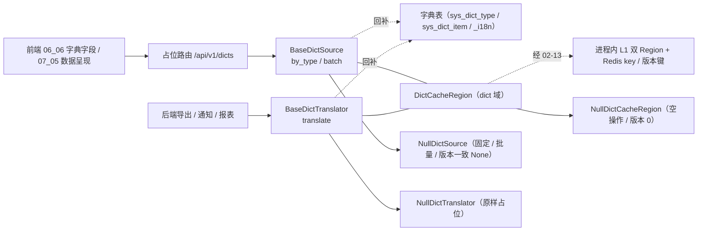

# 字典取数与缓存契约基座详细设计

> 项目骨架 · 02 后端基座 · 04 跨阶段基座 · 17 字典取数与缓存契约基座 · 详细设计

[文档首页](../../../../../../../文档首页.md) › [02-4-17 字典取数与缓存契约基座](../02_后端基座_04_跨阶段基座_17_字典取数与缓存契约基座.md) › 01 详细设计　|　[← 父任务](../02_后端基座_04_跨阶段基座_17_字典取数与缓存契约基座.md)

## 1. 概述 <a id="overview"></a>

- **目标**：落地「字典取数与缓存契约基座」——新建独立能力域 `app/dict/`：取数契约 `BaseDictSource`（`by_type` / `batch`）、翻译契约 `BaseDictTranslator`（`translate`）与缓存扩展契约 `DictCacheRegion`（`dict_key` / `version_key` / `is_version_current`）；缺省实现 `NullDictSource` / `NullDictTranslator` / `NullDictCacheRegion`（固定 / 批量 / 原样占位）；参数对象 `DictQuery` / `DictBatchQuery` / `DictTranslateQuery`；结果契约 `DictItem` / `DictTypeResult` / `DictBatchResult`；常量 `DICT_CACHE_DOMAIN` / `DICT_STATUSES` / `DICT_PROBE_LIMIT`；字典错误码 `40101`~`40103`；配置分区 `dict_source` / `dict_translator` / `dict_cache_region`、装配接线与占位路由 `/api/v1/dicts`。
- **范围**：`app/dict/`（新增）、`app/api/dict.py`（新增占位路由）、`app/core/error_codes.py`、`app/core/config.py`、`app/core/assembly.py`、`app/api/deps.py`、`app/api/router.py`、单测；架构 09「错误码分段」/ 07「字典与系统参数管理」与「缓存架构」、《后端基类清单》§7 / §9 / §10、《后端开发规范》§3.1、计划 §3 / §3.1、需求 02-44 登记。
- **不含**（归后续阶段）：真实取数（`sys_dict_type` / `sys_dict_item` / `_i18n` 附表查询、关键字 / 级联 / 按值子集 / 探针）、真实 L1 双 Region 与 Redis 读写、写路径（删 key + `INCR` 版本键）、高级查询（`advanced-query` / `attrs` / `query-providers` / `query-schemes`，归 02-4-9 / 02-4-20）→ **通用能力·字典模块 / 表单定制阶段**；权限码 `dict:manage` / `dict:query-scheme` → **RBAC / 字典模块阶段**；字典 CRUD 端点 → 字典模块阶段。
- **依据**：需求 [02-44](../../../../../需求/02_需求_后端基座.md#r02-44)、《[架构设计 · 数据架构](../../../../../../../设计/架构设计/07_架构设计_数据架构.md)》「字典与系统参数管理」「缓存架构」节、《[架构设计 · 接口与集成](../../../../../../../设计/架构设计/09_架构设计_接口与集成.md)》「错误码分段」节、《[架构设计 · 后端基础类体系](../../../../../../../设计/架构设计/04_架构设计_后端基础类体系.md)》「阶段交付与跨阶段基座契约」节、《[后端基类清单](../../../../../../../后端基类清单.md)》「跨阶段基座」节、《[后端开发规范](../../../../../../../规范/后端开发规范.md)》「后端基座体系」节、[《概要设计 · 字典管理》](../../../../../../../设计/概要设计/09_概要设计_字典管理.md)、[《组件设计 · 字典字段》](../../../../../../../设计/组件设计/06_字段类/01_组件设计_字典字段/01_组件设计_字典字段.md)、前端冻结契约 [06 字典字段](../../../../../../04_前端组件库/任务/06_字段类/06_字段类_06_字典字段/06_字段类_06_字典字段.md)。

## 2. 现状与差距 <a id="gap"></a>

| 现状 | 差距 |
| --- | --- |
| 全库无 `BaseDictSource` / `BaseDictTranslator` / `DictCacheRegion`（检索零命中）；无 `app/dict/` 目录 | 前端字典字段（06_06）与数据呈现（07_05）需按类型取数、批量合并、级联过滤、标签回显与版本比对；后端业务翻译（导出 / 通知 / 报表）需微秒级零往返翻译；无统一出口则版本口径、缓存 key 与翻译语义发散 |
| 02-28 `BaseQueryProvider` / `BaseQueryProviderRegistry` 已就位（只覆盖字典高级查询执行） | 普通取数与缓存版本口径无统一契约；高级查询与普通取数边界需显式收口 |
| 02-13 `CacheRegion` 契约（`build_key` / `is_stale` / 版本号）已就位；`build_cache_key` 支持 `bms:{tenant}:{domain}:{key}` | 字典 key 规范（`{locale}:{type}` / `version`）与 L1 双 Region 承接无字典侧扩展点 |
| 02-4-16 / 19 / 20 / 21 / 22 / 23 已交付占位路由与「一域一目录」范式 | 新能力域无提供者与占位路由，「依赖注入可解析」无落点 |

## 3. 交付物清单 <a id="tree"></a>

```text
backend/
├── app/dict/__init__.py                    # 新增：能力域包（docstring 口径）
├── app/dict/base.py                        # 新增：常量 / 参数对象 / 结果契约 / 三契约 / DictCacheRegion / 提供者
├── app/dict/null.py                        # 新增：NullDictSource / NullDictTranslator / NullDictCacheRegion
├── app/api/dict.py                         # 新增：占位路由 /api/v1/dicts（BaseRouter）
├── app/core/error_codes.py                 # 修改：登记字典错误码 40101~40103
├── app/core/config.py                      # 修改：Settings 增 dict_source / dict_translator / dict_cache_region 分区
├── app/core/assembly.py                    # 修改：_NULL_MODULES 增 app.dict.null + PLUGIN_WIRINGS 增三条接线
├── app/api/deps.py                         # 修改：导出三提供者
├── app/api/router.py                       # 修改：登记 dict 路由
└── tests/
    └── dict/test_dict.py                   # 新增：Kiwi（契约 / 常量 / 数据契约 / 空实现 / 缓存 / 错误码 / 依赖解析 / 占位路由）

bms文档/
├── 设计/架构设计/09_架构设计_接口与集成.md            # 修改：「错误码分段」4xxxx 行补 401xx 子段 + 已发布码位补三码
├── 设计/架构设计/07_架构设计_数据架构.md              # 修改：「字典与系统参数管理」契约行补实现契约名与缓存 key / 版本语义
├── 后端基类清单.md                                    # 修改：§7 目录 + §9 占位行改已交付 + §10 继承链
├── 规范/后端开发规范.md                                # 修改：「后端基座体系」§3.1 补字典取数与缓存口径
├── 项目/01_项目骨架/计划/01_计划_项目骨架.md          # 修改：§2 已完成 + §3 剩余排期 + §3.1 后续阶段待办 + 进展统计
├── 项目/01_项目骨架/需求/02_需求_后端基座.md          # 修改：需求 02-44 补实现期要点注块
├── 项目/…/02_后端基座_04_跨阶段基座/…17….md           # 修改：参考文档补本设计 / 实施 / 测试链接，实施后回写状态
└── 项目/…/02_后端基座_04_跨阶段基座.md                # 修改：子任务清单 17 状态 / 完成日期回写
```

## 4. 字典能力域（`app/dict/`） <a id="contract"></a>

### 4.1 常量 <a id="constants"></a>

| 常量 | 值 | 说明 |
| --- | --- | --- |
| `DICT_CACHE_DOMAIN` | `"dict"` | 缓存域简称（`DictCacheRegion.domain`；key `bms:{tenant}:dict:...`） |
| `DICT_STATUSES` | `("enabled", "disabled")` | 条目状态（对齐《数据架构》`status` 口径） |
| `DICT_PROBE_LIMIT` | `2001` | 探针条数上限（前端首次以 `limit=2001` 判别大小字典；对齐 06_06 阈值 2000） |
| `NULL_DICT_VERSION` | `1` | 占位全局版本号（空实现固定下发，供版本比对断言） |
| `DEFAULT_DICT_LOCALE` | 复用 `app.i18n.base.DEFAULT_LOCALE`（`zh-CN`） | 默认语言（不另立常量，避免跨域口径漂移） |

> `DictQuery`（单类型）不带 locale：`GET /dicts/{type}` 的语言由实现从请求上下文（`Accept-Language`，经 02-4-14 `BaseTranslator.resolve_locale`）解析；`DictBatchQuery` / `DictTranslateQuery` 显式带 `locale`。

### 4.2 数据契约 <a id="data"></a>

| 契约 | 字段 | 说明 |
| --- | --- | --- |
| `DictQuery` | `dict_type` / `version`（可空） / `keyword`（可空） / `parent_id`（可空） / `values`（可空） / `limit`（可空） | 单类型取数参数对象 |
| `DictBatchQuery` | `types` / `version`（可空） / `locale`（默认 `DEFAULT_LOCALE`） | 批量合并取数参数对象 |
| `DictTranslateQuery` | `dict_type` / `values` / `locale`（默认 `DEFAULT_LOCALE`） | 后端翻译参数对象 |
| `DictItem` | `value` / `label` / `code` / `parent_id`（可空） / `sort` / `status` / `color`（可空） | 条目（对齐《概要设计 · 字典管理》接口条目字段；不含 `attr_json`） |
| `DictTypeResult` | `version` / `items`（可空，`None`＝版本一致） / `has_more` / `total` | 单类型结果 |
| `DictBatchResult` | `version` / `items`（`Mapping[str, DictTypeResult \| None]`，`None`＝该类型版本一致） | 批量结果 |

- 参数对象与结果契约全部继承 `BaseSchema`（JSON 友好、跨端易演进）；`DictItem.status` 取 `DICT_STATUSES`；`DictItem.parent_id` 为**级联父值**（引用父条目 `value`，对齐 06_06「传入级联父值…携带 `parent_id=父值`」）。
- `DictTypeResult.items` 三态语义：`None`＝版本一致（前端复用本地缓存）；`()`＝确无数据（已查，空字典）；非空＝条目集。
- `DictBatchResult.items` 的内层复用 `DictTypeResult`（其 `version` 与批量全局 `version` 同值，冗余但契约复用；`None` 表示该类型版本一致）。
- `DictItem` 只承载普通运行时链路字段；扩展属性 `attr_json` 与属性 schema 归高级查询接口（02-4-9 / 02-4-20），不进普通缓存链路（对齐《数据架构》4.1 与 06_06 8.3/8.4）。

### 4.3 契约 <a id="methods"></a>

| 契约 | 键 | 方法 | 语义 |
| --- | --- | --- | --- |
| `BaseDictSource` | `dict_source` | `async by_type(query: DictQuery) -> DictTypeResult` | 单类型取数：版本比对（一致 `items=None`）/ 关键字模糊（label / value / code，命中列实现侧定义）/ 级联父值过滤 / 按值子集 / 条数上限与 `has_more` / `total` |
| `BaseDictSource` | `dict_source` | `async batch(query: DictBatchQuery) -> DictBatchResult` | 批量合并取数：一次返回多类型（表单页 100 字段合并 1 次请求）；版本一致的类型 `items=None`；每类型统一探针截断（`limit=DICT_PROBE_LIMIT`） |
| `BaseDictTranslator` | `dict_translator` | `async translate(query: DictTranslateQuery) -> Mapping[str, str]` | 后端翻译（value → label，当前 locale）：供导出 / 通知 / 报表 / 审批 / 明细行批量；与取数**共用同一份 L1 缓存**，缺失 values 一次 IN 查询回填、防 N+1 |
| `DictCacheRegion` | `dict_cache_region` | `dict_key(tenant, locale, dict_type)` / `version_key(tenant)` / `is_version_current(version, *, tenant)` | 字典缓存扩展点：固定 `domain="dict"`，提供 key 拼接与版本判定；真实 L1 双 Region（小字典整类型 + 超大字典局部子集）随通用能力阶段继承本类回补 |
| 提供者 | — | `get_dict_source` / `get_dict_translator` / `get_dict_cache_region` | 依赖注入提供者（应用级单例；公共依赖经 `app/api/deps.py` 统一导出） |

### 4.4 缓存契约 <a id="cache"></a>

| 项 | 设计 |
| --- | --- |
| 类型缓存 key | `bms:{tenant}:dict:{locale}:{type}`（`DictCacheRegion.dict_key`，经 02-13 `build_key(business_key=f"{locale}:{type}")`） |
| 全局版本键 | `bms:{tenant}:dict:version`（`DictCacheRegion.version_key`，`build_key(business_key="version")`）；写路径 `INCR` 由字典模块实现，本基座只提供 key |
| 版本比对 | `by_type` 的 `version` 与当前全局版本一致 → `items=None`；`is_version_current(version, tenant)` 封装 `not is_stale(version_key(tenant), version)` |
| L1 承接 | 进程内 L1 经 02-13 `CacheRegion` 承载；`DictCacheRegion` 为其字典域扩展子类，真实双 Region 随通用能力阶段回补（§13） |
| 租户 / 语言 | key 含租户前辍与 locale，租户间天然隔离、多语言分键；全 key 带 TTL、三防由 02-13 统一 |
| 降级 | Redis 故障时降级直连 DB 并始终返回全量 `items`（版本比对仅作优化，不作正确性兜底）——实现侧口径 |

### 4.5 口径 <a id="semantics"></a>

| 情形 | 处置 |
| --- | --- |
| 同步性 | 全部**异步**（真实实现为异步 DB / 缓存访问，回补时调用面零改动） |
| 租户隔离 | 契约方法不显式传租户参数；实现侧从请求上下文与 02-13 拼接 key，**调用方不可绕过** |
| 版本比对 | 只承担「缓存是否新鲜」判断，不承担数据正确性兜底；一致返 `items=None`，不一致返全量 `items` + 新版本 |
| 级联 | `parent_id` 为父条目 `value`；父级变化由前端清空重载（06_06 4.4） |
| 按值子集 | `values` 仅返回指定 value 的条目（超大字典列批量翻译用）；未命中 value **不占位**（与组织回显不同） |
| 空字典 / 超大字典 | 空字典返 `items=()`；超过 `limit` 置 `has_more=True`（探针 `DICT_PROBE_LIMIT`） |
| 翻译 | 与取数共用 L1 缓存；未命中走批量 IN 回填（防 N+1）；label 缺失回退主表默认 label；仅服务后端场景，列表 / 表单 label 由前端标签翻译完成 |
| 高级查询边界 | 扩展属性与条件查询经 02-28 查询提供者、方案经 02-4-20；本域只承载普通取数与翻译，不重复建设 |
| 错误码 | 字典错误码 `40101`~`40103` 统一登记于 `app/core/error_codes.py`；占位期**不抛**，真实抛错随字典模块阶段 |
| 不实现真实能力 | 不连库、不连 Redis、不做真实缓存 / 翻译；三空实现固定返回 |



## 5. 错误码登记（`app/core/error_codes.py`） <a id="errors"></a>

在 `ErrorCode` 增字典错误码（系统配置段 `4xxxx` 下的 `401xx` 子段）：

| 码位 | 名称 | 说明 |
| --- | --- | --- |
| `40101` | `DICT_SOURCE_UNAVAILABLE` | 字典数据源不可用（取数失败 / 缓存与库均不可达） |
| `40102` | `DICT_TYPE_NOT_FOUND` | 字典类型不存在（未注册 / 已删除） |
| `40103` | `DICT_LOCALE_UNSUPPORTED` | 不支持的语言（不在 `SUPPORTED_LOCALES`） |

- 本任务只登记码位常量，真实抛错分支随字典模块阶段；架构 09「错误码分段」同步登记 `401xx` 子段与码位。

## 6. 占位路由（`app/api/dict.py`） <a id="route"></a>

`router = BaseRouter(key="dict", prefix="/dicts", tags=["dict"], dependencies=[Depends(require_auth)])`——基于 02-6-1 路由基座，统一挂载到 `/api/v1`：

| 方法 | 路径 | 入参 | 响应 | 口径 |
| --- | --- | --- | --- | --- |
| GET | `/api/v1/dicts/{dict_type}` | `version`、`keyword`、`parent_id`、`values`（逗号分隔）、`limit` | `DictTypeResult` | 组装 `DictQuery` → `by_type(...)`；占位固定两条，版本一致 `items=null` |
| POST | `/api/v1/dicts/batch` | body `DictBatchQuery`（`types` / `version` / `locale`） | `DictBatchResult` | 直接委托 `batch(...)`；占位按类型固定 |

- 结果契约（`BaseSchema`）直接作为响应体数据；`POST /dicts/batch` 以 `DictBatchQuery` 作为请求体（查询参数经 FastAPI `Query` 绑定）。
- `translate` **不暴露路由**（后端服务层专用，经 `BaseDictTranslator` 契约取用）。
- 高级查询（`advanced-query` / `attrs` / `query-providers` / `query-schemes`）归 02-4-9 / 02-4-20，本路由不重复建设。
- **登录即可**（无权限码）：占位期经 `Depends(require_auth)`（恒定放行）；`dict:manage` / `dict:query-scheme` 与接口级限流随字典模块 / RBAC 阶段。

## 7. 应用装配与依赖注入 <a id="di"></a>

| 位置 | 变更 |
| --- | --- |
| `app/core/config.py` | `Settings` 增 `dict_source` / `dict_translator` / `dict_cache_region` 三个 `PluginSelection`（未配置 → 解析到 `null`） |
| `app/core/assembly.py` | `_NULL_MODULES` 增 `app.dict.null`（导入即自动登记）；`PLUGIN_WIRINGS` 增三条接线（`state_attr` 同名） |
| `app/api/deps.py` | 导出 `get_dict_source` / `get_dict_translator` / `get_dict_cache_region` |
| `app/api/router.py` | 模块列表增 `dict`（登记路由 → 统一挂载 `/api/v1`） |

提供者均为普通同步函数（取装配 settings 解析单例，无 IO）；真实实现替换占位时调用面零改动。

## 8. 继承与分层 <a id="base"></a>

- `BaseDictSource` / `BaseDictTranslator` → `BasePluggable` → `BaseCapability` → `BaseObject`。
- `DictCacheRegion` → `CacheRegion` → `BasePluggable` → `BaseCapability` → `BaseObject`（抽象，固定 `domain="dict"`）。
- `NullDictSource` / `NullDictTranslator` → 对应契约 + `BaseNullObject` → `BasePlaceholder` → `BaseObject`；`NullDictCacheRegion` → `DictCacheRegion` + `BaseNullObject`。
- 参数对象 / 结果契约 `DictQuery` / `DictBatchQuery` / `DictTranslateQuery` / `DictItem` / `DictTypeResult` / `DictBatchResult` → `BaseSchema`。

## 9. 登记落点 <a id="register"></a>

| 落点 | 登记内容 |
| --- | --- |
| 《架构设计 · 接口与集成》「错误码分段」节 | `4xxxx` 行补 `401xx` 字典取数子段；「平台已发布码位」补 `40101`~`40103` |
| 《架构设计 · 数据架构》「字典与系统参数管理」节 | 「字典取数契约」行补实现契约名（`BaseDictSource` / `BaseDictTranslator` / `DictCacheRegion`）、参数对象与结果契约、版本三态与缓存 key 口径 |
| 《后端基类清单》§7 目录 | 横切扩展能力域补 `app/dict/` |
| 《后端基类清单》§9 跨阶段基座 | 把「字典取数（待实施）」行改为已交付行（三契约 / 空实现 / 数据契约 / 常量 / 错误码 / 占位路由 / 状态） |
| 《后端基类清单》§10 继承链 | 补两条：`NullDictSource` / `NullDictTranslator` → 对应契约 → `BasePluggable` → `BaseCapability` → `BaseObject`；`NullDictCacheRegion` → `DictCacheRegion` → `CacheRegion` → `BasePluggable` → `BaseCapability` → `BaseObject` |
| 《后端开发规范》「后端基座体系」§3.1 | 补口径：字典普通取数（按类型 / 批量 / 级联 / 按值子集 / 版本比对）与后端翻译一律经 `app/dict/` 三契约，L1 经 02-13 `CacheRegion`，**禁止各模块直连字典表、自建字典缓存或平行翻译实现** |
| 计划《01_计划_项目骨架》§2 / §3 / §3.1 | 02-4-17 移入已完成（状态 / 日期）；§3.1 增「字典真实取数与缓存」行 + 02_04 偏差跟踪；进展统计回写 |
| 需求 [02-44](../../../../../需求/02_需求_后端基座.md#r02-44) | 补 `> 注：实现期要点` 块 |
| 02-4-17 任务文档 | 参考文档补本设计 / 实施 / 测试链接；实施后回写状态 / 完成日期 |

## 10. 测试设计（Kiwi 先行） <a id="tests"></a>

用例**先登记 Kiwi TCMS 再编码**；本任务新分配一条用例（分类「平台骨架」/ 优先级 `P2` / 状态 `CONFIRMED` / 标签「自动化」；平台登记后回填编号，题面与平台一致）：

| 用例 | 断言要点 | 自动化文件 |
| --- | --- | --- |
| 契约继承与能力域标识 | 三契约 → `BasePluggable` / `BaseCapability`；`DictCacheRegion` → `CacheRegion` 且 `domain="dict"`；三空实现 → `BaseNullObject`；`key` / `plugin_key` / `placeholder` | `tests/dict/test_dict.py` |
| 常量与数据契约 | 四常量取值；`DictItem` 字段集与默认；`DictQuery` / `DictBatchQuery` / `DictTranslateQuery` 字段与默认 locale；结果契约默认（`items=None` / `has_more=False`） | 同上 |
| 空实现固定 / 批量 / 翻译 | `by_type` 固定两条、版本一致 `items=None`、`values` / `keyword` / `parent_id` / `limit` 过滤与 `has_more`；`batch` 按类型固定与版本一致；`translate` 按 values 原样占位 | 同上 |
| 缓存 key 与版本判定 | `dict_key` / `version_key` 拼接；`is_version_current` 与占位版本 0 判定 | 同上 |
| 错误码登记 | `ErrorCode` 含 `40101`~`40103` 且取值正确 | 同上 |
| 依赖解析 | `create_app()` 装配三空实现；`resolve_plugin(...)` 同一实例 | 同上 |
| 占位路由 | `GET /dicts/{type}` 固定返回、版本一致 `items=null`、`values` 过滤；`POST /dicts/batch` 按类型返回 | 同上 |
| 内存实现 + 路由 | 测试内存实现替换提供者：参数透传、版本比对、批量、翻译 | 同上 |

回归：全量 `pytest`（含接口冒烟）。

## 11. 实施步骤 <a id="steps"></a>

1. 新增 `app/dict/`（常量 / 参数对象 / 结果契约 / 三契约 / `DictCacheRegion` / 三空实现 / 三提供者）。
2. `app/core/error_codes.py` 登记字典错误码 `40101`~`40103`。
3. `app/core/config.py` / `app/core/assembly.py` / `app/api/deps.py` / `app/api/dict.py` / `app/api/router.py` 装配与占位路由。
4. 测试：先登记 Kiwi，再写 `tests/dict/test_dict.py`。
5. 登记：架构 09 / 07、《后端基类清单》§7 / §9 / §10、《后端开发规范》§3.1、计划 §2 / §3 / §3.1、需求 02-44 注块、任务 / 父任务状态。
6. 验证：`pytest --cov=app`、`ruff check` / `ruff format --check` / `pyright` 全绿；`check-base.py` / `check-backend-base.py` 通过。
7. 回写：实施 / 测试记录 + 任务（02-4-17、02_04）状态、计划表。
8. 收尾：按「处理偏差与遗留」套路闭环后提交（推送另议）。

## 12. 验收映射 <a id="accept-map"></a>

| 完成标准（需求 02-44 / 任务 02-4-17） | 验证方式 |
| --- | --- |
| 接口 / 抽象声明就位、可被上层引用 | `BaseDictSource`（by_type / batch）+ `BaseDictTranslator`（translate）+ `DictCacheRegion` + Kiwi 用例 |
| 版本比对语义可核对 | `items=None`（版本一致）vs `()`（空字典）三态 + 空实现版本一致返 `None` + 路由断言 |
| 批量合并契约可核对 | `batch(DictBatchQuery)` → `DictBatchResult{version, items: {type: ...}}` + 空实现按类型 + 路由 |
| 级联 / 按值子集 / 探针 | `DictQuery.parent_id` / `values` / `limit` + `DICT_PROBE_LIMIT` + 空实现过滤 + `has_more` |
| 缓存契约 | `DictCacheRegion` 固定 `domain="dict"` + `dict_key` / `version_key` / `is_version_current` + 02-13 承接 |
| 错误码登记 | `ErrorCode` `40101`~`40103` + 架构 09 错误码段 |
| 依赖注入可解析、应用可启动不报错 | 装配三空实现 + 提供者解析用例 + 应用冒烟 + 占位路由 |
| 占位实现固定 / 批量 / 翻译 | 三空实现；无真实 DB / Redis / 缓存 / 翻译 |
| 不实现真实能力 | 无字典表读写、无真实缓存 / INCR / 高级查询 |
| 登记齐备 | 架构 09 / 07、《后端基类清单》§7 / §9 / §10、《后端开发规范》§3.1、计划 §2 / §3 / §3.1 |
| 无 lint / 类型错误 | `ruff check` / `ruff format --check` / `pyright` |

## 13. 边界与开放项 <a id="boundary"></a>

- **真实取数**（`sys_dict_type` / `sys_dict_item` / `_i18n` 查询、关键字命中列、级联展开、按值子集、探针截断）→ **通用能力·字典模块阶段**。
- **真实缓存**（Redis 读写与 TTL / 三防、`INCR` 版本键、L1 双 Region：小字典整类型 + 超大字典局部子集与版本惰性比对）→ **通用能力阶段**；本任务只固化 key 规范、版本语义与 `DictCacheRegion` 扩展点。
- **写路径**（字典 / 参数变更删 key + `INCR`）→ 字典模块阶段；本基座只读，不建表、不写库。
- **后端翻译真实实现**（L1 零往返、缺失 values 批量 IN 回填、label 缺失回退）→ 通用能力阶段；本任务只固化契约与共用缓存口径。
- **高级查询**（`advanced-query` / `attrs` / `query-providers` / `query-schemes`、`sys_dict_attr` / `attr_json` / `sys_query_scheme`）→ 02-4-9 / 02-4-20 已交付契约，真实执行随表单定制 / 通用能力阶段。
- **权限码 `dict:manage` / `dict:query-scheme`** 与接口级限流 → RBAC / 字典模块阶段；占位 `require_auth` 恒定放行。
- **错误码真实抛错分支**（数据源不可用 / 类型不存在 / 语言不支持）→ 字典模块阶段；本任务只登记码位常量。
- **测试**：真实字典用例（关键字 / 级联 / 按值 / 超大字典 / 版本失效）随回补阶段补充。

## 14. 对齐记录 <a id="align"></a>

| # | 事项 | 结论 |
| --- | --- | --- |
| 1 | 代码落点 | 新建独立能力域 `app/dict/`（用户拍板） |
| 2 | 契约结构 | **拆两契约**：取数 `BaseDictSource`（`by_type` / `batch`）+ 翻译 `BaseDictTranslator`（`translate`）（用户拍板） |
| 3 | 参数形态 | **统一参数对象**：`DictQuery` / `DictBatchQuery` / `DictTranslateQuery`（分三个参数对象）（用户拍板） |
| 4 | 结果契约 | 包装结果：`DictTypeResult{version, items, has_more, total}` + `DictBatchResult{version, items}`；`translate → Mapping[str, str]`（用户拍板） |
| 5 | 条目字段 | `DictItem`：`value` / `label` / `code` / `parent_id` / `sort` / `status` / `color`；不含 `attr_json`（用户拍板） |
| 6 | 缓存承载 | **`DictCacheRegion` 抽象子类**（固定 `domain="dict"` + `dict_key` / `version_key` / `is_version_current`）+ 独立 `NullDictCacheRegion` + 插件键 `dict_cache_region`（用户拍板） |
| 7 | 版本语义 | `items=None`＝版本一致；`items=()`＝空字典；非空＝条目集（用户拍板） |
| 8 | 错误码 | **新增** `401xx` 子段三码 `40101`~`40103`（用户拍板） |
| 9 | 占位路由 | `/api/v1/dicts`：`GET /dicts/{type}` + `POST /dicts/batch`；`translate` 无路由；高级查询归 02-4-9 / 02-4-20（用户拍板） |
| 10 | 表声明 | **不新增**（字典表归通用能力·字典模块，本基座只读出口）（用户拍板） |
| 11 | 常量 | 复用 i18n `DEFAULT_LOCALE`；新增 `DICT_CACHE_DOMAIN` / `DICT_STATUSES` / `DICT_PROBE_LIMIT`（用户拍板） |
| 12 | 认证 | 占位路由经 `require_auth`（恒定放行）；权限码随字典模块 / RBAC（用户拍板） |
| 13 | 测试 | 新登记一条 Kiwi 用例（平台登记 + `@pytest.mark.kiwi_id(<编号>)`）（用户拍板） |
| 14 | 工时 / 窗口 | 4h；阶段一补做窗口序 7（2026-09-20） |
| 15 | 交付范围 | 一条龙（设计 / 实施 / 测试 / 登记 / 记录 / 提交 / 偏差遗留 / 收尾） |

> 本文档依《文档生成规范》编写 · 关键决策逐项确认
