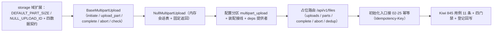

# 对象存储扩展基座实施记录

> 项目骨架 · 02 后端基座 · 04 跨阶段基座 · 18 对象存储扩展基座 · 实施记录

[文档首页](../../../../../../../文档首页.md) › [02-4-18 对象存储扩展基座](../02_后端基座_04_跨阶段基座_18_对象存储扩展基座.md) › 01 实施　|　[← 父任务](../02_后端基座_04_跨阶段基座_18_对象存储扩展基座.md)

## 1. 实施信息 <a id="meta"></a>

| 项 | 值 |
| --- | --- |
| 任务 | [02-4-18 对象存储扩展基座](../02_后端基座_04_跨阶段基座_18_对象存储扩展基座.md) |
| 对应需求 | [02-45](../../../../../需求/02_需求_后端基座.md#r02-45) |
| 详细设计 | [18_详细设计_01_对象存储扩展基座](../设计/18_详细设计_01_对象存储扩展基座.md) |
| 实施日期 | 2026-09-20 |
| 实施人 | minjian |
| 实施环境 | 开发机（Ubuntu，Python 3.14 / uv） |
| 提交 | 待提交 |
| 结论 | 完成 |

## 2. 实施概览 <a id="overview"></a>



结果小结：在 `02-17` 对象存储域上扩展分片上传与秒传判定契约（`BaseMultipartUpload` 五方法 + `MultipartInit` / `MultipartSession` / `MultipartPart` / `ExistingObjectRef` 四数据契约 + `DEFAULT_PART_SIZE` / `NULL_UPLOAD_ID` 常量 + `get_multipart_upload` 提供者），占位实现 `NullMultipartUpload` 以内存会话表承载会话语义（不落盘 / 不连 MinIO / 不判定秒传）；占位路由 `/api/v1/files` 五端点统一挂载，初始化入口按需求接 `02-25` 幂等基座；应用可启动、提供者可解析；`pytest` / `ruff` / `pyright` 与基座护栏全绿，新增模块覆盖率 100%。

## 3. 实施过程 <a id="process"></a>

1. **分片契约（`app/storage/base.py`）**：增常量 `DEFAULT_PART_SIZE`（5MB，S3 / MinIO 分片下限）、`NULL_UPLOAD_ID`；参数对象 `MultipartInit`（`key` / `size`（`gt=0`）/ `sha256` / `mime` / `part_size`（`gt=0`，缺省取常量））、结果契约 `MultipartSession`（`upload_id` / `key` / `part_size` / `total_parts`）、`MultipartPart`（`part_no` / `etag` / `size`）、秒传引用 `ExistingObjectRef`（`key` / `size` / `content_type` / `etag` / `stored_at`）；契约 `BaseMultipartUpload(BasePluggable)`（`key = plugin_key = "multipart_upload"`；异步 `initiate` / `upload_part` / `complete` / `abort` / `check`）与提供者 `get_multipart_upload`。
2. **占位实现（`app/storage/null.py`）**：新增 `NullMultipartUpload`——内存会话表（只记初始化入参与会话，不落盘）+ 固定返回：`initiate` 登记会话并返回 `NULL_UPLOAD_ID` 前缀递增标识（`total_parts = ceil(size / part_size)`）、`upload_part` 回显分片（etag 取 `NULL_ETAG`）、`complete` 回显会话 key / size 并结束会话、`abort` 清会话、`check` 恒未命中；未知会话 / 越界分片抛 `NotFoundError`（与真实实现口径一致）。
3. **路由契约（`app/schemas/storage.py`）**：新增 `MultipartInitiateRequest` / `MultipartSessionResponse` / `MultipartPartResponse` / `StoredObjectResponse` / `DedupResponse`（与能力域契约字段一一对应，路由内显式映射、不隐式透传字典）。
4. **装配与依赖注入**：`app/core/config.py` 增 `multipart_upload` 分区；`app/core/assembly.py` 增 `PluginWiring("multipart_upload", BaseMultipartUpload, "multipart_upload", "multipart_upload")`（`_NULL_MODULES` 无需增项——`app.storage.null` 已在列，占位类随既有导入自动登记）；`app/api/deps.py` 导出 `get_multipart_upload`；`app/api/router.py` 登记 `file` 路由。
5. **占位路由（`app/api/file.py`）**：`BaseRouter(key="file", prefix="/files", tags=["file"], dependencies=[Depends(require_auth)])`——`POST /api/v1/files/uploads`（初始化）、`PUT …/uploads/{upload_id}/parts/{part_no}`（分片，表单字段 `data`）、`POST …/uploads/{upload_id}/complete`（合并）、`DELETE …/uploads/{upload_id}`（取消）、`GET /api/v1/files/dedup`（秒传查询，`sha256` 校验 64 位小写十六进制、`size` 校验 > 0，非法抛 `ParamError`）。
6. **幂等接线**：初始化入口按需求 02-45 内容 2 接 `02-25` 幂等基座——读 `Idempotency-Key` 头（缺失即跳过）；首次经 `begin` → 委托 `initiate` → `save` 写首次会话；重复经 `load` 复用首次会话直接回响应（占位期 `NullIdempotencyStore` 恒首次、不缓存）。
7. **测试**：新增 `tests/storage/test_multipart.py`（Kiwi 845 共 11 条：契约与标识 / 常量 / 数据契约与校验 / 占位初始化会话 / 占位分片合并取消 / 异常处置 / 秒传恒定未命中 / 依赖解析与插件清单 / 占位五路由与异常分支 / 幂等接线 / 秒传命中响应映射）。
8. **前置契约适配**（消费方）：`tests/api/test_router_base.py` 默认登记表键期望值补 `file`；`tests/crosscut/test_plugin_registration.py` 的 `_EXPECTED_PLUGIN_KEYS` 补 `multipart_upload`（登记表 / 端口清单随能力域增长属预期，不改断言语义）。
9. **Kiwi 登记**：已在 mjbk Kiwi TCMS（分类「平台骨架」、P2、CONFIRMED、标签「自动化」）登记用例 **845「02-4-18 对象存储扩展基座：BaseMultipartUpload 五方法契约 / 数据契约与常量 / 占位会话语义与固定返回 / 依赖解析 / 占位路由与幂等接线」**（2026-09-20），与 `@pytest.mark.kiwi_id(845)` 一致。
10. **登记回写**：架构 20「分片状态机」补契约基座登记；《后端基类清单》§9「对象存储扩展」行由「待定」改为落点 + 契约 + 状态、§10 继承链补一条；《后端开发规范》§3.1 补分片上传与秒传强制口径（只写语义与强制口径）；计划 §1 / §2 / §3 / §3.1、需求 02-45 注块、任务 / 父任务状态回写。

**设计微调（实施中回写设计，见 §6）**：① `MultipartInit.part_size` 与路由请求契约同字段补 `gt=0`（防零除）；② `complete` / `abort` 后会话即失效（与合并 / 取消语义一致）；③ `abort` 对未知会话抛 `NotFoundError`（非「幂等空操作」，与 S3 / MinIO 语义一致）。

关键命令：

```bash
uv run pytest --cov=app -q
uv run ruff check .
uv run ruff format --check .
uv run pyright
python3 scripts/tools/base-check/check-base.py          # 需在 bms 根目录执行
python3 scripts/tools/base-check/check-backend-base.py  # 需在 bms 根目录执行
```

## 4. 问题与处置 <a id="issues"></a>

| 问题 / 现象 | 原因 | 处置与落点 |
| --- | --- | --- |
| 需求 02-45 原文 `initiate(size, sha256, mime)` 未含目标对象 key | 需求文本简化，与 S3 / MinIO `create_multipart_upload(bucket, key)` 语义不符（`complete` 无法确定目标对象） | 按详细设计（用户拍板）取「入参含 key、上层构造基座透传」；**回写需求 02-45 注块登记偏差**，并在任务「参考文档」标明 |
| 需求 02-45 要求「上传会话幂等键取 `02-25` 幂等存储」，而契约按「不加幂等参数」落 | 契约加幂等参数会与幂等基座职责重叠 | 幂等接线落**初始化占位路由**（读 `Idempotency-Key` → `begin` / `load` / `save`），契约只签名不感知幂等；用例以幂等存储替身断言调用面 |
| 占位实现原设计为「无状态固定返回」，`complete` 拿不到会话 key / size | 占位无状态时 `complete` 只能返回无意义键值 | 按用户拍板改为**内存会话表**（占位期带状态），`complete` 回显会话 key / size；内存表无 TTL / 无上限登记为占位期已知项（实施记录 §6 与设计 §12） |
| 架构 04 §4 / §8 未新增行 | 概念层已在「能力域全景」与「跨阶段基座契约（语义）」登记「对象存储扩展（分片 / 秒传）」，节点只写语义、实现侧细节归《后端基类清单》 | 架构 04 零改动（符合「架构节点只写架构语义」口径）；契约细节落《后端基类清单》§9 / §10 |
| 需求总览未回写状态 | 需求文档**不承载进度**（《计划文档规范》与 AI 开发规范口径） | 状态回写仅落任务与计划两处；详细设计 §8 已同步更正 |
| 全量 `pytest` 1 项失败（02-4-23 记录的 `tests/crosscut/test_m3_closure.py`） | **既有**历史失败项 | 本轮基线全绿、该失败不复现（`tests/crosscut` 45 passed），无需处置 |

## 5. 验证结果 <a id="verify"></a>

| 完成标准 | 验证方法 | 实测结果 |
| --- | --- | --- |
| 接口 / 抽象声明与职责边界就位 | `BaseMultipartUpload` 五入口 + 四数据契约 + Kiwi 845 用例 | 通过 |
| 职责边界登记 | 架构 20「分片状态机」+《后端基类清单》§9 / §10 +《后端开发规范》§3.1 | 已登记 |
| 依赖注入可解析、应用可启动不报错 | 装配单例 + 提供者解析用例 + 占位路由用例 + 应用冒烟 | 通过 |
| 幂等接线落点 | 初始化路由经 `02-25`（`begin` / `load` / `save`）+ 替身断言调用面 | 通过 |
| 不实现真实能力 | 无 MinIO 分片调用 / 无分片落盘、无秒传索引查询、无会话落库与状态机、无孤儿回收、无类型与大小校验实现 | 通过 |
| 登记齐备 | 架构 20、《后端基类清单》§9 / §10、《后端开发规范》§3.1、计划 §1 / §2 / §3 / §3.1、需求 02-45 注块 | 已登记 |
| 无 lint / 类型错误 | `uv run ruff check .` / `uv run ruff format --check .` / `uv run pyright` | All checks passed / 330 files already formatted / 0 errors |
| 基座护栏 | `check-base.py` / `check-backend-base.py` | 均通过 |
| 新增模块覆盖率 | `pytest --cov=app.storage --cov=app.schemas.storage --cov=app.api.file` | `storage/base.py` / `storage/null.py` / `schemas/storage.py` / `api/file.py` 均 100% |

> 全量 `pytest`：**653 passed, 8 skipped, 0 failed**（8 skipped 为真实 Redis 集成用例，环境未配置）。

## 6. 偏差与遗留 <a id="deviations"></a>

- **偏差**：
  - 需求原文 `initiate(size, sha256, mime)` 未含目标对象 `key` → 取「入参含 key」（用户拍板），已回写需求 02-45 注块与计划 §2「偏差与遗留」列。
  - 占位实现由「无状态固定返回」改为「内存会话表」（用户拍板），`complete` 回显会话 key / size；已回写设计 §4 与 §12。
  - 设计微调三处（实施中回写设计）：`part_size` 补 `gt=0`、`complete` / `abort` 后会话失效、`abort` 对未知会话抛 `NotFoundError`；均属口径收紧，不改变契约方法面。
  - 路由契约落点新建 `app/schemas/storage.py`（用户拍板；与能力域契约字段一一对应，路由内显式映射）。
- **遗留归口（已登记，随对应阶段销项）**：
  - 真实分片托管 / 秒传判定 / 上传会话持久化与分片状态机 / 断点续传分片状态 / 孤儿分片回收 / 类型与大小上限 / 租户配额联动 / 分片直传预签名口径 → **文件管理阶段**；已登记计划 §3.1「分片上传与秒传真实实现」行与需求 02-45 `> 注：` 块。
  - 幂等真实去重（Redis 前置 + 唯一约束兜底）→ **通用能力阶段**；幂等键租户维度随租户解析接入回补。
  - 登录态真实鉴权与 `file:upload` / `file:download` 权限码 → **认证 / RBAC / 文件管理阶段**（`require_auth` 占位）。
  - 占位期已知项：内存会话表无 TTL、无容量上限（应用级单例长期运行内存随会话数增长）；`check` 恒未命中不判定秒传——随真实实现销项。
- **结论**：本任务遗留已全部登记去向，偏差与遗留处理完成。

> 本文档依《文档生成规范》编写
