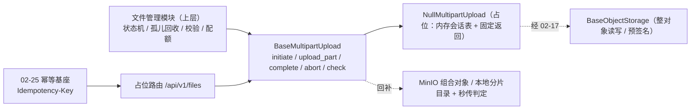

# 对象存储扩展基座详细设计

> 项目骨架 · 02 后端基座 · 04 跨阶段基座 · 18 对象存储扩展基座 · 详细设计

[文档首页](../../../../../../../文档首页.md) › [02-4-18 对象存储扩展基座](../02_后端基座_04_跨阶段基座_18_对象存储扩展基座.md) › 01 详细设计　|　[← 父任务](../02_后端基座_04_跨阶段基座_18_对象存储扩展基座.md)

## 1. 概述 <a id="overview"></a>

- **目标**：在 `02-17` 对象存储域上扩展「分片上传与秒传判定」契约与占位实现——`app/storage/base.py` 增常量 `DEFAULT_PART_SIZE` / `NULL_UPLOAD_ID`、数据契约 `MultipartInit` / `MultipartSession` / `MultipartPart` / `ExistingObjectRef`、契约 `BaseMultipartUpload`（`initiate` / `upload_part` / `complete` / `abort` / `check`）与提供者 `get_multipart_upload`；`app/storage/null.py` 增占位 `NullMultipartUpload`（内存会话表 + 固定返回）；配置分区 `[multipart_upload]`、装配接线，以及占位路由 `POST /api/v1/files/uploads`、`PUT /api/v1/files/uploads/{upload_id}/parts/{part_no}`、`POST /api/v1/files/uploads/{upload_id}/complete`、`DELETE /api/v1/files/uploads/{upload_id}`、`GET /api/v1/files/dedup`（初始化接 `02-25` 幂等基座）。
- **范围**：`app/storage/base.py`、`app/storage/null.py`（修改）、`app/schemas/storage.py`（新增）、`app/core/config.py`、`app/core/assembly.py`、`app/api/deps.py`、`app/api/file.py`（新增）、`app/api/router.py`、单测；架构 20「分片状态机」、架构 04 §4 / §8、《后端基类清单》/《后端开发规范》/ 计划 / 需求 02-45 登记。
- **不含**（归后续阶段）：真实分片托管（MinIO 组合对象 / 本地分片目录与 `.part` 临时对象）、秒传真实判定（sha256 索引查询）、上传会话持久化与分片状态机（上传中 / 完成 / 失败 / 孤儿）、孤儿分片回收、类型白名单与大小上限、分片与整文件 SHA256 校验、租户存储配额联动、断点续传分片状态列表、`sys_file` 元数据与 `file.uploaded` 事件 → **文件管理阶段**；上传 / 下载 / 预览真实路由与预签名直传 → 同阶段；幂等真实去重（Redis 前置 + 唯一约束兜底）→ **通用能力阶段**；登录态真实鉴权与 `file:upload` / `file:download` 权限码 → **认证 / 文件管理阶段**。
- **依据**：需求 [02-45](../../../../../需求/02_需求_后端基座.md#r02-45)、《[架构设计 · 文件管理](../../../../../../../设计/架构设计/20_架构设计_子系统_文件管理.md)》「分片状态机」「安全控制」节、《[架构设计 · 后端基础类体系](../../../../../../../设计/架构设计/04_架构设计_后端基础类体系.md)》「阶段交付与跨阶段基座契约」节、《[后端基类清单](../../../../../../../后端基类清单.md)》「跨阶段基座」节、《[后端开发规范](../../../../../../../规范/后端开发规范.md)》「后端基座体系（强制）」节、《[命名规范](../../../../../../../规范/命名规范.md)》「API 命名」节、《[API接口规范](../../../../../../../规范/API接口规范.md)》「统一响应」「幂等 / 限流 / 审计」节。

## 2. 现状与差距 <a id="gap"></a>

| 现状 | 差距 |
| --- | --- |
| `BaseObjectStorage`（`02-4-1`）已覆盖对象写入 / 读取 / 删除 / 存在判定 / 预签名，`local` / `minio` 双实现已交付（`04-1`） | 无分片上传与秒传判定契约（全库检索零命中）；文件管理模块与前端文件上传字段（`06_07`）无统一出口，会话状态与秒传判定会各自实现 |
| 架构 20 §2 已于 2026-09-20 登记「秒传与基座边界」（分片编排归文件管理模块、底层分片托管与秒传判定经对象存储扩展出口） | 《后端基类清单》§9「对象存储扩展」行仍为「待定（详细设计定）」——无代码落点、契约与状态 |
| 需求 02-45 内容 2 要求「上传会话幂等键取 `02-25` 幂等存储」 | 幂等接线无落点（`IdempotencyStore` 已就位、无消费方） |
| 接口路由基座（`02-6-1`）与 `require_auth` 占位已就位，补充基座普遍落占位路由 | 文件域无占位路由，前端与联调侧无统一入口基线 |
| 需求 02-45 原文 `initiate(size, sha256, mime)` **未含目标对象 key** | 与 S3 / MinIO `create_multipart_upload(bucket, key)` 语义不符（`complete` 无法确定目标对象）；按本设计取「`initiate` 入参含 key」，并在需求 02-45 注块登记偏差 |

## 3. 交付物清单 <a id="tree"></a>

```text
backend/
├── app/storage/base.py                    # 修改：DEFAULT_PART_SIZE / NULL_UPLOAD_ID / MultipartInit / MultipartSession / MultipartPart / ExistingObjectRef / BaseMultipartUpload / get_multipart_upload
├── app/storage/null.py                    # 修改：新增 NullMultipartUpload（内存会话表 + 固定返回、不落盘）
├── app/schemas/storage.py                 # 新增：MultipartInitiateRequest / MultipartSessionResponse / MultipartPartResponse / StoredObjectResponse / DedupResponse
├── app/core/config.py                     # 修改：Settings 增 multipart_upload 分区（PluginSelection）
├── app/core/assembly.py                   # 修改：_NULL_MODULES 无需增项（app.storage.null 已在列）+ PLUGIN_WIRINGS 增 multipart_upload 接线
├── app/api/deps.py                        # 修改：导出 get_multipart_upload
├── app/api/file.py                        # 新增：占位路由 /files（uploads / parts / complete / abort / dedup；初始化接 02-25 幂等）
├── app/api/router.py                      # 修改：登记 file 路由
└── tests/
    ├── storage/test_multipart.py          # 新增：Kiwi 新编号（契约 / 常量 / 数据契约 / 占位固定返回与会话语义 / 依赖解析 / 占位路由 / 幂等接线）
    ├── api/test_router_base.py            # 修改：默认登记表键期望值补 file（02-6-1 用例，路由表增长属预期）
    └── crosscut/test_plugin_registration.py   # 修改：_EXPECTED_PLUGIN_KEYS 补 multipart_upload（能力域端口清单）

bms文档/
├── 设计/架构设计/20_架构设计_子系统_文件管理.md   # 修改：「分片状态机」节补契约基座登记
├── 设计/架构设计/04_架构设计_后端基础类体系.md    # 修改：§4 基类清单 + §8 跨阶段基座契约表
├── 后端基类清单.md                                # 修改：§9 对象存储扩展行落点与契约（原「待定」）+ §10 继承链
├── 规范/后端开发规范.md                            # 修改：§3.1 补分片上传与秒传强制口径（只写语义与强制口径，不写实现侧标识）
├── 项目/01_项目骨架/计划/01_计划_项目骨架.md      # 修改：§3.1 后续阶段待办（分片与秒传真实实现行）+ 02_04 偏差跟踪
├── 项目/01_项目骨架/需求/02_需求_后端基座.md      # 修改：需求 02-45 补实现期要点注块（含 key 入参偏差）+ 状态 / 完成日期
├── 项目/01_项目骨架/需求/00_需求_项目骨架.md      # 修改：需求总览 02-45 行状态 / 完成日期回写
├── 项目/…/02_后端基座_04_跨阶段基座/…18….md      # 修改：参考文档补本设计 / 实施 / 测试链接，实施后回写状态
└── 项目/…/02_后端基座_04_跨阶段基座.md            # 修改：子任务清单 18 状态 / 完成日期回写
```

## 4. 分片上传与秒传契约（`app/storage/`） <a id="contract"></a>

| 成员 | 形态 | 说明 |
| --- | --- | --- |
| `DEFAULT_PART_SIZE` | `int` 常量，`5 * 1024 * 1024` | 分片缺省大小（5MB，S3 / MinIO 分片下限；末片除外） |
| `NULL_UPLOAD_ID` | `str` 常量，`"null-upload-id"` | 占位上传会话标识前缀（实际值前缀 + 递增序号） |
| `MultipartInit` | `BaseSchema`（参数对象） | `key: str` / `size: int`（`gt=0`）/ `sha256: str` / `mime: str \| None = None` / `part_size: int \| None = None`（`gt=0`，缺省取 `DEFAULT_PART_SIZE`） |
| `MultipartSession` | `BaseSchema`（结果契约） | `upload_id: str` / `key: str` / `part_size: int` / `total_parts: int` |
| `MultipartPart` | `BaseSchema`（结果契约） | `part_no: int` / `etag: str` / `size: int` |
| `ExistingObjectRef` | `BaseSchema`（秒传引用） | `key: str` / `size: int` / `content_type: str \| None` / `etag: str \| None` / `stored_at: datetime \| None` |
| `BaseMultipartUpload(BasePluggable, ABC)` | 能力域契约 | `key = plugin_key = "multipart_upload"`；五入口全异步 |
| `initiate(init) -> MultipartSession` | 抽象方法（async） | 初始化分片上传会话（返回会话标识 / 分片大小 / 分片总数） |
| `upload_part(upload_id, part_no, data) -> MultipartPart` | 抽象方法（async） | 上传单个分片（返回分片序号 / etag / 字节数） |
| `complete(upload_id) -> StoredObject` | 抽象方法（async） | 合并分片为最终对象（返回对象元数据） |
| `abort(upload_id) -> None` | 抽象方法（async） | 取消会话并清理临时分片（会话不存在抛 `NotFoundError`） |
| `check(sha256, size) -> ExistingObjectRef \| None` | 抽象方法（async） | 秒传判定：命中返回既有对象引用、未命中 `None` |
| `NullMultipartUpload(BaseMultipartUpload, BaseNullObject)` | 占位实现 | 内存会话表（不落盘）+ 固定返回：`initiate` 登记会话并返回 `NULL_UPLOAD_ID` 前缀递增标识、`upload_part` 回显、`complete` 回显会话 key / size 并结束会话、`abort` 清会话、`check` 恒未命中 |
| `get_multipart_upload(request) -> BaseMultipartUpload` | 提供者 | 取应用级单例（`resolve_plugin("multipart_upload", settings.multipart_upload.provider)`） |

**口径**：

| 情形 | 处置 |
| --- | --- |
| 同步性 | 五入口**全异步**（真实实现为网络 / 磁盘 IO，与对象存储域一致，回补时调用面零改动） |
| 键口径 | 目标对象 key 由上层按 `02-17` 口径（`bms:{租户}:files:{业务键}`）构造、本契约只透传不校验前缀 |
| 分片粒度 | `part_size` 缺省取 `DEFAULT_PART_SIZE`（5MB）；`MultipartInit.part_size` 可覆盖（上层按业务调大，**须 ≥ S3 / MinIO 下限**，下限校验随真实实现） |
| 序号口径 | `part_no` 从 **1 起**（`1 ~ total_parts`）；`total_parts = ceil(size / part_size)`；`size` 声明 `gt=0`（空文件不走分片上传），故 `total_parts` 恒 ≥ 1 |
| 秒传语义 | `check` 只作**判定与引用返回**（命中给出既有对象引用）；是否复用既有对象（不重传）由上层决定，基座不代替上层做业务判定 |
| 会话不存在 | `upload_part` / `complete` / `abort` 的 `upload_id` 未知、或 `part_no` 越界（不在 `1 ~ total_parts`）→ 抛 `NotFoundError`（10002，全局处理器统一转 404）；占位实现同样抛（口径一致、用例可覆盖） |
| 幂等 | 契约**不含幂等参数**；上传会话幂等由上层经 `02-25` 幂等基座承载（占位路由的初始化入口已接入，见 §5），重传与重复初始化不产生重复对象 |
| 合并产物 | `complete` 返回 `StoredObject`（对象元数据）；落 `sys_file` 元数据与 `file.uploaded` 事件归上层（文件管理模块） |
| 职责边界 | 分片状态机（初始化 / 分片 / 合并 / 取消 / 断点续传状态列表）、孤儿回收、类型白名单与大小上限、SHA256 校验、租户配额 → **上层**；本契约只落**分片托管与秒传判定** |
| 占位语义 | 占位带**内存会话表**（只记 key / size / mime / part_size；不落盘、不连 MinIO）；**`complete` / `abort` 后会话即失效**（与合并 / 取消语义一致，再次操作抛 `NotFoundError`）；`check` 恒未命中（占位不判定秒传，避免上层误跳过上传） |
| 后端不代理流 | 下载 / 预览走预签名直连（`02-17` 口径）；真实实现可经预签名 URL 让前端分片直传（开放项，占位期按 `upload_part` 契约承载） |



## 5. 占位路由（`app/api/file.py`） <a id="route"></a>

`router = BaseRouter(key="file", prefix="/files", tags=["file"], dependencies=[Depends(require_auth)])`——基于 `02-6-1` 路由基座，统一挂载到 `/api/v1`：

| 方法 | 路径 | 请求 | 响应 | 口径 |
| --- | --- | --- | --- | --- |
| POST | `/api/v1/files/uploads` | `MultipartInitiateRequest` | `MultipartSessionResponse` | 委托 `initiate`；读 `Idempotency-Key` 头按 §5.1 接 `02-25` 幂等 |
| PUT | `/api/v1/files/uploads/{upload_id}/parts/{part_no}` | `UploadFile`（表单字段名 `data`） | `MultipartPartResponse` | 委托 `upload_part`；`part_no` 经路径参数（`ge=1`） |
| POST | `/api/v1/files/uploads/{upload_id}/complete` | — | `StoredObjectResponse` | 委托 `complete`（占位回显会话 key / size） |
| DELETE | `/api/v1/files/uploads/{upload_id}` | — | `null` | 委托 `abort`（占位清会话条目；会话不存在 → 404） |
| GET | `/api/v1/files/dedup` | 查询参数 `sha256` / `size` | 命中 `DedupResponse`、未命中 `data: null` | 委托 `check`；`sha256` 校验 64 位小写十六进制、`size` 校验 `> 0`（非法抛 `ParamError` 10001） |

**路由契约**（`app/schemas/storage.py`，与能力域契约字段一一对应，路由面单独演化）：

| 契约 | 字段 | 说明 |
| --- | --- | --- |
| `MultipartInitiateRequest` | `key` / `size` / `sha256` / `mime` / `part_size` | 初始化请求（→ `MultipartInit`） |
| `MultipartSessionResponse` | `upload_id` / `key` / `part_size` / `total_parts` | 会话响应（← `MultipartSession`） |
| `MultipartPartResponse` | `part_no` / `etag` / `size` | 分片响应（← `MultipartPart`） |
| `StoredObjectResponse` | `key` / `size` / `content_type` / `etag` | 合并产物响应（← `StoredObject`） |
| `DedupResponse` | `key` / `size` / `content_type` / `etag` / `stored_at` | 秒传命中响应（← `ExistingObjectRef`） |

**口径**：

- 登录即可（**无权限码**）：占位期经 `Depends(require_auth)`（恒定放行）；真实登录态与 `file:upload` / `file:download` 权限码随认证 / 文件管理阶段。
- 能力域契约字段与路由契约字段**字段名一致**，路由内做显式映射（不隐式透传字典），保证 OpenAPI 契约稳定。
- 秒传响应**不包 `exists` 包裹层**：命中返回引用视图、未命中 `data: null`，与契约返回语义一一对应。
- 分片上传按表单体（`multipart/form-data`）承载，与浏览器 `FormData` / 前端上传字段直传一致；分片大小与序号校验（大小上限 / 序号范围）以 `upload_part` 契约为准。

### 5.1 初始化入口的幂等接线 <a id="idem"></a>

`POST /files/uploads` 按需求 02-45 内容 2 接 `02-25` 幂等基座（`IdempotencyStore`）：

| 情形 | 处置 |
| --- | --- |
| 未带 `Idempotency-Key` 头 | 直接委托 `initiate`（不做幂等，行为与不接幂等一致） |
| 带幂等键且首次（`begin` 为 True） | 委托 `initiate` → `save(幂等键, 会话载荷)` → 回响应 |
| 带幂等键且重复（`begin` 为 False） | `load` 取首次会话直接回响应（**不再开新会话**）；载荷缺失时按首次流程兜底 |

- 幂等键统一经 `build_idempotency_key` 构建（`bms:{租户|global}:idem:{键}`）；占位期取全局作用域（租户维度随租户解析接入，见 §12）。
- 占位期 `NullIdempotencyStore` 恒定首次、不缓存 → 行为等价于「每次新开会话」，幂等分支可断言（`begin` / `save` 调用面）。
- 幂等只作用于**初始化**入口（会话创建是唯一需要防重复建会话的动作）；分片重传与合并幂等由上层状态机 + 幂等基座承载（重复初始化不产生重复对象）。

## 6. 应用装配与依赖注入 <a id="di"></a>

| 位置 | 变更 |
| --- | --- |
| `app/core/config.py` | `Settings` 增 `multipart_upload: PluginSelection = Field(default_factory=PluginSelection)`（未配置 → 解析到 `null`） |
| `app/core/assembly.py` | `_NULL_MODULES` **无需增项**（`app.storage.null` 已在列，占位类随既有导入自动登记）；`PLUGIN_WIRINGS` 增 `PluginWiring("multipart_upload", BaseMultipartUpload, "multipart_upload", "multipart_upload")` |
| `app/api/deps.py` | 导出 `get_multipart_upload`（模块 docstring 补「分片上传」） |
| `app/api/router.py` | 模块列表增 `file`（登记路由 → 统一挂载 `/api/v1`） |

- 提供者为普通同步函数（取装配 settings 解析单例，无 IO）；真实实现（MinIO 分片 / 本地分片目录）后续按同键登记新实现名，**调用面零改动**。
- 真实实现登记落点：装配层工厂（延迟导入 SDK）随文件管理阶段补，本任务只落占位实现与接线。

## 7. 继承与分层 <a id="base"></a>

- `BaseMultipartUpload → BasePluggable → BaseCapability (+ BaseAsyncResource) → BaseObject`。
- `NullMultipartUpload → BaseMultipartUpload + BaseNullObject → BasePlaceholder → BaseObject`。
- 数据契约 `MultipartInit` / `MultipartSession` / `MultipartPart` / `ExistingObjectRef` → `BaseSchema`；路由契约 `MultipartInitiateRequest` / `MultipartSessionResponse` / `MultipartPartResponse` / `StoredObjectResponse` / `DedupResponse` → `BaseSchema`。
- 与 `BaseObjectStorage` 分工：同域（`app/storage/`）两个插件键——对象存储键落**整对象读写 / 预签名**，分片键落**分片托管与秒传判定**；二者互不替代（分片合并产物经对象存储键可读）。
- 与 `02-25` 幂等域、`02-6-1` 路由基座的关系：**单向依赖**（本域不反向依赖幂等 / 路由实现，仅经公共基座契约与提供者）。

## 8. 登记落点 <a id="register"></a>

| 落点 | 登记内容 |
| --- | --- |
| 《架构设计 · 文件管理》「分片状态机」节 | 补「契约基座（2026-09-20 登记，补充三 `02-45`）」：分片上传与秒传判定以统一契约承载（初始化 / 分片 / 合并 / 取消 / 秒传判定五方法，契约边界与命名见《后端基类清单》「跨阶段基座」节）；上传会话幂等经 `02-25` 幂等基座 |
| 《架构设计 · 后端基础类体系》§4 基类清单 | 新增行（`BaseMultipartUpload` / `NullMultipartUpload` + 四数据契约）+ 继承链补两条 |
| 《架构设计 · 后端基础类体系》§8 跨阶段基座契约表 | 新增「对象存储扩展（分片上传 / 秒传）」行（代码位置、契约、回补阶段＝**文件管理阶段**） |
| 《后端基类清单》§9 跨阶段基座 | 「对象存储扩展」行由「待定（详细设计定）」改为**代码位置 + 契约 + 状态**（`已交付（02-4-18，2026-09-20；真实分片托管 / 秒传判定 / 会话落库 / 孤儿回收随文件管理阶段）`）；§10 继承链与目录补两条 |
| 《后端开发规范》「后端基座体系」节 §3.1 | 补口径（**只写语义与强制口径，不写实现侧标识**）：文件分片上传与秒传判定一律经对象存储扩展基座出口，禁止各模块自接分片 SDK / 自建秒传判定；分片状态机、孤儿回收、类型与大小校验、配额联动归上层；上传会话幂等经幂等基座承载 |
| 计划《01_计划_项目骨架》§3.1「后续阶段待办」 | 新增「分片上传与秒传真实实现（MinIO 组合对象 / 本地分片目录、会话持久化与状态机、孤儿分片回收、类型与大小上限、配额联动）」行，出处 `02-4-18`；02_04 表「偏差与遗留」补 `02-4-18` |
| 需求 [02-45](../../../../../需求/02_需求_后端基座.md#r02-45) | 参考文档后补 `> 注：实现期要点` 块（含「`initiate` 入参含目标对象 key」的需求原文偏差登记）；**需求文档不承载进度**，状态回写落任务与计划两处（需求总览无状态列，不改动） |
| 02-4-18 任务文档 / 02_04 父任务 | 参考文档补本设计 / 实施 / 测试链接；实施后回写状态 / 完成日期与子任务清单 |

## 9. 测试设计（Kiwi 先登记） <a id="tests"></a>

用例**先登记 Kiwi TCMS 再编码**；本任务新分配 **Kiwi 1 条**（分类「平台骨架」、优先级 P2、状态 CONFIRMED、标签「自动化」；**编号以平台自增返回值为准**，登记后回填本表与代码内 `@pytest.mark.kiwi_id(...)`）：

| Kiwi | 用例 | 断言要点 | 自动化文件 |
| --- | --- | --- | --- |
| 待登记 | 契约继承与能力域标识 | `BaseMultipartUpload → BasePluggable → BaseCapability → BaseObject`；`NullMultipartUpload → BaseNullObject`；`key == plugin_key == "multipart_upload"`；`placeholder` / `describe()` | `tests/storage/test_multipart.py` |
| 待登记 | 常量与数据契约 | `DEFAULT_PART_SIZE == 5 * 1024 * 1024`；`NULL_UPLOAD_ID == "null-upload-id"`；`MultipartInit` / `MultipartSession` / `MultipartPart` / `ExistingObjectRef` 字段与默认值（含 `part_size` / `mime` / `stored_at` 缺省）、`size` 拒绝 0 / 负值 | 同上 |
| 待登记 | 占位 initiate 固定返回与会话 | 首次 `upload_id == "null-upload-id-1"`、二次为 `-2`；`key` 回显；`part_size` 缺省 5MB、入参覆盖回显；`total_parts` 按 `ceil(size / part_size)`（≤ 5MB → 1、11MB → 3） | 同上 |
| 待登记 | 占位分片 / 合并 / 取消 | `upload_part` 返回 `MultipartPart`（`part_no` 回显 / `etag == NULL_ETAG` / `size == len(data)`）；`complete` 回显会话 `key` / `size`（`etag == NULL_ETAG`）；`abort` 清会话；`complete` / `abort` 后会话失效、再次操作抛 `NotFoundError` | 同上 |
| 待登记 | 占位异常处置 | 未知 `upload_id` 的 `upload_part` / `complete` / `abort` 均抛 `NotFoundError`；`part_no` 越界（0 / `total_parts + 1`）抛 `NotFoundError` | 同上 |
| 待登记 | 占位秒传恒定未命中 | `check(sha256, size)` 恒返回 `None`（不判定秒传） | 同上 |
| 待登记 | 依赖解析 | 应用装配缺省 `NullMultipartUpload`（`app.state.multipart_upload`）；路由经 `Depends(get_multipart_upload)` 取到同一实例；插件清单含 `multipart_upload` 且 provider 为 `null` | 同上 |
| 待登记 | 占位路由与幂等接线 | `POST /api/v1/files/uploads` 返回会话（缺省分片粒度）；带 `Idempotency-Key` 头时经幂等基座（占位恒首次）正常建会话；`PUT .../parts/1` 表单上传回分包；`POST .../complete` 回显；`GET /files/dedup` 未命中 `data: null`、非法 `sha256` → 10001；`DELETE ...` 后 `complete` → 404 | 同上 |

回归：全量 `pytest`（含接口冒烟）；**前置契约协同适配**——`tests/api/test_router_base.py` 默认登记表期望键补 `file`、`tests/crosscut/test_plugin_registration.py` 的 `_EXPECTED_PLUGIN_KEYS` 补 `multipart_upload`（登记表 / 端口清单随能力域增长属预期，不改断言语义）。

## 10. 实施步骤 <a id="steps"></a>

1. `app/storage/base.py`：增常量、四数据契约、`BaseMultipartUpload`（五异步抽象入口）与提供者 `get_multipart_upload`。
2. `app/storage/null.py`：增 `NullMultipartUpload`（内存会话表 + 固定返回 + 未知会话 / 越界分片抛 `NotFoundError`）。
3. `app/schemas/storage.py`：路由请求 / 响应契约五个。
4. `app/core/config.py` / `app/core/assembly.py` / `app/api/deps.py`：配置分区、装配接线与提供者导出。
5. `app/api/file.py` + `app/api/router.py`：占位路由（含初始化入口的 `02-25` 幂等接线）与登记。
6. 测试：**先登记 Kiwi 取得编号**，再写 `tests/storage/test_multipart.py`（代码内标注用例编号）；同步适配两处前置契约断言。
7. 登记：架构 20 / 04 §4 / §8、《后端基类清单》§9 / §10、《后端开发规范》§3.1、计划 §3.1 + 02_04 偏差跟踪、需求 02-45 注块（含偏差）、需求总览、任务 / 父任务状态。
8. 验证：`uv run pytest --cov=app -q`、`uv run ruff check .`、`uv run ruff format --check .`、`uv run pyright` 全绿；`check-base.py` / `check-backend-base.py` 通过。
9. 回写：实施 / 测试记录 + 任务（`02-4-18`、`02_04`）与需求 02-45 状态、计划表。
10. 收尾：按「处理偏差与遗留」套路闭环后提交（推送另议）。

## 11. 验收映射 <a id="accept-map"></a>

| 完成标准（需求 02-45 / 任务 02-4-18） | 验证方式 |
| --- | --- |
| 接口 / 抽象声明与职责边界就位 | `BaseMultipartUpload` 五入口 + 四数据契约 + Kiwi 用例（契约 / 常量 / 数据契约） |
| 职责边界登记 | 架构 20「分片状态机」+ 架构 04 §8 + 《后端基类清单》§9 + 《后端开发规范》§3.1 |
| 依赖注入可解析、应用可启动不报错 | 装配单例 + 提供者解析用例 + 应用冒烟 + 占位路由 |
| 不实现真实能力 | 无 MinIO 分片调用 / 无分片落盘、无秒传索引查询、无会话落库与状态机、无孤儿回收、无类型与大小校验实现 |
| 幂等接线落点 | 初始化路由经 `02-25` 幂等基座（`begin` / `load` / `save`）+ 用例断言 |
| 登记齐备 | 架构 20 / 04 §4 / §8、《后端基类清单》§9 / §10、《后端开发规范》§3.1、计划 §3.1 |
| 无 lint / 类型错误 | `ruff check` / `ruff format --check` / `uv run pyright` |
| 新增模块覆盖率 100% | `pytest --cov=app.storage --cov=app.schemas.storage --cov=app.api.file` |

## 12. 边界与开放项 <a id="boundary"></a>

- **真实分片托管与秒传判定**（MinIO 组合对象 / 本地分片目录与 `.part` 临时对象、sha256 索引查询、分片校验）→ **文件管理阶段**；已登记计划 §3.1。
- **上传会话持久化与分片状态机**（上传中 / 完成 / 失败 / 孤儿、断点续传分片状态列表）、**孤儿分片回收**、**类型白名单与大小上限**、**租户配额联动**、`sys_file` 元数据与 `file.uploaded` 事件 → **文件管理阶段 / 任务调度 / 多租户路由**。
- **分片直传**：真实实现可经预签名 URL 让前端分片直连对象存储（后端不代理文件流）；届时是否需要 `upload_part` 之外的直传口径随文件管理阶段设计。
- **幂等真实去重**（Redis 前置 + 幂等键唯一约束兜底）→ **通用能力阶段**；占位期 `NullIdempotencyStore` 恒首次、不缓存。
- **幂等键租户维度**：占位期取全局作用域（`bms:global:idem:{键}`）；租户维度随租户解析接入（`get_tenant`）阶段回补。
- **登录态真实鉴权与权限码**（`file:upload` / `file:download` / `file:manage`）→ **认证 / RBAC / 文件管理阶段**（`require_auth` 占位恒定放行）。
- **占位语义已知项**：① 占位带内存会话表（`check` 恒未命中、`complete` 回显会话 key / size），会话**无 TTL、无容量上限**（应用级单例长期运行内存随会话数增长）——占位期已知、可接受，随真实实现（落库 / Redis）销项；② 占位分片不做大小与序号范围之外的校验。
- **需求原文偏差**：需求 02-45 原文 `initiate(size, sha256, mime)` 未含目标对象 key，本设计按 S3 / MinIO 语义取「入参含 key」，已在需求 02-45 注块登记；`part_size` 可入参覆盖同样在注块说明。
- **测试**：真实分片（写入后合并回读、秒传命中、孤儿清理）用例随文件管理阶段补充。

## 13. 对齐记录 <a id="align"></a>

| # | 事项 | 结论 |
| --- | --- | --- |
| 1 | 代码落点 | 扩展 `app/storage/`：契约 / 数据契约 / 常量落 `app/storage/base.py`，占位落 `app/storage/null.py`（用户拍板） |
| 2 | 契约签名 | 参数对象 + 结果契约（`MultipartInit` → `MultipartSession`；`upload_part` → `MultipartPart`；`complete` → `StoredObject`；`abort` → `None`）（用户拍板） |
| 3 | 目标对象 key | `initiate` 入参含 `key`（上层构造、基座透传）；属需求原文偏差，需求注块登记（用户拍板） |
| 4 | 秒传返回契约 | 新增 `ExistingObjectRef \| None`（不复用 `StoredObject`）（用户拍板） |
| 5 | 占位秒传语义 | 恒定未命中（恒 `None`，不判定秒传）（用户拍板） |
| 6 | 占位路由 | 落 `/api/v1/files/...` 占位路由（用户拍板） |
| 7 | 断点续传接口 | 不补 `list_parts`，以需求五方法为准（用户拍板） |
| 8 | 错误码 | 不新增 `5xxxx`；未知会话 / 越界分片抛 `NotFoundError`（10002）（用户拍板） |
| 9 | 常量与分片粒度 | `DEFAULT_PART_SIZE`（5MB）+ `NULL_UPLOAD_ID`；`part_size` 可经 `MultipartInit` 可选覆盖（用户拍板） |
| 10 | 幂等口径 | 契约不加幂等参数；占位初始化路由接 `02-25` 幂等基座（读 `Idempotency-Key`，缺失即跳过）（用户拍板） |
| 11 | 表声明 | 不落 `sys_file` 等表声明（归文件管理模块 / 《数据库设计》）（用户拍板） |
| 12 | 插件键与分区 | `plugin_key = multipart_upload` + `[multipart_upload]` 分区 + `app.state.multipart_upload`（用户拍板） |
| 13 | 路由端点形态 | 资源复数 + HTTP 方法（uploads / parts / complete / abort / dedup）（用户拍板） |
| 14 | 分片请求体 | `UploadFile`（`multipart/form-data`）（用户拍板） |
| 15 | 秒传响应 | 契约直对（命中引用视图、未命中 `data: null`，不包 `exists`）（用户拍板） |
| 16 | 路由契约落点 | 新建 `app/schemas/storage.py`（路由专用请求 / 响应契约，与能力域契约字段一一对应）（用户拍板） |
| 17 | 秒传引用字段 | `key` / `size` / `content_type` / `etag` / `stored_at`（用户拍板） |
| 18 | 路由鉴权 | `Depends(require_auth)` 占位（登录即可、无权限码）（用户拍板） |
| 19 | 用例文件 | 新增 `tests/storage/test_multipart.py`，既有 `test_storage.py` 零改动（用户拍板） |
| 20 | 分片序号 | S3 口径：`part_no` 1 起，`total_parts = ceil(size / part_size)`（用户拍板） |
| 21 | 占位 complete | 内存会话表回显会话 `key` / `size`（用户拍板） |
| 22 | 表单字段名 | `data`（与契约参数同名）（用户拍板） |
| 23 | 秒传参数校验 | `sha256` 64 位小写十六进制、`size > 0`；非法抛 `ParamError`（10001）（用户拍板） |
| 24 | `size` 口径 | `gt=0`（空文件不走分片上传），`total_parts` 恒 ≥ 1（用户拍板） |
| 25 | 占位 upload_id | `NULL_UPLOAD_ID` 前缀 + 递增序号（首条 `null-upload-id-1`）（用户拍板） |
| 26 | 占位异常处置 | 未知会话 / 越界分片抛 `NotFoundError`（与真实实现口径一致）（用户拍板） |
| 27 | 会话表容量 | 不设上限（已知项登记 §12，随真实实现销项）（用户拍板） |
| 28 | 工时 / 窗口 | 3h；阶段一补做窗口序 8（2026-09-20）（任务文档） |
| 29 | 交付范围 | 一条龙（设计 / 实施 / 测试 / 验证 / 登记 / 记录 / 提交 / 偏差遗留 / 收尾） |

> 本文档依《文档生成规范》编写 · 关键决策逐项确认
