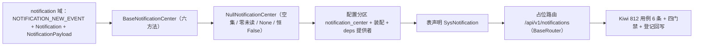

# 通知中心接口契约基座实施记录

> 项目骨架 · 02 后端基座 · 04 跨阶段基座 · 19 通知中心接口契约基座 · 实施记录

[文档首页](../../../../../../../文档首页.md) › [02-4-19 通知中心接口契约基座](../02_后端基座_04_跨阶段基座_19_通知中心接口契约基座.md) › 01 实施　|　[← 父任务](../02_后端基座_04_跨阶段基座_19_通知中心接口契约基座.md)

## 1. 实施信息 <a id="meta"></a>

| 项 | 值 |
| --- | --- |
| 任务 | [02-4-19 通知中心接口契约基座](../02_后端基座_04_跨阶段基座_19_通知中心接口契约基座.md) |
| 对应需求 | [02-46](../../../../../需求/02_需求_后端基座.md#r02-46) |
| 详细设计 | [19_详细设计_01_通知中心接口契约基座](../设计/19_详细设计_01_通知中心接口契约基座.md) |
| 实施日期 | 2026-09-20 |
| 实施人 | minjian |
| 实施环境 | 开发机（Ubuntu，Python 3.14 / uv） |
| 提交 | 待提交 |
| 结论 | 完成 |

## 2. 实施概览 <a id="overview"></a>



结果小结：通知中心读契约（`BaseNotificationCenter`：`list` / `detail`（查看即已读）/ `unread_count` / `mark_read` / `mark_all_read` / `delete`）、事件负载契约（`NotificationPayload` + `NOTIFICATION_NEW_EVENT`）、数据契约（`Notification`）、占位实现（`NullNotificationCenter`）与提供者落地；`SysNotification` 表声明；占位路由 `/api/v1/notifications` 基于 02-6-1 路由基座统一挂载；应用可启动、提供者可解析；`pytest` / `ruff` / `pyright` 全绿，新增模块覆盖率 100%。

## 3. 实施过程 <a id="process"></a>

1. **能力域契约与数据契约**：新增 `app/notification/`——`NOTIFICATION_NEW_EVENT = "notification.new"`；`Notification`（`id` / `user_id` / `title` / `content` / `type` / `biz_type` / `biz_id` / `is_read` / `created_at`）；`NotificationPayload`（`title` / `type` / `biz_type` / `biz_id` / `created_at`）；`BaseNotificationCenter`（`key = plugin_key = "notification_center"`，六异步方法）；占位 `NullNotificationCenter`；提供者 `get_notification_center`。
2. **角标口径**：`mark_read` / `mark_all_read` 返回操作后的未读总数（服务端唯一口径，前端据此校准角标）；`detail(..., mark_read=True)` 查看即已读；并发加锁由实现侧按用户完成，**契约不加锁 / 幂等键参数**。
3. **装配与依赖注入**：`app/core/config.py` 增 `notification_center` 分区；`app/core/assembly.py` 增 `app.notification.null` 与 `PluginWiring("notification_center", ...)`；`app/api/deps.py` 导出提供者。
4. **表声明**：`app/models/system.py` 增 `SysNotification`（`user_id` / `title` / `content` / `type` / `biz_type` / `biz_id` / `is_read`；继承 `BaseModel`，真实建表随通知公告阶段）。
5. **占位路由**：新增 `app/api/notification.py`（`BaseRouter`，`prefix="/notifications"`，`Depends(require_auth)`）——`GET`（列表，`filter_query` + `page_query` 绑定）/ `GET /unread-count` / `GET /{id}`（`mark_read` 查询参数）/ `POST /read` / `POST /read-all` / `DELETE /{id}`；静态路径先于 `/{id}` 登记；`app/api/router.py` 登记。
6. **测试**：新增 `tests/notification/test_notification.py`（6 条，含内存测试中心验证查看即已读与角标口径），Kiwi 812。
7. **前置契约适配**（消费方）：`tests/api/test_router_base.py` 登记表键补 `notification`；`tests/crosscut/test_plugin_registration.py::_EXPECTED_PLUGIN_KEYS` 补 `notification_center`。
8. **Kiwi 登记**：已在 mjbk Kiwi TCMS（分类「平台骨架」、P2、CONFIRMED、标签「自动化」）登记用例 **812「02-4-19 通知中心接口契约基座：契约与能力域标识 / 数据契约与事件负载 / 占位固定返回 / 依赖解析 / 占位路由 / 内存实现角标口径」**（2026-09-20），与 `@pytest.mark.kiwi_id(812)` 一致。
9. **登记回写**：架构 09「公共约定」/ 18「事件路由」/ 22「站内信与待办通知」、《后端基类清单》§9 / §10、《后端开发规范》§3.1、计划 §3 / §3.1、需求 02-46 注块、任务 / 父任务状态回写。

关键命令：

```bash
uv run pytest --cov=app -q
uv run ruff check .
uv run ruff format --check .
uv run pyright
python3 scripts/tools/base-check/check-base.py          # 需在 bms 根目录执行
python3 scripts/tools/base-check/check-backend-base.py  # 需在 bms 根目录执行
```

## 4. 问题与处置 <a id="issues"></a>

| 问题 / 现象 | 原因 | 处置与落点 |
| --- | --- | --- |
| Kiwi 预估号 782 已被占用 | 平台此前经测试结果导入自动建了 `tests/api/test_router_base.py::*` 等用例（pk 782 起），手工登记序号不顺延 | 按《AI开发规范》「编号以平台自增主键为准、既有编号不得复用」**先登记取得实际号 812** 再回填代码；偏差登记于计划 §3 本任务行与实施 §6 |
| pyright strict：`_parse_filters` 内 `item` 类型未知 | `json.loads` 返回 `Any`，列表元素类型未定 | `cast("list[object]", items)` 后再 `FilterSpec.model_validate` |
| `tests/api/test_router_base.py` / `tests/crosscut/test_plugin_registration.py` 断言失败 | 新增 `notification` 路由 / `notification_center` 能力域 | 按预期适配补登记项 |
| `check-base.py` 报「跨层引用」 | `后端开发规范` 中误用相对链接指向 `设计/架构设计/18…` | 按基座口径改为纯文本「平台《架构设计 · 实时推送》」 |

## 5. 验证结果 <a id="verify"></a>

| 完成标准 | 验证方法 | 实测结果 |
| --- | --- | --- |
| 接口 / 抽象声明与角标口径就位 | `BaseNotificationCenter` 六方法 + `Notification` / `NotificationPayload` + Kiwi 812 | 通过 |
| 事件负载契约 | `NotificationPayload`（五字段）+ `NOTIFICATION_NEW_EVENT` | 通过 |
| 表声明（个人维度） | `SysNotification` 字段 / 索引 | 通过 |
| 依赖注入可解析、应用可启动不报错 | 装配单例 + 提供者解析用例 + 应用冒烟 + 占位路由 | 通过 |
| 占位实现固定返回 | `NullNotificationCenter` 空分页 / None / 0 / False；无落库 / 推送 | 通过 |
| 登记齐备 | 架构 09 / 18 / 22、《后端基类清单》§9 / §10、《后端开发规范》§3.1、计划 §3 / §3.1 | 已登记 |
| 无 lint / 类型错误 | `ruff check` / `ruff format --check` / `uv run pyright` | All checks passed / 305 files already formatted / 0 errors |
| 基座护栏 | `check-base.py` / `check-backend-base.py` | 均通过 |
| 新增模块覆盖率 | `pytest --cov=app.notification --cov=app.api.notification` | 均 100% |

> 全量 `pytest`：**599 passed, 8 skipped**（含接口冒烟；无失败）。

## 6. 偏差与遗留 <a id="deviations"></a>

- **偏差**：Kiwi 用例号为 **812**（平台预估 782 已被自动导入用例占用，按《AI开发规范》「编号以平台自增主键为准、既有编号不得复用」取登记返回值）；需求 / 设计 / 任务文档中的预估号已按 812 回填（设计 §14 保留预估说明）。
- **偏差**：列表 `filters` 线上绑定采用 JSON 字符串查询参数（占位期仅作承载演示，复杂条件绑定随真实筛选实现按《API接口规范》直传字段口径接入）。
- **遗留归口（已登记，随对应阶段销项）**：
  - `sys_notification` 取数与落库（查看即已读 / 批量已读 / 删除）→ **通知公告阶段**；已登记计划 §3.1「通知中心真实实现」行。
  - `notification.new` 推送触发、渠道偏好过滤与免打扰、按 locale 渲染 → **通知公告阶段**。
  - 未读角标并发加锁 / 幂等（实现侧按用户）→ **通知公告阶段**。
  - 动作权限码（如 `notification:delete`）→ **RBAC 阶段**。
  - 登录态真实鉴权 → **认证阶段**（`require_auth` 占位）。
- **处理偏差与遗留（2026-09-20 闭环）**：计划 §3.1 新增「通知中心真实实现」行；需求 02-46 `> 注：` 块补实现期要点；消费方（通知公告 / RBAC / 认证阶段）已在计划与需求注块登记去向。
- **结论**：本任务遗留已全部登记去向，偏差与遗留处理完成。

> 本文档依《文档生成规范》编写
