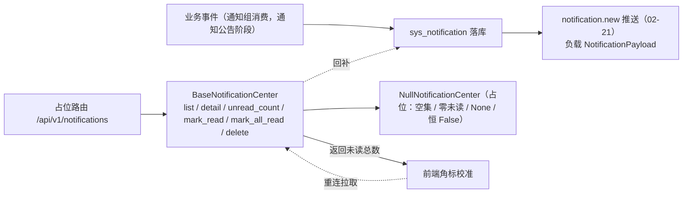

# 通知中心接口契约基座详细设计

> 项目骨架 · 02 后端基座 · 04 跨阶段基座 · 19 通知中心接口契约基座 · 详细设计

[文档首页](../../../../../../../文档首页.md) › [02-4-19 通知中心接口契约基座](../02_后端基座_04_跨阶段基座_19_通知中心接口契约基座.md) › 01 详细设计　|　[← 父任务](../02_后端基座_04_跨阶段基座_19_通知中心接口契约基座.md)

## 1. 概述 <a id="overview"></a>

- **目标**：落地「通知中心接口契约基座」——`app/notification/` 的能力域中间层契约 `BaseNotificationCenter`（列表 / 详情（查看即已读）/ 未读计数 / 已读 / 全部已读 / 删除）、事件负载契约 `NotificationPayload`（`notification.new`）、数据契约 `Notification`、占位实现 `NullNotificationCenter`（空集 / 零未读）与依赖注入提供者 `get_notification_center`；表声明 `SysNotification`；配置分区 `notification_center`、装配接线与占位路由 `/api/v1/notifications`。
- **范围**：`app/notification/`（新增）、`app/schemas/notification.py`（新增）、`app/models/system.py`、`app/core/config.py`、`app/core/assembly.py`、`app/api/deps.py`、`app/api/notification.py`（新增路由）、`app/api/router.py`、单测；架构 09「公共约定」/ 18「事件路由」/ 22「站内信与待办通知」、《后端基类清单》§9 / §10、《后端开发规范》§3.1、计划 §3 / §3.1、需求 02-46 登记。
- **不含**（归后续阶段）：真实取数与落库（`sys_notification` 查询 / 写入、查看即已读落库、批量已读、删除）、实时推送触发（`notification.new` 发送）、渠道偏好过滤与免打扰时段、按收件人 locale 渲染、未读角标并发加锁与幂等、动作权限码 → **通知公告阶段 / 认证与安全阶段**；登录态真实鉴权 → **认证阶段**。
- **依据**：需求 [02-46](../../../../../需求/02_需求_后端基座.md#r02-46)、《[架构设计 · 通知公告](../../../../../../../设计/架构设计/22_架构设计_子系统_通知公告.md)》「站内信与待办通知」节、《[架构设计 · 实时推送](../../../../../../../设计/架构设计/18_架构设计_子系统_实时推送.md)》「事件路由」节、《[架构设计 · 接口与集成](../../../../../../../设计/架构设计/09_架构设计_接口与集成.md)》「公共约定」节、《[后端基类清单](../../../../../../../后端基类清单.md)》「跨阶段基座」节、《[后端开发规范](../../../../../../../规范/后端开发规范.md)》「后端基座体系」节、《[API接口规范](../../../../../../../规范/API接口规范.md)》「参数与分页」节、已交付 [02-4-20](../../02_后端基座_04_跨阶段基座_20_列表查询与偏好契约基座/02_后端基座_04_跨阶段基座_20_列表查询与偏好契约基座.md) / [02-4-23](../../02_后端基座_04_跨阶段基座_23_用户偏好基座/02_后端基座_04_跨阶段基座_23_用户偏好基座.md)。

## 2. 现状与差距 <a id="gap"></a>

| 现状 | 差距 |
| --- | --- |
| `02-20` `BaseNotifier` 只覆盖「发送」（`inbox` / `email` / `sms`），不覆盖读取；`02-21` `BaseRealtimePublisher` 只覆盖「推送」 | 前端通知与消息（07_04）需列表 / 详情 / 未读计数 / 已读 / 删除接口，缺统一契约则各模块重复实现、角标口径发散 |
| `sys_notification` 仅有架构登记（22 §2：`user_id` / `title` / `content` / `type` / `biz_type` / `biz_id` / `is_read`），无模型声明 | 无表声明，站内信落库无落点 |
| `notification.new` 已登记事件（18 §5），但负载字段未在契约层固化 | 推送负载 `title` / `type` / `biz_type` / `biz_id` / `created_at` 散落，前端口径易漂 |
| 分页 / 筛选契约（`BasePageQuery` / `BaseFilterQuery`，02-4-20）、列表偏好（02-4-23）、路由基座（02-6-1）、工厂基座（02-3-15）已就位 | 新能力域无提供者，「依赖注入可解析」无落点 |

## 3. 交付物清单 <a id="tree"></a>

```text
backend/
├── app/notification/__init__.py           # 新增：能力域包（docstring 口径）
├── app/notification/base.py               # 新增：NOTIFICATION_NEW_EVENT / Notification / NotificationPayload / BaseNotificationCenter / get_notification_center
├── app/notification/null.py               # 新增：NullNotificationCenter（空集 / 零未读 / 恒 False）
├── app/schemas/notification.py            # 新增：NotificationReadRequest / UnreadCountResponse（占位路由请求响应契约）
├── app/models/system.py                   # 修改：新增 SysNotification 表声明
├── app/core/config.py                     # 修改：Settings 增 notification_center 分区（PluginSelection）
├── app/core/assembly.py                   # 修改：_NULL_MODULES 增 app.notification.null + PLUGIN_WIRINGS 增 notification_center 接线
├── app/api/deps.py                        # 修改：导出 get_notification_center
├── app/api/notification.py                # 新增：占位路由 /api/v1/notifications（BaseRouter）
├── app/api/router.py                      # 修改：登记 notification 路由
└── tests/
    └── notification/test_notification.py  # 新增：Kiwi 782（契约 / 事件负载 / 占位 / 依赖解析 / 占位路由）

bms文档/
├── 设计/架构设计/09_架构设计_接口与集成.md    # 修改：「公共约定」补通知中心接口口径
├── 设计/架构设计/18_架构设计_子系统_实时推送.md # 修改：「事件路由」补 notification.new 负载字段
├── 设计/架构设计/22_架构设计_子系统_通知公告.md # 修改：「站内信与待办通知」补契约基座与接口口径
├── 后端基类清单.md                            # 修改：§9 跨阶段基座补一行 + §10 继承链
├── 规范/后端开发规范.md                        # 修改：「后端基座体系」§3.1 补通知中心口径
├── 项目/01_项目骨架/计划/01_计划_项目骨架.md  # 修改：§3 剩余排期 / 已完成 + §3.1 后续阶段待办 + 进展统计
├── 项目/01_项目骨架/需求/02_需求_后端基座.md  # 修改：需求 02-46 补实现期要点注块
├── 项目/…/02_后端基座_04_跨阶段基座/…19….md   # 修改：参考文档补本设计 / 实施 / 测试链接，实施后回写状态
└── 项目/…/02_后端基座_04_跨阶段基座.md        # 修改：子任务清单 19 状态 / 完成日期回写
```

## 4. 通知中心能力域（`app/notification/`） <a id="contract"></a>

### 4.1 契约与数据契约 <a id="members"></a>

| 成员 | 形态 | 说明 |
| --- | --- | --- |
| `NOTIFICATION_NEW_EVENT` | `str` 常量，`"notification.new"` | 新站内信推送事件名（与 `app.ws.base.REALTIME_EVENTS` 之一同源） |
| `Notification(BaseSchema)` | 数据契约 | 通知对象：`id`（可空）/ `user_id`（可空）/ `title` / `content` / `type` / `biz_type` / `biz_id` / `is_read` / `created_at` |
| `NotificationPayload(BaseSchema)` | 数据契约 | `notification.new` 事件负载：`title` / `type` / `biz_type` / `biz_id` / `created_at`（无正文与未读数，避免载荷膨胀与角标漂移） |
| `BaseNotificationCenter(BasePluggable, ABC)` | 能力域契约 | `key = plugin_key = "notification_center"`；六个异步方法（见下） |
| `get_notification_center(request) -> BaseNotificationCenter` | 提供者 | 取应用级单例（`resolve_plugin("notification_center", settings.notification_center.provider)`） |

### 4.2 方法签名 <a id="signature"></a>

| 方法 | 签名 | 语义 |
| --- | --- | --- |
| `list` | `async list(filter: BaseFilterQuery, page: BasePageQuery) -> BasePageResponse[Notification]` | 列表（当前用户维度）：筛选复用 02-4-20 `BaseFilterQuery`（`keyword` + `filters`），分页复用 `BasePageQuery`（`page` / `size` / 排序） |
| `detail` | `async detail(notification_id: int, *, mark_read: bool = True) -> Notification \| None` | 详情；**查看即已读**（`mark_read` 为 True 时命中即标记已读并回传最新对象），未命中 `None` |
| `unread_count` | `async unread_count() -> int` | 当前未读总数（服务端唯一口径） |
| `mark_read` | `async mark_read(ids: Sequence[int]) -> int` | 按 id 批量标记已读；返回**操作后的未读总数**（供前端校准角标） |
| `mark_all_read` | `async mark_all_read() -> int` | 全部标记已读；返回**操作后的未读总数**（恒 `0`） |
| `delete` | `async delete(notification_id: int) -> bool` | 删除单条；返回是否删除到既有通知 |

### 4.3 口径 <a id="semantics"></a>

| 情形 | 处置 |
| --- | --- |
| 同步性 | 全部**异步**（真实取数为异步 SQLAlchemy 查询 / 落库，与 `preference` / 通知渠道域一致，回补时调用面零改动） |
| 用户维度 | 六个方法均隐含「当前用户」上下文（`current_user_id`），契约签名不显式传 `user_id`；真实实现从会话上下文取用户 |
| 角标一致性 | **未读数以服务端为唯一口径**：`mark_read` / `mark_all_read` 返回操作后未读总数，前端直接以返回值校准角标，不依赖推送增量推算 |
| 并发裁决 | 实时推送与已读的并发由**实现侧**处理（按用户加锁 / 串行化未读变更）；**契约层不引入锁或幂等键参数**，占位实现不体现 |
| 查看即已读 | `detail(..., mark_read=True)` 命中即已读；`mark_read=False` 供「仅预览」场景（如后台批处理），默认 True 对齐需求 |
| 事件负载 | `notification.new` 触发时机（站内信落库后）与发送归通知公告阶段；本任务只固化负载字段，供生产（通知公告）与消费（前端 07_04 / 08_10）共用 |
| 已读 / 删除范围 | 只作用于当前用户自己的通知（越权由真实实现按 `user_id` 过滤 / 校验）；占位不涉及 |
| 非敏感 | 通知内容按收件人语言运行时渲染（i18n），契约只承载已渲染文本；前端只展示 |



## 5. 表声明（`app/models/system.py`） <a id="model"></a>

新增 `SysNotification(BaseModel)`（租户库表，真实建表结构以《数据库设计》为唯一事实源）：

| 字段 | 类型 | 说明 |
| --- | --- | --- |
| 公共字段 | — | 继承 `BaseModel`（雪花 `id` / 审计 / 软删除 / 乐观锁） |
| `user_id` | `BigInteger`（索引） | 用户 ID（逻辑外键 → `sys_user.id`，个人维度） |
| `title` | `String(256)` | 标题 |
| `content` | `Text` | 正文（已按收件人 locale 渲染） |
| `type` | `String(32)`（索引） | 通知类型（如 `system` / `approval` / `announcement`；取值随通知公告阶段定） |
| `biz_type` | `String(64)`（可空） | 业务类型（如 `approval`） |
| `biz_id` | `String(64)`（可空） | 业务标识（供跳转与去重） |
| `is_read` | `Boolean`（索引） | 是否已读 |

- 字段对齐《架构设计 · 通知公告》§2 `sys_notification`；本任务只声明，不建表、不迁移。
- 通知类型枚举取值不在本任务固化（占位不校验），随通知公告阶段确定。

## 6. 占位路由（`app/api/notification.py`） <a id="route"></a>

`router = BaseRouter(key="notification", prefix="/notifications", tags=["notification"], dependencies=[Depends(require_auth)])`——基于 02-6-1 路由基座，统一挂载到 `/api/v1`：

| 方法 | 路径 | 入参 | 响应 | 口径 |
| --- | --- | --- | --- | --- |
| GET | `/api/v1/notifications` | `keyword`（可选）、`page` / `size` / `order_by` / `order` | 分页（`{list, total, page, size}`） | 委托 `list(filter, page)`；占位空集 |
| GET | `/api/v1/notifications/unread-count` | — | `{count}` | 委托 `unread_count()`；占位 `0` |
| GET | `/api/v1/notifications/{notification_id}` | `mark_read`（查询，默认 `true`） | 通知或 `null` | 委托 `detail(id, mark_read=...)`；占位 `null` |
| POST | `/api/v1/notifications/read` | `{ids: [int]}` | `{count}` | 委托 `mark_read(ids)`；占位 `0` |
| POST | `/api/v1/notifications/read-all` | — | `{count}` | 委托 `mark_all_read()`；占位 `0` |
| DELETE | `/api/v1/notifications/{notification_id}` | — | `bool` | 委托 `delete(id)`；占位 `false` |

- **静态路径先于动态路径登记**：`/unread-count`、`/read`、`/read-all` 在 `/{notification_id}` 之前，避免路径吞并。
- 请求 / 响应契约 `NotificationReadRequest`（`ids`）/ `UnreadCountResponse`（`count`）落 `app/schemas/notification.py`；数据契约 `Notification` 落 `app/notification/base.py`。
- 列表筛选经 `FilterDep`（`_filter_query`：占位仅绑定 `keyword`）；完整 `filters` 条件绑定随真实筛选实现接入（见 §13）。
- **登录即可**（无权限码）：占位期经 `Depends(require_auth)`（恒定放行），真实登录态随认证阶段。
- 未读数是否由推送触发 / 已读是否重推角标 → 归通知公告阶段（占位不推）。

## 7. 应用装配与依赖注入 <a id="di"></a>

| 位置 | 变更 |
| --- | --- |
| `app/core/config.py` | `Settings` 增 `notification_center: PluginSelection = Field(default_factory=PluginSelection)`（未配置 → 解析到 `null`） |
| `app/core/assembly.py` | `_NULL_MODULES` 增 `app.notification.null`（导入即自动登记）；`PLUGIN_WIRINGS` 增 `PluginWiring("notification_center", BaseNotificationCenter, "notification_center", "notification_center")` |
| `app/api/deps.py` | 导出 `get_notification_center` |
| `app/api/router.py` | 模块列表增 `notification`（登记路由 → 统一挂载 `/api/v1`） |

提供者为普通同步函数（取装配 settings 解析单例，无 IO）；真实实现替换占位时调用面零改动。

## 8. 继承与分层 <a id="base"></a>

- `BaseNotificationCenter → BasePluggable → BaseCapability (+ BaseAsyncResource) → BaseObject`。
- `NullNotificationCenter → BaseNotificationCenter + BaseNullObject → BasePlaceholder → BaseObject`。
- 数据契约 `Notification` / `NotificationPayload` → `BaseSchema`；请求响应 `NotificationReadRequest` / `UnreadCountResponse` → `BaseSchema`。
- 模型 `SysNotification → BaseModel → BaseObject`。

## 9. 登记落点 <a id="register"></a>

| 落点 | 登记内容 |
| --- | --- |
| 《架构设计 · 接口与集成》「公共约定」节 | 补通知中心接口口径：`/api/v1/notifications`（列表 / 详情（查看即已读）/ 未读数 / 已读 / 全部已读 / 删除，登录即可）；未读数以服务端为唯一口径、写接口返回操作后未读总数；列表经 02-4-20 筛选 / 分页契约 |
| 《架构设计 · 实时推送》「事件路由」节 | 补 `notification.new` 负载字段：`title` / `type` / `biz_type` / `biz_id` / `created_at`（无正文与未读数） |
| 《架构设计 · 通知公告》「站内信与待办通知」节 | 补契约基座口径：读接口统一经 `BaseNotificationCenter`，禁止各模块自建通知存储；接口路径与角标一致性口径 |
| 《后端基类清单》§9 跨阶段基座 | 把「通知中心（待实施）」行改为已交付行（`app/notification/`，契约 / 占位 / 接口路径 / 状态）；§10 继承链补两条 |
| 《后端开发规范》「后端基座体系」节 §3.1 | 补口径：通知中心读接口一律经 `BaseNotificationCenter`，未读数以服务端为唯一口径、写接口返回未读总数 |
| 计划《01_计划_项目骨架》§3 / §3.1 | 02-4-19 由剩余排期移入已完成（状态 / 日期）；§3.1 增「通知中心真实实现（取数落库 / 推送触发 / 按用户加锁）」行；进展统计回写 |
| 需求 [02-46](../../../../../需求/02_需求_后端基座.md#r02-46) | 补 `> 注：实现期要点` 块；实施完成后回写状态 / 完成日期 |
| 02-4-19 任务文档 | 参考文档补本设计 / 实施 / 测试链接；实施后回写状态 / 完成日期 |

## 10. 测试设计（Kiwi 782 先行） <a id="tests"></a>

用例**先登记 Kiwi TCMS 再编码**；本任务新分配 **Kiwi 782**（分类「平台骨架」/ 优先级 `P2` / 状态 `CONFIRMED` / 标签「自动化」；平台登记后回填编号，题面与平台一致）：

| Kiwi | 用例 | 断言要点 | 自动化文件 |
| --- | --- | --- | --- |
| 782 | 契约继承与能力域标识 | `BaseNotificationCenter → BasePluggable → BaseCapability`；`NullNotificationCenter → BaseNullObject`；`key` / `placeholder` | `tests/notification/test_notification.py` |
| 782 | 数据契约与事件负载 | `Notification` 字段默认值；`NotificationPayload` 字段集 == `{title, type, biz_type, biz_id, created_at}`；`NOTIFICATION_NEW_EVENT == "notification.new"` | 同上 |
| 782 | 占位固定返回 | `list` 空分页（`total=0`、回显 `page` / `size`）；`detail` None；`unread_count` 0；`mark_read` / `mark_all_read` 0；`delete` False | 同上 |
| 782 | 依赖解析 | `create_app()` 装配 `NullNotificationCenter`；`resolve_plugin("notification_center", None)` 同一实例 | 同上 |
| 782 | 占位路由 | `GET /api/v1/notifications` `data.list == []` / `total == 0`；`GET /unread-count` `{count:0}`；`GET /{id}` `null`；`POST /read` `{count:0}`；`POST /read-all` `{count:0}`；`DELETE /{id}` `false` | 同上 |
| 782 | 内存实现 + 路由（角标口径） | 用测试内存实现替换提供者：查看即已读后 `unread_count` 递减、`mark_read` 返回操作后总数、`mark_all_read` 归零、`delete` 后详情 `null` | 同上 |

回归：全量 `pytest`（含接口冒烟）。

## 11. 实施步骤 <a id="steps"></a>

1. 新增 `app/notification/`（常量 / `Notification` / `NotificationPayload` / `BaseNotificationCenter` / `NullNotificationCenter` / `get_notification_center`）。
2. `app/schemas/notification.py` 请求响应契约；`app/models/system.py` 表声明 `SysNotification`。
3. `app/core/config.py` / `app/core/assembly.py` / `app/api/deps.py` / `app/api/router.py` / `app/api/notification.py` 装配与占位路由。
4. 测试：先登记 Kiwi 782，再写 `tests/notification/test_notification.py`。
5. 登记：架构 09 / 18 / 22、《后端基类清单》§9 / §10、《后端开发规范》§3.1、计划 §3 / §3.1、需求 02-46 注块、任务 / 父任务状态。
6. 验证：`pytest --cov=app`、`ruff check` / `ruff format --check` / `pyright` 全绿；`check-base.py` / `check-backend-base.py` 通过。
7. 回写：实施 / 测试记录 + 任务（02-4-19、02_04）与需求 02-46 状态、计划表。
8. 收尾：按「处理偏差与遗留」套路闭环后提交（推送另议）。

## 12. 验收映射 <a id="accept-map"></a>

| 完成标准（需求 02-46 / 任务 02-4-19） | 验证方式 |
| --- | --- |
| 接口 / 抽象声明与角标口径就位 | `BaseNotificationCenter` 六方法 + `Notification` / `NotificationPayload` + 返回值口径 + Kiwi 782 |
| 角标一致性口径登记 | 「未读以服务端为唯一口径、写接口返回未读总数」入契约 docstring + 架构 18 / 22 |
| 事件负载契约 | `NotificationPayload`（`title` / `type` / `biz_type` / `biz_id` / `created_at`）+ `NOTIFICATION_NEW_EVENT` |
| 表声明（个人维度） | `SysNotification` + 字段 / 索引结构核对 |
| 依赖注入可解析、应用可启动不报错 | 装配单例 + 提供者解析用例 + 应用冒烟 + 占位路由 |
| 占位实现固定返回 | `NullNotificationCenter` 空集 / 零未读 / None / 恒 False；无落库 / 推送实现 |
| 不实现真实能力 | 无 `sys_notification` 取数落库 / `notification.new` 发送 / 加锁实现 |
| 登记齐备 | 架构 09 / 18 / 22、《后端基类清单》§9 / §10、《后端开发规范》§3.1、计划 §3 / §3.1 |
| 无 lint / 类型错误 | `ruff check` / `ruff format --check` / `pyright` |

## 13. 边界与开放项 <a id="boundary"></a>

- **真实取数与落库**（`sys_notification` 查询 / 写入、查看即已读落库、批量已读、删除）→ **通知公告阶段**；已登记计划 §3.1。
- **实时推送触发**（站内信落库后发 `notification.new`）、**渠道偏好过滤 / 免打扰**、**按 locale 渲染** → **通知公告阶段**。
- **未读角标并发加锁 / 幂等**（按用户串行化未读变更）→ **通知公告阶段**（实现侧，契约不加参数，登记于契约 docstring 与架构 22）。
- **动作权限码**（如 `notification:delete`）→ **RBAC 阶段**；个人通知按用户维度天然隔离。
- **登录态真实鉴权** → **认证阶段**（`require_auth` 占位）。
- **列表 `filters` 线上绑定**（复杂条件查询参数）→ 随真实筛选实现接入；占位期 route 仅绑定 `keyword`，契约层已按 `BaseFilterQuery` 承载。
- **通知类型枚举取值** → 通知公告阶段确定；本任务不固化。
- **测试**：真实取数 / 落库 / 推送 / 并发用例随对应阶段补充。

## 14. 对齐记录 <a id="align"></a>

| # | 事项 | 结论 |
| --- | --- | --- |
| 1 | 代码落点 | 新建 `app/notification/`（与 `app/notify/` 渠道发送域区分）（用户拍板） |
| 2 | 标识符 | `plugin_key = 配置分区 = app.state 属性 = "notification_center"`，提供者 `get_notification_center`（用户拍板） |
| 3 | `list` 签名 | `async list(filter: BaseFilterQuery, page: BasePageQuery) -> BasePageResponse[Notification]`（用户拍板） |
| 4 | `detail` 语义 | `async detail(notification_id, *, mark_read: bool = True) -> Notification \| None`（查看即已读，副作用可关）（用户拍板） |
| 5 | 已读返回 | `mark_read(ids) -> int` / `mark_all_read() -> int`，返回操作后未读总数（角标校准）（用户拍板） |
| 6 | 未读 / 删除返回 | `unread_count() -> int`；`delete(notification_id) -> bool`（用户拍板） |
| 7 | 事件负载 | `app/notification/` 定义 `NotificationPayload` + `NOTIFICATION_NEW_EVENT`；架构 18 登记字段（用户拍板） |
| 8 | 路由 | 落占位 `/api/v1/notifications`（六端点，登录即可）（用户拍板） |
| 9 | 表声明 | 声明 `SysNotification` 骨架（继承 `BaseModel`，真实建表随通知公告阶段）（用户拍板） |
| 10 | 并发 / 角标 | 契约**不加**锁 / 幂等键参数；仅登记「未读以服务端为唯一口径、写接口返回未读总数、实现侧按用户加锁（02-30）」（用户拍板） |
| 11 | 登记落点 | 架构 09 / 18 / 22、《后端基类清单》§9 / §10、《后端开发规范》§3.1、计划 §3 / §3.1、需求 02-46 注块 |
| 12 | 测试 | 新分配 Kiwi 782（平台登记 + `@pytest.mark.kiwi_id(782)`） |
| 13 | 工时 / 窗口 | 3h；阶段一补做窗口序 3（2026-09-20） |
| 14 | 交付范围 | 一条龙（设计 / 实施 / 测试 / 登记 / 记录 / 提交 / 偏差遗留 / 收尾） |

> 本文档依《文档生成规范》编写 · 关键决策逐项确认
