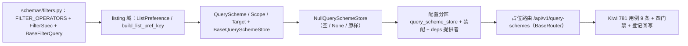

# 列表查询与偏好契约基座实施记录

> 项目骨架 · 02 后端基座 · 04 跨阶段基座 · 20 列表查询与偏好契约基座 · 实施记录

[文档首页](../../../../../../../文档首页.md) › [02-4-20 列表查询与偏好契约基座](../02_后端基座_04_跨阶段基座_20_列表查询与偏好契约基座.md) › 01 实施　|　[← 父任务](../02_后端基座_04_跨阶段基座_20_列表查询与偏好契约基座.md)

## 1. 实施信息 <a id="meta"></a>

| 项 | 值 |
| --- | --- |
| 任务 | [02-4-20 列表查询与偏好契约基座](../02_后端基座_04_跨阶段基座_20_列表查询与偏好契约基座.md) |
| 对应需求 | [02-47](../../../../../需求/02_需求_后端基座.md#r02-47) |
| 详细设计 | [20_详细设计_01_列表查询与偏好契约基座](../设计/20_详细设计_01_列表查询与偏好契约基座.md) |
| 实施日期 | 2026-09-20 |
| 实施人 | minjian |
| 实施环境 | 开发机（Ubuntu，Python 3.14 / uv） |
| 提交 | 待提交 |
| 结论 | 完成 |

## 2. 实施概览 <a id="overview"></a>



结果小结：筛选契约（`FilterSpec` / `BaseFilterQuery`，操作符复用 `SCOPE_OPERATORS`）、列表偏好协议（`ListPreference` / `build_list_pref_key`，读写经 02-50）与查询方案契约（`QueryScheme` / `BaseQuerySchemeStore` / `NullQuerySchemeStore` / `get_query_scheme_store`）落地；占位路由 `/api/v1/query-schemes` 基于 02-6-1 路由基座统一挂载；应用可启动、提供者可解析；`pytest` / `ruff` / `pyright` 全绿，新增模块覆盖率 100%。

## 3. 实施过程 <a id="process"></a>

1. **筛选契约**：新增 `app/schemas/filters.py`——`FILTER_OPERATORS = SCOPE_OPERATORS`（复用数据范围 11 种操作符）、`FILTER_MULTI_SEPARATOR`；`FilterSpec`（`field` / `operator` / `value` + `serialize` 按《API接口规范》口径：等值直传 / 多值逗号 / 区间 `*_start`·`*_end` / 空值判定）、`serialize_filters`、`BaseFilterQuery`（`keyword` + `filters` + `to_query_params`）。
2. **列表偏好协议与查询方案契约**：新增 `app/listing/`——`LIST_PREF_KEY_PREFIX` / `LIST_DENSITIES` / `build_list_pref_key`（`list.{form_key}`）；`ListColumnPreference` / `ListPreference`；`QuerySchemeScope` / `QuerySchemeTarget` / `QueryScheme`（含 `name`）；`BaseQuerySchemeStore`（`list` / `get` / `save` / `delete` / `resolve_default`）；占位 `NullQuerySchemeStore`；提供者 `get_query_scheme_store`。
3. **装配与依赖注入**：`app/core/config.py` 增 `query_scheme_store` 分区；`app/core/assembly.py` 增 `app.listing.null` 与 `PluginWiring("query_scheme_store", ...)`；`app/api/deps.py` 导出提供者。
4. **占位路由**：新增 `app/api/query_scheme.py`（`BaseRouter`，`prefix="/query-schemes"`，`Depends(require_auth)`）——`GET`（列表）/ `GET /default`（三级默认）/ `GET /{id}` / `POST` / `PUT /{id}` / `DELETE /{id}`；`app/api/router.py` 登记。
5. **测试**：新增 `tests/schemas/test_filters.py`（3 条）与 `tests/listing/test_listing.py`（6 条，含内存测试存储验证成功路径），共用 Kiwi 781。
6. **前置契约适配**（消费方）：`tests/api/test_router_base.py` 登记表键补 `query_scheme`；`tests/crosscut/test_plugin_registration.py::_EXPECTED_PLUGIN_KEYS` 补 `query_scheme_store`。
7. **Kiwi 登记**：已在 mjbk Kiwi TCMS（分类「平台骨架」、P2、CONFIRMED、标签「自动化」）登记用例 **781「02-4-20 列表查询与偏好契约基座：筛选契约 FilterSpec/BaseFilterQuery / 列表偏好协议 / 查询方案 BaseQuerySchemeStore / 占位路由」**（2026-09-20），与 `@pytest.mark.kiwi_id(781)` 一致。
8. **登记回写**：架构 07「租户库表」/ 09「公共约定」、《后端基类清单》§9 / §10、《后端开发规范》§3.1、计划 §3.1（新增列表查询与偏好真实实现行）、需求 02-47 注块、任务 / 父任务状态回写。

关键命令：

```bash
uv run pytest --cov=app -q
uv run ruff check .
uv run ruff format --check .
uv run pyright
python3 scripts/tools/base-check/check-base.py          # 需在 bms 根目录执行
python3 scripts/tools/base-check/check-backend-base.py  # 需在 bms 根目录执行
```

## 4. 问题与处置 <a id="issues"></a>

| 问题 / 现象 | 原因 | 处置与落点 |
| --- | --- | --- |
| pyright strict：`list[FilterSpec] = Field(default_factory=list)` 报 `list[Unknown]`；`isinstance(value, (list, tuple))` 报 `list[Unknown]` | 自定义 Pydantic 模型作 `list` 元素 + `default_factory=list` 未带类型参数；裸 `list`/`tuple` 在 isinstance 收窄为 `list[Unknown]` | `default_factory=list[FilterSpec]` 显式类型参数；`serialize` 内先 `isinstance` 再 `cast("list[object]", value)` 统一取元素 |
| `NullQuerySchemeStore` 恒 None 致路由成功分支未覆盖 | 占位存储无真实数据 | 测试内以内存测试存储 `_InMemorySchemeStore` 经 `dependency_overrides` 验证成功路径（新建 / 列表 / 详情 / 默认 / 删除），覆盖至 100% |
| `test_router_base.py` / `test_plugin_registration.py` 断言失败 | 新增 `query_scheme` 能力域 / 路由 | 按预期适配补 `query_scheme` / `query_scheme_store` |
| 全量 `pytest` 1 项失败 `tests/crosscut/test_m3_closure.py` | 既有失败（阶段三文档口径） | 登记为既有遗留，不在本任务修复 |

## 5. 验证结果 <a id="verify"></a>

| 完成标准 | 验证方法 | 实测结果 |
| --- | --- | --- |
| 查询契约与偏好协议就位 | `FilterSpec` / `BaseFilterQuery` / `ListPreference` / `QueryScheme` + Kiwi 781 | 通过 |
| 查询方案契约三级与 `name` | `BaseQuerySchemeStore`（含 `resolve_default`）+ `QueryScheme.name` | 通过 |
| 依赖注入可解析、应用可启动不报错 | 装配单例 + 提供者解析用例 + 应用冒烟 + 占位路由 | 通过 |
| 占位实现固定返回 | `NullQuerySchemeStore` 空 / None / 原样；无落库 | 通过 |
| 登记齐备 | 架构 07 / 09、《后端基类清单》§9 / §10、《后端开发规范》§3.1、计划 §3.1 | 已登记 |
| 无 lint / 类型错误 | `ruff check` / `ruff format --check` / `uv run pyright` | All checks passed / 299 files already formatted / 0 errors |
| 基座护栏 | `check-base.py` / `check-backend-base.py` | 均通过 |
| 新增模块覆盖率 | `pytest --cov=app.schemas.filters --cov=app.listing --cov=app.api.query_scheme` | 均 100% |

> 全量 `pytest`：**591 passed, 8 skipped, 1 failed**——唯一失败为既有 `test_m3_closure.py`，非本次改动引入。

## 6. 偏差与遗留 <a id="deviations"></a>

- **偏差**：筛选序列化为占位口径——`is_null` / `is_not_null` 采用 `{field}_is_null=1` / `{field}_is_not_null=1`（《API接口规范》未列，随真实实现对齐）；其余按设计。
- **遗留归口（已登记，随对应阶段销项）**：
  - 筛选真实执行（DB 侧 WHERE / 白名单防注入）、字典高级查询执行引擎 → **列表接口 / 表单定制阶段**。
  - 列表偏好与查询方案落库、跨端同步 → **通用能力阶段**；已登记计划 §3.1「列表查询与偏好真实实现」行。
  - `query:scheme` 权限码与三级作用域权限 → **RBAC 阶段**。
  - 登录态真实鉴权 → **认证阶段**（`require_auth` 占位）。
- **既有遗留（非本任务引入）**：`test_m3_closure.py` 失败（阶段三文档口径），留待阶段三文档收口对齐。
- **处理偏差与遗留（2026-09-20 闭环）**：计划 §3.1 新增「列表查询与偏好真实实现」行；需求 02-47 `> 注：` 块补实现期要点；消费方（列表接口 / 表单定制 / 通用能力 / RBAC / 认证阶段）已在计划与需求注块登记去向。
- **结论**：本任务遗留已全部登记去向，偏差与遗留处理完成。

> 本文档依《文档生成规范》编写
