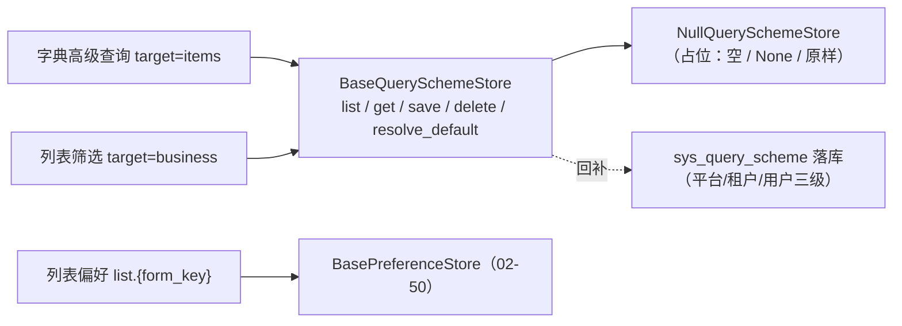

# 列表查询与偏好契约基座详细设计

> 项目骨架 · 02 后端基座 · 04 跨阶段基座 · 20 列表查询与偏好契约基座 · 详细设计

[文档首页](../../../../../../../文档首页.md) › [02-4-20 列表查询与偏好契约基座](../02_后端基座_04_跨阶段基座_20_列表查询与偏好契约基座.md) › 01 详细设计　|　[← 父任务](../02_后端基座_04_跨阶段基座_20_列表查询与偏好契约基座.md)

## 1. 概述 <a id="overview"></a>

- **目标**：落地「列表查询与偏好契约基座」——`app/schemas/filters.py` 的筛选契约（`FilterSpec` / `BaseFilterQuery`，操作符复用 `SCOPE_OPERATORS`，序列化口径与排序 02-40 同源）；`app/listing/` 的列表偏好协议（`ListPreference` / `build_list_pref_key` / `LIST_DENSITIES`，读写经 02-50 用户偏好基座）与查询方案契约（`QueryScheme` / `QuerySchemeScope` / `QuerySchemeTarget` / `BaseQuerySchemeStore` / `NullQuerySchemeStore` / `get_query_scheme_store`）；配置分区、装配接线与占位路由 `/api/v1/query-schemes`。
- **范围**：`app/schemas/filters.py`（新增）、`app/listing/`（新增）、`app/core/config.py`、`app/core/assembly.py`、`app/api/deps.py`、`app/api/query_scheme.py`（新增路由）、`app/api/router.py`、单测；架构 07 / 09、《后端基类清单》/《后端开发规范》/ 计划 / 需求 02-47 登记。
- **不含**（归后续阶段）：筛选真实执行（DB 侧 WHERE、字典高级查询执行引擎）、列表偏好与查询方案真实持久化（`sys_query_scheme` / 偏好落库）、三级作用域权限校验（`query:scheme` 权限码）、字典高级查询 provider 联动 → **列表接口 / 通用能力 / RBAC / 表单定制阶段**；登录态真实鉴权 → 认证阶段。
- **依据**：需求 [02-47](../../../../需求/02_需求_后端基座.md#r02-47)、《[架构设计 · 接口与集成](../../../../../../设计/架构设计/09_架构设计_接口与集成.md)》「公共约定」节、《[架构设计 · 数据架构](../../../../../../设计/架构设计/07_架构设计_数据架构.md)》「租户库表」节、《[组件设计 · 查询筛选区](../../../../../../设计/组件设计/07_展示类/02_组件设计_查询筛选区/02_组件设计_查询筛选区.md)》「查询方案」节、《[概要设计 · 用户喜好](../../../../../../设计/概要设计/04_概要设计_用户喜好.md)》、《[概要设计 · 字典管理](../../../../../../设计/概要设计/09_概要设计_字典管理.md)》、《[API接口规范](../../../../../../规范/API接口规范.md)》「参数与分页」节、《[后端基类清单](../../../../../../后端基类清单.md)》「跨阶段基座」节。

## 2. 现状与差距 <a id="gap"></a>

| 现状 | 差距 |
| --- | --- |
| 排序契约 `SortSpec` / `BaseSortQuery` 与分页契约 `BasePageQuery` / `BaseCursorQuery` 已就位（02-2-5 / 02-40） | 列表查询缺**筛选参数序列化**契约（字段名直传 / 多值逗号 / 区间 `*_start`·`*_end` / 布尔 1·0），各接口自定 |
| 用户偏好基座已就位（02-4-23 `BasePreferenceStore`），列表偏好键 `list.{form_key}` 口径已定（概要 04 §2.2） | 无列表偏好协议数据契约（`columns` / `pageSize` / `density` / `query`），列表页会各自拼 JSON |
| `sys_query_scheme` 已泛化登记（概要 09 / 07 数据架构：`target=items|business`、三级 scope），接口 `/api/v1/query-schemes` 已定 | 无 `BaseQuerySchemeStore` 契约与占位实现；三级优先级解析无统一落点 |
| 路由基座（02-6-1）已就位 | 查询方案无占位路由 |

## 3. 交付物清单 <a id="tree"></a>

```text
backend/
├── app/schemas/filters.py                 # 新增：FILTER_OPERATORS / FILTER_MULTI_SEPARATOR / FilterSpec / BaseFilterQuery
├── app/listing/__init__.py                # 新增：能力域包（docstring 口径）
├── app/listing/base.py                    # 新增：LIST_PREF_KEY_PREFIX / LIST_DENSITIES / build_list_pref_key / ListColumnPreference / ListPreference / QuerySchemeScope / QuerySchemeTarget / QueryScheme / BaseQuerySchemeStore / get_query_scheme_store
├── app/listing/null.py                    # 新增：NullQuerySchemeStore（固定返回空 / None / 原样）
├── app/core/config.py                     # 修改：Settings 增 query_scheme_store 分区（PluginSelection）
├── app/core/assembly.py                   # 修改：_NULL_MODULES 增 app.listing.null + PLUGIN_WIRINGS 增 query_scheme_store 接线
├── app/api/deps.py                        # 修改：导出 get_query_scheme_store
├── app/api/query_scheme.py                # 新增：占位路由 /api/v1/query-schemes（BaseRouter）
├── app/api/router.py                      # 修改：登记 query_scheme 路由
└── tests/
    ├── schemas/test_filters.py            # 新增：Kiwi 781（筛选契约 / 操作符 / 序列化）
    └── listing/test_listing.py            # 新增：Kiwi 781（列表偏好协议 / 查询方案契约 / 占位 / 依赖解析 / 占位路由）

bms文档/
├── 设计/架构设计/09_架构设计_接口与集成.md    # 修改：「公共约定」补列表查询与偏好 / 查询方案口径
├── 设计/架构设计/07_架构设计_数据架构.md      # 修改：「租户库表」查询方案口径
├── 后端基类清单.md                            # 修改：§9 跨阶段基座补一行 + §10 继承链
├── 规范/后端开发规范.md                        # 修改：「后端基座体系」节补列表查询与偏好口径
├── 项目/01_项目骨架/计划/01_计划_项目骨架.md  # 修改：§3.1 后续阶段待办（真实实现行）+ 02-4-20 偏差跟踪
├── 项目/01_项目骨架/需求/02_需求_后端基座.md  # 修改：需求 02-47 补实现期要点注块
├── 项目/…/02_后端基座_04_跨阶段基座/…20….md   # 修改：参考文档补本设计 / 实施 / 测试链接，实施后回写状态
└── 项目/…/02_后端基座_04_跨阶段基座.md        # 修改：子任务清单 20 状态 / 完成日期回写
```

## 4. 筛选契约（`app/schemas/filters.py`） <a id="filters"></a>

| 成员 | 形态 | 说明 |
| --- | --- | --- |
| `FILTER_OPERATORS` | `tuple[str, ...]` 常量 | 操作符白名单：复用数据范围 `SCOPE_OPERATORS`（`eq` / `ne` / `in` / `like` / `gt` / `gte` / `lt` / `lte` / `between` / `is_null` / `is_not_null`，11 种） |
| `FILTER_MULTI_SEPARATOR` | `str` 常量，`","` | 多值（`in` / `not_in`）逗号分隔口径 |
| `FilterSpec(BaseSchema)` | 数据契约 | `field` / `operator`（默认 `eq`）/ `value`；单条筛选条件 |
| `FilterSpec.serialize()` | 方法 | 按《API接口规范》口径序列化为查询参数：等值直传 `{field: value}`；多值 `{field: "v1,v2"}`；区间 `{field_start: v1, field_end: v2}`；布尔 1/0 |
| `BaseFilterQuery(BaseSchema)` | 列表查询请求契约 | `keyword`（跨字段模糊）+ `filters: list[FilterSpec]`；`to_query_params()` 合并序列化 |
| `serialize_filters(filters)` | 函数 | `FilterSpec` 列表 → 查询参数字典（同名字段后者覆盖） |

**口径**（与 02-40 排序同源，均落 `app/schemas/`）：

| 情形 | 处置 |
| --- | --- |
| 操作符来源 | 复用 `app.scope.base.SCOPE_OPERATORS`（与数据范围过滤同一个白名单，避免两处漂移） |
| 多值 | `in` / `not_in` 以逗号分隔字符串（`field=v1,v2`），与《API接口规范》一致 |
| 区间 | `between` 序列化为 `field_start` / `field_end`（单边可空）；日期 ISO 8601 UTC |
| 布尔 | `field=1` / `field=0`（不传即「全部」） |
| 空条件 | 未填条件不参与请求（不传空串 / null） |
| 类型 | `value` 用 `object`（原样承载；类型 / 长度校验随真实实现） |

## 5. 列表偏好协议与查询方案契约（`app/listing/`） <a id="listing"></a>

### 5.1 列表偏好协议 <a id="list-pref"></a>

| 成员 | 形态 | 说明 |
| --- | --- | --- |
| `LIST_PREF_KEY_PREFIX` | `str` 常量，`"list"` | 列表偏好键前缀（域） |
| `LIST_DENSITIES` | `tuple[str, ...]`，`("default", "small")` | 表格密度取值（对齐《概要设计 · 用户喜好》§2.2） |
| `build_list_pref_key(form_key)` | 函数 | 列表偏好键 `list.{form_key}`（经 02-50 `BasePreferenceStore` 读写） |
| `ListColumnPreference(BaseSchema)` | 数据契约 | 列偏好：`prop` / `visible` / `order` / `width` |
| `ListPreference(BaseSchema)` | 数据契约 | 列表偏好：`columns` / `page_size` / `density` / `query`（上次筛选条件 JSON） |

口径：偏好值 JSON 结构 `{query, columns:[{prop,visible,order,width}], pageSize, density}`（概要 04 §2.2）；读写**经 02-50** `BasePreferenceStore`（键 `build_list_pref_key(form_key)`），**列表页不自建偏好存储**；排序列 / 页码 / 选中 / 展开为会话态不入偏好；「重置」清除 `query` 子键。

### 5.2 查询方案契约 <a id="scheme"></a>

| 成员 | 形态 | 说明 |
| --- | --- | --- |
| `QuerySchemeScope` | `StrEnum`：`user` / `tenant` / `platform` | 方案作用域三级 |
| `QuerySchemeTarget` | `StrEnum`：`items` / `business` | 方案目标：字典高级查询 / 列表筛选 |
| `QueryScheme(BaseSchema)` | 数据契约 | `id`（可空，新建无 id）/ `name` / `scope` / `owner_id` / `target` / `dict_type` / `field_key` / `provider_key` / `conditions` / `params` / `layout` / `is_default` / `shared` / `status` |
| `BaseQuerySchemeStore(BasePluggable, ABC)` | 能力域契约 | `key = plugin_key = "query_scheme_store"` |
| `list(target, *, field_key=None)` | 抽象方法（async） | 列方案（按 `target`、可选按 `field_key` 过滤） |
| `get(scheme_id)` | 抽象方法（async） | 取单个方案（未命中 `None`） |
| `save(scheme)` | 抽象方法（async） | 保存 / 更新方案（返回落库后的方案） |
| `delete(scheme_id)` | 抽象方法（async） | 删除方案（返回是否删除） |
| `resolve_default(target, field_key)` | 抽象方法（async） | 按三级优先级（个人 > 租户 > 平台）解析默认方案；无则 `None` |
| `NullQuerySchemeStore` | 占位实现 | `list` 空元组 / `get` None / `save` 原样返回 / `delete` False / `resolve_default` None（不落库） |
| `get_query_scheme_store(request)` | 提供者 | 取应用级单例 |

口径：

| 情形 | 处置 |
| --- | --- |
| 泛化 | 一份 `sys_query_scheme` 供字典高级查询（`target=items`，`dict_type` 填类型）与列表筛选（`target=business`，`field_key=form_key`）共用 |
| `name` | 方案名（组件设计需命名 / 重名覆盖 / 另存为）；概要字段清单漏列，本任务补上 |
| 三级优先级 | 个人（`scope=user`、`owner_id` 当前用户）> 租户（`scope=tenant`）> 平台（`scope=platform`）；`resolve_default` 返回命中最高优先级且 `is_default` 的方案 |
| 权限 | 个人方案免权限码；租户 / 共享方案维护需 `query:scheme`（真实随 RBAC 阶段） |
| 条件结构 | `conditions` 为条件组 JSON（`{logic:'AND', children:[{field, operator, value}]}`），操作符与 `FILTER_OPERATORS` / 数据范围同源 |



## 6. 占位路由（`app/api/query_scheme.py`） <a id="route"></a>

`router = BaseRouter(key="query_scheme", prefix="/query-schemes", tags=["query_scheme"], dependencies=[Depends(require_auth)])`：

| 方法 | 路径 | 说明 | 响应 |
| --- | --- | --- | --- |
| GET | `/api/v1/query-schemes` | 列方案（`target` 必填、`field_key` 可选） | 方案数组 |
| GET | `/api/v1/query-schemes/default` | 按三级优先级解析默认方案 | 方案或 `null` |
| GET | `/api/v1/query-schemes/{scheme_id}` | 方案详情 | 方案或 404 |
| POST | `/api/v1/query-schemes` | 新建 / 保存方案 | 方案 |
| PUT | `/api/v1/query-schemes/{scheme_id}` | 更新方案 | 方案 |
| DELETE | `/api/v1/query-schemes/{scheme_id}` | 删除方案 | `null` |

- `/default` 路由**先于** `/{scheme_id}` 登记（避免路径吞并）。
- 请求 / 响应契约复用 `QueryScheme`（`BaseSchema`）；`id` 可空（新建）。
- **登录即可**（个人方案免权限码）：占位期经 `Depends(require_auth)`；租户 / 共享方案 `query:scheme` 校验随 RBAC 阶段。

## 7. 应用装配与依赖注入 <a id="di"></a>

| 位置 | 变更 |
| --- | --- |
| `app/core/config.py` | `Settings` 增 `query_scheme_store: PluginSelection` |
| `app/core/assembly.py` | `_NULL_MODULES` 增 `app.listing.null`；`PLUGIN_WIRINGS` 增 `PluginWiring("query_scheme_store", BaseQuerySchemeStore, "query_scheme_store", "query_scheme_store")` |
| `app/api/deps.py` | 导出 `get_query_scheme_store` |
| `app/api/router.py` | 模块列表增 `query_scheme`（登记路由 → 统一挂载 `/api/v1`） |

## 8. 继承与分层 <a id="base"></a>

- `BaseQuerySchemeStore → BasePluggable → BaseCapability (+ BaseAsyncResource) → BaseObject`。
- `NullQuerySchemeStore → BaseQuerySchemeStore + BaseNullObject → BasePlaceholder → BaseObject`。
- 数据契约 `FilterSpec` / `BaseFilterQuery` / `ListPreference` / `ListColumnPreference` / `QueryScheme` → `BaseSchema`。

## 9. 登记落点 <a id="register"></a>

| 落点 | 登记内容 |
| --- | --- |
| 《架构设计 · 接口与集成》「公共约定」节 | 补列表查询与偏好基座口径：筛选参数序列化（与排序同源）、列表偏好键 `list.{form_key}` 经偏好基座、查询方案三级 `BaseQuerySchemeStore` + 通用接口 `/api/v1/query-schemes` |
| 《架构设计 · 数据架构》「租户库表」节 | 补查询方案基座口径 |
| 《后端基类清单》§9 跨阶段基座 | 新增「列表查询与偏好」行（`app/listing/` / `app/schemas/filters.py`，契约与占位状态）；§10 继承链补两条 |
| 《后端开发规范》「后端基座体系」节 §3.1 | 补口径：列表筛选 / 分页参数与序列化走基座契约，列表偏好经 `BasePreferenceStore`（键 `list.{form_key}`），查询方案经 `BaseQuerySchemeStore` |
| 计划《01_计划_项目骨架》§3.1 + 02-4-20 偏差跟踪 | 新增「列表查询与偏好真实实现（筛选执行 / 方案落库 / 权限码）」行 |
| 需求 [02-47](../../../../需求/02_需求_后端基座.md#r02-47) | 补 `> 注：实现期要点` 块；实施完成后回写状态 / 完成日期 |
| 02-4-20 任务文档 | 参考文档补本设计 / 实施 / 测试链接；实施后回写状态 / 完成日期 |

## 10. 测试设计（Kiwi 781 先行） <a id="tests"></a>

用例**先登记 Kiwi TCMS 再编码**；本任务新分配 **Kiwi 781**：

| Kiwi | 用例 | 断言要点 | 自动化文件 |
| --- | --- | --- | --- |
| 781 | 筛选契约与操作符 | `FILTER_OPERATORS == SCOPE_OPERATORS`（11 种）；`FilterSpec` 默认 `eq` | `tests/schemas/test_filters.py` |
| 781 | 筛选序列化 | 等值直传 / `in` 逗号 / `between` `*_start`·`*_end`；`BaseFilterQuery.to_query_params()` 合并 keyword | 同上 |
| 781 | 列表偏好协议 | `build_list_pref_key("user_form") == "list.user_form"`；`LIST_DENSITIES`；`ListPreference` 结构默认值 | `tests/listing/test_listing.py` |
| 781 | 查询方案枚举与契约 | `QuerySchemeScope` / `QuerySchemeTarget` 取值；`QueryScheme` 字段（含 `name`） | 同上 |
| 781 | 占位实现 | `NullQuerySchemeStore` list 空 / get None / save 原样 / delete False / resolve_default None | 同上 |
| 781 | 依赖解析 | `create_app()` 装配 `NullQuerySchemeStore`；`resolve_plugin("query_scheme_store", None)` 同一实例 | 同上 |
| 781 | 占位路由 | `GET /api/v1/query-schemes`（`target=business`）空数组；`GET /default` `null`；`POST` 回显；`DELETE` `data:null` | 同上 |

回归：全量 `pytest`（含接口冒烟）。

## 11. 实施步骤 <a id="steps"></a>

1. 新增 `app/schemas/filters.py`（`FILTER_OPERATORS` / `FilterSpec` / `BaseFilterQuery` / `serialize_filters`）。
2. 新增 `app/listing/`（偏好协议 + 查询方案契约 + 占位 + 提供者）。
3. `app/core/config.py` / `app/core/assembly.py` / `app/api/deps.py` / `app/api/router.py` / `app/api/query_scheme.py` 装配与占位路由。
4. 测试：先登记 Kiwi 781，再写 `tests/schemas/test_filters.py`、`tests/listing/test_listing.py`。
5. 登记：架构 07 / 09、《后端基类清单》§9 / §10、《后端开发规范》§3.1、计划 §3.1、需求 02-47 注块、任务 / 父任务状态。
6. 验证：`pytest --cov=app`、`ruff check` / `ruff format --check` / `pyright` 全绿；`check-base.py` / `check-backend-base.py` 通过。
7. 回写：实施 / 测试记录 + 任务（02-4-20、02_04）与需求 02-47 状态、计划表。
8. 收尾：按「处理偏差与遗留」套路闭环后提交（推送另议）。

## 12. 验收映射 <a id="accept-map"></a>

| 完成标准（需求 02-47 / 任务 02-4-20） | 验证方式 |
| --- | --- |
| 查询契约与偏好协议就位 | `FilterSpec` / `BaseFilterQuery` / `ListPreference` / `QueryScheme` + Kiwi 781 |
| 查询方案契约三级与 `name` 字段 | `BaseQuerySchemeStore`（`list` / `get` / `save` / `delete` / `resolve_default`）+ `QueryScheme.name` |
| 依赖注入可解析、应用可启动不报错 | 装配单例 + 提供者解析用例 + 应用冒烟 + 占位路由 |
| 占位实现固定返回 | `NullQuerySchemeStore` 空 / None / 原样；无落库 |
| 不实现真实能力 | 无筛选执行 / 方案落库 / 权限码实现 |
| 登记齐备 | 架构 07 / 09、《后端基类清单》§9 / §10、《后端开发规范》§3.1、计划 §3.1 |
| 无 lint / 类型错误 | `ruff check` / `ruff format --check` / `pyright` |

## 13. 边界与开放项 <a id="boundary"></a>

- **筛选真实执行**（DB 侧 WHERE 拼接、白名单防注入、字典高级查询执行引擎）→ **列表接口 / 表单定制阶段**。
- **列表偏好与查询方案真实持久化**（`sys_user_preference` / `sys_query_scheme` 落库、跨端同步）→ **通用能力阶段**；已登记计划 §3.1。
- **三级作用域权限码** `query:scheme`（租户 / 共享方案维护）→ **RBAC 阶段**；个人方案免权限码。
- **登录态真实鉴权** → **认证阶段**（`require_auth` 占位）。
- **查询方案与字典高级查询 provider 联动** → 字典取数基座（02-4-17）/ 表单定制阶段。
- **测试**：筛选执行 / 方案落库 / 权限码用例随对应阶段补充。

## 14. 对齐记录 <a id="align"></a>

| # | 事项 | 结论 |
| --- | --- | --- |
| 1 | 代码落点 | `app/schemas/filters.py`（筛选契约）+ `app/listing/`（偏好协议 + 查询方案）（用户拍板） |
| 2 | 查询契约形态 | `FilterSpec` + `BaseFilterQuery`，操作符复用 `SCOPE_OPERATORS`（用户拍板） |
| 3 | 列表偏好协议 | `ListPreference` + `build_list_pref_key` + `LIST_DENSITIES`；读写经 02-50（用户拍板） |
| 4 | 查询方案方法集 | `list` / `get` / `save` / `delete` / `resolve_default`（三级优先级）（用户拍板） |
| 5 | `name` 字段 | `QueryScheme` 补 `name`（用户拍板） |
| 6 | 占位实现 | `NullQuerySchemeStore`（空 / None / 原样 / 恒 False）（用户拍板） |
| 7 | 路由 | 落占位 `/api/v1/query-schemes`（含 `/default`）（用户拍板） |
| 8 | 登记落点 | 架构 07 / 09、《后端基类清单》§9 / §10、《后端开发规范》§3.1、计划 §3.1、需求 02-47 注块 |
| 9 | 测试 | 新分配 Kiwi 781（平台登记 + `@pytest.mark.kiwi_id(781)`） |
| 10 | 工时 / 窗口 | 4h；阶段一补做窗口序 2（2026-09-20） |
| 11 | 交付范围 | 一条龙（设计 / 实施 / 测试 / 登记 / 记录 / 提交 / 偏差遗留 / 收尾） |

> 本文档依《文档生成规范》编写 · 关键决策逐项确认
