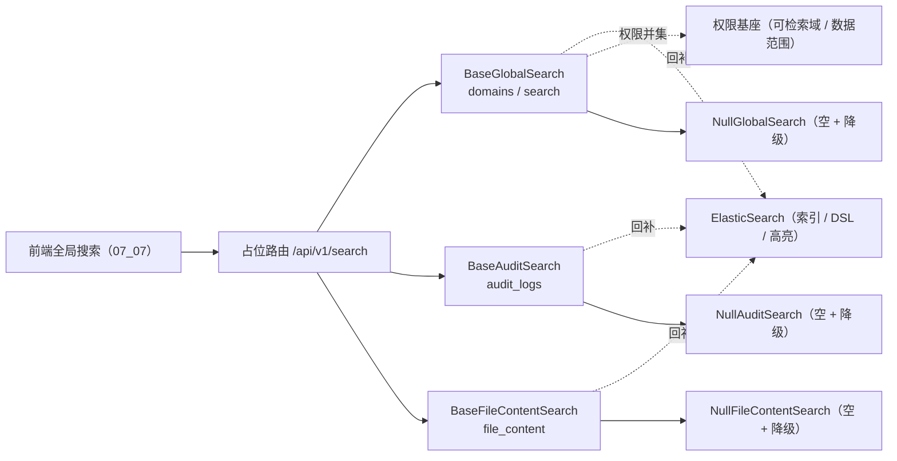

# 全文检索查询契约基座详细设计

> 项目骨架 · 02 后端基座 · 04 跨阶段基座 · 21 全文检索查询契约基座 · 详细设计

[文档首页](../../../../../../../文档首页.md) › [02-4-21 全文检索查询契约基座](../02_后端基座_04_跨阶段基座_21_全文检索查询契约基座.md) › 01 详细设计　|　[← 父任务](../02_后端基座_04_跨阶段基座_21_全文检索查询契约基座.md)

## 1. 概述 <a id="overview"></a>

- **目标**：落地「全文检索查询契约基座」——新建独立能力域 `app/globalsearch/`：多域聚合检索契约 `BaseGlobalSearch`（`domains()` 可检索域并集 + `search` 多域分组）、审计日志检索契约 `BaseAuditSearch`（`audit_logs`）、文件内容检索契约 `BaseFileContentSearch`（`file_content`）；三份缺省实现 `NullGlobalSearch` / `NullAuditSearch` / `NullFileContentSearch`（空结果 + 降级标记）；数据契约（`GlobalSearchHit` / `GlobalSearchGroup` / `GlobalSearchResult` / `AuditLogHit` / `AuditSearchResult` / `FileContentHit` / `FileContentSearchResult`）与常量（可检索域 / 降级原因 / 降级替代入口 / 默认条数 / 页深上限）；配置分区 `global_search` / `audit_search` / `file_content_search`、装配接线与占位路由 `/api/v1/search`；检索错误码 `10101`~`10107` 单一登记。
- **范围**：`app/globalsearch/`（新增）、`app/api/search.py`（新增占位路由）、`app/core/error_codes.py`、`app/core/config.py`、`app/core/assembly.py`、`app/api/deps.py`、`app/api/router.py`、单测；架构 09「公共约定」「错误码分段」/ 25「查询路径」「降级策略」、《后端基类清单》§9 / §10、《后端开发规范》§3.1、计划 §3 / §3.1、需求 02-48 登记。
- **不含**（归后续阶段）：真实 ElasticSearch 索引与查询 DSL、多域聚合与权限并集的实际过滤、租户隔离与动作级数据范围强制注入、审计日志跨月多索引路由与哈希链交叉、文件内容解析与重解析、ES 故障降级为数据库模糊查询与恢复重建、限深 / 限流 / 超时 → **全文检索阶段（十六）**；登录态真实鉴权 → **认证阶段**；权限码 `log:query` / `file:query` / 动作级数据范围 → **RBAC 阶段**。
- **依据**：需求 [02-48](../../../../../需求/02_需求_后端基座.md#r02-48)、《[架构设计 · 全文检索](../../../../../../../设计/架构设计/25_架构设计_子系统_全文检索.md)》「查询路径」「降级策略」节、《[架构设计 · 接口与集成](../../../../../../../设计/架构设计/09_架构设计_接口与集成.md)》「公共约定」「错误码分段」节、《[后端基类清单](../../../../../../../后端基类清单.md)》「跨阶段基座」节、《[后端开发规范](../../../../../../../规范/后端开发规范.md)》「后端基座体系」节、《[概要设计 · 全文检索](../../../../../../../设计/概要设计/33_概要设计_全文检索.md)》、已交付 [02-4-3 全文检索基座](../../02_后端基座_04_跨阶段基座_03_全文检索基座/02_后端基座_04_跨阶段基座_03_全文检索基座.md)、前端冻结契约 [07_01 占位版交付](../../../../../04_前端组件库/任务/07_展示类/07_展示类_01_占位版交付/07_展示类_01_占位版交付.md)。

## 2. 现状与差距 <a id="gap"></a>

| 现状 | 差距 |
| --- | --- |
| `02-19` `BaseSearchIndex` 只覆盖单索引 `index` / `delete` / `search`（返回 id + 分数 + 高亮） | 前端全局搜索（07_07）需多域聚合分组、可检索域按权限并集、审计日志检索、文件内容检索与降级标记；缺上层契约则多域聚合与降级提示各写各的 |
| 架构 25 已登记「可检索域按权限并集」「降级标记与替代入口」 | 域清单、降级字段与分组结果结构未在契约层固化，前后端口径易漂 |
| 概要设计 33 已定三路径 `/search/global`、`/search/logs`、`/search/files` 与 `10101`~`10107` 错误码 | 路径与错误码未在代码层登记，调用面与码位无落点 |
| 数据查询提供者（02-4-9）、通知 / 列表 / AI 对话契约基座已就位 | 新能力域无提供者与占位路由，「依赖注入可解析」无落点 |

## 3. 交付物清单 <a id="tree"></a>

```text
backend/
├── app/globalsearch/__init__.py            # 新增：能力域包（docstring 口径）
├── app/globalsearch/base.py                # 新增：常量 / 数据契约 / 三契约 / 三提供者
├── app/globalsearch/null.py                # 新增：NullGlobalSearch / NullAuditSearch / NullFileContentSearch
├── app/api/search.py                       # 新增：占位路由 /api/v1/search（BaseRouter）
├── app/core/error_codes.py                 # 修改：登记检索错误码 10101~10107
├── app/core/config.py                      # 修改：Settings 增三检索分区
├── app/core/assembly.py                    # 修改：_NULL_MODULES 增 globalsearch.null + PLUGIN_WIRINGS 增三条接线
├── app/api/deps.py                         # 修改：导出三提供者
├── app/api/router.py                       # 修改：登记 search 路由
└── tests/
    └── globalsearch/test_global_search.py  # 新增：Kiwi（三契约 / 数据契约 / 降级 / 空实现 / 依赖解析 / 占位路由）

bms文档/
├── 设计/架构设计/09_架构设计_接口与集成.md            # 修改：「公共约定」补检索接口口径；「错误码分段」登记 101xx 子段
├── 设计/架构设计/25_架构设计_子系统_全文检索.md        # 修改：「查询路径」补契约基座；「降级策略」补降级字段
├── 后端基类清单.md                                    # 修改：§9 跨阶段基座补行 + §10 继承链 + 目录
├── 规范/后端开发规范.md                                # 修改：「后端基座体系」§3.1 补检索口径
├── 项目/01_项目骨架/计划/01_计划_项目骨架.md          # 修改：§3 剩余排期 / 已完成 + §3.1 后续阶段待办 + 进展统计
├── 项目/01_项目骨架/需求/02_需求_后端基座.md          # 修改：需求 02-48 补实现期要点注块
├── 项目/…/02_后端基座_04_跨阶段基座/…21….md           # 修改：参考文档补本设计 / 实施 / 测试链接，实施后回写状态
└── 项目/…/02_后端基座_04_跨阶段基座.md                # 修改：子任务清单 21 状态 / 完成日期回写
```

## 4. 全文检索查询能力域（`app/globalsearch/`） <a id="contract"></a>

### 4.1 常量 <a id="constants"></a>

| 常量 | 值 | 说明 |
| --- | --- | --- |
| `GLOBAL_SEARCH_DOMAINS` | `("user", "dept", "role", "dict", "purchase", "file_meta", "help_article")` | 可检索域（对齐概要设计 33 `doc_type`；实际可见域 = 权限并集，由实现在 `domains()` 给出） |
| `DEGRADE_REASONS` | `("unavailable", "timeout", "fallback")` | 降级原因（不可用 / 超时 / 已降级兜底） |
| `NULL_DEGRADE_REASON` | `"unavailable"` | 占位降级原因（`NullXxx` 固定返回） |
| `NULL_SEARCH_ALTERNATIVE` | `"db_fuzzy"` | 占位替代入口口径（ES 不可用时降级数据库模糊查询 / 列表页兜底） |
| `DEFAULT_GLOBAL_SEARCH_SIZE` | `20` | 默认返回条数 |
| `GLOBAL_SEARCH_MAX_PAGE` | `100` | 分页限深上限（对齐概要设计 33「limit/offset 限深 ≤ 100 页」） |

### 4.2 数据契约 <a id="data"></a>

| 契约 | 字段 |
| --- | --- |
| `GlobalSearchHit` | `doc_type` / `biz_id` / `title` / `highlight`（字段 → 高亮片段，白名单清洗由实现 / 前端渲染承担） / `updated_at`（可空） |
| `GlobalSearchGroup` | `doc_type` / `hits`（本域命中） / `total`（本域命中总数） |
| `GlobalSearchResult` | `groups`（按域分组） / `total` / `degraded` / `degrade_reason`（可空） / `alternative`（可空） |
| `AuditLogHit` | `log_type` / `record_id` / `title` / `user_id`（可空） / `username`（可空） / `highlight` / `time`（可空） |
| `AuditSearchResult` | `hits` / `total` / `degraded` / `degrade_reason` / `alternative` |
| `FileContentHit` | `file_id` / `name` / `mime_type`（可空） / `highlight` / `updated_at`（可空） |
| `FileContentSearchResult` | `hits` / `total` / `degraded` / `degrade_reason` / `alternative` |

- 全部继承 `BaseSchema`（JSON 友好、跨端事件结果易演进）；`highlight` 为 `dict[str, str]`。
- 结果只承载**业务标识与高亮片段**（不返详情），详情一律回查库（对齐架构 25「查询路径」与 `02-19` 口径）。

### 4.3 契约 <a id="methods"></a>

| 契约 | 键 | 方法 | 语义 |
| --- | --- | --- | --- |
| `BaseGlobalSearch` | `global_search` | `async domains() -> Sequence[str]` | 当前用户可检索域（权限并集）；无权限域不返回 |
| `BaseGlobalSearch` | `global_search` | `async search(q, *, types=None, page=1, size=DEFAULT_GLOBAL_SEARCH_SIZE) -> GlobalSearchResult` | 多域聚合检索：按域分组 + 高亮；`types` 限定域（None = 全部可检索域） |
| `BaseAuditSearch` | `audit_search` | `async audit_logs(q, *, log_type=None, start_time, end_time, page=1, size=DEFAULT_GLOBAL_SEARCH_SIZE) -> AuditSearchResult` | 审计日志检索：时间范围**必填**（单次 ≤ 31 天，跨月多索引由实现路由） |
| `BaseFileContentSearch` | `file_content_search` | `async file_content(q, *, file_type=None, page=1, size=DEFAULT_GLOBAL_SEARCH_SIZE) -> FileContentSearchResult` | 文件内容检索：返回文件 ID 与上下文高亮 |
| 提供者 | — | `get_global_search` / `get_audit_search` / `get_file_content_search` | 依赖注入提供者（应用级单例；公共依赖经 `app/api/deps.py` 统一导出） |

### 4.4 口径 <a id="semantics"></a>

| 情形 | 处置 |
| --- | --- |
| 同步性 | 全部**异步**（真实实现为异步 ES 查询，回补时调用面零改动） |
| 权限并集 | 可检索域 = 当前用户已授予业务权限的并集（用户 / 部门 / 角色 / 字典 / 产品单据 / 文件元数据 / 帮助文章）；无权限域不展示、不查询 |
| 租户隔离与数据范围 | `tenant_id` 强制隔离 + 动作级数据范围过滤由**实现**从上下文与权限基座注入，**契约方法不显式传租户 / 数据范围参数、调用方不可绕过** |
| 详情回查 | 结果只含业务标识与高亮片段；点击跳转目标页回查库取最新（避免双写一致性难题） |
| 高亮安全 | 高亮片段渲染前按白名单清洗（防 XSS）；契约只承载片段文本 |
| 降级 | 引擎不可用 / 超时 / 降级兜底时返回 `degraded = True` + `degrade_reason` + `alternative`（替代入口），前端提示、不阻塞页面；**契约含降级字段** |
| 审计时间范围 | `start_time` / `end_time` 必填；单次 ≤ 31 天（超限错误码 `10107`），跨月自动路由多索引归实现 |
| 文件不可检索 | 文件未解析 / 解析失败 / OCR 待办时命中标记错误码 `10106`（可经重新解析接口处理），归实现 / 文件管理阶段 |
| 错误码 | 检索错误码 `10101`~`10107` 统一登记于 `app/core/error_codes.py`；文案由前端按 i18n 映射 |
| 不实现真实能力 | 不连 ES、不做多域聚合 / 权限过滤 / 跨月路由 / 降级兜底；`NullGlobalSearch` 固定空结果 + 降级标记 |



## 5. 错误码登记（`app/core/error_codes.py`） <a id="errors"></a>

在 `ErrorCode` 增检索错误码（`1xxxx` 通用段 `101xx` 子段，对齐概要设计 33）：

| 码位 | 名称 | 说明 |
| --- | --- | --- |
| `10101` | `SEARCH_UNAVAILABLE` | 检索服务不可用（ES 故障且降级失败） |
| `10102` | `SEARCH_TIMEOUT` | 检索超时 |
| `10103` | `SEARCH_DEGRADED` | 检索服务降级中（结果可能不完整） |
| `10104` | `SEARCH_INDEX_NOT_READY` | 目标索引不存在或未就绪 |
| `10105` | `SEARCH_REBUILD_RUNNING` | 索引重建任务进行中 |
| `10106` | `SEARCH_FILE_NOT_SEARCHABLE` | 文件内容不可检索（未解析 / 失败 / OCR 待办） |
| `10107` | `SEARCH_TIME_RANGE_EXCEEDED` | 审计日志检索时间范围超限（单次 ≤ 31 天） |

- 本任务只登记码位常量，真实抛错 / 降级分支随全文检索阶段；`10103` 的降级语义同时由契约 `degraded` 字段承载。
- 架构 09「错误码分段」同步登记 `101xx` 检索子段与码位。

## 6. 占位路由（`app/api/search.py`） <a id="route"></a>

`router = BaseRouter(key="search", prefix="/search", tags=["search"], dependencies=[Depends(require_auth)])`——基于 02-6-1 路由基座，统一挂载到 `/api/v1`：

| 方法 | 路径 | 入参 | 响应 | 口径 |
| --- | --- | --- | --- | --- |
| GET | `/api/v1/search/global` | `q`、`types`（多值，可选）、`page` / `size` | `GlobalSearchResult` | 委托 `search(q, types=..., page=..., size=...)`；占位空分组 + 降级 |
| GET | `/api/v1/search/logs` | `q`、`log_type`（可选）、`start_time`、`end_time`、`page` / `size` | `AuditSearchResult` | 委托 `audit_logs(...)`；时间范围必填；占位空 + 降级 |
| GET | `/api/v1/search/files` | `q`、`file_type`（可选）、`page` / `size` | `FileContentSearchResult` | 委托 `file_content(...)`；占位空 + 降级 |

- 结果契约（`BaseSchema`）直接作为响应体数据；无新增请求响应 schema（查询参数经 FastAPI `Query` 绑定）。
- **登录即可**（无权限码）：占位期经 `Depends(require_auth)`（恒定放行）；`log:query` / `file:query` 与动作级数据范围随 RBAC 阶段。
- 限深（`page ≤ GLOBAL_SEARCH_MAX_PAGE`）与限流 / 超时随全文检索阶段实现；占位不校验。

## 7. 应用装配与依赖注入 <a id="di"></a>

| 位置 | 变更 |
| --- | --- |
| `app/core/config.py` | `Settings` 增 `global_search` / `audit_search` / `file_content_search` 三个 `PluginSelection`（未配置 → 解析到 `null`） |
| `app/core/assembly.py` | `_NULL_MODULES` 增 `app.globalsearch.null`（导入即自动登记）；`PLUGIN_WIRINGS` 增三条接线（`state_attr` 同名） |
| `app/api/deps.py` | 导出 `get_global_search` / `get_audit_search` / `get_file_content_search` |
| `app/api/router.py` | 模块列表增 `search`（登记路由 → 统一挂载 `/api/v1`） |

提供者为普通同步函数（取装配 settings 解析单例，无 IO）；真实实现替换占位时调用面零改动。

## 8. 继承与分层 <a id="base"></a>

- `BaseGlobalSearch` / `BaseAuditSearch` / `BaseFileContentSearch` → `BasePluggable` → `BaseCapability`（+ `BaseAsyncResource`）→ `BaseObject`。
- `NullGlobalSearch` / `NullAuditSearch` / `NullFileContentSearch` → 对应契约 + `BaseNullObject` → `BasePlaceholder` → `BaseObject`。
- 数据契约 `GlobalSearchHit` / `GlobalSearchGroup` / `GlobalSearchResult` / `AuditLogHit` / `AuditSearchResult` / `FileContentHit` / `FileContentSearchResult` → `BaseSchema`。

## 9. 登记落点 <a id="register"></a>

| 落点 | 登记内容 |
| --- | --- |
| 《架构设计 · 接口与集成》「公共约定」节 | 补检索接口口径：`/api/v1/search`（global / logs / files，登录即可）、可检索域按权限并集、租户与数据范围检索侧强制、结果只返标识与高亮、降级标记与替代入口、限深 |
| 《架构设计 · 接口与集成》「错误码分段」节 | `1xxxx` 行补 `101xx` 检索子段；「平台已发布码位」补 `10101`~`10107` |
| 《架构设计 · 全文检索》「查询路径」节 | 补查询契约基座口径（多域聚合 / 审计日志 / 文件内容三分契约，可检索域按权限并集，详情回查库） |
| 《架构设计 · 全文检索》「降级策略」节 | 补降级字段口径（`degraded` / `degrade_reason` / `alternative`）与错误码 `10103` |
| 《后端基类清单》§9 跨阶段基座 | 把「全局检索（待实施）」行改为已交付行（`app/globalsearch/`，三契约 / 空实现 / 错误码 / 占位路由 / 状态）；§10 继承链补三条；§目录补 `app/globalsearch/` |
| 《后端开发规范》「后端基座体系」节 §3.1 | 补口径：全局搜索 / 审计日志检索 / 文件内容检索一律经 `app/globalsearch/` 三契约，禁止各模块自建多域聚合与降级提示 |
| 计划《01_计划_项目骨架》§3 / §3.1 | 02-4-21 由剩余排期移入已完成（状态 / 日期）；§3.1 增「全文检索查询真实实现（ES / 权限并集 / 跨月路由 / 降级兜底 / 限深限流）」行；进展统计回写 |
| 需求 [02-48](../../../../../需求/02_需求_后端基座.md#r02-48) | 补 `> 注：实现期要点` 块；实施完成后回写状态 / 完成日期 |
| 02-4-21 任务文档 | 参考文档补本设计 / 实施 / 测试链接；实施后回写状态 / 完成日期 |

## 10. 测试设计（Kiwi 先行） <a id="tests"></a>

用例**先登记 Kiwi TCMS 再编码**；本任务新分配一条用例（分类「平台骨架」/ 优先级 `P2` / 状态 `CONFIRMED` / 标签「自动化」；平台登记后回填编号，题面与平台一致）：

| 用例 | 断言要点 | 自动化文件 |
| --- | --- | --- |
| 契约继承与能力域标识 | 三契约 → `BasePluggable` / `BaseCapability`；三空实现 → `BaseNullObject`；`key` / `plugin_key`（`global_search` / `audit_search` / `file_content_search`）/ `placeholder` | `tests/globalsearch/test_global_search.py` |
| 常量与数据契约 | 可检索域 / 降级原因 / 默认条数 / 页深上限；结果契约字段集与默认值（含降级三字段） | 同上 |
| 空实现固定返回 | `domains` 空；三方法空结果 + `degraded=True` + `degrade_reason` / `alternative` | 同上 |
| 错误码登记 | `ErrorCode` 含 `10101`~`10107` 且取值正确 | 同上 |
| 依赖解析 | `create_app()` 装配三空实现；`resolve_plugin(...)` 同一实例 | 同上 |
| 占位路由 | `GET /search/global`（含 `types` 多值）/ `logs`（时间范围）/ `files` 固定空 + 降级 | 同上 |
| 内存实现 + 路由 | 测试内存实现替换提供者：多域分组 / 域过滤 / 审计命中 / 文件命中 / 有权限域清单 | 同上 |

回归：全量 `pytest`（含接口冒烟）。

## 11. 实施步骤 <a id="steps"></a>

1. 新增 `app/globalsearch/`（常量 / 数据契约 / 三契约 / 三空实现 / 三提供者）。
2. `app/core/error_codes.py` 登记检索错误码 `10101`~`10107`。
3. `app/core/config.py` / `app/core/assembly.py` / `app/api/deps.py` / `app/api/search.py` / `app/api/router.py` 装配与占位路由。
4. 测试：先登记 Kiwi，再写 `tests/globalsearch/test_global_search.py`。
5. 登记：架构 09 / 25、《后端基类清单》§9 / §10 / 目录、《后端开发规范》§3.1、计划 §3 / §3.1、需求 02-48 注块、任务 / 父任务状态。
6. 验证：`pytest --cov=app`、`ruff check` / `ruff format --check` / `pyright` 全绿；`check-base.py` / `check-backend-base.py` 通过。
7. 回写：实施 / 测试记录 + 任务（02-4-21、02_04）与需求 02-48 状态、计划表。
8. 收尾：按「处理偏差与遗留」套路闭环后提交（推送另议）。

## 12. 验收映射 <a id="accept-map"></a>

| 完成标准（需求 02-48 / 任务 02-4-21） | 验证方式 |
| --- | --- |
| 接口 / 抽象声明就位 | `BaseGlobalSearch`（domains / search）+ `BaseAuditSearch`（audit_logs）+ `BaseFileContentSearch`（file_content）+ Kiwi 用例 |
| 降级字段就位 | 三结果契约 `degraded` / `degrade_reason` / `alternative` + 空实现固定降级 + 错误码 `10103` |
| 多域分组与权限并集口径 | `GlobalSearchHit` / `GlobalSearchGroup` / `GlobalSearchResult` + `domains()` + docstring 口径 |
| 错误码登记 | `ErrorCode` `10101`~`10107` + 架构 09 错误码段 |
| 依赖注入可解析、应用可启动不报错 | 装配三空实现 + 提供者解析用例 + 应用冒烟 + 占位路由 |
| 占位实现固定返回 | 三空实现空结果 + 降级标记；无真实 ES / 聚合 / 权限过滤 / 跨月路由 |
| 不实现真实能力 | 无 ES 连接 / 查询 DSL / 数据范围注入 / 降级兜底实现 |
| 登记齐备 | 架构 09 / 25、《后端基类清单》§9 / §10、《后端开发规范》§3.1、计划 §3 / §3.1 |
| 无 lint / 类型错误 | `ruff check` / `ruff format --check` / `pyright` |

## 13. 边界与开放项 <a id="boundary"></a>

- **真实 ES 索引 / 查询 DSL / 高亮 / 多域聚合 / 权限并集过滤 / 租户与数据范围强制注入** → **全文检索阶段（十六）**。
- **审计日志跨月多索引路由 / 时间范围校验（≤ 31 天）/ 哈希链字段交叉** → **全文检索阶段**。
- **文件内容解析 / 重新解析 / 不可检索标记** → 全文检索阶段（解析）+ 文件管理阶段（重解析入口）。
- **降级兜底（数据库模糊查询）与恢复重放重建** → 全文检索阶段；本任务只固化降级字段与错误码。
- **限深 / 限流 / 超时快速失败** → 全文检索阶段；占位不校验。
- **权限码 `log:query` / `file:query` 与动作级数据范围** → **RBAC 阶段**；登录态真实鉴权 → **认证阶段**（`require_auth` 占位）。
- **测试**：真实索引 / 聚合 / 权限过滤 / 降级兜底 / 跨月路由用例随对应阶段补充。

## 14. 对齐记录 <a id="align"></a>

| # | 事项 | 结论 |
| --- | --- | --- |
| 1 | 代码落点 | **新建独立能力域 `app/globalsearch/`**；插件键与配置分区 `global_search` / `audit_search` / `file_content_search`（用户拍板） |
| 2 | 契约拆分 | **拆三契约**：`BaseGlobalSearch`（domains / search）+ `BaseAuditSearch`（audit_logs）+ `BaseFileContentSearch`（file_content）；三空实现（用户拍板） |
| 3 | 可检索域 | `BaseGlobalSearch` 增 `domains()`（权限并集）（用户拍板） |
| 4 | 数据契约形态 | 全部 `BaseSchema`（pydantic，JSON 友好）（用户拍板） |
| 5 | 结果契约 | 分组结果（`GlobalSearchHit` / `GlobalSearchGroup` / `GlobalSearchResult`）+ 降级三字段（`degraded` / `degrade_reason` / `alternative`）（用户拍板） |
| 6 | 三方法结果 | **专用结果契约**（多域分组 / 审计命中 / 文件命中字段各异），各自含降级三字段（用户拍板） |
| 7 | 占位路由 | 新增 `/api/v1/search/global` / `/search/logs` / `/search/files`（对齐概要设计 33）（用户拍板） |
| 8 | 错误码 | **登记 `10101`~`10107`** 常量并回写架构 09 错误码段（用户拍板） |
| 9 | 表声明 | 不新增表声明（无新落点）（用户拍板） |
| 10 | 登记落点 | 架构 09 / 25、《后端基类清单》§9 / §10、《后端开发规范》§3.1、计划 §3 / §3.1、需求 02-48 注块 |
| 11 | 测试 | 新登记 Kiwi 用例一条（平台登记 + `@pytest.mark.kiwi_id(<编号>)`） |
| 12 | 工时 / 窗口 | 2h；阶段一补做窗口序 5（2026-09-20） |
| 13 | 交付范围 | 一条龙（设计 / 实施 / 测试 / 登记 / 记录 / 提交 / 偏差遗留 / 收尾） |

> 本文档依《文档生成规范》编写 · 关键决策逐项确认
