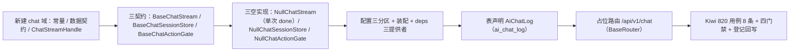

# AI 对话基座实施记录

> 项目骨架 · 02 后端基座 · 04 跨阶段基座 · 22 AI 对话基座 · 实施记录

[文档首页](../../../../../../../文档首页.md) › [02-4-22 AI 对话基座](../02_后端基座_04_跨阶段基座_22_AI对话基座.md) › 01 实施　|　[← 父任务](../02_后端基座_04_跨阶段基座_22_AI对话基座.md)

## 1. 实施信息 <a id="meta"></a>

| 项 | 值 |
| --- | --- |
| 任务 | [02-4-22 AI 对话基座](../02_后端基座_04_跨阶段基座_22_AI对话基座.md) |
| 对应需求 | [02-49](../../../../../需求/02_需求_后端基座.md#r02-49) |
| 详细设计 | [22_详细设计_01_AI对话基座](../设计/22_详细设计_01_AI对话基座.md) |
| 实施日期 | 2026-09-20 |
| 实施人 | minjian |
| 实施环境 | 开发机（Ubuntu，Python 3.14 / uv） |
| 提交 | 待提交 |
| 结论 | 完成 |

## 2. 实施概览 <a id="overview"></a>



结果小结：新建独立能力域 `app/chat/`——流式对话契约 `BaseChatStream`（`stream` 返回 `ChatStreamHandle`（流标识 + 增量事件序列 `token` / `done` / `error` + 审计标识）/ `stop(stream_id)`）、会话查询契约 `BaseChatSessionStore`（`list_sessions` / `get_session` / `list_messages` / `delete_session`）、自动执行确认撤销契约 `BaseChatActionGate`（`confirm_action` / `revoke_action`）；三空实现与数据契约 / 常量；`AiChatLog`（`ai_chat_log`，按月分片）表声明；占位路由 `/api/v1/chat` 基于 02-6-1 路由基座统一挂载；应用可启动、提供者可解析；`pytest` / `ruff` / `pyright` 全绿，新增模块覆盖率 100%。

## 3. 实施过程 <a id="process"></a>

1. **能力域契约与数据契约**：新增 `app/chat/base.py`——常量（`CHAT_STREAM_EVENT_TYPES` / `CHAT_MESSAGE_STATUSES` / `CHAT_MODULES` / `CHAT_MESSAGE_ROLES` / `CHAT_CITATION_TYPES` / `CHAT_RESULT_KINDS` / `CHAT_ACTION_STATUSES` / `AI_AUTO_EXECUTE_KEY` / `AI_AUTO_APPROVE_KEY` / `NULL_CHAT_STREAM_ID`）；数据契约 `ChatStreamEvent` / `ChatCitation` / `ChatMessageResult` / `ChatSessionMessage` / `ChatSession` / `ChatActionResult`（`BaseSchema`）与运行时句柄 `ChatStreamHandle`（frozen dataclass）；三契约（`key = plugin_key` 分别 `chat_stream` / `chat_session_store` / `chat_action_gate`）与三提供者 `get_chat_stream` / `get_chat_session_store` / `get_chat_action_gate`；`messages` 入参复用 02-18 `app.llm.base.ChatMessage`。
2. **契约口径**：流式契约只描述事件语义（不绑定传输实现）；会话为 `ai_chat_log` 审计数据派生视图（`session_id` 分组键，不另建事实源）；自动执行强制二次确认、缺少确认一律拒绝、撤销落审计；两开关默认关闭、各自独立、approve 依赖 execute——口径固化于 docstring 与常量，**占位不读 `sys_config`**。
3. **空实现**：新增 `app/chat/null.py`——`NullChatStream`（句柄 `stream_id` 固定 `null-stream`、事件序列单条 `done`（`content` 复用 `NULL_CHAT_REPLY`）、`stop` 恒 False）/ `NullChatSessionStore`（空集 / None / 恒 False）/ `NullChatActionGate`（恒 `unknown`）。
4. **装配与依赖注入**：`app/core/config.py` 增 `chat_stream` / `chat_session_store` / `chat_action_gate` 三分区；`app/core/assembly.py` 增 `app.chat.null` 与三条 `PluginWiring`；`app/api/deps.py` 导出三提供者。
5. **表声明**：新增 `app/models/ai.py` 的 `AiChatLog`（`ai_chat_log`；`user_id` / `tenant_id` / `session_id` / `module` / `role` / `prompt` / `response` / `model` / `provider_key` / `tokens` / `cost` / `status`；继承 `BaseModel`，按月分片，真实建表随 AI 阶段）。
6. **占位路由**：新增 `app/api/chat.py`（`BaseRouter`，`prefix="/chat"`，`Depends(require_auth)`）——`POST /stream`（收集事件后非流式返回）/ `POST /stop` / `GET /sessions` / `GET /sessions/{id}` / `GET /sessions/{id}/messages` / `DELETE /sessions/{id}` / `POST /actions/{id}/confirm` / `POST /actions/{id}/revoke`；请求响应契约落 `app/schemas/chat.py`；`app/api/router.py` 登记。
7. **测试**：新增 `tests/chat/test_chat.py`（8 条，含内存流 / 会话 / 动作实现），Kiwi 820。
8. **前置契约适配**（消费方）：`tests/api/test_router_base.py` 登记表键补 `chat`；`tests/crosscut/test_plugin_registration.py::_EXPECTED_PLUGIN_KEYS` 补三个能力键。
9. **Kiwi 登记**：已在 mjbk Kiwi TCMS（分类「平台骨架」、P2、CONFIRMED、标签「自动化」）登记用例 **820「02-4-22 AI 对话基座：流式事件 / 会话查询 / 确认撤销契约与占位断言」**（2026-09-20），与 `@pytest.mark.kiwi_id(820)` 一致。
10. **登记回写**：架构 09「公共约定」/ 26「AI 服务」（LLM 适配层 / 交互审计 / 安全闸门）、《后端基类清单》§9 / §10 / 目录、《后端开发规范》§3.1、计划 §3 / §3.1、需求 02-49 注块、任务 / 父任务状态回写。

关键命令：

```bash
uv run pytest --cov=app -q
uv run ruff check .
uv run ruff format --check .
uv run pyright
python3 scripts/tools/base-check/check-base.py          # 需在 bms 根目录执行
python3 scripts/tools/base-check/check-backend-base.py  # 需在 bms 根目录执行
```

## 4. 问题与处置 <a id="issues"></a>

| 问题 / 现象 | 原因 | 处置与落点 |
| --- | --- | --- |
| `tests/api/test_router_base.py` 登记表键断言失败 | 新增 `chat` 路由 | 按预期适配补 `chat` |
| `tests/crosscut/test_plugin_registration.py` 两项断言失败 | 新增三能力域 | `_EXPECTED_PLUGIN_KEYS` 补 `chat_stream` / `chat_session_store` / `chat_action_gate` |
| `check-backend-base.py` 报「`ChatStreamHandle` 未在《后端基类清单》登记」 | `ChatStreamHandle` 直接继承 `BaseObject` | 《后端基类清单》§9 契约行登记 + §10 继承链补 `ChatStreamHandle → BaseObject` |
| pyright strict：`rows` / `citations` / `messages` / `events` 泛型未参数化 | `Field(default_factory=list)` 未带类型实参 | 改为 `Field(default_factory=list[<类型>])` |

## 5. 验证结果 <a id="verify"></a>

| 完成标准 | 验证方法 | 实测结果 |
| --- | --- | --- |
| 流式事件语义就位 | `ChatStreamEvent`（token / done / error + `stream_id` + `audit_id`）+ `ChatStreamHandle` + `stop` + Kiwi 820 | 通过 |
| 会话模型与查询就位 | `ChatSession` / `ChatSessionMessage` / `ChatCitation` + `BaseChatSessionStore` 四方法 | 通过 |
| 确认 / 撤销签名与开关协作口径就位 | `BaseChatActionGate` 两方法 + `ChatActionResult` + `AI_AUTO_EXECUTE_KEY` / `AI_AUTO_APPROVE_KEY` | 通过 |
| 表声明（派生视图分组键） | `AiChatLog`（`ai_chat_log`）字段 / 表名核对 | 通过 |
| 依赖注入可解析、应用可启动不报错 | 装配三空实现 + 提供者解析用例 + 应用冒烟 + 占位路由 | 通过 |
| 占位实现固定返回 | `NullChatStream` 单次 done；会话空 / None；确认撤销 unknown；无真实流 / 执行 | 通过 |
| 登记齐备 | 架构 09 / 26、《后端基类清单》§9 / §10、《后端开发规范》§3.1、计划 §3 / §3.1 | 已登记 |
| 无 lint / 类型错误 | `ruff check` / `ruff format --check` / `uv run pyright` | All checks passed / 312 files already formatted / 0 errors |
| 基座护栏 | `check-base.py` / `check-backend-base.py` | 均通过 |
| 新增模块覆盖率 | `pytest --cov=app.chat --cov=app.schemas.chat --cov=app.models.ai` | 均 100% |

> 全量 `pytest`：**610 passed, 8 skipped**（含接口冒烟；无失败）。

## 6. 偏差与遗留 <a id="deviations"></a>

- **偏差**：需求 / 任务原写「扩展 02-18 LLM 适配域」，经逐项确认改为**新建独立能力域 `app/chat/`**（三契约并行、空实现与装配一次到位）；架构 09 / 26、《后端基类清单》§9 / §10 已按新落点登记，02-18 的 `ChatMessage` 仍被复用为流式入参。
- **偏差**：占位路由以「收集事件后一次性返回」的**非流式形态**承载契约（需求与任务未列路由），真实流式传输（SSE / WebSocket）随 AI 阶段；调用面不变。
- **遗留归口（已登记，随对应阶段销项）**：
  - 真实流式传输（SSE / WebSocket 报文编解码、断线重连、中断下发）→ **AI 阶段（十七）**；已登记计划 §3.1「AI 对话真实实现」行。
  - 会话投影查询（`ai_chat_log` 按用户 / `session_id` 聚合、消息分页）→ **AI 阶段**。
  - 确认 / 撤销执行与审计落库、`sys_config` 读取两开关、白名单校验 → **AI 阶段**。
  - `ai_chat_log` 建表 / 按月分片 / 迁移 → **AI 阶段**（表结构以《数据库设计》为唯一事实源）。
  - prompt 注入防护、AI 接口独立限流与预算 → **AI 阶段**；提示词落库前掩码经 `BaseMasker` 接入。
  - 权限码 `ai:chat` → **RBAC 阶段**；登录态真实鉴权 → **认证阶段**（`require_auth` 占位）。
- **处理偏差与遗留（2026-09-20 闭环）**：计划 §3.1 新增「AI 对话真实实现」行；需求 02-49 `> 注：` 块补实现期要点；消费方（AI / RBAC / 认证阶段）已在计划与需求注块登记去向。
- **结论**：本任务遗留已全部登记去向，偏差与遗留处理完成。

> 本文档依《文档生成规范》编写
