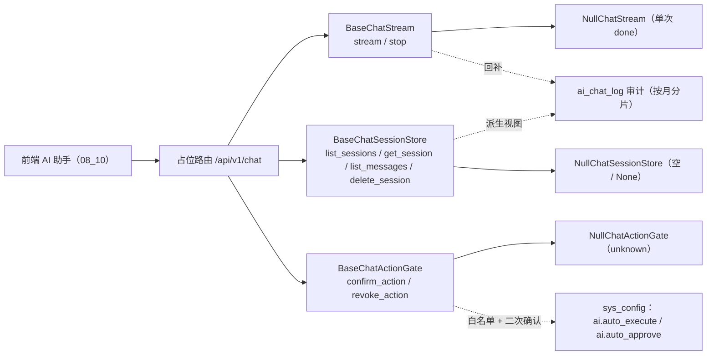

# AI 对话基座详细设计

> 项目骨架 · 02 后端基座 · 04 跨阶段基座 · 22 AI 对话基座 · 详细设计

[文档首页](../../../../../../../文档首页.md) › [02-4-22 AI 对话基座](../02_后端基座_04_跨阶段基座_22_AI对话基座.md) › 01 详细设计　|　[← 父任务](../02_后端基座_04_跨阶段基座_22_AI对话基座.md)

## 1. 概述 <a id="overview"></a>

- **目标**：落地「AI 对话基座」——新建独立能力域 `app/chat/`：流式对话契约 `BaseChatStream`（`ChatStreamHandle` 句柄 + 增量事件序列 + `stop`）、会话查询契约 `BaseChatSessionStore`（会话 / 消息，会话以审计数据为派生视图）、自动执行确认 / 撤销契约 `BaseChatActionGate`；三份缺省实现 `NullChatStream` / `NullChatSessionStore` / `NullChatActionGate`；数据契约（`ChatStreamEvent` / `ChatSession` / `ChatSessionMessage` / `ChatCitation` / `ChatMessageResult` / `ChatActionResult` / `ChatStreamHandle`）与常量（事件类型 / 消息状态 / 四模式 / 开关键）；`ai_chat_log` 表声明 `AiChatLog`；配置分区 `chat_stream` / `chat_session_store` / `chat_action_gate`、装配接线与占位路由 `/api/v1/chat`。
- **范围**：`app/chat/`（新增）、`app/schemas/chat.py`（新增）、`app/models/ai.py`（新增，`AiChatLog`）、`app/core/config.py`、`app/core/assembly.py`、`app/api/deps.py`、`app/api/chat.py`（新增占位路由）、`app/api/router.py`、单测；架构 09「公共约定」/ 26「AI 服务」、《后端基类清单》§9 / §10、《后端开发规范》§3.1、计划 §3 / §3.1、需求 02-49 登记。
- **不含**（归后续阶段）：真实流式传输（SSE / WebSocket 报文编解码）与真实 Provider 调用、会话投影落库（由 `ai_chat_log` 按用户 / 会话聚合的查询实现）、`ai_chat_log` 按月分片与建表迁移、`sys_config` 读写 `ai.auto_execute` / `ai.auto_approve`、确认 / 撤销的业务执行与审计落库、prompt 注入防护、AI 接口独立限流与预算 → **AI 阶段（十七）**；登录态真实鉴权 → **认证阶段**；权限码 `ai:chat` → **RBAC 阶段**。
- **依据**：需求 [02-49](../../../../../需求/02_需求_后端基座.md#r02-49)、《[架构设计 · AI 服务](../../../../../../../设计/架构设计/26_架构设计_子系统_AI服务.md)》「LLM 适配层」「交互审计」「安全闸门」节、《[架构设计 · 接口与集成](../../../../../../../设计/架构设计/09_架构设计_接口与集成.md)》「公共约定」节、《[后端基类清单](../../../../../../../后端基类清单.md)》「跨阶段基座」节、《[后端开发规范](../../../../../../../规范/后端开发规范.md)》「后端基座体系」节、已交付 [02-4-2 LLM 适配基座](../../02_后端基座_04_跨阶段基座_02_LLM适配基座/02_后端基座_04_跨阶段基座_02_LLM适配基座.md) / [02-4-9 数据查询提供者基座](../../02_后端基座_04_跨阶段基座_09_数据查询提供者基座/02_后端基座_04_跨阶段基座_09_数据查询提供者基座.md)、前端冻结契约 [08_01_03 报表大屏与 AI 占位](../../../../../../04_前端组件库/任务/08_交互类/08_交互类_01_占位版交付/08_交互类_01_占位版交付_03_报表大屏与AI占位/08_交互类_01_占位版交付_03_报表大屏与AI占位.md)。

## 2. 现状与差距 <a id="gap"></a>

| 现状 | 差距 |
| --- | --- |
| `02-18` `BaseLlmProvider` 只覆盖一次性 `chat` / `embedding` / `ocr` | 前端 AI 助手（08_10）需流式输出与停止、会话列表与历史、自动执行确认 / 撤销；缺流式与会话契约，前端只能等整段返回 |
| 架构 26 已登记「服务端事件流（增量片段 / 结束 / 错误 / 审计标识 + 中断）」与「会话以 `ai_chat_log` 为派生视图」 | 事件字段、会话 / 消息结构、状态口径与确认 / 撤销签名未在契约层固化，前后端口径易漂 |
| `ai_chat_log` 仅有架构 / 数据架构登记（user_id / tenant_id / module / prompt / response / model / tokens / cost / status / created_at，按月分片），无模型声明 | 无表声明与派生视图分组键（`session_id`），会话投影无落点 |
| 数据查询提供者 `BaseQueryProvider` / `02-4-9` 已就位（问数数据集查询出口） | 问数（report 模式）会话结果需契约承载 `result`（图表 / 表格） |
| 路由基座（`02-6-1`）、工厂基座（`02-3-15`）、偏好 / 通知 / 列表契约基座已就位 | 新能力域无提供者与占位路由，「依赖注入可解析」无落点 |

## 3. 交付物清单 <a id="tree"></a>

```text
backend/
├── app/chat/__init__.py                    # 新增：能力域包（docstring 口径）
├── app/chat/base.py                        # 新增：常量 / 数据契约 / ChatStreamHandle / BaseChatStream / BaseChatSessionStore / BaseChatActionGate / 三提供者
├── app/chat/null.py                        # 新增：NullChatStream / NullChatSessionStore / NullChatActionGate
├── app/schemas/chat.py                     # 新增：占位路由请求 / 响应契约
├── app/models/ai.py                        # 新增：AiChatLog 表声明（ai_chat_log）
├── app/core/config.py                      # 修改：Settings 增 chat_stream / chat_session_store / chat_action_gate 分区
├── app/core/assembly.py                    # 修改：_NULL_MODULES 增 app.chat.null + PLUGIN_WIRINGS 增三条接线
├── app/api/deps.py                         # 修改：导出三提供者
├── app/api/chat.py                         # 新增：占位路由 /api/v1/chat（BaseRouter）
├── app/api/router.py                       # 修改：登记 chat 路由
└── tests/
    └── chat/test_chat.py                   # 新增：Kiwi（契约 / 数据契约 / 空实现 / 依赖解析 / 占位路由 / 内存实现）

bms文档/
├── 设计/架构设计/09_架构设计_接口与集成.md    # 修改：「公共约定」补流式与会话响应契约口径
├── 设计/架构设计/26_架构设计_子系统_AI服务.md # 修改：「LLM 适配层」「交互审计」「安全闸门」补契约基座与表声明
├── 后端基类清单.md                            # 修改：§9 跨阶段基座补三行 + §10 继承链 + 目录
├── 规范/后端开发规范.md                        # 修改：「后端基座体系」§3.1 补 AI 对话口径
├── 项目/01_项目骨架/计划/01_计划_项目骨架.md  # 修改：§3 剩余排期 / 已完成 + §3.1 后续阶段待办 + 进展统计
├── 项目/01_项目骨架/需求/02_需求_后端基座.md  # 修改：需求 02-49 补实现期要点注块
├── 项目/…/02_后端基座_04_跨阶段基座/…22….md   # 修改：参考文档补本设计 / 实施 / 测试链接，实施后回写状态
└── 项目/…/02_后端基座_04_跨阶段基座.md        # 修改：子任务清单 22 状态 / 完成日期回写
```

## 4. AI 对话能力域（`app/chat/`） <a id="contract"></a>

### 4.1 常量 <a id="constants"></a>

| 常量 | 值 | 说明 |
| --- | --- | --- |
| `CHAT_STREAM_EVENT_TYPES` | `("token", "done", "error")` | 增量事件类型清单 |
| `CHAT_MESSAGE_STATUSES` | `("streaming", "done", "error", "stopped")` | 消息状态清单（前端 `AiMessageStatus` 同源） |
| `CHAT_MODULES` | `("ask", "report", "approval", "doc_qa")` | 四模式（问答 / 问数 / 审批辅助 / 文档问答，前端 `AiMode` 同源） |
| `CHAT_MESSAGE_ROLES` | `("user", "assistant", "system")` | 消息角色 |
| `CHAT_CITATION_TYPES` | `("file", "article", "record")` | 引用来源类型 |
| `CHAT_RESULT_KINDS` | `("chart", "table")` | 问数结果形态（复用前端图表卡） |
| `CHAT_ACTION_STATUSES` | `("confirmed", "revoked", "rejected", "unknown")` | 确认 / 撤销结果状态 |
| `AI_AUTO_EXECUTE_KEY` | `"ai.auto_execute"` | 自动执行写操作开关键（`sys_config`） |
| `AI_AUTO_APPROVE_KEY` | `"ai.auto_approve"` | 自动审批开关键（`sys_config`） |
| `NULL_CHAT_STREAM_ID` | `"null-stream"` | 占位流标识（`NullChatStream` 固定返回） |

### 4.2 数据契约 <a id="data"></a>

| 契约 | 形态 | 字段 |
| --- | --- | --- |
| `ChatStreamEvent` | `BaseSchema` | `type`（token / done / error）/ `stream_id` / `content`（增量片段；done 为完整文本）/ `audit_id`（审计标识，对应 `ai_chat_log.id`，可空）/ `error`（错误摘要，可空） |
| `ChatCitation` | `BaseSchema` | `type`（file / article / record）/ `title` / `id` |
| `ChatMessageResult` | `BaseSchema` | `kind`（chart / table）/ `chart_type`（可空）/ `dataset_id`（可空，问数数据集）/ `rows`（行数据，默认空） |
| `ChatSessionMessage` | `BaseSchema` | `id` / `session_id` / `role` / `status`（streaming / done / error / stopped）/ `content` / `result`（可空）/ `citations` / `risks` / `audit_id`（可空）/ `created_at`（可空） |
| `ChatSession` | `BaseSchema` | `id` / `title` / `module` / `message_count` / `updated_at`（可空） |
| `ChatActionResult` | `BaseSchema` | `action_id` / `ok` / `status` / `detail`（可空） |
| `ChatStreamHandle` | frozen dataclass（`BaseObject`） | `stream_id`（可用于 `stop`）/ `events: AsyncIterator[ChatStreamEvent]`（运行时句柄，不走 JSON 序列化） |

- 字段对齐前端 `08_01_03` 冻结契约（`AiMode` / `AiMessageStatus` / `AiMessage` / `AiSession` / `AiCitation`），真实实现只换数据通路、不改契约。
- `messages` 入参复用 `02-18` 的 `app.llm.base.ChatMessage`（`content` / `role`），不重复定义。

### 4.3 契约 <a id="methods"></a>

| 契约 | 键 | 方法 | 语义 |
| --- | --- | --- | --- |
| `BaseChatStream` | `chat_stream` | `async stream(messages, *, module, session_id=None, provider_key=None, model=None) -> ChatStreamHandle` | 发起流式对话，返回句柄（`stream_id` + 事件序列）；事件类型 `token` / `done` / `error`，`done` 携带审计标识 |
| `BaseChatStream` | `chat_stream` | `async stop(stream_id) -> bool` | 中断在途流；返回是否命中并中断 |
| `BaseChatSessionStore` | `chat_session_store` | `async list_sessions(*, module=None) -> Sequence[ChatSession]` | 列当前用户会话（审计数据派生视图），可按模式过滤 |
| `BaseChatSessionStore` | `chat_session_store` | `async get_session(session_id) -> ChatSession \| None` | 取单会话；未命中 None |
| `BaseChatSessionStore` | `chat_session_store` | `async list_messages(session_id) -> Sequence[ChatSessionMessage]` | 取会话消息（升序；消息可独立分页随真实实现） |
| `BaseChatSessionStore` | `chat_session_store` | `async delete_session(session_id) -> bool` | 删除会话（派生视图的删除语义随 AI 阶段定）；返回是否命中 |
| `BaseChatActionGate` | `chat_action_gate` | `async confirm_action(action_id) -> ChatActionResult` | 自动执行类操作二次确认 |
| `BaseChatActionGate` | `chat_action_gate` | `async revoke_action(action_id) -> ChatActionResult` | 撤销已执行结果（撤销动作落审计） |
| 提供者 | — | `get_chat_stream` / `get_chat_session_store` / `get_chat_action_gate` | 依赖注入提供者（应用级单例；公共依赖经 `app/api/deps.py` 统一导出） |

### 4.4 口径 <a id="semantics"></a>

| 情形 | 处置 |
| --- | --- |
| 同步性 | 全部**异步**（真实实现为异步流 / 异步查询，与 LLM 适配域一致，回补时调用面零改动） |
| 传输形态 | 契约只描述**事件语义**，不绑定传输实现（SSE / WebSocket 报文由实现决定）；占位路由以「收集事件后一次性返回」的非流式形态承载契约 |
| 事件语义 | `token` 为增量片段（`content`）；`done` 为结束（`content` 为完整文本，`audit_id` 为审计标识）；`error` 为错误（`error` 说明）；`stream_id` 每个事件都带，供 `stop` |
| 会话事实源 | 会话是 `ai_chat_log` 审计数据的**派生视图**（按用户聚合），**不另建独立会话事实源**；`session_id` 为投影分组键 |
| 会话维度 | 查询方法均隐含「当前用户」上下文（`current_user_id`），签名不显式传 `user_id`；真实实现按 `user_id` 过滤 |
| 确认 / 撤销 | 自动执行前**强制二次确认**；缺少确认的自动执行请求一律拒绝；撤销动作落审计。开关 `ai.auto_execute` / `ai.auto_approve` 默认关闭、各自独立、`ai.auto_approve` 依赖 `ai.auto_execute` 开启（未开启时配置拒绝保存并强制关闭）；开启时仅限配置白名单（写接口 / 审批节点）。**占位不读 `sys_config`**，口径固化于契约 docstring 与常量 |
| 权限 | AI 对话权限码 `ai:chat`；占位期路由经 `Depends(require_auth)`（恒定放行），真实鉴权与权限码随认证 / RBAC 阶段 |
| 不实现真实能力 | 不做真实 Provider 调用 / 流式传输 / 会话投影查询 / 确认撤销执行；`NullChatStream` 固定返回单次 `done` |



## 5. 表声明（`app/models/ai.py`） <a id="model"></a>

新增 `AiChatLog(BaseModel)`（AI 域表 `ai_chat_log`，按月分片，真实建表结构以《数据库设计》为唯一事实源）：

| 字段 | 类型 | 说明 |
| --- | --- | --- |
| 公共字段 | — | 继承 `BaseModel`（雪花 `id` / 审计 / 软删除 / 乐观锁） |
| `user_id` | `BigInteger`（索引） | 用户 ID（逻辑外键 → `sys_user.id`） |
| `tenant_id` | `BigInteger`（索引，可空） | 租户 ID |
| `session_id` | `String(64)`（索引） | 会话标识（派生视图分组键） |
| `module` | `String(32)` | 模式（ask / report / approval / doc_qa） |
| `role` | `String(16)` | 消息角色（user / assistant / system） |
| `prompt` | `Text`（可空） | 提示词（落库前经 `BaseMasker` 掩码随 AI 阶段） |
| `response` | `Text`（可空） | 响应文本 |
| `model` | `String(64)`（可空） | 实际使用的模型 |
| `provider_key` | `String(64)`（可空） | Provider 标识 |
| `tokens` | `Integer` | token 消耗（默认 0） |
| `cost` | `Numeric(20, 4)` | 成本（金额四库统一 `NUMERIC(20,4)`，默认 0） |
| `status` | `String(16)` | 状态（streaming / done / error / stopped） |

- 对齐架构 26「交互审计」字段并补 `session_id`（派生会话视图分组键）、`provider_key`（Provider 追溯）。
- **按月分片**：逻辑表名 `ai_chat_log`、物理表名带 `yyyyMM`；本任务只声明骨架，不建表、不迁移、不预建分片。

## 6. 占位路由（`app/api/chat.py`） <a id="route"></a>

`router = BaseRouter(key="chat", prefix="/chat", tags=["chat"], dependencies=[Depends(require_auth)])`——基于 02-6-1 路由基座，统一挂载到 `/api/v1`：

| 方法 | 路径 | 入参 | 响应 | 口径 |
| --- | --- | --- | --- | --- |
| POST | `/api/v1/chat/stream` | `{messages, module, session_id?}` | `{stream_id, events}` | 委托 `stream(...)` 并**收集事件**（非流式占位）；占位单条 `done` |
| POST | `/api/v1/chat/stop` | `{stream_id}` | `{stopped}` | 委托 `stop(stream_id)`；占位 `false` |
| GET | `/api/v1/chat/sessions` | `module`（可选） | 会话列表 | 委托 `list_sessions(module=...)`；占位空集 |
| GET | `/api/v1/chat/sessions/{session_id}` | — | 会话或 `null` | 委托 `get_session(id)`；占位 `null` |
| GET | `/api/v1/chat/sessions/{session_id}/messages` | — | 消息列表 | 委托 `list_messages(id)`；占位空集 |
| DELETE | `/api/v1/chat/sessions/{session_id}` | — | `bool` | 委托 `delete_session(id)`；占位 `false` |
| POST | `/api/v1/chat/actions/{action_id}/confirm` | — | `ChatActionResult` | 委托 `confirm_action(id)`；占位 `unknown` |
| POST | `/api/v1/chat/actions/{action_id}/revoke` | — | `ChatActionResult` | 委托 `revoke_action(id)`；占位 `unknown` |

- 请求 / 响应契约 `ChatMessageInput` / `ChatStreamRequest` / `ChatStreamResponse` / `ChatStopRequest` / `ChatStopResponse` 落 `app/schemas/chat.py`；数据契约（会话 / 消息 / 事件 / 动作结果）落 `app/chat/base.py`。
- `messages` 入参在路由内转 `app.llm.base.ChatMessage` 后交契约。
- **登录即可**（无权限码）：占位期经 `Depends(require_auth)`（恒定放行）；权限码 `ai:chat` 随 RBAC 阶段。
- 真实流式传输（SSE / WebSocket）随 AI 阶段；非流式占位形态不改变契约调用面。

## 7. 应用装配与依赖注入 <a id="di"></a>

| 位置 | 变更 |
| --- | --- |
| `app/core/config.py` | `Settings` 增 `chat_stream` / `chat_session_store` / `chat_action_gate` 三个 `PluginSelection`（未配置 → 解析到 `null`） |
| `app/core/assembly.py` | `_NULL_MODULES` 增 `app.chat.null`（导入即自动登记）；`PLUGIN_WIRINGS` 增 `chat_stream` / `chat_session_store` / `chat_action_gate` 三条接线（`state_attr` 同名） |
| `app/api/deps.py` | 导出 `get_chat_stream` / `get_chat_session_store` / `get_chat_action_gate` |
| `app/api/router.py` | 模块列表增 `chat`（登记路由 → 统一挂载 `/api/v1`） |

提供者为普通同步函数（取装配 settings 解析单例，无 IO）；真实实现替换占位时调用面零改动。

## 8. 继承与分层 <a id="base"></a>

- `BaseChatStream` / `BaseChatSessionStore` / `BaseChatActionGate` → `BasePluggable` → `BaseCapability`（+ `BaseAsyncResource`）→ `BaseObject`。
- `NullChatStream` / `NullChatSessionStore` / `NullChatActionGate` → 对应契约 + `BaseNullObject` → `BasePlaceholder` → `BaseObject`。
- 数据契约 `ChatStreamEvent` / `ChatSession` / `ChatSessionMessage` / `ChatCitation` / `ChatMessageResult` / `ChatActionResult` → `BaseSchema`；`ChatStreamHandle` → frozen dataclass `BaseObject`。
- 模型 `AiChatLog` → `BaseModel` → `BaseObject`。

## 9. 登记落点 <a id="register"></a>

| 落点 | 登记内容 |
| --- | --- |
| 《架构设计 · 接口与集成》「公共约定」节 | 补流式与会话响应契约口径：事件语义（增量片段 / 结束 / 错误 / 审计标识，支持中断）、会话为审计派生视图、非流式占位路由 `/api/v1/chat`（登录即可）、确认 / 撤销与两开关协作 |
| 《架构设计 · AI 服务》「LLM 适配层」节 | 补流式契约基座口径（`BaseChatStream` / `BaseChatSessionStore` / `BaseChatActionGate`，传输形态由实现定） |
| 《架构设计 · AI 服务》「交互审计」节 | 补会话派生视图与 `ai_chat_log` 表声明口径（`session_id` 分组键、按月分片） |
| 《架构设计 · AI 服务》「安全闸门」节 | 补确认 / 撤销契约与 `ai.auto_execute` / `ai.auto_approve` 常量口径 |
| 《后端基类清单》§9 跨阶段基座 | 把「AI 对话流式（待实施）」行改为三行已交付行（`app/chat/`，三契约 / 空实现 / 表声明 / 占位路由 / 状态）；§10 继承链补三条；§目录补 `app/chat/` |
| 《后端开发规范》「后端基座体系」节 §3.1 | 补口径：AI 流式 / 会话 / 确认撤销一律经 `app/chat/` 三契约，禁止各模块自建；开关默认关闭、approve 依赖 execute |
| 计划《01_计划_项目骨架》§3 / §3.1 | 02-4-22 由剩余排期移入已完成（状态 / 日期）；§3.1 增「AI 对话真实实现（流式传输 / 会话投影 / 确认撤销执行 / 开关读取）」行；进展统计回写 |
| 需求 [02-49](../../../../../需求/02_需求_后端基座.md#r02-49) | 补 `> 注：实现期要点` 块；实施完成后回写状态 / 完成日期 |
| 02-4-22 任务文档 | 参考文档补本设计 / 实施 / 测试链接；实施后回写状态 / 完成日期 |

## 10. 测试设计（Kiwi 先行） <a id="tests"></a>

用例**先登记 Kiwi TCMS 再编码**；本任务新分配一条用例（分类「平台骨架」/ 优先级 `P2` / 状态 `CONFIRMED` / 标签「自动化」；平台登记后回填编号，题面与平台一致）：

| 用例 | 断言要点 | 自动化文件 |
| --- | --- | --- |
| 契约继承与能力域标识 | 三契约 → `BasePluggable` / `BaseCapability`；三空实现 → `BaseNullObject`；`key` / `plugin_key`（`chat_stream` / `chat_session_store` / `chat_action_gate`）/ `placeholder` | `tests/chat/test_chat.py` |
| 常量与数据契约 | `CHAT_STREAM_EVENT_TYPES` / `CHAT_MESSAGE_STATUSES` / `CHAT_MODULES` / 开关键；`ChatStreamEvent` / `ChatSession` / `ChatSessionMessage` / `ChatActionResult` 字段集与默认值 | 同上 |
| 空实现固定返回 | `NullChatStream.stream` 句柄 `stream_id` 固定、事件序列为单条 `done`（含占位文本）；`stop` False；会话空 / None；确认撤销 `unknown` | 同上 |
| 依赖解析 | `create_app()` 装配三空实现；`resolve_plugin(...)` 同一实例 | 同上 |
| 占位路由 | `POST /stream` 单条 done；`POST /stop` false；`GET /sessions` 空；`GET /sessions/{id}` null；`GET /sessions/{id}/messages` 空；`DELETE` false；`confirm` / `revoke` unknown | 同上 |
| 内存实现 + 路由 | 测试内存实现替换提供者：会话列表 / 消息 / 删除、确认撤销状态、`stop` 命中断流 | 同上 |
| 表声明 | `AiChatLog` 表名 `ai_chat_log`、关键字段（`session_id` / `module` / `status`）存在 | 同上 |

回归：全量 `pytest`（含接口冒烟）。

## 11. 实施步骤 <a id="steps"></a>

1. 新增 `app/chat/`（常量 / 数据契约 / `ChatStreamHandle` / 三契约 / 三空实现 / 三提供者）。
2. `app/models/ai.py` 表声明 `AiChatLog`；`app/schemas/chat.py` 占位路由请求响应契约。
3. `app/core/config.py` / `app/core/assembly.py` / `app/api/deps.py` / `app/api/chat.py` / `app/api/router.py` 装配与占位路由。
4. 测试：先登记 Kiwi，再写 `tests/chat/test_chat.py`。
5. 登记：架构 09 / 26、《后端基类清单》§9 / §10 / 目录、《后端开发规范》§3.1、计划 §3 / §3.1、需求 02-49 注块、任务 / 父任务状态。
6. 验证：`pytest --cov=app`、`ruff check` / `ruff format --check` / `pyright` 全绿；`check-base.py` / `check-backend-base.py` 通过。
7. 回写：实施 / 测试记录 + 任务（02-4-22、02_04）与需求 02-49 状态、计划表。
8. 收尾：按「处理偏差与遗留」套路闭环后提交（推送另议）。

## 12. 验收映射 <a id="accept-map"></a>

| 完成标准（需求 02-49 / 任务 02-4-22） | 验证方式 |
| --- | --- |
| 流式事件语义就位 | `ChatStreamEvent`（token / done / error + `stream_id` + `audit_id`）+ `ChatStreamHandle` + `stop` + Kiwi 用例 |
| 会话模型与查询就位 | `ChatSession` / `ChatSessionMessage` / `ChatCitation` + `BaseChatSessionStore` 四方法 + 派生视图口径 |
| 确认 / 撤销签名与开关协作口径就位 | `BaseChatActionGate` 两方法 + `ChatActionResult` + `AI_AUTO_EXECUTE_KEY` / `AI_AUTO_APPROVE_KEY` + docstring |
| 表声明（派生视图分组键） | `AiChatLog` + 字段 / 索引结构核对 |
| 依赖注入可解析、应用可启动不报错 | 装配三空实现 + 提供者解析用例 + 应用冒烟 + 占位路由 |
| 占位实现固定返回 | `NullChatStream` 单次 done；三空实现固定返回；无真实流 / 投影 / 执行 |
| 不实现真实能力 | 无真实 Provider / 流式传输 / 会话查询 / 确认撤销执行 / `sys_config` 读取 |
| 登记齐备 | 架构 09 / 26、《后端基类清单》§9 / §10、《后端开发规范》§3.1、计划 §3 / §3.1 |
| 无 lint / 类型错误 | `ruff check` / `ruff format --check` / `pyright` |

## 13. 边界与开放项 <a id="boundary"></a>

- **真实流式传输**（SSE / WebSocket 报文编解码、断线重连、中断下发）→ **AI 阶段（十七）**；本任务契约只描述事件语义、占位路由以非流式收集承载。
- **会话投影查询**（`ai_chat_log` 按用户 / `session_id` 聚合、消息分页）→ **AI 阶段**。
- **确认 / 撤销执行与审计落库**、`sys_config` 读取 `ai.auto_execute` / `ai.auto_approve`、白名单校验、prompt 注入防护、AI 接口限流与预算 → **AI 阶段**。
- **`ai_chat_log` 建表 / 按月分片 / 迁移** → **AI 阶段（表结构以《数据库设计》为唯一事实源）**。
- **权限码 `ai:chat`** → **RBAC 阶段**；登录态真实鉴权 → **认证阶段**（`require_auth` 占位）。
- **提示词 / 响应落库前掩码** → 复用 `BaseMasker`，随 AI 阶段接入（计划 §3.1 已登记）。
- **测试**：真实流式 / 会话投影 / 确认撤销执行用例随对应阶段补充。

## 14. 对齐记录 <a id="align"></a>

| # | 事项 | 结论 |
| --- | --- | --- |
| 1 | 代码落点 | **新建独立能力域 `app/chat/`**（与 `app/llm/` 适配域并列），插件键与配置分区 `chat_stream` / `chat_session_store` / `chat_action_gate`（用户拍板） |
| 2 | 契约拆分 | **拆三契约**：`BaseChatStream`（stream / stop）+ `BaseChatSessionStore`（会话查询）+ `BaseChatActionGate`（确认 / 撤销）；三空实现（用户拍板） |
| 3 | `stream` 返回 | **`ChatStreamHandle` 句柄**（`stream_id` + 事件序列），可在首事件前 `stop`（用户拍板） |
| 4 | 事件数据契约 | `ChatStreamEvent(BaseSchema)`（JSON 友好）（用户拍板） |
| 5 | 会话字段范围 | **完整对齐前端 08_10**（会话 / 消息 / 引用 / 结果 / 风险 / 审计标识）；`module` 四模式、状态 `streaming` / `done` / `error` / `stopped`（用户拍板） |
| 6 | 确认 / 撤销返回 | `ChatActionResult`（`action_id` / `ok` / `status` / `detail`）（用户拍板） |
| 7 | 开关口径 | 定义 `AI_AUTO_EXECUTE_KEY` / `AI_AUTO_APPROVE_KEY` 常量 + docstring 固化；占位不读 `sys_config`（用户拍板） |
| 8 | 占位路由 | **新增非流式占位路由** `/api/v1/chat`（收集事件返回）（用户拍板） |
| 9 | 表声明 | 声明 `AiChatLog` 骨架（含 `session_id` 派生视图分组键），不建表 / 不迁移（用户拍板） |
| 10 | 会话查询方法 | `get_session` 与 `list_messages` **分离**（消息可独立分页）（用户拍板） |
| 11 | 路由前缀 | `/api/v1/chat`（资源式，`BaseRouter` 统一挂载）（用户拍板） |
| 12 | 登记落点 | 架构 09 / 26、《后端基类清单》§9 / §10、《后端开发规范》§3.1、计划 §3 / §3.1、需求 02-49 注块 |
| 13 | 测试 | 新登记 Kiwi 用例一条（平台登记 + `@pytest.mark.kiwi_id(<编号>)`） |
| 14 | 工时 / 窗口 | 4h；阶段一补做窗口序 4（2026-09-20） |
| 15 | 交付范围 | 一条龙（设计 / 实施 / 测试 / 登记 / 记录 / 提交 / 偏差遗留 / 收尾） |

> 本文档依《文档生成规范》编写 · 关键决策逐项确认
