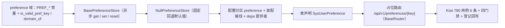

# 用户偏好基座实施记录

> 项目骨架 · 02 后端基座 · 04 跨阶段基座 · 23 用户偏好基座 · 实施记录

[文档首页](../../../../../../../文档首页.md) › [02-4-23 用户偏好基座](../02_后端基座_04_跨阶段基座_23_用户偏好基座.md) › 01 实施　|　[← 父任务](../02_后端基座_04_跨阶段基座_23_用户偏好基座.md)

## 1. 实施信息 <a id="meta"></a>

| 项 | 值 |
| --- | --- |
| 任务 | [02-4-23 用户偏好基座](../02_后端基座_04_跨阶段基座_23_用户偏好基座.md) |
| 对应需求 | [02-50](../../../../../需求/02_需求_后端基座.md#r02-50) |
| 详细设计 | [23_详细设计_01_用户偏好基座](../设计/23_详细设计_01_用户偏好基座.md) |
| 实施日期 | 2026-09-20 |
| 实施人 | minjian |
| 实施环境 | 开发机（Ubuntu，Python 3.14 / uv） |
| 提交 | 待提交 |
| 结论 | 完成 |

## 2. 实施概览 <a id="overview"></a>



结果小结：用户偏好能力域契约与占位实现落地（`BasePreferenceStore` / `NullPreferenceStore` / 常量 / 键规范 / `get_preference_store`），表声明 `SysUserPreference`（用户维度、键唯一），占位路由 `GET/PUT/DELETE /api/v1/preferences/{key}` 基于 02-6-1 路由基座统一挂载；应用可启动、提供者可解析；`pytest` / `ruff` / `pyright` 全绿，新增模块覆盖率 100%。

## 3. 实施过程 <a id="process"></a>

1. **用户偏好能力域**：新增 `app/preference/`——常量 `PREF_KEY_SEPARATOR` / `PREF_KEY_MAX_LENGTH`（128）/ `PREF_VALUE_MAX_BYTES`（65536）/ `PREF_MAX_KEYS`（200）；键规范 `is_valid_pref_key`（`{域}.{键}`）/ `domain_of`；契约 `BasePreferenceStore(BasePluggable)`（`key = plugin_key = "preference"`；异步 `get(key, *, default)` / `set(key, value)` / `reset(key) -> bool`）；占位 `NullPreferenceStore`（回退默认值 / 空操作 / `reset` 恒 False）；提供者 `get_preference_store`。
2. **表声明**：`app/models/system.py` 新增 `SysUserPreference(BaseModel)`——`user_id` / `pref_key` / `pref_value`（Text 存 JSON）+ `UniqueConstraint(user_id, pref_key, deleted_at)`（不建表、不迁移）。
3. **装配与依赖注入**：`app/core/config.py` 增 `preference` 分区；`app/core/assembly.py` 增 `app.preference.null`（自动登记）与 `PluginWiring("preference", BasePreferenceStore, "preference", "preference_store")`；`app/api/deps.py` 导出提供者。
4. **占位路由**：新增 `app/api/preference.py`（`BaseRouter`，`prefix="/preferences"`，`Depends(require_auth)` 占位）——`GET` / `PUT` / `DELETE /api/v1/preferences/{key}`，键格式经 `is_valid_pref_key` 校验、非法抛 `ParamError`（10001）；`app/api/router.py` 登记该路由；请求 / 响应契约 `PreferenceValueRequest` / `PreferenceResponse` 落 `app/schemas/preference.py`。
5. **测试**：新增 `tests/preference/test_preference.py`（6 条 Kiwi 780：契约 / 常量 / 键规范 / 占位回退 / 依赖解析 / 占位路由）。
6. **前置契约适配**（消费方）：`tests/api/test_router_base.py` 默认登记表键期望值补 `preference`（02-6-1 用例，路由表动态增长属预期）；`tests/crosscut/test_plugin_registration.py::_EXPECTED_PLUGIN_KEYS` 补 `preference`（能力域端口清单）。
7. **Kiwi 登记**：已在 mjbk Kiwi TCMS（分类「平台骨架」、P2、CONFIRMED、标签「自动化」）登记用例 **780「02-4-23 用户偏好基座：BasePreferenceStore 契约 / 键规范与常量 / 占位回退默认值 / 依赖解析 / 占位路由」**（2026-09-20），与 `@pytest.mark.kiwi_id(780)` 一致。
8. **登记回写**：架构 07「字典与用户偏好」/ 09「公共约定」、《后端基类清单》§9 / §10、《后端开发规范》§3.1、计划 §3.1（新增用户偏好真实实现行）、需求 02-50 注块、任务 / 父任务状态回写。

关键命令：

```bash
uv run pytest --cov=app -q
uv run ruff check .
uv run ruff format --check .
uv run pyright
python3 scripts/tools/base-check/check-base.py          # 需在 bms 根目录执行
python3 scripts/tools/base-check/check-backend-base.py  # 需在 bms 根目录执行
```

## 4. 问题与处置 <a id="issues"></a>

| 问题 / 现象 | 原因 | 处置与落点 |
| --- | --- | --- |
| 全量 `pytest` 1 项失败 `tests/crosscut/test_m3_closure.py` | **既有失败**（改动前即失败；阶段三需求总览缺「M3 验收门禁」节） | 超出本任务范围，登记为既有遗留（同 02-6-1 记录），不在本任务修复 |
| `test_router_base.py::test_unified_mount_and_prefix` / `test_plugin_registration.py` 断言失败 | 新增 `preference` 能力域，登记表键与端口清单增长 | 按预期适配：分别补 `preference`（前置契约协同，不改变断言语义） |

## 5. 验证结果 <a id="verify"></a>

| 完成标准 | 验证方法 | 实测结果 |
| --- | --- | --- |
| 接口 / 抽象声明与键规范就位 | `BasePreferenceStore` + 常量 + `is_valid_pref_key` + Kiwi 780 | 通过 |
| 表声明（用户维度、键唯一） | `SysUserPreference` + 唯一约束 | 通过 |
| 依赖注入可解析、应用可启动不报错 | 装配单例 + 提供者解析用例 + 应用冒烟 + 占位路由 | 通过 |
| 占位实现固定返回默认值 | `NullPreferenceStore` 回退默认值；无落库 / 缓存实现 | 通过 |
| 登记齐备 | 架构 07 / 09、《后端基类清单》§9 / §10、《后端开发规范》§3.1、计划 §3.1 | 已登记 |
| 无 lint / 类型错误 | `ruff check` / `ruff format --check` / `uv run pyright` | All checks passed / 292 files already formatted / 0 errors |
| 基座护栏 | `check-base.py` / `check-backend-base.py` | 均通过 |
| 新增模块覆盖率 | `pytest --cov=app.preference --cov=app.schemas.preference --cov=app.api.preference` | `base.py` / `null.py` / `schemas/preference.py` / `api/preference.py` 均 100% |

> 全量 `pytest`：**581 passed, 8 skipped, 1 failed**——唯一失败为既有 `test_m3_closure.py`，非本次改动引入。

## 6. 偏差与遗留 <a id="deviations"></a>

- **偏差**：无（按详细设计实施；目录 `app/preference/`、异步三方法、`reset → bool`、`get` 带 `default`、`BaseModel + 唯一约束`、常量与键规范、占位路由，均按用户拍板）。
- **遗留归口（已登记，随对应阶段销项）**：
  - 真实持久化 / 缓存 / key 白名单 / 大小与数量校验 / 全量 / 批量接口 / 操作日志 → **通用能力阶段**；已登记计划 §3.1「用户偏好真实实现」行与需求 02-50 `> 注：` 块。
  - 登录态真实鉴权 → **认证阶段**（`require_auth` 占位）。
  - 跨端同步与本地回退策略 → 前端偏好持久化能力（消费方）。
  - 模型与真实建表差异（概要「联合主键 / 无软删除」vs `BaseModel`）→ 真实建表以《数据库设计》为准。
- **既有遗留（非本任务引入）**：`test_m3_closure.py` 失败（阶段三文档口径），留待阶段三文档收口对齐。
- **处理偏差与遗留（2026-09-20 闭环）**：计划 §3.1 新增「用户偏好真实实现」行；需求 02-50 `> 注：` 块补实现期要点；消费方（通用能力阶段、认证阶段、前端偏好持久化能力、数据库设计）已在计划与需求注块登记去向。
- **结论**：本任务遗留已全部登记去向，偏差与遗留处理完成。

> 本文档依《文档生成规范》编写
