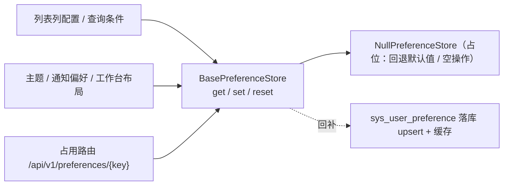

# 用户偏好基座详细设计

> 项目骨架 · 02 后端基座 · 04 跨阶段基座 · 23 用户偏好基座 · 详细设计

[文档首页](../../../../../../../文档首页.md) › [02-4-23 用户偏好基座](../02_后端基座_04_跨阶段基座_23_用户偏好基座.md) › 01 详细设计　|　[← 父任务](../02_后端基座_04_跨阶段基座_23_用户偏好基座.md)

## 1. 概述 <a id="overview"></a>

- **目标**：落地「用户偏好基座」能力域契约与占位实现——`app/preference/` 的 `BasePreferenceStore`（异步 `get` / `set` / `reset`）、常量（键规范 `{域}.{键}`、单键值与条数上限）、占位实现 `NullPreferenceStore`（固定回退默认值）与依赖注入提供者 `get_preference_store`；表声明 `SysUserPreference`（用户维度、键唯一）；配置分区 `[preference]`、装配接线与占位路由 `GET/PUT/DELETE /api/v1/preferences/{key}`。
- **范围**：`app/preference/`（新增）、`app/schemas/preference.py`（新增）、`app/models/system.py`、`app/core/config.py`、`app/core/assembly.py`、`app/api/deps.py`、`app/api/preference.py`（新增路由）、`app/api/router.py`、单测；架构 07「字典与用户偏好」/ 09「公共约定」、《后端基类清单》/《后端开发规范》/ 计划 / 需求 02-50 登记。
- **不含**（归后续阶段）：真实持久化（`sys_user_preference` 落库 upsert）、Redis 缓存 `bms:{tenant}:pref:{user_id}`（先写库后删缓存）、key 白名单真实校验、`GET /preferences`（当前用户全部）与 `PUT /preferences/batch`（批量）、跨端同步与本地回退策略 → **通用能力阶段 / 前端组件库**；登录态真实鉴权 → **认证阶段**。
- **依据**：需求 [02-50](../../../../需求/02_需求_后端基座.md#r02-50)、《[架构设计 · 数据架构](../../../../../../设计/架构设计/07_架构设计_数据架构.md)》「字典与用户偏好」节与「租户库表」节、《[架构设计 · 接口与集成](../../../../../../设计/架构设计/09_架构设计_接口与集成.md)》「公共约定」节、《[概要设计 · 用户喜好](../../../../../../设计/概要设计/04_概要设计_用户喜好.md)》、《[后端基类清单](../../../../../../后端基类清单.md)》「跨阶段基座」节、《[后端开发规范](../../../../../../规范/后端开发规范.md)》「后端基座体系」节、《[API接口规范](../../../../../../规范/API接口规范.md)》「统一响应」节。

## 2. 现状与差距 <a id="gap"></a>

| 现状 | 差距 |
| --- | --- |
| 全库无 `BasePreferenceStore`（检索零命中）；无 `app/preference/` 目录 | 用户偏好（向导开关 / 列配置 / 通知偏好 / 工作台布局）散落多处，键规范与落库口径会发散 |
| `sys_user_preference` 仅有架构与概要登记（07 §3.2 / 概要 04），无模型声明 | 无表声明，偏好持久化无落点 |
| 列表偏好键 `list.{form_key}` 口径已定（概要 04 §2.2）、查询筛选区（组件设计 07_05）依赖偏好 | 无统一读写契约，列表页会各自实现偏好存取 |
| 缓存 Region（02-13）、路由基座（02-6-1）、工厂基座（02-3-15）已就位 | 新能力域无提供者，「依赖注入可解析」无落点 |

## 3. 交付物清单 <a id="tree"></a>

```text
backend/
├── app/preference/__init__.py             # 新增：能力域包（docstring 口径）
├── app/preference/base.py                 # 新增：PREF_* 常量 / is_valid_pref_key / domain_of / BasePreferenceStore / get_preference_store
├── app/preference/null.py                 # 新增：NullPreferenceStore（固定回退默认值）
├── app/schemas/preference.py              # 新增：PreferenceValueRequest / PreferenceResponse（占位路由请求响应契约）
├── app/models/system.py                   # 修改：新增 SysUserPreference 表声明
├── app/core/config.py                     # 修改：Settings 增 preference 分区（PluginSelection）
├── app/core/assembly.py                   # 修改：_NULL_MODULES 增 app.preference.null + PLUGIN_WIRINGS 增 preference 接线
├── app/api/deps.py                        # 修改：导出 get_preference_store
├── app/api/preference.py                  # 新增：占位路由 GET/PUT/DELETE /api/v1/preferences/{key}（BaseRouter）
├── app/api/router.py                      # 修改：登记 preference 路由
└── tests/
    └── preference/test_preference.py      # 新增：Kiwi 780（契约 / 常量 / 键规范 / 占位回退 / 依赖解析 / 占位路由）

bms文档/
├── 设计/架构设计/07_架构设计_数据架构.md      # 修改：「字典与用户偏好」节补基座口径
├── 设计/架构设计/09_架构设计_接口与集成.md    # 修改：「公共约定」补偏好接口口径
├── 后端基类清单.md                            # 修改：§9 跨阶段基座补一行 + §10 继承链
├── 规范/后端开发规范.md                        # 修改：「后端基座体系」节补偏好口径
├── 项目/01_项目骨架/计划/01_计划_项目骨架.md  # 修改：§3.1 后续阶段待办（偏好真实实现行）+ 02-4-23 偏差跟踪
├── 项目/01_项目骨架/需求/02_需求_后端基座.md  # 修改：需求 02-50 补实现期要点注块
├── 项目/…/02_后端基座_04_跨阶段基座/…23….md   # 修改：参考文档补本设计 / 实施 / 测试链接，实施后回写状态
└── 项目/…/02_后端基座_04_跨阶段基座.md        # 修改：子任务清单 23 状态 / 完成日期回写
```

## 4. 用户偏好能力域（`app/preference/`） <a id="contract"></a>

| 成员 | 形态 | 说明 |
| --- | --- | --- |
| `PREF_KEY_SEPARATOR` | `str` 常量，`"."` | 键分隔符（`{域}.{键}`） |
| `PREF_KEY_MAX_LENGTH` | `int` 常量，`128` | 单键长度上限 |
| `PREF_VALUE_MAX_BYTES` | `int` 常量，`65536` | 单键值 JSON 字节上限（对齐概要 `pref.key_max_size` 默认 64KB） |
| `PREF_MAX_KEYS` | `int` 常量，`200` | 单用户偏好键数上限（对齐概要 `pref.max_keys` 默认） |
| `is_valid_pref_key(key)` | 函数 | 键规范校验：`{域}.{键}` 至少两段、各段非空、小写字母数字下划线（如 `list.user_form` / `ui.theme` / `notify.channels`） |
| `domain_of(key)` | 函数 | 取键域名（首段；供分域缓存 / 日志） |
| `BasePreferenceStore(BasePluggable, ABC)` | 能力域契约 | `key = plugin_key = "preference"`；异步 `get` / `set` / `reset` |
| `get(key, *, default=None) -> object \| None` | 抽象方法（async） | 读取偏好；未设置返回 `default` |
| `set(key, value) -> None` | 抽象方法（async） | 写入 / 覆盖（upsert）；值须 JSON 可序列化 |
| `reset(key) -> bool` | 抽象方法（async） | 清除该键（恢复默认）；返回是否删除了既有键 |
| `NullPreferenceStore(BasePreferenceStore, BaseNullObject)` | 占位实现 | `get` 固定回退 `default`；`set` 空操作；`reset` 恒 `False`（不落库） |
| `get_preference_store(request) -> BasePreferenceStore` | 提供者 | 取应用级单例（`resolve_plugin("preference", settings.preference.provider)`） |

**口径**：

| 情形 | 处置 |
| --- | --- |
| 同步性 | 全部**异步**（真实持久化为异步 SQLAlchemy 落库，与 `session_store` / `idempotency` 一致，回补时调用面零改动） |
| 键规范 | `{域}.{键}`（至少两段点分、小写）；列表偏好为 `list.{form_key}`（域 `list`、键 `{form_key}`）；未知 key 拒写的**白名单**由真实实现（通用能力阶段）承载，本任务只落格式规范与校验辅助 |
| 默认值 | `get` 带 `default` 形参——占位实现固定回退该默认（需求「占位固定返回默认值」），真实实现未命中同样回退 |
| `reset` 返回 | `bool`——消费方可区分「本就没设置」与「已恢复默认」 |
| 单键上限 | 常量 `PREF_VALUE_MAX_BYTES` / `PREF_MAX_KEYS` 统一登记；大小 / 数量校验随真实实现 |
| 跨端同步 / 本地回退 | 消费方决定（前端偏好持久化能力以服务端为准、离线本地回退）；基座只提供读写原语 |
| 非敏感 | 偏好不参与权限计算与审计链，仅落操作日志（真实实现） |



## 5. 表声明（`app/models/system.py`） <a id="model"></a>

新增 `SysUserPreference(BaseModel)`（租户库表，真实建表结构以《数据库设计》为唯一事实源）：

| 字段 | 类型 | 说明 |
| --- | --- | --- |
| 公共字段 | — | 继承 `BaseModel`（雪花 `id` / 审计 / 软删除 / 乐观锁） |
| `user_id` | `BigInteger`（索引） | 用户 ID（逻辑外键 → `sys_user.id`） |
| `pref_key` | `String(128)` | 偏好键（`{域}.{键}`，如 `list.user_form`） |
| `pref_value` | `Text` | 偏好值（JSON 字符串；跨方言安全，避免 MySQL 专用 `JSON`） |

- 唯一约束 `UniqueConstraint("user_id", "pref_key", "deleted_at")`（与《架构设计 · 数据架构》「唯一约束统一建为 (唯一字段, deleted_at)」一致；用户维度 + 键唯一）。
- 概要「`user_id + pref_key` 联合主键、无软删除」与 `BaseModel` 强制口径冲突：按用户拍板**继承 `BaseModel` + 唯一约束**，真实建表以《数据库设计》为准（本任务只声明，不建表、不迁移）。

## 6. 占位路由（`app/api/preference.py`） <a id="route"></a>

`router = BaseRouter(key="preference", prefix="/preferences", tags=["preference"], dependencies=[Depends(require_auth)])`——基于 02-6-1 路由基座，统一挂载到 `/api/v1`：

| 方法 | 路径 | 请求 | 响应 | 口径 |
| --- | --- | --- | --- | --- |
| GET | `/api/v1/preferences/{key}` | 路径 `key` | `{key, value}` | 委托 `get_preference_store().get(key)`；key 格式非法抛 `ParamError`（10001） |
| PUT | `/api/v1/preferences/{key}` | `{value}` | `{key, value}` | 委托 `set(key, value)`（upsert）；key 非法抛 `ParamError` |
| DELETE | `/api/v1/preferences/{key}` | 路径 `key` | `null` | 委托 `reset(key)`；key 非法抛 `ParamError` |

- 请求 / 响应契约 `PreferenceValueRequest`（`value`）/ `PreferenceResponse`（`key` / `value`）落 `app/schemas/preference.py`。
- **登录即可**（无权限码）：占位期经 `Depends(require_auth)`（恒定放行），真实登录态随认证阶段。
- 全量 `GET /preferences` 与批量 `PUT /preferences/batch`、key 白名单与大小校验、缓存与落库 → 不含（通用能力阶段）。

## 7. 应用装配与依赖注入 <a id="di"></a>

| 位置 | 变更 |
| --- | --- |
| `app/core/config.py` | `Settings` 增 `preference: PluginSelection = Field(default_factory=PluginSelection)`（未配置 → 解析到 `null`） |
| `app/core/assembly.py` | `_NULL_MODULES` 增 `app.preference.null`（导入即自动登记）；`PLUGIN_WIRINGS` 增 `PluginWiring("preference", BasePreferenceStore, "preference", "preference_store")` |
| `app/api/deps.py` | 导出 `get_preference_store` |
| `app/api/router.py` | 模块列表增 `preference`（登记路由 → 统一挂载 `/api/v1`） |

提供者为普通同步函数（取装配 settings 解析单例，无 IO）；真实实现替换占位时调用面零改动。

## 8. 继承与分层 <a id="base"></a>

- `BasePreferenceStore → BasePluggable → BaseCapability (+ BaseAsyncResource) → BaseObject`。
- `NullPreferenceStore → BasePreferenceStore + BaseNullObject → BasePlaceholder → BaseObject`。
- 数据契约 `PreferenceValueRequest` / `PreferenceResponse` → `BaseSchema`（请求响应基类）。
- 模型 `SysUserPreference → BaseModel → BaseObject`。

## 9. 登记落点 <a id="register"></a>

| 落点 | 登记内容 |
| --- | --- |
| 《架构设计 · 数据架构》「字典与用户偏好」节 | 补基座口径：偏好统一经 `BasePreferenceStore`（`get` / `set` / `reset`，键 `{域}.{键}`、单键上限统一），列表偏好键 `list.{form_key}`；禁止各模块自建偏好存储 |
| 《架构设计 · 接口与集成》「公共约定」节 | 补偏好接口口径：`/api/v1/preferences/{key}`（登录即可）、偏好只作展示 / 交互状态 |
| 《后端基类清单》§9 跨阶段基座 | 新增「用户偏好」行（`app/preference/`，契约与占位状态）；§10 继承链补两条 |
| 《后端开发规范》「后端基座体系」节 §3.1 | 补口径：用户偏好一律经 `BasePreferenceStore` 读写，禁止各模块自建偏好存储；键遵循 `{域}.{键}` |
| 计划《01_计划_项目骨架》§3.1 + 02-4-23 偏差跟踪 | 新增「用户偏好真实实现（落库 upsert + 缓存 + key 白名单 + 批量接口）」行 |
| 需求 [02-50](../../../../需求/02_需求_后端基座.md#r02-50) | 补 `> 注：实现期要点` 块；实施完成后回写状态 / 完成日期 |
| 02-4-23 任务文档 | 参考文档补本设计 / 实施 / 测试链接；实施后回写状态 / 完成日期 |

## 10. 测试设计（Kiwi 780 先行） <a id="tests"></a>

用例**先登记 Kiwi TCMS 再编码**；本任务新分配 **Kiwi 780**（平台登记后回填编号，题面与平台一致）：

| Kiwi | 用例 | 断言要点 | 自动化文件 |
| --- | --- | --- | --- |
| 780 | 契约继承与能力域标识 | `BasePreferenceStore → BasePluggable → BaseCapability`；`NullPreferenceStore → BaseNullObject`；`placeholder` / `key` | `tests/preference/test_preference.py` |
| 780 | 常量清单 | `PREF_KEY_MAX_LENGTH == 128` / `PREF_VALUE_MAX_BYTES == 65536` / `PREF_MAX_KEYS == 200` / 分隔符 `.` | 同上 |
| 780 | 键规范校验 | `is_valid_pref_key`：`ui.theme` / `list.user_form` / `notify.channels` 合法；空串 / 无点 / 大写 / 段空 / 超长非法；`domain_of` 取首段 | 同上 |
| 780 | 占位回退默认值 | `NullPreferenceStore.get("ui.theme")` → `None`；`get(..., default=...)` → 默认值；`set` 空操作后仍回退；`reset` → `False` | 同上 |
| 780 | 依赖解析 | `create_app()` 装配 `NullPreferenceStore`；路由 `Depends(get_preference_store)` 取到同一实例 | 同上 |
| 780 | 占位路由 | `PUT /api/v1/preferences/ui.theme` → `{key, value}`；`GET` → 回退 `null`；`DELETE` → `data: null`；非法 key → 10001 | 同上 |

回归：全量 `pytest`（含接口冒烟）。

## 11. 实施步骤 <a id="steps"></a>

1. 新增 `app/preference/`（常量 / `is_valid_pref_key` / `domain_of` / `BasePreferenceStore` / `NullPreferenceStore` / `get_preference_store`）。
2. `app/schemas/preference.py` 请求响应契约；`app/models/system.py` 表声明 `SysUserPreference`。
3. `app/core/config.py` / `app/core/assembly.py` / `app/api/deps.py` / `app/api/router.py` / `app/api/preference.py` 装配与占位路由。
4. 测试：先登记 Kiwi 780，再写 `tests/preference/test_preference.py`。
5. 登记：架构 07 / 09、《后端基类清单》§9 / §10、《后端开发规范》§3.1、计划 §3.1、需求 02-50 注块、任务 / 父任务状态。
6. 验证：`pytest --cov=app`、`ruff check` / `ruff format --check` / `pyright` 全绿；`check-base.py` / `check-backend-base.py` 通过。
7. 回写：实施 / 测试记录 + 任务（02-4-23、02_04）与需求 02-50 状态、计划表。
8. 收尾：按「处理偏差与遗留」套路闭环后提交（推送另议）。

## 12. 验收映射 <a id="accept-map"></a>

| 完成标准（需求 02-50 / 任务 02-4-23） | 验证方式 |
| --- | --- |
| 接口 / 抽象声明与键规范就位 | `BasePreferenceStore` + 常量 + `is_valid_pref_key` + Kiwi 780 |
| 表声明（用户维度、键唯一） | `SysUserPreference` + 唯一约束断言 / 结构核对 |
| 依赖注入可解析、应用可启动不报错 | 装配单例 + 提供者解析用例 + 应用冒烟 + 占位路由 |
| 占位实现固定返回默认值 | `NullPreferenceStore` 回退默认值；无落库 / 缓存实现 |
| 不实现真实能力 | 无 `sys_user_preference` 落库 / Redis 缓存 / 白名单实现 |
| 登记齐备 | 架构 07 / 09、《后端基类清单》§9 / §10、《后端开发规范》§3.1、计划 §3.1 |
| 无 lint / 类型错误 | `ruff check` / `ruff format --check` / `pyright` |

## 13. 边界与开放项 <a id="boundary"></a>

- **真实持久化与缓存**（`sys_user_preference` upsert、Redis `bms:{tenant}:pref:{user_id}` 先写库后删缓存、key 白名单、大小 / 数量校验、`GET /preferences` 全量与批量、操作日志）→ **通用能力阶段**；已登记计划 §3.1。
- **登录态真实鉴权** → **认证阶段**（`require_auth` 占位）。
- **跨端同步与本地回退策略** → 前端偏好持久化能力（消费方决定）。
- **模型与真实建表差异**：概要「联合主键 / 无软删除」与 `BaseModel` 口径冲突按用户拍板取 `BaseModel + 唯一约束`；真实建表以《数据库设计》为准。
- **测试**：真实持久化 / 缓存 / 白名单用例随通用能力阶段补充。

## 14. 对齐记录 <a id="align"></a>

| # | 事项 | 结论 |
| --- | --- | --- |
| 1 | 代码落点 | `app/preference/`（单数能力域目录）（用户拍板） |
| 2 | 同步性 | 异步 `get` / `set` / `reset`（用户拍板） |
| 3 | 契约基类 | `BasePluggable` + 提供者 + 配置选择 + 装配（用户拍板） |
| 4 | `reset` 返回 | `bool`（用户拍板） |
| 5 | `get` 默认值 | `get(key, *, default=None)`（用户拍板） |
| 6 | 表模型口径 | 继承 `BaseModel` + `UniqueConstraint(user_id, pref_key, deleted_at)`（用户拍板） |
| 7 | 常量与校验 | `PREF_KEY_MAX_LENGTH` / `PREF_VALUE_MAX_BYTES` / `PREF_MAX_KEYS` + `is_valid_pref_key`（用户拍板） |
| 8 | 路由 | 落占位 `GET/PUT/DELETE /api/v1/preferences/{key}`（基于 02-6-1 路由基座）（用户拍板） |
| 9 | 登记落点 | 架构 07 / 09、《后端基类清单》§9 / §10、《后端开发规范》§3.1、计划 §3.1、需求 02-50 注块 |
| 10 | 测试 | 新分配 Kiwi 780（平台登记 + `@pytest.mark.kiwi_id(780)`） |
| 11 | 工时 / 窗口 | 2h；阶段一补做窗口序 1（2026-09-20） |
| 12 | 交付范围 | 一条龙（设计 / 实施 / 测试 / 登记 / 记录 / 提交 / 偏差遗留 / 收尾） |

> 本文档依《文档生成规范》编写 · 关键决策逐项确认
