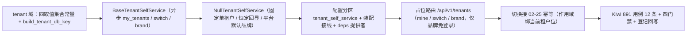

# 租户自助与品牌基座实施记录

> 项目骨架 · 02 后端基座 · 04 跨阶段基座 · 24 租户自助与品牌基座 · 实施记录

[文档首页](../../../../../../../文档首页.md) › [02-4-24 租户自助与品牌基座](../02_后端基座_04_跨阶段基座_24_租户自助与品牌基座.md) › 01 实施　|　[← 父任务](../02_后端基座_04_跨阶段基座_24_租户自助与品牌基座.md)

## 1. 实施信息 

| 项 | 值 |
| --- | --- |
| 任务 | [02-4-24 租户自助与品牌基座](../02_后端基座_04_跨阶段基座_24_租户自助与品牌基座.md) |
| 对应需求 | [02-51](../../../../../需求/02_需求_后端基座.md#r02-51) |
| 详细设计 | [24_详细设计_01_租户自助与品牌基座](../设计/24_详细设计_01_租户自助与品牌基座.md) |
| 实施日期 | 2026-09-20 |
| 实施人 | minjian |
| 实施环境 | 开发机（Ubuntu，Python 3.14 / uv） |
| 前置基座 | 02-5-2 多租户数据拓扑（解析链）、02-6-1 接口路由基座、02-3-10 限流幂等防重放中间层、02-3-1 插件化装配 |
| 提交 | 设计定稿 `40b34f59`・实施代码 `2267ccfe` |
| 结论 | 完成 |

## 2. 实施概览 

结果小结：租户自助能力域契约与占位实现落地——`app/tenant/`（取值集合常量、数据源键助手、四数据契约、`BaseTenantSelfService` 三方法、`NullTenantSelfService`、提供者），路由契约落 `app/schemas/tenant.py`，占位路由 `/api/v1/tenants`（我的租户 / 切换 / 品牌，仅品牌免登录）基于接口路由基座统一挂载；当前租户经解析链上下文入参传入（契约不读上下文、不参与解析）；切换接幂等基座（作用域绑当前租户位）。应用可启动、提供者可解析；`pytest` / `ruff` / `pyright` 全绿，新增 / 改动模块覆盖率 100%。

## 3. 实施过程 

1. **租户自助能力域**：新增 `app/tenant/`——取值集合常量 `THEME_MODES`（light / dark / system）/ `TENANT_STATUSES`（active / suspended）/ `TENANT_SWITCH_MODES`（token / session）与默认品牌主色 `DEFAULT_BRAND_PRIMARY_COLOR`（`#1677ff`）；数据源键助手 `build_tenant_db_key`（`tenant_{code}`）；数据契约 `TenantSummary` / `TenantSelfOverview` / `TenantSwitchResult` / `TenantBrand`；契约 `BaseTenantSelfService(BasePluggable)`（`key = plugin_key = "tenant_self_service"`；异步 `my_tenants(*, current_code=None)` / `switch(code)` / `brand(*, code=None)`）；占位 `NullTenantSelfService`（固定单租户 / 切换恒定回显 / 品牌固定平台默认）；提供者 `get_tenant_self_service`。
2. **路由契约**：新增 `app/schemas/tenant.py`——`TenantSwitchRequest` / `TenantSummaryResponse` / `TenantSelfOverviewResponse` / `TenantSwitchResponse` / `TenantBrandResponse`，与能力域契约字段名一致，由路由层显式映射（不隐式透传字典）；字段一律 snake_case。
3. **装配与依赖注入**：`Settings` 增 `tenant_self_service` 分区（未配置 → `null`）；`_NULL_MODULES` 增 `app.tenant.null`（同域新增 `null.py`，导入即自动登记）；`PLUGIN_WIRINGS` 增 `PluginWiring("tenant_self_service", BaseTenantSelfService, "tenant_self_service", "tenant_self_service")`；`app/api/deps.py` 导出提供者；`app/api/router.py` 登记 `tenant` 路由。
4. **占位路由**：新增 `app/api/tenant.py`——`GET /api/v1/tenants/mine`（挂登录依赖；当前租户编码经 `current_code_of(解析链上下文)` 传入）、`POST /api/v1/tenants/switch`（挂登录依赖；读 `Idempotency-Key` 头，按需复用首次结果，幂等键作用域绑当前租户位）、`GET /api/v1/tenants/brand`（**免登录**，查询参数 `code` 可选）；路由级不统一挂登录依赖，按接口声明。
5. **前置契约断言同步**：`tests/api/test_router_base.py` 默认路由登记表键元组补 `tenant`；`tests/crosscut/test_plugin_registration.py::_EXPECTED_PLUGIN_KEYS` 补 `tenant_self_service`。
6. **测试**：先在 mjbk Kiwi TCMS 平台登记用例取得编号 **891**（平台自增主键，登记前实测最新号 890），再写 `tests/tenant/test_tenant_self_service.py`（13 条，均标注 `@pytest.mark.kiwi_id(891)`）。
7. **登记回写**：架构 12「租户解析链」节、《后端基类清单》§9 / §10 与目录行、《后端开发规范》§3.1、计划 §2 / §3 / §3.1 与工时台账、需求 02-51 `> 注：` 块、任务与父任务状态。

## 4. 问题与处置 

| 问题 / 现象 | 原因 | 处置与落点 |
| --- | --- | --- |
| `pyright` 报 `reportUnknownVariableType`（概览的租户列表字段） | `Field(default_factory=list)` 使元素类型退化为 `Unknown` | 按仓库既有口径改为 `Field(default_factory=list[TenantSummary])`（路由契约同理），两处修复后类型检查 0 错误 |
| 全量 `pytest` 收集期报 `import file mismatch`（`test_tenant.py`） | 测试目录无 `__init__.py`，pytest 以文件 basename 建模块名，与既有 `tests/db/test_tenant.py` 同名（单目录运行不复现） | 用例文件重命名为 `test_tenant_self_service.py`（唯一 basename），并同步更新 Kiwi 891 用例文本中的自动化文件路径 |
| 路由内手工编码校验分支不可达（覆盖率 98%） | 请求契约已开 `str_strip_whitespace` + `code` 最小长度 1，空 / 纯空白编码在契约层即被拦下，经全局校验处理器统一收口为 10001 | 移除手工校验分支（空编码仍为 10001，用例断言不变）；`current_code_of` 改为公开助手并补单测，覆盖「解析链豁免路径无上下文」分支 |
| 新增能力域致两处前置契约断言失败 | 登记表键与端口清单增长 | 按预期适配（`tenant` / `tenant_self_service`），不改变断言语义 |

## 5. 验证结果 

| 完成标准 | 验证方法 | 实测结果 |
| --- | --- | --- |
| 接口 / 抽象声明就位（我的租户 / 切换 / 品牌） | `BaseTenantSelfService` 三方法 + 四数据契约 + 常量 + Kiwi 891 用例 | 通过 |
| 与解析链协作、优先级不变 | 当前租户经调用方入参传入；契约不参与解析、无解析次序变更；占位路由取解析链上下文 | 通过 |
| 占位实现固定返回单租户 | `NullTenantSelfService` 三方法固定返回 + 占位语义用例 | 通过 |
| 依赖注入可解析、应用可启动不报错 | 装配单例 + 提供者解析用例（`plugin_providers["tenant_self_service"] == "null"`）+ 应用冒烟 + 占位路由 | 通过 |
| 占位路由（仅品牌免登录）+ 切换幂等 | 路由依赖计数断言 + 三接口用例 + 幂等替身用例（键 `bms:demo:idem:k-1`、复用首次结果） | 通过 |
| 登记齐备 | 架构 12、《后端基类清单》§9 / §10、《后端开发规范》§3.1、计划 §2 / §3 / §3.1、需求 02-51 注块、任务与父任务 | 已登记 |
| 无 lint / 类型错误 | `ruff check` / `ruff format --check` / `uv run pyright` | All checks passed / 339 files already formatted / 0 errors |
| 基座护栏 | `check-base.py` / `check-backend-base.py` | 均通过 |
| 新增 / 改动模块覆盖率 | `pytest --cov=app` | `app/tenant/base.py` / `null.py` / `__init__.py`、`app/schemas/tenant.py`、`app/api/tenant.py` 均 100% |

> 全量 `pytest --cov=app`：**678 passed, 8 skipped, 0 failed**（8 skipped 为需真实 Redis 的集成用例；02-4-23 记录的 `test_m3_closure.py` 既有失败**未复现**）。

## 6. 偏差与遗留 

- **偏差**：无（按详细设计实施；能力域目录 `app/tenant/`、插件键 `tenant_self_service`、概览契约返回形态、摘要字段对齐前端冻结契约、切换结果契约含生效方式、品牌签名与字段、`/tenants` 三接口与品牌免登录、常量集、幂等接入与作用域、契约双份落点、`my_tenants` 带 `current_code` 入参，均按用户拍板）。实现侧两处细化已记入「问题与处置」：手工编码校验分支移除（空编码 10001 由契约 + 全局处理器收口）、`current_code_of` 取公开助手（为覆盖豁免路径分支）。
- **遗留归口（已登记，随对应阶段销项）**：
  - 真实取数（用户与租户关系、租户列表过滤与排序、角色名解析）→ **RBAC 阶段**；已登记计划 §3.1「租户自助真实实现」行与需求 02-51 `> 注：` 块。
  - 令牌 / 会话换发（重发令牌、会话内切换、旧租户会话标记失效）→ **认证阶段**。
  - 品牌来源（租户配置落库、登录页背景）与平台超管租户管理（开通 / 停用 / 配额 / 域名注册 / 批量迁移）→ **租户管理阶段**（品牌字段以《数据库设计》为准，本任务不动租户表声明）。
  - 前端对接：后端 snake_case 与前端 08_03_02 camelCase 契约的映射 → 宿主数据通路注入层。
  - 切换后缓存清理与页面标签重置 → 前端切换编排（宿主注入步骤）。
- **消费方标注**：前端 `08_03_02`（租户切换件 / 品牌与主题件，依赖后端能力）已在计划 §3.1 行与本记录登记「只换数据通路」；后端契约字段与前端冻结契约一一对应，无前端契约改动。
- **处理偏差与遗留（2026-09-20 闭环）**：计划 §3.1 新增「租户自助真实实现」行；需求 02-51 `> 注：` 块补实现期要点；消费方与阶段归口已在计划、需求注块与本文登记去向。
- **结论**：本任务遗留已全部登记去向，偏差与遗留处理完成。

> 本文档依《文档生成规范》编写
