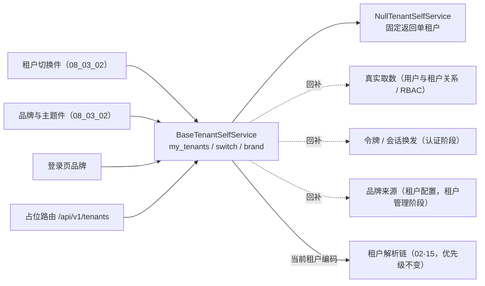

# 租户自助与品牌基座详细设计

> 项目骨架 · 02 后端基座 · 04 跨阶段基座 · 24 租户自助与品牌基座 · 详细设计

[文档首页](../../../../../../../文档首页.md) › [02-4-24 租户自助与品牌基座](../02_后端基座_04_跨阶段基座_24_租户自助与品牌基座.md) › 01 详细设计　|　[← 父任务](../02_后端基座_04_跨阶段基座_24_租户自助与品牌基座.md)

## 1. 概述 <a id="overview"></a>

- **目标**：落地「租户自助与品牌」能力域契约与占位实现——新增 `app/tenant/` 的 `BaseTenantSelfService`（异步 `my_tenants` / `switch` / `brand`）、数据契约（租户摘要 / 自助概览 / 切换结果 / 品牌）、常量与 `db_key` 助手、占位实现 `NullTenantSelfService`（固定返回单租户）与依赖注入提供者 `get_tenant_self_service`；配置分区 `[tenant_self_service]`、装配接线与占位路由 `/api/v1/tenants`（我的租户 / 切换 / 品牌，仅品牌免登录）。
- **范围**：`app/tenant/`（新增，含 `__init__.py` / `base.py` / `null.py`）、`app/schemas/tenant.py`（新增路由契约）、`app/core/config.py`、`app/core/assembly.py`、`app/api/deps.py`、`app/api/tenant.py`（新增路由）、`app/api/router.py`、单测与前置契约断言；架构 12「租户解析」节、《后端基类清单》§9 / §10、《后端开发规范》§3.1、计划 §3.1、需求 02-51 注块与任务 / 父任务状态登记。
- **不含**（归后续阶段）：真实取数（用户与租户关系、租户列表来源）、真实令牌 / 会话换发（**认证阶段**）、品牌信息落库来源（**租户管理阶段**，《数据库设计》为准）、平台超管租户管理（开通 / 停用 / 配额 / 批量迁移，**多租户路由阶段**）、切换后缓存清理与页面标签重置（**宿主 / 前端切换编排**）。
- **依据**：需求 [02-51](../../../../../需求/02_需求_后端基座.md#r02-51)、需求 [02-15](../../../../../需求/02_需求_后端基座.md#r02-15)、《[架构设计 · 多租户路由](../../../../../../../设计/架构设计/12_架构设计_子系统_多租户路由.md)》「租户解析链」节、《[架构设计 · 数据架构](../../../../../../../设计/架构设计/07_架构设计_数据架构.md)》「数据分布」节、《[后端基类清单](../../../../../../../后端基类清单.md)》「跨阶段基座」节、《[后端开发规范](../../../../../../../规范/后端开发规范.md)》「后端基座体系」节、《[API接口规范](../../../../../../../规范/API接口规范.md)》「统一响应 / ID 字符串传输 / 幂等」节、《[命名规范](../../../../../../../规范/命名规范.md)》「API 命名」节。

## 2. 现状与差距 <a id="gap"></a>

| 现状 | 差距 |
| --- | --- |
| 全库无租户自助契约（检索零命中）；无 `app/tenant/` 能力域目录 | 前端租户切换件与品牌件（08_03_02）无稳定后端数据通路，只能各页面自建取数 |
| 租户解析链已交付（`app/db/tenant.py`：子域名 → 请求头 → token 优先级、demo 回落、豁免路径、未知租户 404 / 80001） | 解析链只解决「请求属于哪个租户」，缺**用户自助视角**的「我加入哪些租户 / 怎么切 / 品牌是什么」契约 |
| `SysTenant` 表声明已就位（编码 / 名称 / 域名 / 数据源键 / 状态 / 到期时间，平台库） | 无品牌信息来源口径（名称 / 标识 / 主题）；本任务只落契约，来源归租户管理阶段与《数据库设计》 |
| 前端 08_03_02 已冻结对外契约（租户摘要：标识 / 名称 / 编码 / Logo / 角色名；品牌配置：名称 / Logo / favicon / 主色 / 默认模式 / 登录背景 / 强调色开关 / 暗色开关） | 后端无同构数据契约，双端字段口径无对齐基准（后端按 API 规范输出 snake_case，前端注入层映射） |
| 幂等基座（02-25）、接口路由基座（02-6-1）、插件装配（02-3-1）均已就位 | 新能力域无配置分区 / 装配接线 / 提供者 / 路由登记，「依赖注入可解析」无落点 |

## 3. 交付物清单 <a id="tree"></a>

```text
backend/
├── app/tenant/__init__.py                 # 新增：能力域包（docstring 口径）
├── app/tenant/base.py                     # 新增：常量 / build_tenant_db_key / 四数据契约 / BaseTenantSelfService / get_tenant_self_service
├── app/tenant/null.py                     # 新增：NullTenantSelfService（固定返回单租户）
├── app/schemas/tenant.py                  # 新增：占位路由请求 / 响应契约（与能力域契约字段一一对应）
├── app/core/config.py                     # 修改：Settings 增 tenant_self_service 分区（PluginSelection）
├── app/core/assembly.py                   # 修改：_NULL_MODULES 增 app.tenant.null + PLUGIN_WIRINGS 增接线
├── app/api/deps.py                        # 修改：导出 get_tenant_self_service
├── app/api/tenant.py                      # 新增：占位路由 GET /tenants/mine、POST /tenants/switch、GET /tenants/brand（BaseRouter）
├── app/api/router.py                      # 修改：登记 tenant 路由
└── tests/
    ├── tenant/test_tenant.py              # 新增：Kiwi 用例（契约 / 常量 / 数据契约 / 占位语义 / 依赖解析 / 占位路由）
    ├── api/test_router_base.py            # 修改：默认路由登记表键元组补 tenant
    └── crosscut/test_plugin_registration.py  # 修改：_EXPECTED_PLUGIN_KEYS 补 tenant_self_service

bms文档/
├── 设计/架构设计/12_架构设计_子系统_多租户路由.md   # 修改：「租户解析链」节补用户自助出口实施口径
├── 后端基类清单.md                                 # 修改：§9 跨阶段基座补一行 + §10 继承链
├── 规范/后端开发规范.md                             # 修改：「后端基座体系」§3.1 补一条强制口径
├── 项目/01_项目骨架/计划/01_计划_项目骨架.md        # 修改：§3 排期表 02-4-24 行 + §3.1 待办 + 工时台账
├── 项目/01_项目骨架/需求/02_需求_后端基座.md        # 修改：需求 02-51 补实现期要点注块
├── 项目/…/02_后端基座_04_跨阶段基座_24_….md         # 修改：参考文档补本设计 / 实施 / 测试链接，实施后回写状态
└── 项目/…/02_后端基座_04_跨阶段基座.md              # 修改：子任务清单 24 状态 / 完成日期回写
```

## 4. 租户自助能力域（`app/tenant/`） <a id="contract"></a>

| 成员 | 形态 | 说明 |
| --- | --- | --- |
| `THEME_MODES` | `tuple[str, ...]` 常量，`("light", "dark", "system")` | 品牌默认主题模式取值集合（对齐前端主题模式三取值） |
| `TENANT_STATUSES` | `tuple[str, ...]` 常量，`("active", "suspended")` | 租户状态取值集合（对齐租户注册表状态列） |
| `TENANT_SWITCH_MODES` | `tuple[str, ...]` 常量，`("token", "session")` | 切换生效方式取值集合（经重发令牌 / 经会话内切换），供实现侧校验 |
| `DEFAULT_BRAND_PRIMARY_COLOR` | `str` 常量，`"#1677ff"` | 平台默认品牌主色（与前端未配置时的回退色一致） |
| `build_tenant_db_key(code)` | 函数 | 由租户编码派生数据源键（`tenant_{code}`，与租户注册表数据源键口径一致） |
| `TenantSummary` | 数据契约 | 租户摘要（见 §5） |
| `TenantSelfOverview` | 数据契约 | 自助概览：租户列表 + 当前租户编码 + 是否多租户（见 §5） |
| `TenantSwitchResult` | 数据契约 | 切换结果：目标租户 / 数据源键 / 是否生效 / 生效方式 / 是否需重发令牌 / 令牌（见 §5） |
| `TenantBrand` | 数据契约 | 品牌信息（名称 / 标识 / 主题等，见 §5） |
| `BaseTenantSelfService(BasePluggable, ABC)` | 能力域契约 | `key = plugin_key = "tenant_self_service"`；异步 `my_tenants` / `switch` / `brand` |
| `my_tenants(*, current_code=None) -> TenantSelfOverview` | 抽象方法（async） | 取「我加入的租户」概览；`current_code` 由调用方（路由层）从解析链上下文传入，实现负责标注（不读请求上下文） |
| `switch(code) -> TenantSwitchResult` | 抽象方法（async） | 切换到目标租户：结果经令牌 / 会话生效，**解析链命中优先级不变**（不改变子域名 → 请求头 → token 的相对次序） |
| `brand(*, code=None) -> TenantBrand` | 抽象方法（async） | 取品牌信息；`code` 缺省当前租户（登录页可按编码预览目标租户品牌），未命中回退平台默认品牌 |
| `NullTenantSelfService(BaseTenantSelfService, BaseNullObject)` | 占位实现 | 固定返回单租户（见 §6） |
| `get_tenant_self_service(request) -> BaseTenantSelfService` | 提供者 | 取应用级单例（`resolve_plugin("tenant_self_service", settings.tenant_self_service.provider)`） |

**口径**：

| 情形 | 处置 |
| --- | --- |
| 同步性 | 全部**异步**（真实实现为异步取数与令牌换发，回补时调用面零改动） |
| 当前租户来源 | 契约不读请求上下文——由调用方传入 `current_code`；解析链（子域名 → 请求头 → token）仍是当前租户的**唯一权威来源**，本契约不参与解析、不改优先级 |
| 数据源键 | 统一由租户编码派生（`tenant_{code}`）；实现与解析链共用同一口径，调用方不自行拼接 |
| 多租户判定 | 概览的「是否多租户」按租户列表长度 > 1 计算（前端据此决定是否显示切换入口） |
| 切换生效 | 结果以「生效方式 + 是否需重发令牌 + 令牌」表达，**不绑定传输**（令牌签发归认证阶段）；子域名 / 请求头渠道优先级不变 |
| 品牌来源 | 随租户配置提供（真实来源归租户管理阶段）；未配置或未命中回退平台默认品牌（主色取 `DEFAULT_BRAND_PRIMARY_COLOR`、模式取 `system`） |
| 登录要求 | 品牌信息**登录前可用**（登录页需要）；我的租户 / 切换需登录 |
| 写副作用 | 切换为会话 / 令牌语义动作，无业务数据写入；重复请求由幂等键复用首次结果 |
| 键格式 | 数据源键、租户状态、主题模式、切换生效方式等取值集合与格式由基座登记，业务模块与前端不得自定义 |



## 5. 数据契约 <a id="contracts"></a>

`TenantSummary`（租户摘要，字段对齐前端已冻结契约；主键与标识以**字符串**输出，规避 JS 精度丢失）：

| 字段 | 类型 | 必填 | 说明 |
| --- | --- | --- | --- |
| `id` | `str` | 是 | 租户标识（真实实现回填租户主键字符串；占位以租户编码充当） |
| `name` | `str` | 是 | 租户名称 |
| `code` | `str \| None` | 否 | 租户编码 |
| `logo` | `str \| None` | 否 | 租户 Logo 地址 |
| `role_name` | `str \| None` | 否 | 该租户下的角色名 |

`TenantSelfOverview`（自助概览）：

| 字段 | 类型 | 必填 | 说明 |
| --- | --- | --- | --- |
| `tenants` | `list[TenantSummary]` | 是（缺省空列表） | 我加入的租户列表 |
| `current_code` | `str \| None` | 否 | 当前租户编码（调用方传入 / 占位固定当前租户） |
| `multi_tenant` | `bool` | 是（缺省 `False`） | 是否多租户（列表长度 > 1） |

`TenantSwitchResult`（切换结果）：

| 字段 | 类型 | 必填 | 说明 |
| --- | --- | --- | --- |
| `tenant_code` | `str` | 是 | 目标租户编码 |
| `db_key` | `str` | 是 | 目标数据源键（按编码派生） |
| `applied` | `bool` | 是（缺省 `True`） | 切换是否已生效 |
| `mode` | `str` | 是（缺省 `"token"`，取值 ∈ `TENANT_SWITCH_MODES`） | 本次切换生效方式（经重发令牌 / 经会话内切换） |
| `reissue_token` | `bool` | 是（缺省 `False`） | 是否要求调用方重取令牌 |
| `token` | `str \| None` | 否 | 新令牌（需重发且已签发时非空；令牌签发归认证阶段） |

`TenantBrand`（品牌信息，字段对齐前端已冻结契约）：

| 字段 | 类型 | 必填 | 说明 |
| --- | --- | --- | --- |
| `name` | `str \| None` | 否 | 品牌名称（页面标题 / 侧栏 / 登录页） |
| `logo` | `str \| None` | 否 | Logo 地址 |
| `favicon` | `str \| None` | 否 | favicon 地址 |
| `primary_color` | `str` | 是（缺省 `DEFAULT_BRAND_PRIMARY_COLOR`） | 品牌主色（十六进制） |
| `default_mode` | `str` | 是（缺省 `"system"`，取值 ∈ `THEME_MODES`） | 租户默认主题模式 |
| `login_bg` | `str \| None` | 否 | 登录页背景图 |
| `allow_user_accent` | `bool` | 是（缺省 `True`） | 是否允许用户覆盖强调色 |
| `disable_dark` | `bool` | 是（缺省 `False`） | 是否禁用暗色 |

> 命名口径：后端 JSON 字段一律 snake_case（《命名规范》「API 命名」节 / 《API接口规范》）；前端 08_03_02 的 camelCase 对外契约由宿主数据通路注入层做映射，后端不为其改变命名风格。

## 6. 占位实现语义（`NullTenantSelfService`） <a id="null"></a>

| 方法 | 占位行为 |
| --- | --- |
| `my_tenants(*, current_code=None)` | 固定返回**单租户**概览：列表仅含演示租户（编码 / 名称取解析链既有 demo 租户口径，标识以编码充当、无 Logo 与角色名）；当前租户编码固定为演示租户（不采用传入值）；是否多租户为 `False` |
| `switch(code)` | **恒定回显**：`tenant_code` 取传入编码、`db_key` 按编码派生、`applied=True`、`mode="token"`、`reissue_token=False`、`token=None`；不校验租户存在性、不改会话 / 令牌、无任何副作用（真实校验与令牌换发归认证阶段） |
| `brand(*, code=None)` | 固定返回平台默认品牌（主色取 `DEFAULT_BRAND_PRIMARY_COLOR`、默认模式 `system`、允许用户强调色、不禁用暗色；名称 / 标识等留空由消费方回退）；不区分 `code`、不读租户配置 |

口径：占位实现「恒定返回、零外部依赖」——不连库、不读缓存、不签发令牌；成功路径与失败分支的真实语义由实现阶段回补，契约与调用面不变。

## 7. 占位路由（`app/api/tenant.py`） <a id="route"></a>

`router = BaseRouter(key="tenant", prefix="/tenants", tags=["tenant"])`——基于接口路由基座，统一挂载到 `/api/v1`；**登录要求按接口声明**（路由级不统一挂登录依赖）：

| 方法 | 路径 | 请求 | 响应（`data`） | 登录 | 口径 |
| --- | --- | --- | --- | --- | --- |
| GET | `/api/v1/tenants/mine` | — | 自助概览 | 需登录 | 当前租户编码取自解析链上下文（未命中时为空）；委托 `my_tenants(current_code=...)` |
| POST | `/api/v1/tenants/switch` | `{code}` | 切换结果 | 需登录 | 委托 `switch(code)`；带 `Idempotency-Key` 头时首次结果复用（作用域绑当前租户位，见下）；非法编码（空串）抛 `ParamError`（10001） |
| GET | `/api/v1/tenants/brand` | 查询参数 `code`（可选） | 品牌信息 | **免登录** | 委托 `brand(code=code)`；登录页按编码预览品牌，顶栏缺省取当前租户 |

- 请求 / 响应契约落 `app/schemas/tenant.py`（与能力域契约字段名一致，路由内**显式映射**、不隐式透传字典）：请求 `TenantSwitchRequest`（`code`）；响应 `TenantSummaryResponse` / `TenantSelfOverviewResponse` / `TenantSwitchResponse` / `TenantBrandResponse`。
- 幂等口径：`POST /tenants/switch` 读 `Idempotency-Key` 请求头（缺失即跳过）；命中时经 `load` 复用首次结果、未命中则执行后 `save` 首次结果；幂等键经统一拼接（`bms:{当前租户}:idem:{键}`，作用域绑解析链当前租户位，避免多租户下同键互相命中——切换结果含令牌语义，不宜跨租户复用）。
- 切换成功后不再由后端改上下文：新租户以重发令牌 / 会话内切换生效，客户端后续请求经子域名或请求头携带目标租户，解析链优先级不变。

## 8. 应用装配与依赖注入 <a id="di"></a>

| 位置 | 变更 |
| --- | --- |
| `app/core/config.py` | `Settings` 增 `tenant_self_service: PluginSelection = Field(default_factory=PluginSelection)`（未配置 → 解析到 `null`） |
| `app/core/assembly.py` | `_NULL_MODULES` 增 `app.tenant.null`（导入即自动登记）；`PLUGIN_WIRINGS` 增 `PluginWiring("tenant_self_service", BaseTenantSelfService, "tenant_self_service", "tenant_self_service")` |
| `app/api/deps.py` | 导出 `get_tenant_self_service`（并提供解析链租户依赖 `get_tenant` 的复用） |
| `app/api/router.py` | 模块列表增 `tenant`（登记路由 → 统一挂载 `/api/v1`） |
| `tests/api/test_router_base.py` | 默认路由登记表键元组补 `tenant`（新能力域的前置契约断言） |
| `tests/crosscut/test_plugin_registration.py` | `_EXPECTED_PLUGIN_KEYS` 补 `tenant_self_service`（端口清单断言） |

提供者为普通同步函数（取装配 settings 解析单例，无 IO）；真实实现替换占位时调用面零改动。

## 9. 继承与分层 <a id="base"></a>

- `BaseTenantSelfService → BasePluggable → BaseCapability (+ BaseAsyncResource) → BaseObject`。
- `NullTenantSelfService → BaseTenantSelfService + BaseNullObject → BasePlaceholder → BaseObject`。
- 数据契约 `TenantSummary` / `TenantSelfOverview` / `TenantSwitchResult` / `TenantBrand` → `BaseSchema`；路由契约同。
- 当前租户上下文沿用解析链既有上下文类型（数据访问层），本能力域不新建租户上下文类型。

## 10. 登记落点 <a id="register"></a>

| 落点 | 登记内容 |
| --- | --- |
| 《架构设计 · 多租户路由》「租户解析链」节 | 补用户自助出口实施口径：我的租户 / 切换 / 品牌经统一基座提供；切换经令牌 / 会话生效、解析链优先级不变；品牌信息登录前可用（不回写实现侧标识） |
| 《后端基类清单》§9 跨阶段基座 | 「租户自助（横切扩展）」行由「待定（详细设计定）」改为实际落点与契约 / 占位状态；§10 继承链补两条 |
| 《后端开发规范》「后端基座体系」§3.1 | 新增一条强制口径：租户自助（我的租户 / 切换 / 品牌）一律经统一基座读写，禁止各模块自建租户列表 / 切换 / 品牌读取；品牌信息登录前可用、解析链优先级不变（只写语义，不写类名 / 路径 / 常量） |
| 计划《01_计划_项目骨架》§3 与 §3.1 | §3 排期表 02-4-24 行状态与偏差列；§3.1 后续阶段待办补「租户自助真实实现」行；工时台账同步 |
| 需求 [02-51](../../../../../需求/02_需求_后端基座.md#r02-51) | 补 `> 注：实现期要点` 块（真实取数 / 令牌换发 / 品牌来源 / 超管租户管理归口）；实施完成后回写状态与完成日期 |
| 02-4-24 任务文档 | 参考文档补本设计 / 实施 / 测试链接；实施后回写状态 / 完成日期 |
| 02-4-24 父任务（04 跨阶段基座） | 子任务清单 24 状态 / 完成日期回写 |

## 11. 测试设计（Kiwi 先登记后编码） <a id="tests"></a>

用例**先登记 Kiwi TCMS 取得编号再编码**（分类「平台骨架」、优先级 P2、状态 CONFIRMED、自动化用例打「自动化」标签；编号以平台自增主键为准），自动化文件 `tests/tenant/test_tenant.py`：

| 用例 | 断言要点 |
| --- | --- |
| 契约继承与能力域标识 | `BaseTenantSelfService → BasePluggable → BaseCapability`；`NullTenantSelfService → BaseNullObject`；`key` / `plugin_key` 一致；`placeholder` 为真且描述含「占位实现」 |
| 常量与数据源键助手 | `THEME_MODES` / `TENANT_STATUSES` / `TENANT_SWITCH_MODES` 取值；`DEFAULT_BRAND_PRIMARY_COLOR` 为 `#1677ff`；`build_tenant_db_key("demo") == "tenant_demo"` |
| 数据契约字段口径 | 摘要字段集（含 `role_name`）；概览缺省（空列表 / 无当前租户 / 非多租户）；切换结果缺省（`applied=True`、`mode="token"`、`reissue_token=False`、`token=None`）；品牌缺省（主色为平台默认、模式 `system`、允许强调色、不禁暗色） |
| 占位语义：我的租户 | 固定单租户（列表长度 1、编码为演示租户、`multi_tenant=False`）；传入 `current_code` 仍固定演示租户；概览为异步返回 |
| 占位语义：切换 | 恒定回显（`tenant_code` / `db_key` 取传入编码派生、`applied=True`）、零副作用（连调两次结果一致）、未知编码不抛错 |
| 占位语义：品牌 | 固定返回平台默认品牌；带 `code` 与不带 `code` 结果一致（占位不区分） |
| 依赖解析 | `create_app()` 装配 `NullTenantSelfService`；提供者解析到同一实例；`plugin_providers["tenant_self_service"] == "null"` |
| 占位路由：我的租户 | `GET /api/v1/tenants/mine` → 统一响应，`data.tenants` 长度 1、`current_code` 为演示租户 |
| 占位路由：切换 | `POST /api/v1/tenants/switch`（`{code}`）→ `data.db_key` 为 `tenant_{code}`；空编码 → 业务码 10001；带 `Idempotency-Key` 重复提交复用首次结果 |
| 占位路由：品牌 | `GET /api/v1/tenants/brand` 与 `?code=xxx` 均返回默认品牌（**免登录**，无登录依赖） |
| 路由登记契约 | 默认路由登记表键元组含 `tenant`；统一挂载前缀下三条路径均可达 |

回归：全量 `pytest`（含接口冒烟与前置契约断言）；新增 / 改动模块覆盖率 100%。

## 12. 实施步骤 <a id="steps"></a>

1. 新增 `app/tenant/`（常量 / `build_tenant_db_key` / 四数据契约 / `BaseTenantSelfService` / `NullTenantSelfService` / `get_tenant_self_service`）。
2. 新增 `app/schemas/tenant.py`（请求 / 响应契约，字段与能力域契约一一对应）。
3. 装配与路由：`app/core/config.py` / `app/core/assembly.py` / `app/api/deps.py` / `app/api/tenant.py` / `app/api/router.py`；同步两处前置契约断言。
4. 测试：先登记 Kiwi 用例取得编号，再写 `tests/tenant/test_tenant.py` 并在用例上标注编号。
5. 登记：架构 12、《后端基类清单》§9 / §10、《后端开发规范》§3.1、计划 §3 与 §3.1、需求 02-51 注块、任务 / 父任务状态。
6. 验证：`pytest --cov=app`、`ruff check` / `ruff format --check` / `pyright` 全绿；`check-base.py` / `check-backend-base.py` / `check-links.py` / `check-status.py --stage 01_项目骨架 --strict` 通过。
7. 记录：实施记录与测试记录各一份。
8. 回写状态后处理偏差与遗留（消费方 08_03_02 标注 snake_case → camelCase 映射为注入层职责），提交（推送另议）。

## 13. 验收映射 <a id="accept-map"></a>

| 完成标准（需求 02-51 / 任务 02-4-24） | 验证方式 |
| --- | --- |
| 接口 / 抽象声明就位（我的租户 / 切换 / 品牌） | `BaseTenantSelfService` 三方法 + 四数据契约 + 常量 + 契约用例 |
| 与解析链协作、优先级不变 | 当前租户经调用方传入（路由层取解析链）；契约不参与解析、无解析次序变更（见 §4 口径表） |
| 占位实现固定返回单租户 | `NullTenantSelfService` 三方法固定返回 + 占位语义用例 |
| 依赖注入可解析、应用可启动不报错 | 装配单例 + 提供者解析用例 + 应用冒烟 + 占位路由 |
| 不实现真实能力 | 无落库 / 无真实取数 / 无令牌签发 / 无品牌来源实现 |
| 登记齐备 | 架构 12、《后端基类清单》§9 / §10、《后端开发规范》§3.1、计划 §3 / §3.1、需求 02-51 注块 |
| 无 lint / 类型错误 | `ruff check` / `ruff format --check` / `pyright` |

## 14. 边界与开放项 <a id="boundary"></a>

- **真实取数**（用户与租户关系来源、租户列表过滤与排序、角色名解析）→ **RBAC / 租户管理阶段**；已登记计划 §3.1。
- **令牌 / 会话换发**（重发令牌、会话内切换、失效旧租户会话标记）→ **认证阶段**；本契约以结果字段表达语义、不承载签发。
- **品牌来源**（租户配置的品牌名称 / 标识 / 主题落库，含登录页背景）→ **租户管理阶段**；真实来源以《数据库设计》为准，本任务不动表声明。
- **平台超管租户管理**（开通 / 停用 / 配额 / 批量迁移 / 域名解析注册）→ **多租户路由阶段**；不在本契约范围。
- **前端映射**：前端 08_03_02 契约为 camelCase，后端按规范输出 snake_case，映射由宿主数据通路注入层承担（只换数据通路、不改前端契约）。
- **切换后缓存清理 / 页面标签重置** → 前端切换编排（宿主注入步骤），后端不承担。

## 15. 对齐记录 <a id="align"></a>

| # | 事项 | 结论 |
| --- | --- | --- |
| 1 | 代码落点 | 新增能力域目录 `app/tenant/`（用户拍板） |
| 2 | 插件键 | `tenant_self_service`（用户拍板） |
| 3 | `my_tenants` 返回 | 概览契约（列表 + 当前租户编码 + 是否多租户）（用户拍板） |
| 4 | 摘要字段 | 对齐前端冻结契约（标识 / 名称 / 编码 / Logo / 角色名；标识字符串）（用户拍板） |
| 5 | `switch` 契约与占位语义 | 结果契约 + 占位恒定回显（不校验存在性、无副作用）（用户拍板） |
| 6 | `brand` 签名与字段 | `brand(*, code=None)` + 字段对齐前端品牌配置（用户拍板） |
| 7 | 占位路由 | `/api/v1/tenants`（mine / switch / brand），仅品牌免登录（用户拍板） |
| 8 | 表与常量 | 不动 `SysTenant`；落默认品牌主色 / 租户状态 / 切换生效方式常量（用户拍板） |
| 9 | 规范登记 | 《后端开发规范》§3.1 新增一条强制口径（用户拍板） |
| 10 | 幂等 | 接入 `Idempotency-Key`（用户拍板） |
| 11 | 当前租户来源 | 契约带可选入参 `current_code`，由路由层传入（用户拍板） |
| 12 | 契约落点 | 能力域契约 + 路由契约双份（字段一致、路由内显式映射）（用户拍板） |
| 13 | 幂等作用域 | 绑当前租户位（`bms:{租户}:idem:{键}`）（用户拍板） |
| 14 | 主题模式常量 | 落 `THEME_MODES`（light / dark / system）（用户拍板） |
| 15 | 切换生效方式 | 结果契约增 `mode` 字段，`switch(code)` 无入参（用户拍板） |
| 16 | 字段命名 | 后端 snake_case（《命名规范》§8 既定口径）；前端 camelCase 由注入层映射 |
| 17 | 工时 / 窗口 | 3h；阶段一补做窗口（序 10） |
| 18 | 交付范围 | 一条龙（设计 / 实施 / 测试 / 登记 / 记录 / 提交 / 偏差遗留 / 收尾） |

> 本文档依《文档生成规范》编写 · 关键决策逐项确认
