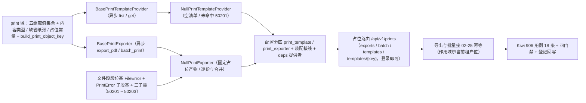

# 打印模板与导出 PDF 基座实施记录

> 项目骨架 · 02 后端基座 · 04 跨阶段基座 · 25 打印模板与导出 PDF 基座 · 实施记录

[文档首页](../../../../../../../文档首页.md) › [02-4-25 打印模板与导出 PDF 基座](../02_后端基座_04_跨阶段基座_25_打印模板与导出PDF基座.md) › 01 实施　|　[← 父任务](../02_后端基座_04_跨阶段基座_25_打印模板与导出PDF基座.md)

## 1. 实施信息 

| 项 | 值 |
| --- | --- |
| 任务 | [02-4-25 打印模板与导出 PDF 基座](../02_后端基座_04_跨阶段基座_25_打印模板与导出PDF基座.md) |
| 对应需求 | [02-52](../../../../../需求/02_需求_后端基座.md#r02-52) |
| 详细设计 | [25_详细设计_01_打印模板与导出 PDF 基座](../设计/25_详细设计_01_打印模板与导出PDF基座.md) |
| 实施日期 | 2026-09-20 |
| 实施人 | minjian |
| 实施环境 | 开发机（Ubuntu，Python 3.14 / uv） |
| 前置基座 | 02-4-1 文件存储（对象存储出口 / 预签名有效期常量）、02-4-10 导入导出、02-3-10 限流幂等防重放中间层、02-6-1 接口路由基座、02-3-1 插件化装配 |
| 提交 | 设计定稿 `b31464ee`・实施代码（见测试记录 §1） |
| 结论 | 完成 |

## 2. 实施概览 

结果小结：打印模板与导出 PDF 能力域契约与占位实现落地——新增 `app/print/`（取值集合常量、产物对象 key 助手、六数据契约、模板来源与导出两契约、两占位实现、两提供者），路由契约落 `app/schemas/print.py`，占位路由 `/api/v1/prints`（单条导出 PDF / 批量打印 / 模板清单 / 模板详情，登录即可）基于接口路由基座统一挂载；错误码新增文件段段位基与打印子段三码位；两写接口接幂等基座（作用域绑当前租户位）。应用可启动、提供者可解析；`pytest` / `ruff` / `pyright` 全绿，新增模块覆盖率 100%。

## 3. 实施过程 

1. **打印能力域（新增 `app/print/`）**：取值集合常量 `PRINT_PAPERS`（A4 / A5 / custom）、`PRINT_ORIENTATIONS`（portrait / landscape）、`PRINT_TONES`（color / mono）、`PRINT_BATCH_MODES`（separate / merged）、`PRINT_TEMPLATE_STATUSES`（active / disabled），产物口径常量 `PRINT_CONTENT_TYPE`（`application/pdf`）/ `DEFAULT_PAPER`（A4）/ `PRINT_OBJECT_DOMAIN`（prints）与占位常量 `PRINT_PLACEHOLDER_MESSAGE` / `NULL_PRINT_URL` / `NULL_PRINT_BIZ_KEY`；产物对象 key 助手 `build_print_object_key`（`bms:{租户|global}:prints:{模板键}:{单据键}`，租户缺省位复用全局租户位常量）；数据契约 `PrintVariable` / `PrintTemplateInfo` / `PrintDocument` / `PrintOptions` / `PrintExportResult` / `PrintBatchResult`；契约 `BasePrintTemplateProvider`（`key = plugin_key = "print_template"`；异步 `list(*, biz_type=None)` / `get(template_key)`）与 `BasePrintExporter`（`key = plugin_key = "print_exporter"`；异步 `export_pdf(template_key, document, *, options=None)` / `batch_print(keys, *, template_key, mode, options=None)`）；提供者 `get_print_template_provider` / `get_print_exporter`。
2. **占位实现（`app/print/null.py`）**：`NullPrintTemplateProvider`（清单恒定为空、取模板恒定未命中抛模板不存在）；`NullPrintExporter`（单条导出与批量打印固定返回占位产物：对象 key 经统一助手派生、占位取址与占位文案、产物有效期复用对象存储缺省预签名有效期；空单据键集合返回空汇总；逐份出一键一条明细、合并出单条明细）；两者均**不触对象存储、不写库、不渲染**。
3. **错误码与异常**：`app/core/error_codes.py` 增文件段打印子段三码位（`50201` 模板不存在 / `50202` 产物不存在或已过期 / `50203` 批量打印超限）；`app/core/exceptions.py` 新增**文件段（5xxxx）段位基** `FileError` + 打印子段基 `PrintError` + 三子类（构造时预置码位与 HTTP 状态），模块 docstring 同步补文件段与打印子段。
4. **路由契约**：新增 `app/schemas/print.py`——`PrintDocumentPayload` / `PrintOptionsPayload` / `PrintExportRequest` / `PrintBatchRequest` / `PrintExportResponse` / `PrintBatchResponse` / `PrintVariableResponse` / `PrintTemplateInfoResponse` / `PrintTemplateListResponse`，与能力域契约字段名一致，由路由层显式映射（不隐式透传字典）；字段一律 snake_case。
5. **装配与依赖注入**：`Settings` 增 `print_exporter` / `print_template` 两分区（未配置 → `null`）；`_NULL_MODULES` 增 `app.print.null`（同域新增 `null.py`，导入即自动登记）；`PLUGIN_WIRINGS` 增两条接线；`app/api/deps.py` 导出两提供者；`app/api/router.py` 登记 `print` 路由（模块名与内建函数同名，按既有口径以别名导入）。
6. **占位路由**：新增 `app/api/print.py`——`POST /api/v1/prints/exports`（单条导出 PDF）、`POST /api/v1/prints/batch`（批量打印）、`GET /api/v1/prints/templates`（模板清单，查询参数 `biz_type` 可选）、`GET /api/v1/prints/templates/{template_key}`（模板详情）；路由级统一挂登录依赖；导出与批量读 `Idempotency-Key` 头（缺失即跳过）、作用域绑当前租户位、重复请求复用首次结果；批量请求契约 `keys` 最小长度 1（空集合在契约层被拦下）。
7. **前置契约断言同步**：`tests/api/test_router_base.py` 默认路由登记表键元组补 `print`；`tests/crosscut/test_plugin_registration.py::_EXPECTED_PLUGIN_KEYS` 补 `print_exporter` / `print_template`。
8. **测试**：先在 mjbk Kiwi TCMS 平台登记用例取得编号 **906**（平台自增主键，登记前实测平台最新号 905——**号段已被 CI 自动导入用例推进**），再写 `tests/print/test_print_exporter.py`（18 条，均标注 `@pytest.mark.kiwi_id(906)`）。
9. **登记回写**：架构 20《文件管理》新增「导出（打印模板与 PDF）」节（原 §6 顺延 §7）、架构 09 §2.2 段表 5xxxx 行与已发布码位行、架构 04 §8 段位基枚举补「文件」、《后端基类清单》§9 / §10 / 目录行、《后端开发规范》§3.1（新增打印与 PDF 导出强制口径 + 段位基枚举）、概要设计 19（导出类型含 PDF）与概要设计 13（打印 / 导出 PDF 产物来源）、计划 §1 / §2 / §3 / §3.1 / §5、需求 02-52 `> 注：` 块、任务与父任务状态。

## 4. 问题与处置 

| 问题 / 现象 | 原因 | 处置与落点 |
| --- | --- | --- |
| Kiwi 编号与预估不符 | CI 自动导入的自动化用例持续推进平台自增主键（登记前实测最新号 **905**，非台账推算值） | 按「先查平台最新号、以平台返回值为准」口径登记并取实验证：本任务用例 **906** |
| 错误码段位断言的 `ErrorCode.FILE` 不存在 | 段位基 `FileError` **不占缺省码位**（同「用户与组织段位基」先例），故未新增 `50001` | 断言改用段位枚举 `ErrorSegment.FILE`（万位 5）校验段位归属，不改代码 |
| 覆盖率缺口 2 处（`app/api/print.py` 行 90 / 222） | 渲染选项映射的非空分支与批量幂等复用分支未被用例触达 | 补两条用例：带渲染选项的导出请求（选项被消费且占位结果不变）、批量幂等复用首次结果；补后新增模块 100% |
| `ruff` 报导入未合并 / 行宽超限 | 测试文件两处 `from app.api.deps import …` 分列、一条断言超 120 列 | `uv run ruff check --fix` + `uv run ruff format`（345 文件已格式化、仅本文件变动） |
| 错误码段位归属与既有文档口径的冲突（**已报备重确认**） | 上一轮确认字面口径为打印子段基直挂通用异常基类，与架构 08「按错误码段位归入段位基、新增段位先加段位基」冲突（5xxxx 无段位基） | 报冲突后重确认：新增 `FileError(BizError)` 作 5xxxx 段位基（无缺省码位）+ `PrintError(FileError)`；架构 04 §8 与《后端开发规范》§3.1 段位基枚举同步补「文件」 |

## 5. 验证结果 

| 完成标准 | 验证方法 | 实测结果 |
| --- | --- | --- |
| 接口 / 抽象声明就位（导出 PDF / 批量打印） | `BasePrintExporter` 两方法 + `PrintExportResult` / `PrintBatchResult` + Kiwi 906 用例 | 通过 |
| 模板来源就位（模板键 / 变量） | `BasePrintTemplateProvider` 两方法 + `PrintTemplateInfo` / `PrintVariable` + 契约用例 | 通过 |
| 产物经对象存储、限时取址 | 结果契约 `object_key` / `url` / `expires_in` + `build_print_object_key` 统一派生 + 占位固定返回（真实落存储归文件管理阶段） | 通过 |
| 占位实现固定返回占位产物 | 两占位实现固定返回 + 占位语义用例（空清单 / 未命中 / 占位产物 / 逐份与合并） | 通过 |
| 依赖注入可解析、应用可启动不报错 | 装配单例 + 提供者解析用例（`plugin_providers` 两键均为 `null`）+ 应用冒烟 + 占位路由 | 通过 |
| 占位路由 + 两写接口幂等 | 路由依赖计数断言（四路径均 1 个登录依赖）+ 四接口用例 + 幂等替身用例（键 `bms:demo:idem:k-*`） | 通过 |
| 不实现真实能力 | 无渲染引擎 / 无对象存储写入 / 无模板落库 / 无任务提交 / 无表声明 | 通过 |
| 登记齐备 | 架构 20 / 09 / 04、《后端基类清单》§9 / §10 / 目录行、《后端开发规范》§3.1、概要设计 13 / 19、计划 §1 ~ §3.1、需求 02-52 注块 | 已登记 |
| 无 lint / 类型错误 | `ruff check` / `ruff format --check` / `uv run pyright` | All checks passed / 345 files already formatted / 0 errors |
| 基座护栏 | `check-base.py` / `check-backend-base.py` / `check-links.py` | 均通过 |
| 新增 / 改动模块覆盖率 | `pytest --cov=app` | `app/print/base.py` / `null.py` / `__init__.py`、`app/schemas/print.py`、`app/api/print.py` 均 100% |

> 全量 `pytest --cov=app`：**698 passed, 8 skipped, 0 failed**（8 skipped 为需真实 Redis 的集成用例；02-4-23 记录的 `test_m3_closure.py` 既有失败未复现）。

## 6. 偏差与遗留 

- **偏差**：无（按详细设计实施；代码落点 `app/print/`、两契约与插件键、专用结果契约、四端点均需登录、参数对象签名、模板来源两方法与占位空清单、常量与产物 key 助手、不落表声明、占位不触对象存储、幂等接入与作用域、错误码子段与段位基、批量结果含任务标识字段而不接任务基座、规范与架构登记、上游登记项 ①③ 顺带回写，均按用户拍板）。行程中的新增待拍板两项（模板详情路由 3 → 4 条、单据数据契约含单据键）与一处口径冲突（段位基）均**先确认后执行**，见详细设计 §16 对齐记录。实现侧细化已记入「问题与处置」：错误码段位断言改用段位枚举、补两条覆盖率用例。
- **遗留归口（已登记，随对应阶段销项）**：
  - 真实 PDF 渲染（引擎与模板渲染选型、长明细跨页表头重复、签章 / 水印）→ **通用能力阶段 / 表单定制阶段**；已登记计划 §3.1「打印与 PDF 导出真实实现」行与需求 02-52 `> 注：` 块。
  - 模板定义来源（模板落库表结构、模板设计器、变量绑定）→ **表单定制阶段**（以《数据库设计》为准，本任务不动表声明）。
  - 产物真实落对象存储与限时取址（写入、预签名生成、命名 / 保留期 / 清理）→ **文件管理阶段**。
  - 批量超阈值转后台任务（任务标识、状态复查、完成通知与限时下载、失败重试）→ **通用能力阶段**（任务调度基座）；占位期结果契约保留任务标识字段。
  - 权限码（打印 / 导出权限码声明与校验）→ RBAC 阶段；打印 / 导出留痕审计 → 审计阶段。
  - 模板分页 / 按权限过滤 / 停用模板过滤 → 实现阶段。
  - **test 仓策展台账补登**：`test文档/用例/Kiwi用例台账.md` 仍只记到 776（后端补充基座批次 777 ~ 906 未入台账、§4 对账数据已过时）→ 归口「下一批次统一补登」（与前批次同口径；test 仓在本工作区未克隆，本次不动）。
- **消费方标注**：前端 `08_03_03`（打印与导出 PDF 件，导出与批量处理函数由宿主注入）已在计划 §3.1 行与本记录登记「只换数据通路」；后端契约字段与前端冻结结果（`fileId` / `fileName` / `url` / `message`）一一对应，**无前端契约改动**，snake_case → camelCase 映射归宿主数据通路注入层。
- **上游登记闭环**：组件设计 19 登记的 ①（打印 / 导出 PDF 任务 → 概要设计 19 导出类型含 PDF）与 ③（打印产物存储 → 概要设计 13 打印 / 导出 PDF 产物来源）已顺带回写；②（打印入口与预览 → 布局设计表单页 / 设计令牌）属布局设计与前端，**不由本任务回写**，仍归其前端侧登记。
- **结论**：本任务遗留已全部登记去向，偏差与遗留处理完成。

> 本文档依《文档生成规范》编写
