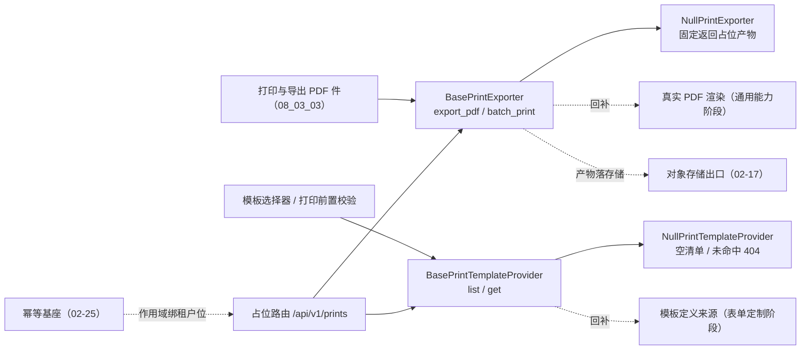

# 打印模板与导出 PDF 基座详细设计

> 项目骨架 · 02 后端基座 · 04 跨阶段基座 · 25 打印模板与导出 PDF 基座 · 详细设计

[文档首页](../../../../../../../文档首页.md) › [02-4-25 打印模板与导出 PDF 基座](../02_后端基座_04_跨阶段基座_25_打印模板与导出PDF基座.md) › 01 详细设计　|　[← 父任务](../02_后端基座_04_跨阶段基座_25_打印模板与导出PDF基座.md)

## 1. 概述 <a id="overview"></a>

- **目标**：落地「打印模板与导出 PDF」能力域契约与占位实现——新增 `app/print/` 的**两契约**：模板来源 `BasePrintTemplateProvider`（异步 `list` / `get`）与导出 `BasePrintExporter`（异步 `export_pdf` / `batch_print`）、数据契约（打印模板信息 / 模板变量 / 单据数据 / 渲染选项 / 导出结果 / 批量结果）、取值集合常量与产物对象 key 助手 `build_print_object_key`、占位实现 `NullPrintTemplateProvider` / `NullPrintExporter` 与依赖注入提供者；配置分区 `[print_template]` / `[print_exporter]`、装配接线与占位路由 `/api/v1/prints`（单条导出 PDF / 批量打印 / 模板清单 / 模板详情）；新增文件段（5xxxx）段位基 `FileError` 与打印子段（502xx）错误码 `50201` ~ `50203`。
- **范围**：`app/print/`（新增，含 `__init__.py` / `base.py` / `null.py`）、`app/schemas/print.py`（新增路由契约）、`app/core/error_codes.py`、`app/core/exceptions.py`、`app/core/config.py`、`app/core/assembly.py`、`app/api/deps.py`、`app/api/print.py`（新增路由）、`app/api/router.py`、单测与前置契约断言；架构 20《文件管理》、架构 09《接口与集成》、架构 04《后端基础类体系》、《后端基类清单》§9 / §10 / 目录行、《后端开发规范》§3.1、概要设计 13 / 19、计划 §1 ~ §3.1、需求 02-52 注块与任务 / 父任务状态登记。
- **不含**（归后续阶段）：真实 PDF 渲染引擎与打印模板渲染（**通用能力 / 表单定制阶段**）、模板定义落库来源与模板设计器（**表单定制阶段**，《数据库设计》为准）、产物真实落对象存储与限时预签名取址（**文件管理阶段**）、批量超阈值转后台任务与任务状态复查（**通用能力阶段**，任务调度基座）、打印 / 导出留痕审计（**审计阶段**）。
- **依据**：需求 [02-52](../../../../../需求/02_需求_后端基座.md#r02-52)、《[架构设计 · 文件管理](../../../../../../../设计/架构设计/20_架构设计_子系统_文件管理.md)》「导出（打印模板与 PDF）」节、《[架构设计 · 接口与集成](../../../../../../../设计/架构设计/09_架构设计_接口与集成.md)》「错误码分段」节、《[架构设计 · 后端基础类体系](../../../../../../../设计/架构设计/04_架构设计_后端基础类体系.md)》「阶段交付与跨阶段基座契约」节、《[后端基类清单](../../../../../../../后端基类清单.md)》「跨阶段基座」节、《[后端开发规范](../../../../../../../规范/后端开发规范.md)》「后端基座体系」节、《[API接口规范](../../../../../../../规范/API接口规范.md)》「统一响应 / ID 字符串传输 / 幂等」节、《[命名规范](../../../../../../../规范/命名规范.md)》「API 命名」节、《[组件设计 19 打印与导出 PDF](../../../../../../../设计/组件设计/08_交互类/19_组件设计_打印与导出PDF/19_组件设计_打印与导出PDF.md)》。

## 2. 现状与差距 <a id="gap"></a>

| 现状 | 差距 |
| --- | --- |
| 全库无打印模板 / PDF 导出契约与实现（检索 `export_pdf` / `batch_print` / `print_template` 零命中）；无 `app/print/` 能力域目录 | 前端打印与导出 PDF 件（08_03_03）的导出 / 批量处理函数**由宿主注入**、未注入即占位不请求——后端无稳定数据通路，宿主无法接线 |
| 导入导出基座 `BaseImporter` / `BaseExporter`（`app/transfer/`，02-33）已就位 | 导入导出基座面向**表格数据流**（行 / 列 / 单元格），不承载「按模板渲染单据 → 高保真 PDF 产物」语义；二者异构，不能互替 |
| 对象存储基座 `BaseObjectStorage`（`app/storage/`，02-17）已就位（`put` / `get` / `presign` + `DEFAULT_PRESIGN_TTL`） | 产物落存储与限时取址的**消费出口**缺失（谁把 PDF 写进去、谁取址给前端） |
| 幂等基座（02-25，`build_idempotency_key` 作用域绑租户位）、接口路由基座（02-6-1）、插件装配（02-3-1）、租户解析链 `get_tenant` 均已就位 | 新能力域无配置分区 / 装配接线 / 提供者 / 路由登记，「依赖注入可解析」无落点 |
| 前端 08_03_03 已冻结对外契约（`PrintJobPayload`：模板键 / 纸张 / 方向 / 色调 / 水印 / 单据键集合 / 批量模式；`PrintJobResult`：文件标识 / 文件名 / 地址 / 提示；`PrintTemplateDef`：模板键 / 标题 / 字段 / 明细列 / 汇总 / 页脚） | 后端无同构数据契约，双端字段口径无对齐基准（后端按 API 规范输出 snake_case，前端注入层映射）；「模板定义来源（模板键 / 变量）」后端无来源出口 |
| 错误码 5xxxx **文件段无段位基**（`app/core/exceptions.py` 现有通用 / 认证 / 用户与组织 / 系统配置 / 开放·租户·SSO 五类段位基），架构 08 §8 要求「按错误码段位归入段位基；新增段位先加段位基」 | 打印 / 导出失败的码位无归处（无 5xxxx 段位基，亦无打印子段基与子类） |

## 3. 交付物清单 <a id="tree"></a>

```text
backend/
├── app/print/__init__.py                  # 新增：能力域包（docstring 口径）
├── app/print/base.py                      # 新增：取值集合常量 / build_print_object_key / 六数据契约 / 两契约 / 两提供者
├── app/print/null.py                      # 新增：NullPrintTemplateProvider（空清单 + 未命中 404）/ NullPrintExporter（固定占位产物）
├── app/schemas/print.py                   # 新增：占位路由请求 / 响应契约（与能力域契约字段一一对应）
├── app/core/error_codes.py                # 修改：文件段打印子段 50201 ~ 50203
├── app/core/exceptions.py                 # 修改：新增 FileError（5xxxx 段位基）+ PrintError（502xx 子段基）+ 三子类
├── app/core/config.py                     # 修改：Settings 增 print_exporter / print_template 两分区（PluginSelection）
├── app/core/assembly.py                   # 修改：_NULL_MODULES 增 app.print.null + PLUGIN_WIRINGS 增两条接线
├── app/api/deps.py                        # 修改：导出 get_print_exporter / get_print_template_provider
├── app/api/print.py                       # 新增：占位路由 POST /prints/exports、POST /prints/batch、GET /prints/templates、GET /prints/templates/{template_key}
├── app/api/router.py                      # 修改：登记 print 路由
└── tests/
    ├── print/test_print_exporter.py       # 新增：Kiwi 用例（契约 / 常量 / 数据契约 / 占位语义 / 错误码 / 依赖解析 / 占位路由）
    ├── api/test_router_base.py            # 修改：默认路由登记表键元组补 print
    └── crosscut/test_plugin_registration.py  # 修改：_EXPECTED_PLUGIN_KEYS 补 print_exporter / print_template

bms文档/
├── 设计/架构设计/20_架构设计_子系统_文件管理.md      # 修改：新增「导出（打印模板与 PDF）」节（其后节序顺延）
├── 设计/架构设计/09_架构设计_接口与集成.md          # 修改：§2.2 段表 5xxxx 行补子段说明 + 已发布码位行补 50201 ~ 50203
├── 设计/架构设计/04_架构设计_后端基础类体系.md      # 修改：§8 段位基枚举补「文件」
├── 设计/概要设计/19_概要设计_导入导出.md            # 修改：功能点与业务规则补「导出 PDF」口径（上游登记项①）
├── 设计/概要设计/13_概要设计_文件管理.md            # 修改：功能点与数据流转补打印 / 导出 PDF 产物来源（上游登记项③）
├── 后端基类清单.md                                  # 修改：§9 跨阶段基座行落定 + §10 继承链 + §321 目录行
├── 规范/后端开发规范.md                             # 修改：「后端基座体系」§3.1 补打印与 PDF 导出强制口径 + 段位基枚举补「文件」
├── 项目/01_项目骨架/计划/01_计划_项目骨架.md        # 修改：§1 工时台账、§2 收纳、§3 移除、§3.1 新增待办行、§5 门禁行
├── 项目/01_项目骨架/需求/02_需求_后端基座.md        # 修改：需求 02-52 补实现期要点注块
├── 项目/…/02_后端基座_04_跨阶段基座_25_….md         # 修改：参考文档补本设计 / 实施 / 测试链接，实施后回写状态
└── 项目/…/02_后端基座_04_跨阶段基座.md              # 修改：子任务清单 25 状态 / 完成日期回写
```

## 4. 打印能力域（`app/print/`） <a id="contract"></a>

| 成员 | 形态 | 说明 |
| --- | --- | --- |
| `PRINT_PAPERS` | `tuple[str, ...]`，`("A4", "A5", "custom")` | 纸张取值集合（对齐前端纸张名三取值） |
| `PRINT_ORIENTATIONS` | `tuple[str, ...]`，`("portrait", "landscape")` | 纸张方向取值集合 |
| `PRINT_TONES` | `tuple[str, ...]`，`("color", "mono")` | 打印色调取值集合（彩色 / 黑白） |
| `PRINT_BATCH_MODES` | `tuple[str, ...]`，`("separate", "merged")` | 批量模式取值集合（逐份 / 合并） |
| `PRINT_TEMPLATE_STATUSES` | `tuple[str, ...]`，`("active", "disabled")` | 打印模板状态取值集合（启用 / 停用） |
| `PRINT_CONTENT_TYPE` | `str`，`"application/pdf"` | 产物内容类型（高保真 PDF） |
| `DEFAULT_PAPER` | `str`，`"A4"` | 缺省纸张 |
| `PRINT_PLACEHOLDER_MESSAGE` | `str`，`"导出未就绪（占位）"` | 占位产物提示文案（与前端占位文案同口径） |
| `NULL_PRINT_URL` | `str`，`"null-print-url"` | 占位产物取址（占位不触对象存储，固定返回） |
| `NULL_PRINT_BIZ_KEY` | `str`，`"null"` | 单据键缺省位（单据数据未带单据键时占位产物 key 的末段） |
| `PRINT_OBJECT_DOMAIN` | `str`，`"prints"` | 产物对象 key 的域段 |
| `build_print_object_key(*, template_key, biz_key, tenant=None)` | 函数 | 产物对象 key 统一派生（见 §5） |
| `PrintVariable` | 数据契约 | 模板变量（变量键 / 标签） |
| `PrintTemplateInfo` | 数据契约 | 打印模板定义（模板键 / 名称 / 单据类型 / 变量清单 / 状态） |
| `PrintDocument` | 数据契约 | 单据数据（单据键 / 主表字段 / 明细行） |
| `PrintOptions` | 数据契约 | 渲染选项（纸张 / 方向 / 色调 / 水印 / 打印人） |
| `PrintExportResult` | 数据契约 | 导出产物（对象 key / 文件标识 / 文件名 / 大小 / 内容类型 / 限时地址 / 有效期 / 提示） |
| `PrintBatchResult` | 数据契约 | 批量结果（任务标识 / 总数 / 成功数 / 失败数 / 产物明细 / 提示） |
| `BasePrintTemplateProvider(BasePluggable, ABC)` | 能力域契约 | `key = plugin_key = "print_template"`；异步 `list` / `get` |
| `list(*, biz_type=None) -> list[PrintTemplateInfo]` | 抽象方法（async） | 取模板清单（可按单据类型过滤） |
| `get(template_key) -> PrintTemplateInfo` | 抽象方法（async） | 取单模板定义（变量清单）；未命中抛模板不存在错误 |
| `BasePrintExporter(BasePluggable, ABC)` | 能力域契约 | `key = plugin_key = "print_exporter"`；异步 `export_pdf` / `batch_print` |
| `export_pdf(template_key, document, *, options=None) -> PrintExportResult` | 抽象方法（async） | 单条单据导出 PDF 产物 |
| `batch_print(keys, *, template_key, mode="separate", options=None) -> PrintBatchResult` | 抽象方法（async） | 多单据批量打印（逐份 / 合并） |
| `NullPrintTemplateProvider(BasePrintTemplateProvider, BaseNullObject)` | 占位实现 | 固定空清单；取模板恒定未命中（见 §6） |
| `NullPrintExporter(BasePrintExporter, BaseNullObject)` | 占位实现 | 固定返回占位产物（见 §6） |
| `get_print_template_provider(request)` / `get_print_exporter(request)` | 提供者 | 取应用级单例（`resolve_plugin`；公共依赖经 `app/api/deps.py` 统一导出） |

**口径**：

| 情形 | 处置 |
| --- | --- |
| 同步性 | 四个方法全部**异步**（真实实现为异步渲染 / 落存储 / 取址，回补时调用面零改动） |
| 模板来源与渲染分层 | 模板来源（`BasePrintTemplateProvider`）只输出**模板元数据**（模板键 / 名称 / 单据类型 / 变量清单 / 状态），**不含渲染模型**（页眉 / 明细列 / 汇总等渲染定义属前端模板能力与表单定制，后端不下发渲染结构）；导出（`BasePrintExporter`）**只按模板键 + 单据数据**产出产物，不反向读取模板渲染定义 |
| 产物落点 | 产物经**对象存储出口**（`02-17`）落库并以**限时取址**下发；后端不代理文件流、不暴露存储路径（限时地址口径见《架构设计 · 文件管理》「在线预览与下载」节） |
| 产物 key | 一律由 `build_print_object_key` 派生（`bms:{租户|global}:prints:{模板键}:{单据键}`），业务与前端**不得自拼**；缺省租户位派生为 `global`，真实实现按解析链租户传入 |
| 模板键 / 变量 | 模板键为业务与模板来源的**唯一对接标识**；变量清单（变量键 + 标签）供前端模板选择器与导出前置校验消费 |
| 批量模式 | `separate`（逐份）与 `merged`（合并）写入契约入参，**由实现侧消费**（逐份产出多份产物、合并产出单份）；超阈值转后台任务（任务标识 + 完成后限时下载）归后续阶段 |
| 登录要求 | 打印 / 导出 / 模板来源均**需登录**（业务操作）；权限码**由上层声明**（基座不内建），与文件下载权限口径一致 |
| 幂等 | 两写接口（导出 / 批量）按需接幂等键（作用域绑当前租户位）；模板来源为读接口、不接幂等 |
| 写副作用 | 占位实现**零外部依赖**——不触对象存储、不写库、不调渲染引擎；成功路径与失败分支的真实语义由实现阶段回补，契约与调用面不变 |



## 5. 数据契约 <a id="contracts"></a>

`PrintVariable`（模板变量）：

| 字段 | 类型 | 必填 | 说明 |
| --- | --- | --- | --- |
| `key` | `str` | 是 | 变量键（与单据数据字段键对应） |
| `label` | `str` | 是 | 变量标签（前端展示名） |

`PrintTemplateInfo`（打印模板定义）：

| 字段 | 类型 | 必填 | 说明 |
| --- | --- | --- | --- |
| `key` | `str` | 是 | 模板键（业务与模板来源的唯一对接标识） |
| `name` | `str` | 是 | 模板名称 |
| `biz_type` | `str \| None` | 否 | 单据类型（缺省不限） |
| `variables` | `list[PrintVariable]` | 是（缺省空列表） | 变量清单 |
| `status` | `str` | 是（缺省 `"active"`，取值 ∈ `PRINT_TEMPLATE_STATUSES`） | 模板状态（启用 / 停用） |

`PrintDocument`（单据数据）：

| 字段 | 类型 | 必填 | 说明 |
| --- | --- | --- | --- |
| `biz_key` | `str \| None` | 否 | 单据键（产物 key / 文件名派生与归档审计关联用；缺省回落 `NULL_PRINT_BIZ_KEY`） |
| `fields` | `dict[str, object]` | 是（缺省空字典） | 主表字段（键与模板变量键对应） |
| `rows` | `list[dict[str, object]]` | 是（缺省空列表） | 明细行 |

`PrintOptions`（渲染选项）：

| 字段 | 类型 | 必填 | 说明 |
| --- | --- | --- | --- |
| `paper` | `str` | 是（缺省 `DEFAULT_PAPER`，取值 ∈ `PRINT_PAPERS`） | 纸张 |
| `orientation` | `str` | 是（缺省 `"portrait"`，取值 ∈ `PRINT_ORIENTATIONS`） | 纸张方向 |
| `tone` | `str` | 是（缺省 `"color"`，取值 ∈ `PRINT_TONES`） | 打印色调（彩色 / 黑白） |
| `watermark` | `str` | 是（缺省空串） | 水印文案（单据级标签与用户 / 租户信息由前端拼接后下发） |
| `printed_by` | `str \| None` | 否 | 打印人（页脚留痕；打印时间由服务端生成） |

`PrintExportResult`（导出产物，字段与前端冻结结果对齐，前端注入层做 snake→camel 映射）：

| 字段 | 类型 | 必填 | 说明 |
| --- | --- | --- | --- |
| `object_key` | `str` | 是 | 产物对象 key（经 `build_print_object_key` 派生） |
| `file_id` | `str \| None` | 否 | 文件标识（真实实现回填 `sys_file` 主键字符串；占位为空） |
| `file_name` | `str` | 是 | 文件名（含 `.pdf`） |
| `size` | `int` | 是（缺省 `0`） | 产物字节数 |
| `content_type` | `str` | 是（缺省 `PRINT_CONTENT_TYPE`） | 内容类型 |
| `url` | `str \| None` | 否 | 限时取址（真实实现为限时预签名地址；占位固定 `NULL_PRINT_URL`） |
| `expires_in` | `int` | 是（缺省 `0`） | 地址有效期（秒；占位取对象存储缺省预签名有效期） |
| `message` | `str \| None` | 否 | 结果提示文案 |

`PrintBatchResult`（批量结果）：

| 字段 | 类型 | 必填 | 说明 |
| --- | --- | --- | --- |
| `task_id` | `str \| None` | 否 | 后台任务标识（超阈值转后台时非空；占位为空，任务基座协作归后续阶段） |
| `total` | `int` | 是（缺省 `0`） | 单据总数 |
| `succeeded` | `int` | 是（缺省 `0`） | 成功单据数 |
| `failed` | `int` | 是（缺省 `0`） | 失败单据数 |
| `items` | `list[PrintExportResult]` | 是（缺省空列表） | 产物明细（逐份多份 / 合并单份） |
| `message` | `str \| None` | 否 | 结果提示文案 |

`build_print_object_key` 口径：

| 项 | 说明 |
| --- | --- |
| 签名 | `build_print_object_key(*, template_key: str, biz_key: str, tenant: str | None = None) -> str` |
| 格式 | `bms:{租户|global}:prints:{模板键}:{单据键}`（未传租户时租户位为 `global`，复用全局租户位常量） |
| 用途 | 产物对象 key 统一派生（导出与批量共用）；业务与前端不得自拼 |

> 命名口径：后端 JSON 字段一律 snake_case（《命名规范》「API 命名」节 / 《API接口规范》）；前端 08_03_03 的 camelCase 对外契约由宿主数据通路注入层做映射，后端不为其改变命名风格。

## 6. 占位实现语义 <a id="null"></a>

`NullPrintTemplateProvider`：

| 方法 | 占位行为 |
| --- | --- |
| `list(*, biz_type=None)` | 固定返回**空清单**（不区分 `biz_type`、不臆造模板定义；消费方以空态回退） |
| `get(template_key)` | 恒定未命中——抛**打印模板不存在**（`50201` / 404）；不返回占位模板（避免占位数据被当真实模板误用） |

`NullPrintExporter`：

| 方法 / 情形 | 占位行为 |
| --- | --- |
| `export_pdf(template_key, document, *, options=None)` | 固定返回单条占位产物：`object_key` 按 `build_print_object_key(template_key=模板键, biz_key=单据键或 `null`)` 派生、`file_name` 为 `{模板键}.pdf`、`size` 为 0、`content_type` 为 PDF 内容类型、`url` 为占位取址、`expires_in` 取对象存储缺省预签名有效期、`file_id` 为空、`message` 为占位文案；**不触对象存储、不写库、不渲染**；`options` 原样忽略（占位不消费渲染选项） |
| `batch_print(keys, *, template_key, mode="separate", options=None)` | 空键 → 返回空汇总（总数 / 成功 / 失败均为 0、明细为空、任务标识为空、占位文案），零副作用；`separate` → **每键一条**产物明细（`file_name` 为 `{模板键}-{单据键}.pdf`）；`merged` → **单条**产物明细（以批内首个单据键为产物标识、`file_name` 为 `{模板键}.pdf`）；两种模式 `total` / `succeeded` 均为单据数、`failed` 为 0、`task_id` 为空 |

口径：占位实现「恒定返回、零外部依赖」——不连库、不连 MinIO、不调渲染引擎、不签地址；成功路径与失败分支的真实语义由实现阶段回补，契约与调用面不变。

## 7. 错误码 <a id="errors"></a>

| 码位 | 名称 | 语义 | HTTP |
| --- | --- | --- | --- |
| `50201` | 打印模板不存在 | 模板键未命中模板来源（占位取模板恒定触发） | 404 |
| `50202` | 导出产物不存在或已过期 | 产物已清理 / 限时地址过期（触发点随实现阶段） | 404 |
| `50203` | 批量打印超限 | 单据数超过单批上限（触发点随实现阶段） | 200（业务失败统一） |

- 段位归属：`5xxxx` **文件段**（《架构设计 · 接口与集成》「错误码分段」节；段表 5xxxx 行分 `501xx` 文件模块自身与 `502xx` 打印与导出 PDF 两子段，互不挤压）。
- 继承层次：`FileError(BizError)`（**5xxxx 段位基**，无缺省码位，同「用户与组织段位基」先例）→ `PrintError(FileError)`（`502xx` 子段基）→ 三子类（模板不存在 / 产物不存在或已过期 / 批量超限）；符合「一切自定义异常按错误码段位归入段位基、新增段位先加段位基」的强制口径。
- 登记：码位统一登记于 `app/core/error_codes.py`，并在架构 09 §2.2「平台已发布码位」行补记；错误码文案由前端按 `error.{code}` 映射，后端不承担文案拼装。

## 8. 占位路由（`app/api/print.py`） <a id="route"></a>

`router = BaseRouter(key="print", prefix="/prints", tags=["print"], dependencies=[Depends(require_auth)])`——基于接口路由基座，统一挂载到 `/api/v1`；四端点均**需登录**（打印 / 导出属业务操作，权限码由上层声明）：

| 方法 | 路径 | 请求 | 响应（`data`） | 口径 |
| --- | --- | --- | --- | --- |
| POST | `/api/v1/prints/exports` | `{template_key, document, options?}` | 导出产物 | 委托 `export_pdf(template_key, document, options=options)`；带 `Idempotency-Key` 头时首次结果复用（作用域绑当前租户位） |
| POST | `/api/v1/prints/batch` | `{template_key, keys, mode?, options?}` | 批量结果 | 委托 `batch_print(keys, template_key=..., mode=..., options=...)`；幂等口径同上 |
| GET | `/api/v1/prints/templates` | 查询参数 `biz_type`（可选） | 模板清单（`{templates: [...]}`） | 委托 `list(biz_type=biz_type)` |
| GET | `/api/v1/prints/templates/{template_key}` | 路径参数 `template_key` | 模板定义 | 委托 `get(template_key)`；未命中由子段错误统一转 404 / `50201` |

- 请求 / 响应契约落 `app/schemas/print.py`（与能力域契约字段名一致，路由内**显式映射**、不隐式透传字典）：请求 `PrintExportRequest`（`template_key` / `document` / `options`）、`PrintBatchRequest`（`template_key` / `keys` / `mode` / `options`），内嵌 `PrintDocumentPayload` / `PrintOptionsPayload`；响应 `PrintExportResponse` / `PrintBatchResponse` / `PrintTemplateInfoResponse` / `PrintVariableResponse` / `PrintTemplateListResponse`。
- 入参约束：`template_key` 最小长度 1；批量 `keys` 最小长度 1（空集合在契约层被拦下，经全局校验处理器统一收口 10001）；`mode` 取值约定 ∈ `PRINT_BATCH_MODES`（占位不校验，真实实现按实现侧校验）。
- 幂等口径：两写接口读 `Idempotency-Key` 请求头（缺失即跳过）；命中时经 `load` 复用首次结果、未命中则执行后 `save` 首次结果；幂等键经统一拼接（`bms:{当前租户}:idem:{键}`，作用域绑解析链当前租户位——产物 / 批量结果不宜跨租户复用）。
- 真实渲染 / 落存储 / 取址随对应阶段，本路由只做参数校验与委托。

## 9. 应用装配与依赖注入 <a id="di"></a>

| 位置 | 变更 |
| --- | --- |
| `app/core/error_codes.py` | 增文件段打印子段三码位（`50201` ~ `50203`） |
| `app/core/exceptions.py` | 增 `FileError(BizError)`（文件段段位基）+ `PrintError(FileError)`（打印子段基）+ 三子类 |
| `app/core/config.py` | `Settings` 增 `print_exporter: PluginSelection` / `print_template: PluginSelection`（未配置 → 解析到 `null`） |
| `app/core/assembly.py` | `_NULL_MODULES` 增 `app.print.null`（导入即自动登记）；`PLUGIN_WIRINGS` 增 `PluginWiring("print_template", BasePrintTemplateProvider, "print_template", "print_template")` 与 `PluginWiring("print_exporter", BasePrintExporter, "print_exporter", "print_exporter")` |
| `app/api/deps.py` | 导出 `get_print_exporter` / `get_print_template_provider` |
| `app/api/router.py` | 模块列表增 `print`（登记路由 → 统一挂载 `/api/v1`；`print` 与内建函数同名，按既有口径以别名导入） |
| `tests/api/test_router_base.py` | 默认路由登记表键元组补 `print`（新能力域的前置契约断言） |
| `tests/crosscut/test_plugin_registration.py` | `_EXPECTED_PLUGIN_KEYS` 补 `print_exporter` / `print_template`（端口清单断言） |

提供者为普通同步函数（取装配 settings 解析单例，无 IO）；真实实现替换占位时调用面零改动。两个能力域同属一个能力域目录、各一插件键——装配期无先后依赖。

## 10. 继承与分层 <a id="base"></a>

- `BasePrintTemplateProvider` / `BasePrintExporter → BasePluggable → BaseCapability (+ BaseAsyncResource) → BaseObject`。
- `NullPrintTemplateProvider → BasePrintTemplateProvider + BaseNullObject → BasePlaceholder → BaseObject`；`NullPrintExporter` 同构。
- 数据契约 `PrintVariable` / `PrintTemplateInfo` / `PrintDocument` / `PrintOptions` / `PrintExportResult` / `PrintBatchResult` → `BaseSchema`；路由契约同。
- 异常 `PrintTemplateNotFoundError` / `PrintArtifactNotFoundError` / `PrintBatchLimitError → PrintError → FileError → BizError → BaseObject`。
- 产物 key 派生复用全局租户位常量、产物有效期复用对象存储缺省预签名有效期常量（**不新建平行常量**）。

## 11. 登记落点 <a id="register"></a>

| 落点 | 登记内容 |
| --- | --- |
| 《架构设计 · 文件管理》 | **新增「导出（打印模板与 PDF）」节**（语义：单据打印 / 列表导出 PDF / 批量打印经统一出口；模板定义来源归表单定制；产物经对象存储 + 限时预签名取址、后端不代理文件流；超阈值批量转后台任务（任务标识 + 完成后限时下载）；其后节序顺延） |
| 《架构设计 · 接口与集成》§2.2 | 段表 5xxxx 行补「`502xx` 子段为打印与导出 PDF」；已发布码位行补 `50201` ~ `50203` |
| 《架构设计 · 后端基础类体系》§8 | 段位基枚举补「文件」 |
| 《后端基类清单》§9 跨阶段基座 | 「打印模板（横切扩展）」行由「待定（详细设计定）」改为实际落点与两契约 / 数据契约 / 常量 / 占位状态；§10 继承链补两条 + 异常链；§321 目录行补 `app/print/` |
| 《后端开发规范》§3.1 | 新增一条强制口径：打印模板与 PDF 导出（单据打印 / 列表导出 PDF / 批量打印 / 模板定义来源）一律经统一基座出口，禁止各模块自接 PDF 引擎、自建模板来源或自拼产物 key；产物经对象存储并限时取址。另：段位基枚举补「文件」（只写语义，不写类名 / 路径 / 常量） |
| 《概要设计 · 导入导出》 | 功能点与业务规则补「导出 PDF」口径（上游登记项①：PDF 导出类型含单据 / 列表、模板选择、逐份 / 合并、异步任务与完成通知、下载与重试） |
| 《概要设计 · 文件管理》 | 功能点与数据流转补打印 / 导出 PDF 产物来源（上游登记项③：来源 = 打印 / 导出，经统一出口落对象存储、限时取址与归档关联） |
| 计划《01_计划_项目骨架》 | §1 工时台账（已完成 +3h、剩余 -3h）；§2 收纳 02-4-25；§3 移除该行、补注块；§3.1 增「打印与 PDF 导出真实实现」行；§5 门禁行同步 |
| 需求 [02-52](../../../../../需求/02_需求_后端基座.md#r02-52) | 补 `> 注：实现期要点` 块（真实渲染 / 模板来源 / 产物落存储与取址 / 批量后台任务 / 错误码子段归口）；实施完成后回写状态与完成日期 |
| 02-4-25 任务文档 | 参考文档补本设计 / 实施 / 测试链接；实施后回写状态 / 完成日期 |
| 02-4-25 父任务（04 跨阶段基座） | 子任务清单 25 状态 / 完成日期回写 |

## 12. 测试设计（Kiwi 先登记后编码） <a id="tests"></a>

用例**先登记 Kiwi TCMS 取得编号再编码**（分类「平台骨架」、优先级 P2、状态 CONFIRMED、自动化用例打「自动化」标签；编号以平台自增主键为准——登记前先查平台最新号），自动化文件 `tests/print/test_print_exporter.py`：

| 用例 | 断言要点 |
| --- | --- |
| 契约继承与能力域标识 | 两契约 `→ BasePluggable → BaseCapability`；两占位 `→ BaseNullObject`；`key` / `plugin_key` 一致（`print_template` / `print_exporter`）；`placeholder` 为真且描述含「占位实现」 |
| 常量与对象 key 助手 | 五组取值集合取值；`PRINT_CONTENT_TYPE` / `DEFAULT_PAPER` / `NULL_PRINT_URL` / `NULL_PRINT_BIZ_KEY` / `PRINT_OBJECT_DOMAIN` / `PRINT_PLACEHOLDER_MESSAGE` 取值；`build_print_object_key` 带租户与缺省租户（`global` 位）两种结果 |
| 数据契约字段口径 | 模板变量与模板信息字段集（含 `status` 缺省）；单据数据缺省（单据键空 / 字段与明细为空）；渲染选项缺省（纸张 / 方向 / 色调 / 水印 / 打印人）；导出结果缺省（`size` 0 / `content_type` 为 PDF / `file_id` 与 `url` 空 / `expires_in` 0）；批量结果缺省（任务标识空 / 计数 0 / 明细为空） |
| 占位语义：模板清单 | 固定空清单；带 `biz_type` 与不带结果一致；异步返回 |
| 占位语义：模板详情 | 恒定未命中——抛打印模板不存在（`50201` / HTTP 404） |
| 占位语义：单条导出 | 产物对象 key 按助手派生（带单据键 / 缺省单据键两种）；文件名 `{模板键}.pdf`；占位取址与占位文案；`size` 0；零副作用（连调两次结果一致）；`options` 传入与否结果一致 |
| 占位语义：批量打印 | 空键 → 空汇总（计数 0 / 明细为空 / 占位文案）；`separate` → 明细条数 = 单据数且逐键命名；`merged` → 单条明细且以首个单据键为标识；两模式汇总计数一致、任务标识为空 |
| 错误码 | 三码位取值（`50201` ~ `50203`）与 HTTP 状态；继承链（三子类 `→ PrintError → FileError → BizError`）；段位归属文件段（万位 5） |
| 依赖解析 | `create_app()` 装配两占位实现；两提供者解析到同一实例；`plugin_providers["print_template"] == "null"`、`plugin_providers["print_exporter"] == "null"` |
| 占位路由：单条导出 | `POST /api/v1/prints/exports` → 统一响应，`data.file_name` 为 `{模板键}.pdf`、`data.url` 为占位取址；空模板键 → 10001 |
| 占位路由：批量打印 | `POST /api/v1/prints/batch`（`{template_key, keys}`）→ `data.total` 为单据数、逐份明细条数一致；空 `keys` → 10001；带 `Idempotency-Key` 重复提交复用首次结果 |
| 占位路由：模板来源 | `GET /api/v1/prints/templates` → `data.templates` 为空列表；`GET /api/v1/prints/templates/{key}` → 404 且业务码 `50201` |
| 路由登记与登录契约 | 默认路由登记表键元组含 `print`；四路径均可达且均挂登录依赖（路由级依赖计数断言） |

回归：全量 `pytest`（含接口冒烟与前置契约断言）；新增 / 改动模块覆盖率 100%。

## 13. 实施步骤 <a id="steps"></a>

1. 新增 `app/print/`（取值集合常量 / `build_print_object_key` / 六数据契约 / 两契约 / 两占位实现 / 两提供者）。
2. 错误码与异常：`app/core/error_codes.py` 增三码位；`app/core/exceptions.py` 增 `FileError` / `PrintError` / 三子类。
3. 新增 `app/schemas/print.py`（请求 / 响应契约，字段与能力域契约一一对应）。
4. 装配与路由：`app/core/config.py` / `app/core/assembly.py` / `app/api/deps.py` / `app/api/print.py` / `app/api/router.py`；同步两处前置契约断言。
5. 测试：先在平台登记 Kiwi 用例取得编号（先查平台最新号），再写 `tests/print/test_print_exporter.py` 并在用例上标注编号。
6. 登记：架构 20 / 09 / 04、《后端基类清单》§9 / §10 / 目录行、《后端开发规范》§3.1、概要设计 19 / 13、计划 §1 ~ §3.1、需求 02-52 注块、任务 / 父任务状态。
7. 验证：`pytest --cov=app`、`ruff check` / `ruff format --check` / `pyright` 全绿；`check-base.py` / `check-backend-base.py` / `check-links.py` / `check-status.py --stage 01_项目骨架 --strict` 通过。
8. 记录：实施记录与测试记录各一份。
9. 回写状态后处理偏差与遗留（消费方 08_03_03 标注 snake_case → camelCase 映射为注入层职责、计划 §3.1 归口），提交（推送另议）。

## 14. 验收映射 <a id="accept-map"></a>

| 完成标准（需求 02-52 / 任务 02-4-25） | 验证方式 |
| --- | --- |
| 接口 / 抽象声明就位（导出 PDF / 批量打印） | `BasePrintExporter` 两方法 + `PrintExportResult` / `PrintBatchResult` + 契约用例 |
| 模板来源就位（模板键 / 变量） | `BasePrintTemplateProvider` 两方法 + `PrintTemplateInfo` / `PrintVariable` + 契约用例；表单定制协作口径见 §4 口径表 |
| 产物经对象存储、限时取址 | 结果契约 `object_key` / `url` / `expires_in` 字段 + `build_print_object_key` 统一派生 + 占位固定返回（真实落存储归文件管理阶段） |
| 占位实现固定返回占位产物 | 两占位实现固定返回 + 占位语义用例（空清单 / 未命中 / 占位产物 / 批量汇总） |
| 依赖注入可解析、应用可启动不报错 | 装配单例 + 提供者解析用例 + 应用冒烟 + 占位路由 |
| 不实现真实能力 | 无渲染引擎 / 无对象存储写入 / 无模板落库 / 无任务提交 |
| 登记齐备 | 架构 20 / 09 / 04、《后端基类清单》§9 / §10 / 目录行、《后端开发规范》§3.1、概要设计 13 / 19、计划 §1 ~ §3.1、需求 02-52 注块 |
| 无 lint / 类型错误 | `ruff check` / `ruff format --check` / `pyright` |

## 15. 边界与开放项 <a id="boundary"></a>

- **真实 PDF 渲染与模板渲染**（渲染引擎选型、模板定义结构、页眉 / 明细列 / 汇总 / 签章 / 页脚落地）→ **通用能力阶段 / 表单定制阶段**；本任务只落契约与占位。
- **模板定义来源**（模板落库表结构、模板设计器、变量绑定）→ **表单定制阶段**；真实来源以《数据库设计》为准，本任务**不动表声明**。
- **产物真实落对象存储与限时取址**（PDF 写入、预签名地址生成、产物清理与保留期）→ **文件管理阶段**；本任务只落 key 派生口径与结果契约字段。
- **批量超阈值转后台任务**（任务标识、状态复查、完成通知与限时下载、失败重试）→ **通用能力阶段**；本任务结果契约保留 `task_id` 字段但**不接任务调度基座**。
- **模板详情路由**（`GET /prints/templates/{template_key}`）已随本任务落位；模板**分页 / 按权限过滤 / 停用模板过滤**随实现阶段。
- **权限码**（打印 / 导出权限码声明与校验）与**打印 / 导出留痕审计**→ RBAC 阶段与审计阶段；本任务不内建权限码。
- **数据库时区口径**：`printed_by` 与打印时间（服务端生成）随实现阶段确定；本任务只落 `printed_by` 入参。
- **前端映射**：前端 08_03_03 契约为 camelCase、以宿主注入的 `PrintJobs` 处理函数消费，后端按规范输出 snake_case，映射由宿主数据通路注入层承担（只换数据通路、不改前端契约）。
- **测试用例编号**于测试步登记后回填实施 / 测试记录与用例文件。

## 16. 对齐记录 <a id="align"></a>

| # | 事项 | 结论 |
| --- | --- | --- |
| 1 | 代码落点 | 新增能力域目录 `app/print/`，与 `app/transfer/`（Excel 导入导出）分域（用户拍板） |
| 2 | 契约划分与插件键 | 两契约：模板来源 `BasePrintTemplateProvider`（`print_template`）+ 导出 `BasePrintExporter`（`print_exporter`）（用户拍板） |
| 3 | 结果契约 | 专用 `PrintExportResult` + `PrintBatchResult`，字段对齐前端冻结结果（用户拍板） |
| 4 | 路由与登录 | 落 `/api/v1/prints`，四端点（exports / batch / templates 清单 / templates 详情）均需登录、权限码由上层声明（用户拍板） |
| 5 | 签名形态 | 参数对象：`export_pdf(template_key, document, *, options=None)` / `batch_print(keys, *, template_key, mode, options)`；`PrintDocument` / `PrintOptions`（用户拍板） |
| 6 | 模板来源 | 两方法（`list` / `get`）+ 占位空清单、取模板恒定未命中（不臆造模板定义）（用户拍板） |
| 7 | 常量与 key 助手 | 五组取值集合 + 内容类型 / 缺省纸张 / 占位常量 + `build_print_object_key`（key 由基座统一派生）（用户拍板） |
| 8 | 表声明 | 不落表声明（模板来源归表单定制阶段，《数据库设计》为准）（用户拍板） |
| 9 | 占位产物 | 不触对象存储（零外部依赖、固定返回占位产物）（用户拍板） |
| 10 | 幂等 | 两写接口按需接 `Idempotency-Key`（作用域绑当前租户位）（用户拍板） |
| 11 | 错误码 | 新增文件段独立子段 `502xx`（`50201` ~ `50203`）（用户拍板，非推荐项） |
| 12 | 错误码基类 | 补文件段段位基 `FileError` + `PrintError` 子段基 + 三子类（用户拍板；**冲突报备后重确认**——原字面口径 `PrintError(BizError)` 与架构 08「按段位归入段位基」冲突） |
| 13 | 批量与任务 | 结果含 `task_id` 字段，不接任务调度基座（用户拍板） |
| 14 | 规范登记 | 新增《后端开发规范》§3.1「打印模板与 PDF 导出必须走基座」+ 段位基枚举补「文件」（用户拍板） |
| 15 | 架构登记 | 架构 20 新增独立节「导出（打印模板与 PDF）」+ 架构 09 §2.2 补码位 + 架构 04 §8 段位基枚举补「文件」（用户拍板） |
| 16 | 上游登记 | 顺带回写 ①（概要设计 19 导出类型含 PDF）与 ③（概要设计 13 打印产物来源与归档）；②（布局设计表单页打印入口）不由本任务回写（用户拍板） |
| 17 | 交付范围 | 一条龙全链条；工时名义 3h，偏差记实施记录（用户拍板） |
| 18 | 单据键 | `PrintDocument` 含 `biz_key`（单据键，产物 key / 文件名派生用）（用户拍板） |
| 19 | 字段命名 | 后端 snake_case（《命名规范》§8 既定口径）；前端 camelCase 由注入层映射 |
| 20 | 窗口 | 阶段一补做窗口（序 11） |

> 本文档依《文档生成规范》编写 · 关键决策逐项确认
