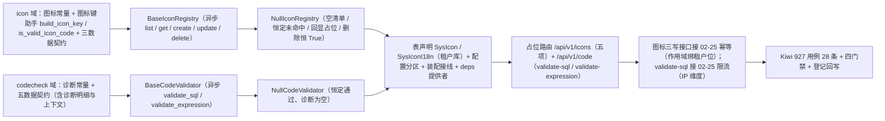

# 自定义图标与代码校验基座实施记录

> 项目骨架 · 02 后端基座 · 04 跨阶段基座 · 26 自定义图标与代码校验基座 · 实施记录

[文档首页](../../../../../../../文档首页.md) › [02-4-26 自定义图标与代码校验基座](../02_后端基座_04_跨阶段基座_26_自定义图标与代码校验基座.md) › 01 实施　|　[← 父任务](../02_后端基座_04_跨阶段基座_26_自定义图标与代码校验基座.md)

## 1. 实施信息 

| 项 | 值 |
| --- | --- |
| 任务 | [02-4-26 自定义图标与代码校验基座](../02_后端基座_04_跨阶段基座_26_自定义图标与代码校验基座.md) |
| 对应需求 | [02-53](../../../../../需求/02_需求_后端基座.md#r02-53) |
| 详细设计 | [26_详细设计_01_自定义图标与代码校验基座](../设计/26_详细设计_01_自定义图标与代码校验基座.md) |
| 实施日期 | 2026-09-20 |
| 实施人 | minjian |
| 实施环境 | 开发机（Ubuntu，Python 3.14 / uv） |
| 前置基座 | 02-4-25 打印模板与导出 PDF（同为前端组件支撑基座批次）、02-3-10 限流幂等防重放中间层、02-6-1 接口路由基座、02-3-1 插件化装配、02-4-23 用户偏好基座（表声明与占位路由先例） |
| 提交 | 设计定稿 `2703e2d7`・实施代码 `c8f4474a` |
| 结论 | 完成 |

## 2. 实施概览 

结果小结：两能力域契约与占位实现落地——新增 `app/icon/`（图标常量、图标键助手与格式校验、三数据契约、契约五方法、占位实现、提供者）与 `app/codecheck/`（诊断常量、五数据契约、契约两方法、占位实现、提供者）；表声明 `SysIcon` / `SysIconI18n`（租户库，唯一约束含软删除位）；路由契约落 `app/schemas/icon.py` / `app/schemas/codecheck.py`；占位路由 `/api/v1/icons`（清单 / 详情 / 新增 / 更新 / 删除）与 `/api/v1/code/validate-sql`、`/api/v1/code/validate-expression`，均基于接口路由基座统一挂载且**均需登录**；图标三写接口接幂等基座、SQL 校验接限流基座；**不新增错误码**。应用可启动、提供者可解析；`pytest` / `ruff` / `pyright` 全绿，新增 / 改动模块覆盖率 100%。

## 3. 实施过程 

1. **图标能力域（新增 `app/icon/`）**：取值集合常量 `ICON_SOURCES`（el / biz / custom / van）、`ICON_STATUSES`（active / disabled），来源与缺省 `ICON_CUSTOM_SOURCE` / `ICON_KEY_SEPARATOR` / `DEFAULT_ICON_STATUS`，上限常量 `ICON_CODE_MAX_LENGTH` / `ICON_NAME_MAX_LENGTH` / `ICON_SVG_MAX_BYTES` 与占位前缀 `NULL_ICON_ID_PREFIX`；图标键助手 `build_icon_key`（`{来源}:{图标键}`）与 `is_valid_icon_code`（kebab-case 正则 + 长度上限）；数据契约 `IconDraft` / `IconPatch`（全字段可选）/ `IconInfo`（含派生 `icon_key`）；契约 `BaseIconRegistry`（`key = plugin_key = "icon_registry"`；异步 `list(*, category=None, status=None, keyword=None)` / `get(code)` / `create(draft)` / `update(code, patch)` / `delete(code)`）；提供者 `get_icon_registry`。
2. **图标占位实现（`app/icon/null.py`）**：`NullIconRegistry`——清单恒定空、取图标恒定未命中（通用资源不存在 `10002` / 404）、新增与更新固定回显入参（标识由图标键派生、图标键派生值经统一助手生成、更新未提供字段回落占位值）、删除恒 `True`；**不落库、不清洗 SVG、不做引用检查**。
3. **代码校验能力域（新增 `app/codecheck/`）**：诊断常量 `VALIDATION_LEVELS` / `VALIDATION_ISSUE_KINDS` / `EXPRESSION_SCOPES` / `DEFAULT_EXPRESSION_SCOPE`、试算口径常量 `SQL_ROW_LIMIT` / `DEFAULT_SQL_TIMEOUT_MS` / `SQL_VALIDATE_RATE_LIMIT`（窗口复用限流基座缺省值）；数据契约 `ValidationIssue`（级别 / 类别 / 提示 / 行 / 列）/ `ValidationColumn` / `SqlValidationResult`（结论 / 诊断 / 字段清单 / 预览行 / 耗时 / 截断标记）/ `ExpressionContext`（场景 / 可用字段 / 预置变量）/ `ExpressionValidationResult`；契约 `BaseCodeValidator`（`key = plugin_key = "code_validator"`；异步 `validate_sql(sql, *, datasource=None)` / `validate_expression(expr, *, context=None)`）；提供者 `get_code_validator`。
4. **代码校验占位实现（`app/codecheck/null.py`）**：`NullCodeValidator` 两方法恒定通过（诊断 / 字段 / 预览行为空、耗时 0、未截断）；**不连从库、不解析 SQL 与表达式、不校验白名单与字段**。
5. **表声明**：`app/models/system.py` 新增 `SysIcon`（`sys_icon`：`code` / `name` / `category` / `tags` / `svg` / `status`，`code` 唯一）与 `SysIconI18n`（`sys_icon_i18n`：`icon_id` / `locale` / `name`，`(icon_id, locale)` 唯一），**租户库**、唯一约束含 `deleted_at`（本任务只声明、不建表、不迁移）。
6. **路由契约**：新增 `app/schemas/icon.py`（`IconCreateRequest` / `IconUpdateRequest` / `IconResponse` / `IconListResponse` / `IconDeleteResponse`）与 `app/schemas/codecheck.py`（`SqlValidateRequest` / `ExpressionContextPayload` / `ExpressionValidateRequest` / `ValidationIssueResponse` / `ValidationColumnResponse` / `SqlValidationResponse` / `ExpressionValidationResponse`），字段与能力域契约一一对应，由路由层显式映射（不隐式透传字典）；字段一律 snake_case。
7. **装配与依赖注入**：`Settings` 增 `code_validator` / `icon_registry` 两分区（未配置 → `null`）；`_NULL_MODULES` 增 `app.codecheck.null` 与 `app.icon.null`（导入即自动登记）；`PLUGIN_WIRINGS` 增两条接线；`app/api/deps.py` 导出两提供者；`app/api/router.py` 登记 `codecheck` / `icon` 路由。
8. **占位路由**：新增 `app/api/icon.py`——`GET /api/v1/icons`（清单，查询参数分组 / 状态 / 关键字）、`GET /api/v1/icons/{code}`（详情）、`POST /api/v1/icons`（新增）、`PUT /api/v1/icons/{code}`（更新）、`DELETE /api/v1/icons/{code}`（删除）；新增 `app/api/codecheck.py`——`POST /api/v1/code/validate-sql`（先经限流基座按 IP 维度 + 解析链租户位判定配额，再委托试算）、`POST /api/v1/code/validate-expression`。两类路由均挂登录依赖；**图标键格式在路由层经 `is_valid_icon_code` 显式校验**（非法抛参数错误 `10001`），与契约层长度约束分工明确。
9. **幂等与限流接线**：图标三写接口读 `Idempotency-Key` 头（缺失即跳过），作用域绑当前租户位，重复提交复用首次结果（删除以 `{deleted}` 作为首次结果载荷）；SQL 校验经 `BaseRateLimiter.require` + `build_rate_limit_key`（维度 `ip`、规则 `SQL_VALIDATE_RATE_LIMIT` + 基座缺省窗口）。
10. **前置契约断言同步**：`tests/api/test_router_base.py` 默认路由登记表键元组补 `icon` / `codecheck`；`tests/crosscut/test_plugin_registration.py::_EXPECTED_PLUGIN_KEYS` 补 `code_validator` / `icon_registry`。
11. **测试**：先在 mjbk Kiwi TCMS 平台登记用例取得编号 **927**（登记前实测平台最新号 926——**号段已被 CI 自动导入用例推进**），再写 `tests/icon/test_icon_registry.py`（17 条）与 `tests/codecheck/test_code_validator.py`（11 条），共 28 条，均标注 `@pytest.mark.kiwi_id(927)`。
12. **登记回写**：架构 04 §8（收口原则补「设计期契约收口」一条）、架构 07 §3.2（租户库表补两表）、《后端基类清单》§9 / §10 / 目录行、《后端开发规范》§3.1（新增图标与代码校验强制口径）、《概要设计 · 菜单管理》（功能点 / 业务规则 / 核心表 / 索引 / 接口 / 权限码 / 页面）、组件设计 03《图标选择器》（`custom:{id}` → `custom:{code}`）、计划 §1 / §2 / §3 / §3.1 / §4 / §5、需求 02-53 `> 注：` 块、任务与父任务状态（父任务 02_04 收口「已完成」）。

## 4. 问题与处置 

| 问题 / 现象 | 原因 | 处置与落点 |
| --- | --- | --- |
| Kiwi 编号与台账预估不符 | CI 自动导入的自动化用例持续推进平台自增主键（登记前实测最新号 **926**，非台账推算值） | 按「先查平台最新号、以平台返回值为准」口径登记并取实验证：本任务用例 **927** |
| `app/api/codecheck.py` 诊断映射分支覆盖率缺口 | 占位实现**恒定空诊断**，映射分支不可达（同 02-4-25 实证） | 注入**替身校验器**（`dependency_overrides`，返回非空诊断 / 字段 / 预览行 / 截断标记）驱动映射分支，补后 100% |
| pyright 报 `__table__.constraints` 类型未知 / 属性不可访问 | 声明式基类上 `__table__` 静态类型为 `FromClause`，无 `constraints` | 测试内 `cast("Table", …)` 后再遍历唯一约束（不改产品代码） |
| `ruff` 报行宽超限（`app/models/system.py` 注释 124 列） | 图标键注释带完整前缀说明过长 | 缩短注释并跑 `ruff format`（357 文件已格式化） |
| `IconInfo` 用例构造报缺 `icon_key` | `icon_key` 为派生值且设计上设为必填 | 用例补齐派生入参（保持契约必填口径，避免占位派生值缺失） |
| 计划 §1 工时台账与枚举求和不符（原记「已完成 178h」而枚举已含打印基座 3h，应为 181h） | 上一批（02-4-25）只更新了枚举未同步台账数字 | 随本任务收口一次校正：**已完成 184h（主体 129h + 补充 55h）、剩余 0h、阶段合计 184h**（与 §2 表及本任务 3h 一致） |
| 计划 §2 中 `02_04` 行工时 23h 与任务文档 58h 不一致 | 该父任务此前为「部分完成」，`check-status.py` 的 H7 跳过部分完成父任务 | 本任务使父任务收口「已完成」，按 H7 要求把计划行工时回写为 **58h**，并同步「含扩展 26 项」与实际交付内容 |

## 5. 验证结果 

| 完成标准 | 验证方法 | 实测结果 |
| --- | --- | --- |
| 接口 / 抽象声明就位（图标注册表五项） | `BaseIconRegistry` 五方法 + `IconDraft` / `IconPatch` / `IconInfo` + Kiwi 927 用例 | 通过 |
| 接口 / 抽象声明就位（代码校验两项） | `BaseCodeValidator` 两方法 + 五数据契约 + 契约用例 | 通过 |
| 表声明（图标键 / 内容 / 分组） | `SysIcon` / `SysIconI18n` 表名、关键字段与含 `deleted_at` 的唯一约束断言 + 架构 07 §3.2 登记 | 通过 |
| 占位实现固定返回 | 两占位实现固定返回 + 占位语义用例（空清单 / 恒定未命中 / 回显与回落 / 恒定通过） | 通过 |
| 依赖注入可解析、应用可启动不报错 | 装配单例 + 提供者解析用例（`plugin_providers` 两键均为 `null`）+ 应用冒烟 + 两占位路由 | 通过 |
| 限流与幂等接入 | `validate-sql` 限流替身键断言（`bms:*:rate:ip:*`）；图标三写接口「首次登记 → 复用」「非首次且首次结果不可读 → 继续执行」「更新与删除复用」用例 | 通过 |
| 不实现真实能力 | 无落库 CRUD / 无 SVG 上传清洗 / 无引用检查 / 无只读从库执行 / 无表达式语义校验 / 无 cron 契约 | 通过 |
| 登记齐备 | 架构 04 / 07、《后端基类清单》§9 / §10 / 目录行、《后端开发规范》§3.1、概要设计 07、组件设计 03、计划 §1 ~ §5、需求 02-53 注块、任务与父任务状态 | 已登记 |
| 无 lint / 类型错误 | `ruff check` / `ruff format --check` / `uv run pyright` | All checks passed / 357 files already formatted / 0 errors |
| 基座护栏 | `check-base.py` / `check-backend-base.py` / `check-links.py` / `check-status.py --stage 01_项目骨架 --strict` | 均通过（状态校验 307 项：硬规则不合规 0、软提示 0） |
| 新增 / 改动模块覆盖率 | `pytest --cov=app` | `app/icon/`（base / null / `__init__`）、`app/codecheck/`（base / null / `__init__`）、`app/schemas/icon.py`、`app/schemas/codecheck.py`、`app/api/icon.py`、`app/api/codecheck.py`、`app/models/system.py`、`app/core/config.py` 均 100% |

> 全量 `pytest --cov=app`：**728 passed, 8 skipped, 0 failed**（8 skipped 为需真实 Redis 的集成用例）。

## 6. 偏差与遗留 

- **偏差**：无功能偏差——按详细设计实施（**分两域** `app/icon/` + `app/codecheck/`、图标契约补 `get` 成五项、`code` 为唯一业务标识与 `custom:{code}` 派生、表声明取主表 + 名称多语言附表、统一校验结果契约、`ExpressionContext` 参数对象、**不新增错误码**、SQL 校验接限流基座、占位语义、路由落点与图标写接口接幂等、全量登记范围，均按用户拍板）。行程中新出现的两项待拍板事项（是否补单图标详情、图标写接口是否接幂等）均**先确认后执行**，见详细设计 §17 对齐记录；文档侧治理性修正见「问题与处置」（工时台账校正、计划父任务行工时与 H7 对齐、pyright 类型标注）。
- **遗留归口（已登记，随对应阶段销项）**：
  - 图标真实落库 CRUD（两表建表与 upsert、唯一约束兜底、启停、清单缓存与版本失效）→ **通用能力阶段**。
  - SVG 上传与内容清洗（类型白名单、大小上限、移除脚本 / 事件属性 / 外链）→ **文件管理阶段**（取 `02-17` 对象存储出口）。
  - 删除引用检查（被菜单 / 卡片引用则先解除引用或用「停用」代替）→ **菜单管理阶段**。
  - SQL 只读从库执行与白名单（只读语句判定、参数化、超时中断、字段声明比对、结果超限）→ **报表 BI 阶段**（取 `02-28` 数据查询提供者）。
  - 表达式语义校验（字段 / 变量存在性、运算符与函数白名单、作用域隔离）→ **RBAC 阶段 / 工作流阶段**。
  - 执行侧故障码位（校验服务不可用 / 超时）→ 随对应实现阶段按段位登记（本域不预设码位）。
  - 登录态与权限码（`icon:manage` / `rpt:design` / `role:grant` / `wf:define`）→ **认证 / RBAC 阶段**。
  - cron 合法性校验 → **任务调度阶段**（不属本域）。
  - **test 仓策展台账补登**：`test文档/用例/Kiwi用例台账.md` 仍只记到 776（后端补充基座批次 777 ~ 927 未入台账、§4 对账数据已过时）→ 归口「下一批次统一补登」（test 仓在本工作区未克隆，本次不动）。
  - 以上均已在计划 §3.1 与需求 02-53 `> 注：` 块登记。
- **消费方标注**：前端 **`08_02`**（组件设计 03 图标选择器 / 组件设计 04 代码表达式编辑器两件）已在计划 §3.1 行与本记录登记「只换数据通路」——后端契约字段与前端冻结契约一一对应（后端 snake_case，宿主注入层做 camelCase 映射），**无前端契约改动**；唯一口径同步为 **`custom:{id}` → `custom:{code}`**（图标键为业务标识，见详细设计 §17）。
- **上游登记闭环**：组件设计 03 登记项①（`sys_menu.icon` 存完整 icon key + `sys_icon` 租户库表 + 图标清单 / 管理接口 + `icon:manage`）已回写《概要设计 · 菜单管理》「功能点分解」「业务规则」「核心表」「索引与唯一约束」「接口设计」「权限码」「页面清单」；登记项②（设计令牌 icon key 取值口径）、③（命名规范 icon key 命名）、④（前端图标引入与分包）属前端 / 设计令牌与命名规范侧，**不由本任务回写**，仍归其原登记。
- **结论**：本任务遗留已全部登记去向，偏差与遗留处理完成；**本任务为 02_04 最后一项，父任务已收口「已完成」，阶段一无剩余任务**。

> 本文档依《文档生成规范》编写
