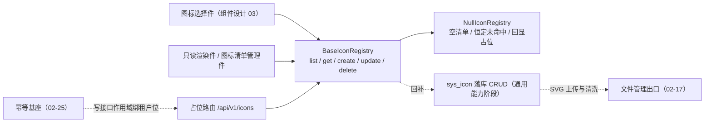
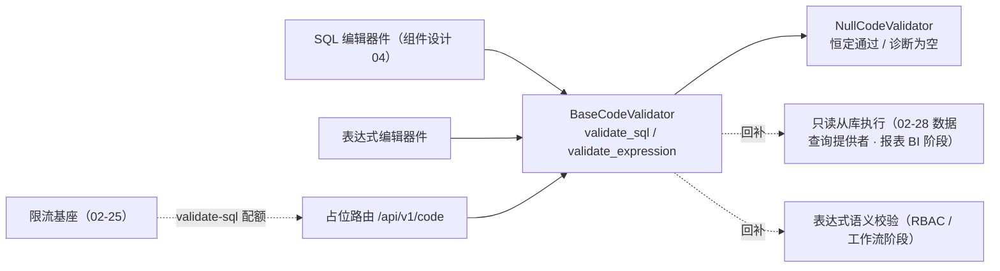

# 自定义图标与代码校验基座详细设计

> 项目骨架 · 02 后端基座 · 04 跨阶段基座 · 26 自定义图标与代码校验基座 · 详细设计

[文档首页](../../../../../../../文档首页.md) › [02-4-26 自定义图标与代码校验基座](../02_后端基座_04_跨阶段基座_26_自定义图标与代码校验基座.md) › 01 详细设计　|　[← 父任务](../02_后端基座_04_跨阶段基座_26_自定义图标与代码校验基座.md)

## 1. 概述 <a id="overview"></a>

- **目标**：落地「自定义图标」与「代码校验」两能力域的契约与占位实现——**两域分置**：新增 `app/icon/`（图标注册表契约 `BaseIconRegistry`：异步 `list` / `get` / `create` / `update` / `delete`、数据契约、图标键助手、占位实现 `NullIconRegistry`）与新增 `app/codecheck/`（代码校验契约 `BaseCodeValidator`：异步 `validate_sql`（只读试算 + 超时与限流）/ `validate_expression`、诊断数据契约、占位实现 `NullCodeValidator`）；表声明 `SysIcon`（`sys_icon`）/ `SysIconI18n`（`sys_icon_i18n`，租户库）；配置分区 `[icon_registry]` / `[code_validator]`、装配接线与两占位路由（`/api/v1/icons` 五项端点、`/api/v1/code/validate-sql` 与 `/api/v1/code/validate-expression`）；图标写接口接幂等基座（作用域绑当前租户位）、SQL 校验接限流基座。
- **范围**：`app/icon/`（新增）、`app/codecheck/`（新增）、`app/schemas/icon.py`（新增）、`app/schemas/codecheck.py`（新增）、`app/models/system.py`、`app/core/config.py`、`app/core/assembly.py`、`app/api/deps.py`、`app/api/icon.py`（新增路由）、`app/api/codecheck.py`（新增路由）、`app/api/router.py`、单测与两处前置契约断言；架构 04《后端基础类体系》、架构 07《数据架构》、《后端基类清单》、《后端开发规范》、《概要设计 · 菜单管理》、组件设计 03《图标选择器》、《概要设计 · 任务调度》与更上游的《命名规范》相关口径，《后端基类清单》与计划 / 需求 02-53 登记，任务 / 父任务状态回写。
- **不含**（归后续阶段）：自定义图标的真实落库 CRUD（`sys_icon` 建表与 upsert）、SVG 上传与内容清洗（**文件管理阶段**）、图标清单缓存与版本失效（**通用能力阶段**）、引用检查（被菜单 / 卡片引用的图标不可删除，**菜单管理阶段**，依赖引用扫描数据）；SQL 只读从库真实执行与白名单校验（**报表 BI 阶段**，取 `02-28` 数据查询提供者）、表达式真实语法 / 字段 / 变量校验（**RBAC 阶段 · 工作流阶段**，语义归 `15-权限计算引擎`）、cron 合法性校验（**任务调度阶段**，独立于本域）、登录态与权限码校验（**认证 / RBAC 阶段**）。
- **依据**：需求 [02-53](../../../../../需求/02_需求_后端基座.md#r02-53)、《[架构设计 · 后端基础类体系](../../../../../../../设计/架构设计/04_架构设计_后端基础类体系.md)》「能力收口与强制口径」「阶段交付与跨阶段基座契约」节、《[架构设计 · 数据架构](../../../../../../../设计/架构设计/07_架构设计_数据架构.md)》「租户库表」节、《[架构设计 · 接口与集成](../../../../../../../设计/架构设计/09_架构设计_接口与集成.md)》「公共约定」「错误码分段」节、《[后端基类清单](../../../../../../../后端基类清单.md)》「跨阶段基座」节、《[后端开发规范](../../../../../../../规范/后端开发规范.md)》「后端基座体系」节、《[API接口规范](../../../../../../../规范/API接口规范.md)》「统一响应 / ID 字符串传输 / 幂等 / 限流」节、《[命名规范](../../../../../../../规范/命名规范.md)》「后端命名」「API 命名」节、《[概要设计 · 菜单管理](../../../../../../../设计/概要设计/07_概要设计_菜单管理.md)》、《[组件设计 03 图标选择器](../../../../../../../设计/组件设计/08_交互类/03_组件设计_图标选择器/03_组件设计_图标选择器.md)》、《[组件设计 04 代码表达式编辑器](../../../../../../../设计/组件设计/08_交互类/04_组件设计_代码表达式编辑器/04_组件设计_代码表达式编辑器.md)》。

## 2. 现状与差距 <a id="gap"></a>

| 现状 | 差距 |
| --- | --- |
| 全库无图标注册表与代码校验契约（检索 `BaseIconRegistry` / `BaseCodeValidator` / `sys_icon` 零命中）；无 `app/icon/` 与 `app/codecheck/` 目录 | 前端图标选择件与只读渲染件（组件设计 03）需自定义图标清单与管理接口、代码 / 表达式编辑器件（组件设计 04）需 SQL 只读试算与表达式校验——后端无稳定数据通路，两端只能各自造口径 |
| 图标 key 前缀口径（`el:` / `biz:` / `custom:` / `van:`）与「未知 key 降级 + 告警」仅在组件设计 03 §3；前端自行拼装 icon key | 前缀拼接无基座统一出口，多端各自拼装必然漂移；`sys_icon` 有登记但**无表声明**、无 CRUD 契约 |
| 「SQL 只读试算 + 超时 / 限流 + 字段清单」「表达式语法 / 字段 / 变量诊断」分散在组件设计 04 §5 / §6 与各业务模块（报表 / 角色 / 工作流） | 校验口径（诊断部位、字段清单、耗时、截断）无统一契约；若各模块自建，前端每个编辑场景都要各接一套 |
| 限流基座 `BaseRateLimiter`（`02-25`）、幂等基座 `IdempotencyStore`（`02-25`）、路由基座 `BaseRouter`（`02-6-1`）、插件装配（`02-3-1`）、租户解析链 `get_tenant` 均已就位 | 两新能力域无配置分区 / 装配接线 / 提供者 / 路由登记，「依赖注入可解析」无落点；「超时与限流」与「防重复提交」无接入点 |
| 《后端基类清单》§9「图标与代码校验」行为「待定（详细设计定）」 | 契约、代码位置、状态无权威登记 |

## 3. 交付物清单 <a id="tree"></a>

```text
backend/
├── app/icon/__init__.py                    # 新增：能力域包（docstring 口径）
├── app/icon/base.py                        # 新增：图标常量 / 图标键助手与 code 校验 / 三数据契约 / BaseIconRegistry / 提供者
├── app/icon/null.py                        # 新增：NullIconRegistry（空清单 / 恒定未命中 / 回显占位）
├── app/codecheck/__init__.py               # 新增：能力域包（docstring 口径）
├── app/codecheck/base.py                   # 新增：诊断常量 / 四数据契约 / BaseCodeValidator / 提供者
├── app/codecheck/null.py                   # 新增：NullCodeValidator（恒定通过、零副诊断）
├── app/schemas/icon.py                     # 新增：占位路由请求 / 响应契约（与能力域契约字段一一对应）
├── app/schemas/codecheck.py                # 新增：占位路由请求 / 响应契约
├── app/models/system.py                    # 修改：新增 SysIcon / SysIconI18n 表声明（租户库）
├── app/core/config.py                      # 修改：Settings 增 code_validator / icon_registry 两分区（PluginSelection）
├── app/core/assembly.py                    # 修改：_NULL_MODULES 增两模块 + PLUGIN_WIRINGS 增两条接线
├── app/api/deps.py                         # 修改：导出 get_icon_registry / get_code_validator
├── app/api/icon.py                         # 新增：占位路由 GET /icons、GET /icons/{code}、POST /icons、PUT /icons/{code}、DELETE /icons/{code}
├── app/api/codecheck.py                    # 新增：占位路由 POST /code/validate-sql、POST /code/validate-expression
├── app/api/router.py                       # 修改：登记 icon / codecheck 路由
└── tests/
    ├── icon/test_icon_registry.py          # 新增：Kiwi 用例（契约 / 常量与键助手 / 数据契约 / 占位语义 / 表声明 / 依赖解析 / 占位路由 / 幂等）
    ├── codecheck/test_code_validator.py    # 新增：Kiwi 用例（契约 / 常量 / 数据契约 / 占位语义 / 依赖解析 / 占位路由 / 限流）
    ├── api/test_router_base.py             # 修改：默认路由登记表键元组补 icon / codecheck
    └── crosscut/test_plugin_registration.py  # 修改：_EXPECTED_PLUGIN_KEYS 补 icon_registry / code_validator

bms文档/
├── 设计/架构设计/04_架构设计_后端基础类体系.md      # 修改：§8 收口原则补「配置类设计期契约」一条（图标 / 代码校验收口语义）
├── 设计/架构设计/07_架构设计_数据架构.md            # 修改：§3.2「租户库表」补 sys_icon / sys_icon_i18n 行
├── 设计/概要设计/07_概要设计_菜单管理.md            # 修改：功能点 / 核心表 / 接口设计 / 权限码补自定义图标（组件设计登记项① 闭环）
├── 设计/组件设计/08_交互类/03_组件设计_图标选择器/…  # 修改：custom:{id} 口径改 custom:{code}（登记项① 同步）
├── 后端基类清单.md                                  # 修改：§9 跨阶段基座行落定实际契约 + §10 继承链 + §10 目录行
├── 规范/后端开发规范.md                             # 修改：「后端基座体系」§3.1 补强制口径（图标与代码校验必须走基座）
├── 项目/01_项目骨架/计划/01_计划_项目骨架.md        # 修改：§1 工时台账、§2 收纳、§3 移除、§3.1 补注、§5 门禁行
├── 项目/01_项目骨架/需求/02_需求_后端基座.md        # 修改：需求 02-53 补实现期要点注块
├── 项目/…/02_后端基座_04_跨阶段基座_26_….md         # 修改：参考文档补本设计 / 实施 / 测试链接，实施后回写状态
└── 项目/…/02_后端基座_04_跨阶段基座.md              # 修改：子任务清单 26 状态 / 完成日期回写
```

## 4. 图标能力域（`app/icon/`） <a id="contract"></a>

| 成员 | 形态 | 说明 |
| --- | --- | --- |
| `ICON_SOURCES` | `tuple[str, ...]`，`("el", "biz", "custom", "van")` | 图标来源前缀取值集合（平台官方 / 业务自绘 / 租户自定义 / 移动端，对齐组件设计 03 §3.1） |
| `ICON_CUSTOM_SOURCE` | `str`，`"custom"` | 租户自定义图标来源前缀（本域承载的唯一来源） |
| `ICON_KEY_SEPARATOR` | `str`，`":"` | 图标键前缀分隔符（`{来源}:{图标键}`） |
| `ICON_STATUSES` | `tuple[str, ...]`，`("active", "disabled")` | 图标状态取值集合（启用 / 停用） |
| `DEFAULT_ICON_STATUS` | `str`，`"active"` | 缺省图标状态（新增默认启用） |
| `ICON_CODE_MAX_LENGTH` | `int`，`64` | 图标键长度上限 |
| `ICON_NAME_MAX_LENGTH` | `int`，`128` | 图标名称长度上限 |
| `ICON_SVG_MAX_BYTES` | `int`，`102400` | SVG 内容字节上限（100KB，对齐组件设计 03 §6.2 上传要求） |
| `NULL_ICON_ID_PREFIX` | `str`，`"null-"` | 占位图标标识前缀（占位实现由图标键派生，便于断言且逐键唯一） |
| `is_valid_icon_code(code)` | 函数 | 图标键规范校验（kebab-case、小写字母 / 数字、段间单连字符） |
| `build_icon_key(code, *, source=ICON_CUSTOM_SOURCE)` | 函数 | 图标键统一派生（`{来源}:{图标键}`；业务与前端不得自拼） |
| `IconDraft` | 数据契约 | 新增入参（图标键 / 名称 / 分组 / 标签 / SVG 内容） |
| `IconPatch` | 数据契约 | 更新入参（名称 / 分组 / 标签 / SVG 内容 / 状态，**全字段可选**；None 表示不变） |
| `IconInfo` | 数据契约 | 图标定义（标识 / 图标键 / 名称 / 分组 / 标签 / SVG 内容 / 状态 / 图标键派生值） |
| `BaseIconRegistry(BasePluggable, ABC)` | 能力域契约 | `key = plugin_key = "icon_registry"`；异步 `list` / `get` / `create` / `update` / `delete` |
| `list(*, category=None, status=None, keyword=None) -> list[IconInfo]` | 抽象方法（async） | 取图标清单（可按分组 / 状态过滤，关键字匹配图标键 / 名称 / 标签） |
| `get(code) -> IconInfo` | 抽象方法（async） | 取单图标定义；未命中抛资源不存在错误（`10002` / 404） |
| `create(draft) -> IconInfo` | 抽象方法（async） | 新增图标（图标键唯一，重复抛业务冲突 `10003`） |
| `update(code, patch) -> IconInfo` | 抽象方法（async） | 更新图标（按图标键定位；未命中抛资源不存在错误） |
| `delete(code) -> bool` | 抽象方法（async） | 删除图标（**引用检查**在实现侧：被菜单 / 卡片引用时拒绝并提示先停用）；返回是否删除了既有图标 |
| `NullIconRegistry(BaseIconRegistry, BaseNullObject)` | 占位实现 | 空清单 / 恒定未命中 / 回显占位（见 §6） |
| `get_icon_registry(request)` | 提供者 | 取应用级单例（`resolve_plugin`；公共依赖经 `app/api/deps.py` 统一导出） |

**口径**：

| 情形 | 处置 |
| --- | --- |
| 同步性 | 五个方法全部**异步**（真实实现为异步落库 / 上传校验，回补时调用面零改动） |
| 业务标识 | 图标键（`code`，kebab-case 唯一）为**契约唯一业务标识**：`create` 入参携带、`get` / `update` / `delete` 以其定位；**不暴露数据库主键**（响应中的标识为占位派生值，真实实现回填字符串化主键，只作归档关联、业务不得以其定位） |
| 图标键拼接 | 前端 icon key 由基座统一派生（`custom:{图标键}`），**业务与前端不得自拼前缀**；平台官方 / 业务自绘 / 移动端来源（`el:` / `biz:` / `van:`）随代码发布、不经本域落库（本域只承载租户自定义图标） |
| 图标键规范 | kebab-case（首段字母开头、段间单连字符、全小写字母数字），长度 ≤ `ICON_CODE_MAX_LENGTH`；格式非法在**路由层**校验为参数错误（`10001`），真实实现侧同样以前置校验兜底 |
| 分组与标签 | `category` 为**开放字符串**（如 `menu` / `direction` / `media` 等由前端约定，不内建枚举）；`tags` 为字符串列表（搜索用），落库侧序列化为逗号分隔字符串（跨方言安全） |
| SVG 内容 | `svg` 为**内联 SVG 内容**（落库 `Text`）；上传类型 / 大小校验与内容清洗（移除脚本 / 事件属性 / 外链）归**文件管理阶段**（本任务只声明字段与上限常量，不实现清洗） |
| 引用检查 | 删除前置校验「被菜单 / 卡片引用则可停用不可删除」归**菜单管理阶段**（依赖引用扫描数据）；契约以 `delete` 返回值与实现的拒绝语义承载，调用面不变 |
| 登录要求 | 清单 / 详情 / 增改删均**需登录**；自定义图标管理权限码（`icon:manage`）**由上层声明**（基座不内建），清单浏览登录即可 |
| 幂等 | 三个写接口（新增 / 更新 / 删除）按需接幂等键（作用域绑当前租户位）；两读接口不接幂等 |



## 5. 图标数据契约与表声明 <a id="icon-data"></a>

`IconDraft`（新增入参）：

| 字段 | 类型 | 必填 | 说明 |
| --- | --- | --- | --- |
| `code` | `str` | 是 | 图标键（kebab-case，租户内唯一；长度 ≤ 64） |
| `name` | `str` | 是 | 图标名称（默认文案，长度 ≤ 128） |
| `category` | `str` | 是 | 图标分组（分类） |
| `tags` | `list[str]` | 是（缺省空列表） | 标签（搜索用） |
| `svg` | `str` | 是 | SVG 内容（内联；大小上限见常量，清洗归文件管理阶段） |

`IconPatch`（更新入参，全字段可选；`None` 表示不变）：

| 字段 | 类型 | 说明 |
| --- | --- | --- |
| `name` | `str \| None` | 图标名称 |
| `category` | `str \| None` | 图标分组 |
| `tags` | `list[str] \| None` | 标签 |
| `svg` | `str \| None` | SVG 内容 |
| `status` | `str \| None` | 状态（取值 ∈ `ICON_STATUSES`） |

`IconInfo`（图标定义）：

| 字段 | 类型 | 必填 | 说明 |
| --- | --- | --- | --- |
| `id` | `str` | 是 | 图标标识（字符串化主键；占位为 `{NULL_ICON_ID_PREFIX}{图标键}`）；**非业务标识**，不用于定位 |
| `code` | `str` | 是 | 图标键（契约唯一业务标识） |
| `name` | `str` | 是 | 图标名称 |
| `category` | `str` | 是 | 图标分组 |
| `tags` | `list[str]` | 是（缺省空列表） | 标签 |
| `svg` | `str` | 是 | SVG 内容 |
| `status` | `str` | 是（缺省 `DEFAULT_ICON_STATUS`，取值 ∈ `ICON_STATUSES`） | 状态 |
| `icon_key` | `str` | 是 | 图标键派生值（`custom:{图标键}`，经 `build_icon_key` 派生，前端直接落库到 `sys_menu.icon` / 卡片配置） |

`build_icon_key` 口径：

| 项 | 说明 |
| --- | --- |
| 签名 | `build_icon_key(code: str, *, source: str = ICON_CUSTOM_SOURCE) -> str` |
| 格式 | `{来源}:{图标键}`（本域来源恒为 `custom`；`ICON_SOURCES` 声明全部来源取值，供解析侧对齐） |
| 用途 | 前端 icon key 统一派生；业务与前端不得自拼前缀 |

`is_valid_icon_code` 口径：正则 `^[a-z][a-z0-9]*(?:-[a-z0-9]+)*$` + 长度上限；空串、大写、下划线、连续连字符、首尾连字符、数字开头均判非法（路由层据此抛参数错误 `10001`）。

**表声明**（`app/models/system.py`，**租户库**；真实建表结构以《数据库设计》为唯一事实源，本任务只声明、不建表、不迁移）：

| 表 | 字段 | 说明 |
| --- | --- | --- |
| `sys_icon` | 公共字段（继承 `BaseModel`：雪花 `id` / 审计 / 软删除 / 乐观锁） | 租户自定义图标主表 |
| | `code: String(64)` | 图标键（kebab-case；唯一） |
| | `name: String(128)` | 图标名称（默认文案） |
| | `category: String(64)` | 图标分组 |
| | `tags: String(256)`（缺省空串） | 标签（逗号分隔，搜索用；跨方言安全，避免 MySQL 专用 `JSON`） |
| | `svg: Text` | SVG 内容（上传前清洗归文件管理阶段） |
| | `status: String(16)`（缺省 `active`） | 状态（`active` / `disabled`） |
| | 唯一约束 | `UniqueConstraint("code", "deleted_at")`（与《架构设计 · 数据架构》「唯一约束统一建为 (唯一字段, deleted_at)」一致） |
| `sys_icon_i18n` | 公共字段（继承 `BaseModel`） | 图标名称多语言附表 |
| | `icon_id: BigInteger` | 图标 ID（逻辑外键 → `sys_icon.id`） |
| | `locale: String(16)` | 语言标识（如 `zh-CN`） |
| | `name: String(128)` | 图标名称文案 |
| | 唯一约束 | `UniqueConstraint("icon_id", "locale", "deleted_at")` |

> 库归属：图标为**租户各自维护**的自定义资源（组件设计 03 登记①「新增租户库表 `sys_icon`」），登记于《架构设计 · 数据架构》§3.2「租户库表」；平台官方与业务自绘图标随代码发布、**不落表**。

## 6. 代码校验能力域（`app/codecheck/`） <a id="codecheck"></a>

| 成员 | 形态 | 说明 |
| --- | --- | --- |
| `VALIDATION_LEVELS` | `tuple[str, ...]`，`("error", "warning")` | 诊断级别取值集合 |
| `VALIDATION_ISSUE_KINDS` | `tuple[str, ...]`，`("syntax", "whitelist", "field", "variable", "other")` | 诊断类别取值集合（语法 / 白名单 / 字段 / 变量 / 其他） |
| `EXPRESSION_SCOPES` | `tuple[str, ...]`，`("data_scope", "workflow_condition", "report", "custom")` | 表达式场景取值集合（数据范围 / 工作流条件 / 报表数据集 / 自定义） |
| `DEFAULT_EXPRESSION_SCOPE` | `str`，`"custom"` | 缺省表达式场景（未声明时按自定义，不臆断业务场景） |
| `SQL_ROW_LIMIT` | `int`，`200` | 只读试算结果行上限（超限截断并置截断标记） |
| `DEFAULT_SQL_TIMEOUT_MS` | `int`，`5000` | 只读试算超时（毫秒，真实实现侧生效） |
| `SQL_VALIDATE_RATE_LIMIT` | `int`，`30` | SQL 校验限流配额（每窗口次数；窗口复用限流基座 `DEFAULT_RATE_WINDOW`，**不新建平行常量**） |
| `ValidationIssue` | 数据契约 | 诊断明细（级别 / 类别 / 提示 / 行 / 列） |
| `ValidationColumn` | 数据契约 | 试算返回字段（字段名 / 类型） |
| `SqlValidationResult` | 数据契约 | SQL 校验与只读试算结果（结论 / 诊断 / 字段清单 / 预览行 / 耗时 / 截断标记） |
| `ExpressionContext` | 数据契约 | 表达式校验上下文（场景 / 可用字段 / 预置变量） |
| `ExpressionValidationResult` | 数据契约 | 表达式校验结果（结论 / 诊断） |
| `BaseCodeValidator(BasePluggable, ABC)` | 能力域契约 | `key = plugin_key = "code_validator"`；异步 `validate_sql` / `validate_expression` |
| `validate_sql(sql, *, datasource=None) -> SqlValidationResult` | 抽象方法（async） | SQL 校验与只读试算执行（仅只读语句、超时与限流、字段清单与预览） |
| `validate_expression(expr, *, context=None) -> ExpressionValidationResult` | 抽象方法（async） | 表达式校验（语法 / 字段 / 变量诊断，含位置） |
| `NullCodeValidator(BaseCodeValidator, BaseNullObject)` | 占位实现 | 两方法恒定通过、诊断为空（见 §7） |
| `get_code_validator(request)` | 提供者 | 取应用级单例（`resolve_plugin`） |

**口径**：

| 情形 | 处置 |
| --- | --- |
| 同步性 | 两方法**异步**（真实实现为异步只读从库执行 / 语义校验，回补时调用面零改动） |
| 校验失败语义 | **校验不通过不是异常**——语法 / 白名单 / 字段 / 变量问题一律以**结果契约**（`valid=False` + `issues`）返回，供前端内联标注；只有「校验服务不可用」「超时」等**执行侧故障**才由实现侧抛异常（本任务不落该类错误码，见 §9） |
| SQL 只读口径 | 只允许**只读语句**（白名单 `SELECT`）；非只读语句归实现侧「白名单」类诊断（`kind = whitelist`），占用写语句一律拒绝执行；真实执行走**只读从库** + 超时（`DEFAULT_SQL_TIMEOUT_MS`） |
| 返回字段与预览 | `columns` 为确认后的字段清单（供前端列名复制与字段声明比对）；`rows` 为预览行（上限 `SQL_ROW_LIMIT`，超限置 `truncated=True`）；字段清单 / 预览均随校验一次返回，避免前端二次取数 |
| 超时与限流 | 超时归实现侧（常量已登记）；**限流经限流基座**（`02-25`）在占位路由层接入，规则取 `SQL_VALIDATE_RATE_LIMIT` + 限流基座缺省窗口 |
| 表达式上下文 | `context` 携带场景（`scope`）、可用字段（`fields`）与预置变量（`variables`），三场景（数据范围 / 工作流条件 / 报表）**同源**；预置变量名（如 `@current_user` / `@current_dept` / `@tenant`）由场景侧下发，基座不内建清单 |
| cron 校验 | **不在本域**（cron 为 5 段调度表达式，语义归任务调度阶段），本任务不落 cron 契约与常量 |
| 登录要求 | 两接口均**需登录**（设计期操作）；权限码（`rpt:design` / `role:grant` / `wf:define`）**由上层声明**，基座不内建 |



## 7. 数据契约与占位语义 <a id="null"></a>

`ValidationIssue`（诊断明细）：

| 字段 | 类型 | 必填 | 说明 |
| --- | --- | --- | --- |
| `level` | `str` | 是（缺省 `"error"`，取值 ∈ `VALIDATION_LEVELS`） | 诊断级别 |
| `kind` | `str` | 是（缺省 `"other"`，取值 ∈ `VALIDATION_ISSUE_KINDS`） | 诊断类别（语法 / 白名单 / 字段 / 变量 / 其他） |
| `message` | `str` | 是 | 提示文案（实现侧给出，前端直接展示；不拼 i18n key） |
| `line` | `int \| None` | 否 | 行号（从 1 起；无位置信息为空） |
| `column` | `int \| None` | 否 | 列号（从 1 起；无位置信息为空） |

`ValidationColumn`（试算字段）：`name: str`（字段名）、`type: str | None`（字段类型，缺省空）。

`SqlValidationResult`（SQL 校验与只读试算结果）：

| 字段 | 类型 | 必填 | 说明 |
| --- | --- | --- | --- |
| `valid` | `bool` | 是（缺省 `True`） | 校验结论（无 `error` 级诊断即通过） |
| `issues` | `list[ValidationIssue]` | 是（缺省空列表） | 诊断明细（含位置，供前端内联标注与底部汇总） |
| `columns` | `list[ValidationColumn]` | 是（缺省空列表） | 试算返回字段清单 |
| `rows` | `list[dict[str, object]]` | 是（缺省空列表） | 结果预览行（上限 `SQL_ROW_LIMIT`） |
| `cost_ms` | `int` | 是（缺省 `0`，≥ 0） | 试算耗时（毫秒） |
| `truncated` | `bool` | 是（缺省 `False`） | 结果是否被行上限截断 |

`ExpressionContext`（表达式校验上下文）：`scope: str`（缺省 `DEFAULT_EXPRESSION_SCOPE`，取值约定 ∈ `EXPRESSION_SCOPES`）、`fields: list[str]`（缺省空列表，可用字段）、`variables: list[str]`（缺省空列表，预置变量）。

`ExpressionValidationResult`（表达式校验结果）：`valid: bool`（缺省 `True`）、`issues: list[ValidationIssue]`（缺省空列表）。

**占位实现语义**：

`NullIconRegistry`：

| 方法 | 占位行为 |
| --- | --- |
| `list(*, category=None, status=None, keyword=None)` | 固定返回**空清单**（不区分过滤参数、不臆造图标；消费方以空态回退） |
| `get(code)` | 恒定未命中——抛**资源不存在**（`10002` / 404）；不返回占位图标（避免占位数据被当真实图标误用） |
| `create(draft)` | 固定**回显入参**：标识为 `{NULL_ICON_ID_PREFIX}{图标键}`、图标键 / 名称 / 分组 / 标签 / SVG 内容取入参、状态取缺省启用、图标键派生值经 `build_icon_key` 生成；**不写库、不校验唯一性、不清洗 SVG** |
| `update(code, patch)` | 固定**回显入参**：名称未提供回落图标键、分组未提供回落空串、标签未提供回落空列表、SVG 未提供回落空串、状态未提供回落缺省启用；标识与图标键派生值同 `create`；**不写库、不校验存在性** |
| `delete(code)` | 固定返回 `True`（幂等删除语义；不校验存在性、不做引用检查） |

`NullCodeValidator`：

| 方法 | 占位行为 |
| --- | --- |
| `validate_sql(sql, *, datasource=None)` | 固定返回**通过**：`valid=True`、`issues` / `columns` / `rows` 为空、`cost_ms` 0、`truncated=False`；**不连从库、不解析 SQL、不校验白名单**；`datasource` 原样忽略（两次调用结果一致） |
| `validate_expression(expr, *, context=None)` | 固定返回**通过**：`valid=True`、`issues` 为空；**不解析表达式、不校验字段与变量**；`context` 传入与否结果一致 |

口径：两占位实现「恒定返回、零外部依赖」——不连库、不解析、不落盘；成功路径与失败分支的真实语义由实现阶段回补，契约与调用面不变。

## 8. 占位路由 <a id="route"></a>

`app/api/icon.py`：`router = BaseRouter(key="icon", prefix="/icons", tags=["icon"], dependencies=[Depends(require_auth)])`——基于接口路由基座，统一挂载到 `/api/v1`；五端点均**需登录**（自定义图标管理权限码由上层声明）：

| 方法 | 路径 | 请求 | 响应（`data`） | 口径 |
| --- | --- | --- | --- | --- |
| GET | `/api/v1/icons` | 查询参数 `category` / `status` / `keyword`（均可选） | 图标清单（`{icons: [...]}`） | 委托 `list(category=..., status=..., keyword=...)` |
| GET | `/api/v1/icons/{code}` | 路径参数 `code` | 图标定义 | 委托 `get(code)`；未命中由资源不存在错误统一转 404 / `10002`；图标键格式非法 → `10001` |
| POST | `/api/v1/icons` | `{code, name, category, tags?, svg}` | 图标定义 | 委托 `create(draft)`；图标键格式非法 → `10001`；带 `Idempotency-Key` 头时首次结果复用（作用域绑当前租户位） |
| PUT | `/api/v1/icons/{code}` | `{name?, category?, tags?, svg?, status?}` | 图标定义 | 委托 `update(code, patch)`；图标键格式非法 → `10001`；幂等口径同上 |
| DELETE | `/api/v1/icons/{code}` | 路径参数 `code` | `{deleted: bool}` | 委托 `delete(code)`；图标键格式非法 → `10001`；幂等口径同上 |

`app/api/codecheck.py`：`router = BaseRouter(key="codecheck", prefix="/code", tags=["codecheck"], dependencies=[Depends(require_auth)])`：

| 方法 | 路径 | 请求 | 响应（`data`） | 口径 |
| --- | --- | --- | --- | --- |
| POST | `/api/v1/code/validate-sql` | `{sql, datasource?}` | SQL 校验结果 | 先经**限流基座**（维度 IP、目标取请求客户端地址，租户位取解析链当前租户；规则 `SQL_VALIDATE_RATE_LIMIT` + 限流基座缺省窗口），再委托 `validate_sql(sql, datasource=datasource)` |
| POST | `/api/v1/code/validate-expression` | `{expr, context?}` | 表达式校验结果 | 委托 `validate_expression(expr, context=context)`（不接限流） |

- 请求 / 响应契约落 `app/schemas/icon.py` 与 `app/schemas/codecheck.py`（与能力域契约**字段名一致**，路由内**显式映射**、不隐式透传字典）：图标请求 `IconCreateRequest` / `IconUpdateRequest`、响应 `IconResponse` / `IconListResponse` / `IconDeleteResponse`；校验请求 `SqlValidateRequest` / `ExpressionValidateRequest`、响应 `SqlValidationResponse` / `ExpressionValidationResponse` / `ValidationIssueResponse` / `ValidationColumnResponse` / `ExpressionContextPayload`。
- 入参约束：图标键最小长度 1、最大长度 `ICON_CODE_MAX_LENGTH`（**格式**由路由层经 `is_valid_icon_code` 显式校验并抛 `10001`，避免与契约层错误码重复）；`sql` / `expr` 最小长度 1（空 / 纯空白在契约层被拦下，经全局校验处理器统一收口 `10001`）。
- 幂等口径：图标三写接口读 `Idempotency-Key` 请求头（缺失即跳过）；命中时经 `load` 复用首次结果、未命中则执行后 `save` 首次结果；幂等键经统一拼接（`bms:{当前租户}:idem:{键}`，作用域绑解析链当前租户位），删除接口以 `{deleted: bool}` 作为首次结果缓存。
- 限流口径：SQL 校验为**重操作**（只读试算），按 IP 维度限流、租户位取解析链；真实实现替换占位后调用面零改动。
- 真实校验执行 / 落库 / 清洗随对应阶段，本路由只做参数校验、限流判定与委托。

## 9. 错误码与异常 <a id="errors"></a>

**本域不新增错误码**（用户拍板），理由与口径：

| 情形 | 处置 |
| --- | --- |
| 图标不存在（含 `get` 未命中、`update` / `delete` 未命中真实实现） | 复用通用段**资源不存在** `10002`（404），与「参数校验失败 `10001`」「业务冲突（图标键重复）`10003`」同为通用段既有码位 |
| 图标键格式非法 | 路由层抛**参数错误** `10001` |
| SQL / 表达式校验不通过 | **以结果契约表达**（`valid=False` + `issues`），不抛异常——校验失败是业务结果而非异常 |
| 校验服务不可用 / 超时（执行侧故障） | 归**实现阶段**（报表 BI / RBAC / 工作流）按各自段位登记（如报表段 `9xxxx`）；本域不预设码位 |
| 段位归属 | 本域跨段（图标属 4xxxx 系统配置、SQL 属 9xxxx 报表、表达式属 RBAC / 工作流），**硬塞单一子段会与后续各阶段码位冲突**，故不新增段位基或子段基；`ErrorCode` / `ErrorSegment` 与架构 09 §2.2 段表、已发布码位行**均不变** |

## 10. 应用装配与依赖注入 <a id="di"></a>

| 位置 | 变更 |
| --- | --- |
| `app/core/config.py` | `Settings` 增 `code_validator: PluginSelection` / `icon_registry: PluginSelection`（未配置 → 解析到 `null`） |
| `app/core/assembly.py` | `_NULL_MODULES` 增 `app.icon.null` 与 `app.codecheck.null`（导入即自动登记）；`PLUGIN_WIRINGS` 增 `PluginWiring("code_validator", BaseCodeValidator, "code_validator", "code_validator")` 与 `PluginWiring("icon_registry", BaseIconRegistry, "icon_registry", "icon_registry")` |
| `app/api/deps.py` | 导出 `get_code_validator` / `get_icon_registry` |
| `app/api/router.py` | 模块列表增 `codecheck` / `icon`（登记路由 → 统一挂载 `/api/v1`） |
| `tests/api/test_router_base.py` | 默认路由登记表键元组补 `codecheck` / `icon`（新能力域的前置契约断言） |
| `tests/crosscut/test_plugin_registration.py` | `_EXPECTED_PLUGIN_KEYS` 补 `code_validator` / `icon_registry`（端口清单断言） |

提供者为普通同步函数（取装配 settings 解析单例，无 IO）；真实实现替换占位时调用面零改动。两能力域各一插件键、各一目录——装配期无先后依赖。

## 11. 继承与分层 <a id="base"></a>

- `BaseIconRegistry` / `BaseCodeValidator → BasePluggable → BaseCapability (+ BaseAsyncResource) → BaseObject`。
- `NullIconRegistry → BaseIconRegistry + BaseNullObject → BasePlaceholder → BaseObject`；`NullCodeValidator` 同构。
- 数据契约 `IconDraft` / `IconPatch` / `IconInfo` / `ValidationIssue` / `ValidationColumn` / `SqlValidationResult` / `ExpressionContext` / `ExpressionValidationResult`（及路由请求 / 响应契约）→ 请求响应基类 `BaseSchema`。
- 表模型 `SysIcon` / `SysIconI18n → BaseModel → BaseObject`。
- 异常：**不新增**（复用通用段 `ParamError` / `NotFoundError` / `ConflictError`）。
- 常量复用：限流窗口复用限流基座 `DEFAULT_RATE_WINDOW`，**不新建平行常量**。

## 12. 登记落点 <a id="register"></a>

| 落点 | 登记内容 |
| --- | --- |
| 《架构设计 · 后端基础类体系》§8 | 收口原则补一条「设计期契约」（语义）：**自定义图标**（icon key 前缀解析与派生、租户自定义图标清单维护）与**代码 / 表达式校验**（只读试算、语法 / 白名单 / 字段 / 变量诊断、超时与限流）一律经能力域基座出口，禁止各模块自建图标清单或直连校验执行；**校验不通过以结果契约表达（非异常）**；§9 跨阶段基座契约清单已含「图标与代码校验」，核对一致（不重复登记） |
| 《架构设计 · 数据架构》§3.2 | 「租户库表」补 `sys_icon`（图标键 / 名称 / 分组 / 标签 / SVG 内容 / 状态；图标键唯一）与 `sys_icon_i18n`（名称多语言附表）行 |
| 《后端基类清单》§9 跨阶段基座 | 「图标与代码校验（横切扩展）」行由「待定（详细设计定）」改为实际落点：两域 `app/icon/` / `app/codecheck/` + 两契约 / 数据契约 / 常量 / 图标键助手 / 占位状态 |
| 《后端基类清单》§10 | 继承链补两条（含数据契约 → 请求响应基类、模型 → `BaseModel`）；目录行补 `app/icon/`、`app/codecheck/` |
| 《后端开发规范》§3.1 | 新增一条强制口径：**自定义图标与代码 / 表达式校验必须走基座**（icon key 由基座统一派生、自定义图标清单经统一出口、SQL 只读试算与表达式校验经统一校验出口；禁止各模块自建图标清单、自拼 icon key、直连从库或自建校验实现；校验不通过以结果契约返回而非异常）。**只写语义与强制口径，不写类名 / 路径 / 常量** |
| 《概要设计 · 菜单管理》 | 功能点补「自定义图标维护」（权限码 `icon:manage`）；核心表补租户库 `sys_icon` / `sys_icon_i18n`；接口设计补图标清单与增改删（登录即可 / `icon:manage`）；业务规则补「图标键存**完整 icon key**、租户自定义图标按租户维维护、删除前置引用检查」（**闭合组件设计 03 登记项①**） |
| 组件设计 03《图标选择器》 | `custom:{id}` 口径统一修正为 **`custom:{code}`**（图标键 kebab-case 唯一、前端 icon key 由 `custom:` + 图标键拼装），登记项① 同步 |
| 计划《01_计划_项目骨架》 | §1 工时台账（已完成 +3h、剩余 -3h）；§2 收纳 02-4-26；§3 移除该行、补注块；§3.1 补「图标与代码校验真实实现」注；§5 门禁行同步 |
| 需求 [02-53](../../../../../需求/02_需求_后端基座.md#r02-53) | 补 `> 注：实现期要点` 块（图标真实落库 / SVG 上传清洗 / 引用检查 / SQL 只读从库与白名单 / 表达式语义校验 / cron 不属本域 / 本域不新增错误码）；实施完成后回写状态与完成日期 |
| 02-4-26 任务文档 | 参考文档补本设计 / 实施 / 测试链接；实施后回写状态 / 完成日期 |
| 02-4-26 父任务（04 跨阶段基座） | 子任务清单 26 状态 / 完成日期回写；**本项为父任务最后一项，回写后父任务状态改「已完成」** |

## 13. 测试设计（Kiwi 先登记后编码） <a id="tests"></a>

用例**先登记 Kiwi TCMS 取得编号再编码**（分类「平台骨架」、优先级 P2、状态 CONFIRMED、自动化用例打「自动化」标签；编号以平台自增主键为准——**登记前先查平台最新号**），自动化文件 `tests/icon/test_icon_registry.py` 与 `tests/codecheck/test_code_validator.py`：

| 用例 | 断言要点 |
| --- | --- |
| 契约继承与能力域标识 | 两契约 `→ BasePluggable → BaseCapability`；两占位 `→ BaseNullObject`；`key` / `plugin_key` 一致（`icon_registry` / `code_validator`）；`placeholder` 为真且描述含「占位实现」 |
| 常量清单 | 图标：`ICON_SOURCES` / `ICON_STATUSES` 取值、`ICON_CUSTOM_SOURCE` / `ICON_KEY_SEPARATOR` / `DEFAULT_ICON_STATUS` / `ICON_CODE_MAX_LENGTH` / `ICON_NAME_MAX_LENGTH` / `ICON_SVG_MAX_BYTES` / `NULL_ICON_ID_PREFIX`；校验：`VALIDATION_LEVELS` / `VALIDATION_ISSUE_KINDS` / `EXPRESSION_SCOPES` / `DEFAULT_EXPRESSION_SCOPE` / `SQL_ROW_LIMIT` / `DEFAULT_SQL_TIMEOUT_MS` / `SQL_VALIDATE_RATE_LIMIT` |
| 图标键助手与格式校验 | `build_icon_key` 结果（缺省来源 `custom`、显式来源）；`is_valid_icon_code` 合法（`purchase-order` / `receipt`）与非法（空串 / 大写 / 下划线 / 数字开头 / 首尾连字符 / 连续连字符 / 超长） |
| 数据契约字段与缺省 | `IconDraft` 字段集；`IconPatch` 全可选；`IconInfo` 缺省（标签空 / 状态 `active`）；`ValidationIssue` 缺省（级别 `error` / 类别 `other` / 位置空）；`ValidationColumn` 缺省类型空；`SqlValidationResult` 缺省（结论真 / 诊断与清单与预览空 / 耗时 0 / 未截断）；`ExpressionContext` 缺省（场景 `custom` / 字段与变量空）；`ExpressionValidationResult` 缺省 |
| 占位语义：图标清单 | 固定空清单；带分组 / 状态 / 关键字与不带结果一致；异步返回 |
| 占位语义：图标详情 | 恒定未命中——抛资源不存在（`10002` / HTTP 404 / 提示含图标键） |
| 占位语义：图标新增 | 标识为占位前缀 + 图标键、图标键派生值为 `custom:{图标键}`、字段回显入参、状态缺省启用、零副作用（连调两次结果一致） |
| 占位语义：图标更新 | 提供字段回显入参；未提供字段回落（名称回落图标键、分组与 SVG 回落空串、标签回落空列表、状态回落缺省） |
| 占位语义：图标删除 | 恒定 `True`；连调两次一致 |
| 占位语义：SQL 校验 | 恒定通过（诊断 / 字段 / 预览空、耗时 0、未截断）；传 `datasource` 与不传结果一致 |
| 占位语义：表达式校验 | 恒定通过（诊断空）；传 `context` 与不传结果一致 |
| 表声明 | `sys_icon` / `sys_icon_i18n` 表名与关键字段存在；两表唯一约束含 `deleted_at` |
| 依赖解析 | `create_app()` 装配两占位实现；两提供者解析到同一实例；`plugin_providers["icon_registry"] == "null"`、`plugin_providers["code_validator"] == "null"` |
| 路由登记与登录契约 | 默认路由登记表键元组含 `icon` / `codecheck`；图标五路径与校验两路径均可达且均挂登录依赖（路由级依赖计数断言） |
| 占位路由：图标清单与详情 | 清单为空列表（带 / 不带过滤参数一致）；详情 404 且业务码 `10002`；图标键格式非法 → `10001` |
| 占位路由：图标增改删 | 新增回显（图标键派生值 / 状态）；更新回显与回落；删除返回 `{deleted: true}`；新增图标键格式非法 → `10001` |
| 图标幂等复用 | 同键二次新增复用首次结果（幂等键形如 `bms:demo:idem:k-*`，作用域绑当前租户位）；「首次结果不可读」场景由独立替身驱动（非首次 + 首次结果为空）继续执行并登记键 |
| 占位路由：SQL 校验与限流 | 统一响应且结果字段回显（结论真 / 诊断空 / 耗时 0）；空 `sql` → `10001`；**限流替身**收到形如 `bms:{租户\|global}:rate:ip:{目标}` 的键（断言前缀与维度段） |
| 占位路由：表达式校验 | 结果回显（结论真 / 诊断空）；带 `context` 与不带结果一致；空 `expr` → `10001` |

回归：全量 `pytest`（含接口冒烟与两处前置契约断言）；新增 / 改动模块覆盖率 100%。

## 14. 实施步骤 <a id="steps"></a>

1. 新增 `app/icon/`（图标常量 / 图标键助手与格式校验 / 三数据契约 / 契约 / 占位实现 / 提供者）。
2. 新增 `app/codecheck/`（诊断常量 / 四数据契约 / 契约 / 占位实现 / 提供者）。
3. 表声明：`app/models/system.py` 增 `SysIcon` / `SysIconI18n`（租户库，两表唯一约束含 `deleted_at`）。
4. 新增 `app/schemas/icon.py` / `app/schemas/codecheck.py`（请求 / 响应契约，字段与能力域契约一一对应）。
5. 装配与路由：`app/core/config.py` / `app/core/assembly.py` / `app/api/deps.py` / `app/api/icon.py` / `app/api/codecheck.py` / `app/api/router.py`；同步两处前置契约断言。
6. 测试：先在平台登记 Kiwi 用例取得编号（先查平台最新号），再写两测试文件并在用例上标注编号。
7. 登记：架构 04 §8 / 架构 07 §3.2、《后端基类清单》§9 / §10 / 目录行、《后端开发规范》§3.1、概要设计 07、组件设计 03、计划 §1 ~ §3.1 / §5、需求 02-53 注块、任务 / 父任务状态。
8. 验证：`pytest --cov=app`、`ruff check` / `ruff format --check` / `pyright` 全绿；`check-base.py` / `check-backend-base.py` / `check-links.py` / `check-status.py --stage 01_项目骨架 --strict` 通过。
9. 记录：实施记录与测试记录各一份。
10. 回写状态后处理偏差与遗留（消费方 `08_02` 两件与上游登记项闭环、计划 §3.1 归口），提交（推送另议）。

## 15. 验收映射 <a id="accept-map"></a>

| 完成标准（需求 02-53 / 任务 02-4-26） | 验证方式 |
| --- | --- |
| 接口 / 抽象声明就位（图标注册表五项） | `BaseIconRegistry` 五方法 + `IconDraft` / `IconPatch` / `IconInfo` + 契约用例 |
| 接口 / 抽象声明就位（代码校验两项） | `BaseCodeValidator` 两方法 + `SqlValidationResult` / `ExpressionContext` / `ExpressionValidationResult` + 契约用例 |
| 表声明（图标键 / 内容 / 分组） | `SysIcon` / `SysIconI18n` 表名、关键字段与唯一约束断言 + 架构 07 §3.2 登记 |
| 占位实现固定返回 | 两占位实现固定返回 + 占位语义用例（空清单 / 恒定未命中 / 回显 / 恒定通过） |
| 依赖注入可解析、应用可启动不报错 | 装配单例 + 提供者解析用例（两键均为 `null`）+ 应用冒烟 + 两占位路由 |
| 限流与幂等接入 | `validate-sql` 限流替身键断言；图标三写接口幂等复用与「首次结果不可读」两用例 |
| 不实现真实能力 | 无落库 CRUD / 无 SVG 上传清洗 / 无只读从库执行 / 无表达式语义校验 / cron 不落 |
| 登记齐备 | 架构 04 §8、架构 07 §3.2、《后端基类清单》§9 / §10 / 目录行、《后端开发规范》§3.1、概要设计 07、组件设计 03、计划 §1 ~ §3.1 / §5、需求 02-53 注块 |
| 无 lint / 类型错误 | `ruff check` / `ruff format --check` / `pyright` |

## 16. 边界与开放项 <a id="boundary"></a>

- **图标真实落库 CRUD**（`sys_icon` / `sys_icon_i18n` 建表与 upsert、唯一约束兜底、状态启停、缓存与版本失效）→ **通用能力阶段**；本任务只落契约、表声明与占位。
- **SVG 上传与内容清洗**（类型白名单、大小上限、移除脚本 / 事件属性 / 外链、存储形态与文件引用）→ **文件管理阶段**（取 `02-17` 对象存储出口）；本任务只落 `svg` 字段与上限常量。
- **引用检查**（被菜单 / 卡片引用的自定义图标不可删除、停用代替）→ **菜单管理阶段**（依赖引用扫描数据）；本任务由 `delete` 返回值与实现侧拒绝语义承载。
- **SQL 只读从库真实执行与白名单**（语句类别判定、参数化、超时中断、慢查询、字段声明比对、结果超限）→ **报表 BI 阶段**（取 `02-28` 数据查询提供者）；本任务只落诊断契约、字段清单与预览、超时 / 行上限常量。
- **表达式语义校验**（字段 / 变量存在性、运算符与函数白名单、作用域隔离）→ **RBAC 阶段 / 工作流阶段**（语义归 `15-权限计算引擎`）；本任务只落上下文与诊断契约。
- **cron 合法性校验** → **任务调度阶段**（不属本域，本任务不落契约与常量）。
- **登录态与权限码**（`icon:manage` / 报表 / 角色 / 工作流场景权限码校验）→ **认证 / RBAC 阶段**；本任务不内建权限码，路由级登录依赖为占位。
- **错误码新增**：本域不新增（图标 / SQL / 表达式跨段，硬塞子段会与后续阶段冲突）；执行侧故障码位随对应实现阶段登记——**若后续实现阶段认为必须有专用码位，按「新增段位先加段位基」回本项目重新确认**（本设计为口径基线）。
- **限流维度**：占位期按 IP 维度接入限流基座（无真实登录态，取请求客户端地址）；真实登录态接入后可按用户维度细分——属实现阶段口径，不影响契约。
- **前端映射**：组件设计 03 / 04 契约为 camelCase，后端按规范输出 snake_case，映射由宿主数据通路注入层承担（只换数据通路、不改前端契约）；`custom:{code}` 口径修正已随本任务同步（登记落点 §12）。
- **测试用例编号**于测试步登记后回填实施 / 测试记录与用例文件。

## 17. 对齐记录 <a id="align"></a>

| # | 事项 | 结论 |
| --- | --- | --- |
| 1 | 代码落点 | **分两域**：新增 `app/icon/`（图标注册表）+ 新增 `app/codecheck/`（代码校验）（用户拍板；两能力语义无关，各一目录与插件键，后续任一回补实现互不影响） |
| 2 | 校验域目录名 | `app/codecheck/`（用户拍板；与 `app/fieldtype/` / `app/globalsearch/` 同风格） |
| 3 | 图标业务标识 | `code`（kebab-case 唯一）为契约标识，前端 icon key = `custom:{code}`（用户拍板；`create` 时尚无主键，`custom:{id}` 口径不自治）——同步修正组件设计 03 的 `custom:{id}`（登记落点 §12） |
| 4 | 图标契约签名 | 列表用关键字参数、写入用参数对象：`list(*, category, status, keyword)` / `get(code)` / `create(draft)` / `update(code, patch)` / `delete(code)`，全异步（用户拍板） |
| 5 | 是否补 `get` | **补** `get(code)`（用户拍板，非推荐项）——图标契约五项 + 路由 `GET /icons/{code}`、占位恒定未命中与用例相应增加 |
| 6 | 表声明 | 取 C：`sys_icon` 主表（`code` / `name` / `category` / `tags` / `svg` / `status` + `BaseModel` 公共字段）+ 附表 `sys_icon_i18n`（用户拍板；名称多语言有落点，与组件设计登记①「可配 `sys_icon_i18n`」一致） |
| 7 | 表归属与登记 | **租户库**，登记《架构设计 · 数据架构》§3.2「租户库表」（用户拍板） |
| 8 | 校验结果契约 | 统一结果契约：`valid` + `issues`（级别 / 类别 / 提示 / 行 / 列）+ `columns` + `rows` + `cost_ms` + `truncated`（用户拍板；`rows` 为**设计期细化**——`truncated` 需配套结果行，且组件设计 04 §5 明确「结果集预览」） |
| 9 | 表达式上下文 | 参数对象 `ExpressionContext`（`scope` + `fields` + `variables`）（用户拍板） |
| 10 | 错误码 | **不新增**：图标不存在复用 `10002`（404）、格式非法 `10001`、校验不通过以结果契约表达（用户拍板；跨段硬塞子段的长期成本更高） |
| 11 | 限流 | `validate_sql` 占位路由接限流基座（`require` + `build_rate_limit_key`，IP 维度 + 解析链租户位，规则 `SQL_VALIDATE_RATE_LIMIT` + 基座缺省窗口）（用户拍板） |
| 12 | 占位语义 | 图标：空清单 / 恒定未命中 / 新增与更新回显 / 删除恒 `True`；校验：两方法恒定通过（用户拍板） |
| 13 | 路由 | 图标 `/api/v1/icons`（清单 / 详情 / 新增 / 更新 / 删除）+ 校验 `/api/v1/code/validate-sql`、`/api/v1/code/validate-expression`（用户拍板） |
| 14 | 写接口幂等 | 图标三写接口**接** `Idempotency-Key`（作用域绑当前租户位）（用户拍板，非推荐项）——与打印写接口同口径，用例含幂等复用与「首次结果不可读」双路径 |
| 15 | 上游登记 | 回写《概要设计 · 菜单管理》（自定义图标功能点 / 核心表 / 接口 / `icon:manage`）+ 组件设计 03 `custom:{id}` → `custom:{code}`（用户拍板） |
| 16 | 登记范围 | 全量：《后端基类清单》§9 / §10 / 目录行 + 《后端开发规范》§3.1 强制口径 + 架构 04 §8 + 架构 07 §3.2 + 计划 §1 ~ §3.1 / §5 + 需求 02-53 注块 + 任务 / 父任务状态（不新增错误码，故不动架构 09 §2.2）（用户拍板） |
| 17 | 交付范围 | 一条龙全链条（设计 / 实施 / 测试 / 登记 / 记录 / 提交 / 偏差遗留 / 收尾）；工时名义 3h，偏差记实施记录（既定口径） |
| 18 | 字段命名 | 后端 snake_case（《命名规范》§8 既定口径）；前端 camelCase 由宿主注入层映射 |
| 19 | 窗口 | 阶段一补做窗口（序 12）；本任务为 02_04 最后一项，完成后父任务收口「已完成」 |

> 本文档依《文档生成规范》编写 · 关键决策逐项确认
