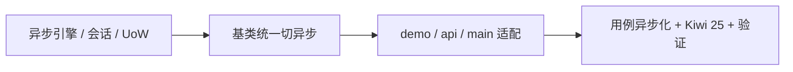

# 数据访问底座实施记录

> 项目骨架 · 02 后端基座 · 05 机制底座 · 01 数据访问底座 · 实施记录

[文档首页](../../../../../../../文档首页.md) › [02-5-1 数据访问底座](../02_后端基座_05_机制底座_01_数据访问底座.md) › 01 实施　|　[← 父任务](../02_后端基座_05_机制底座_01_数据访问底座.md)

## 1. 实施信息 <a id="meta"></a>

| 项 | 值 |
| --- | --- |
| 任务 | [01 数据访问底座](../02_后端基座_05_机制底座_01_数据访问底座.md) |
| 对应需求 | [02-14](../../../../../需求/02_需求_后端基座.md#r02-14) |
| 详细设计 | [01_详细设计_01_数据访问底座](../设计/01_详细设计_01_数据访问底座.md) |
| 实施日期 | 2026-09-13 |
| 实施人 | minjian |
| 实施环境 | 开发机（Ubuntu，Python 3.14 / uv） |
| 提交 | 待确认 |
| 结论 | 完成 |

## 2. 实施概览 <a id="overview"></a>



结果小结：数据访问底座异步化完成（引擎 / 会话 / 工作单元 / 只读标记 / 分页 / 乐观锁转译）；`BaseRepository` / `BaseService` 及派生类、demo 链路统一切异步；`pytest` / `ruff` / `pyright` 全绿、覆盖率 100%。

## 3. 实施过程 <a id="process"></a>

1. **引擎 / 会话 / 工作单元**：
   - `app/db/engine.py`：`EngineFactory`（按 `db_key` 创建 / 缓存 `AsyncEngine`，SQLite 直建、其余附连接池参数、`dispose`）。
   - `app/db/session.py`：`build_session_factory` + `get_db` 请求级依赖。
   - `app/db/unit_of_work.py`：`begin` / `commit` / `rollback` 异步化 + `DbUnitOfWork`。
   - `app/db/routing.py` + `app/core/context.py`：只读上下文标记与读写绑定。
2. **基类异步切换**：`BaseRepository`（CRUD 异步 + `list_page` / `list_cursor` + `_resolve_binding` 接只读标记 + `_guard_version`）、`BaseMemoryRepository`（异步内存）、`BaseDbRepository`（异步占位）、`BaseService`（异步 + `page` / `cursor_page`）、`BaseTransactionalService`（`async with` 事务）。
3. **上层适配**：`DemoService` / `api/demo.py` 异步；`main.py` 装配 `app.state.engine_factory`。
4. **测试**：既有 repo / service / api / uow 用例异步化；新增 `tests/db/test_data_access.py`（Kiwi 25）。
5. **登记**：《架构设计 · 后端基础类体系》§4 / §8、《后端开发规范》§3.1 / §3.4 / §3.7 / §9。
6. **验证**：`uv run pytest` / `uv run ruff check .` / `uv run pyright` 全绿，覆盖率 100%（详见[测试记录](../测试/01_测试_01_数据访问底座.md)）。

关键命令：

```bash
uv run pytest --cov=app -q
uv run ruff check .
uv run pyright
```

## 4. 问题与处置 <a id="issues"></a>

| 问题 / 现象 | 原因 | 处置与落点 |
| --- | --- | --- |
| ruff `F401` 未用导入 | 测试遗留 | 删除 `AsyncIterator` 导入 |
| pyright `reportDeprecated`（`asynccontextmanager`） | 3.14 要求 `AsyncGenerator` 注解 | `AsyncIterator` → `AsyncGenerator` |
| pyright `reportReturnType`（`session.begin()`） | 事务对象非 `[None]` | 上下文泛型改 `AbstractAsyncContextManager[object]` |

## 5. 验证结果 <a id="verify"></a>

| 完成标准 | 验证方法 | 实测结果 |
| --- | --- | --- |
| 接口 / 抽象就位、依赖注入可解析 | 引擎 / 会话 / `get_db` + Kiwi 25 | 通过 |
| 应用可启动、支撑上层链路 | demo 异步链路 + ASGI 用例 | 通过 |
| 基类异步签名一致 | 基类与派生类核对 + 类型检查 | 通过 |
| 无 lint / 类型错误 | `uv run ruff check .` / `uv run pyright` | All checks passed / 0 errors |

## 6. 偏差与遗留 <a id="deviations"></a>

- **无偏差**：按详细设计执行。
- **遗留归口**：真实四库连通、连接池实测、`BaseDbRepository` 真实 CRUD 与软删除 SQL、读写分离真实路由、达梦同步驱动封装随落库 / 后续阶段回补；多租户引擎注册表归 02-5-2。

> 本文档依《文档生成规范》编写
