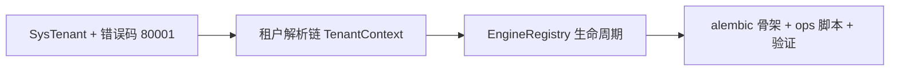

# 多租户数据拓扑实施记录

> 项目骨架 · 02 后端基座 · 05 机制底座 · 02 多租户数据拓扑 · 实施记录

[文档首页](../../../../../../../文档首页.md) › [02-5-2 多租户数据拓扑](../02_后端基座_05_机制底座_02_多租户数据拓扑.md) › 01 实施　|　[← 父任务](../02_后端基座_05_机制底座_02_多租户数据拓扑.md)

## 1. 实施信息 <a id="meta"></a>

| 项 | 值 |
| --- | --- |
| 任务 | [02 多租户数据拓扑](../02_后端基座_05_机制底座_02_多租户数据拓扑.md) |
| 对应需求 | [02-15](../../../../../需求/02_需求_后端基座.md#r02-15) |
| 详细设计 | [02_详细设计_01_多租户数据拓扑](../设计/02_详细设计_01_多租户数据拓扑.md) |
| 实施日期 | 2026-09-13 |
| 实施人 | minjian |
| 实施环境 | 开发机（Ubuntu，Python 3.14 / uv） |
| 提交 | 待确认 |
| 结论 | 完成 |

## 2. 实施概览 <a id="overview"></a>



结果小结：`sys_tenant` 声明、租户解析链与上下文、`EngineRegistry`（常驻 / 懒加载 / LRU / 连接预算）、Alembic 骨架与迁移 / 初始化脚本占位落地；`pytest` / `ruff` / `pyright` 全绿、覆盖率 100%。

## 3. 实施过程 <a id="process"></a>

1. **错误码**：`core/error_codes.py` 增 `TENANT_NOT_FOUND = 80001`；`core/exceptions.py` 增段位基 `OpenTenantError`（8xxxx）与 `TenantNotFoundError`（404）。
2. **模型**：`app/models/platform.py` 增 `SysTenant`（`(code, deleted_at)` 唯一、`idx_domain`）。
3. **租户解析**：`app/db/tenant.py` 落 `TenantContext` / `DEMO_TENANT` / 豁免路径 / `resolve_tenant`（子域名 → `X-Tenant-ID` → token，无来源回落 demo）/ `get_tenant` 依赖。
4. **引擎注册**：`app/db/registry.py` 落 `EngineRegistry`（平台常驻、租户懒加载、LRU / 闲置回收、进程内锁 + Redis SETNX 键占位、连接预算、`aclose`）；`EngineFactory` 补 `drop(db_key)`（逐出 / 回收用，已回写 02-5-1 设计）。
5. **迁移占位**：`alembic/env.py`（离线 / 在线骨架）+ `script.py.mako` + `versions/.gitkeep` + `alembic.ini`；`ops/migrate_tenants.py`（`--target` / `--db` / `--dry-run`）、`ops/init_tenant.py`（`--code` / `--dry-run`）。
6. **登记**：《架构设计 · 多租户路由》新增「三库命名与建库标准」节。
7. **测试**：Kiwi 27（解析链 / 依赖 / 异常 / 模型 / 注册表 / 脚本）。
8. **验证**：`uv run pytest` / `uv run ruff check .` / `uv run pyright` 全绿，覆盖率 100%（详见[测试记录](../测试/02_测试_01_多租户数据拓扑.md)）。

关键命令：

```bash
uv run pytest --cov=app -q
uv run ruff check .
uv run pyright
uv run python ops/migrate_tenants.py --target all --db mysql --dry-run
```

## 4. 问题与处置 <a id="issues"></a>

| 问题 / 现象 | 原因 | 处置与落点 |
| --- | --- | --- |
| `EngineRegistry` 逐出后工厂缓存仍持引擎 | 工厂缓存与注册表生命周期需一致 | `EngineFactory` 增 `drop(db_key)`；回写 02-5-1 设计 §4.1 |
| ruff `I001`（alembic env 导入排序） | 第三方 / 一方导入间空行 | `ruff check --fix` 修正 |

## 5. 验证结果 <a id="verify"></a>

| 完成标准 | 验证方法 | 实测结果 |
| --- | --- | --- |
| 三库模型与建库标准登记齐备 | 架构 11「三库命名与建库标准」节 + 配置默认值 | 通过 |
| `sys_tenant` 声明与 demo 占位可查询 | 模型用例（建表 / 字段 / 写入） | 通过 |
| 解析链与 `TenantContext` 占位返回 demo | 解析链 / 依赖用例（含未知 404 / 80001） | 通过 |
| `EngineRegistry` 占位返回固定引擎引用 | 常驻 / 懒加载 / LRU / 预算 / 释放用例 | 通过 |
| 迁移脚本 `--dry-run` 输出固定库清单 | 脚本用例 | 通过 |
| 无 lint / 类型错误 | `uv run ruff check .` / `uv run pyright` | All checks passed / 0 errors |

## 6. 偏差与遗留 <a id="deviations"></a>

- **偏差**：`EngineFactory` 补 `drop(db_key)`（设计未列，逐出回收所需）；已回写 02-5-1 详细设计。
- **遗留归口**：真实建库 / 字符集落地、落表查询、解析并发隔离、LRU / 连接预算实测随落库阶段；真实 Alembic 迁移与种子归 03-6；全局租户中间件不启用（仅依赖）；token tenant_id 随认证阶段。

> 本文档依《文档生成规范》编写
