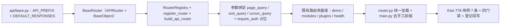

# 接口路由基座实施记录

> 项目骨架 · 02 后端基座 · 06 接口层基座 · 01 接口路由基座 · 实施记录

[文档首页](../../../../../../../文档首页.md) › [02-6-1 接口路由基座](../02_后端基座_06_接口层基座_01_接口路由基座.md) › 01 实施　|　[← 父任务](../02_后端基座_06_接口层基座_01_接口路由基座.md)

## 1. 实施信息 <a id="meta"></a>

| 项 | 值 |
| --- | --- |
| 任务 | [02-6-1 接口路由基座](../02_后端基座_06_接口层基座_01_接口路由基座.md) |
| 对应需求 | [02-55](../../../../../需求/02_需求_后端基座.md#r02-55) |
| 详细设计 | [01_详细设计_01_接口路由基座](../设计/01_详细设计_01_接口路由基座.md) |
| 实施日期 | 2026-09-20 |
| 实施人 | minjian |
| 实施环境 | 开发机（Ubuntu，Python 3.14 / uv） |
| 提交 | 待提交 |
| 结论 | 完成 |

## 2. 实施概览 <a id="overview"></a>



结果小结：接口层统一路由基座落地（`BaseRouter` / `RouterRegistry` / `build_api_router` / 参数绑定工厂 / `require_auth` 占位），既有 4 个模块路由改经基座、`api/router.py` 由手工 `include_router` 改为统一登记挂载、`main.py` 前缀归基座；应用可启动、`/api/v1/demos`·`/modules`·`/plugins` 与 `/healthz` 可达；`pytest`（除既有失败项）/ `ruff` / `pyright` 全绿，新增模块覆盖率 100%。

## 3. 实施过程 <a id="process"></a>

1. **接口路由基座**：新增 `app/api/base.py`——`API_PREFIX`（`/api/v1`）与 `DEFAULT_RESPONSES`（401 / 403 / 404 / 429 / 500 统一错误响应文档）；`BaseRouter(APIRouter, BaseObject)`（`key` / `default_responses`；统一前缀 / tags / 默认错误响应 / 元信息 `describe`）；`RouterRegistry`（`register` 唯一性拒重 / `get` / `keys` / `routers` / `mount`）+ `register_router` / `router_registry` / `build_api_router`；参数绑定工厂 `page_query` / `sort_query` / `cursor_query`（复用 `BasePageQuery` / `BaseSortQuery` / `BaseCursorQuery`）；鉴权占位 `require_auth`（恒定放行）。
2. **既有路由改基座**：`demo.py` / `modules.py` / `plugins.py` 改 `BaseRouter(key=..., prefix=..., tags=[...])`；`health.py` 改 `BaseRouter(key="health", default_responses=False)`（探针豁免统一前缀与统一响应）。
3. **统一挂载**：`api/router.py` 导入模块路由 → `register_router` 登记（`key` 拒重）→ `build_api_router()` 统一挂 `/api/v1`；探针 `health_router` 单独挂根；`main.py` 去掉 `prefix="/api/v1"` 手工传参（前缀归基座）。
4. **默认错误响应豁免**：`BaseRouter.__init__` 支持 `default_responses` 覆盖（探针路由不合并统一错误响应文档）。
5. **测试**：新增 `tests/api/test_router_base.py`（7 条 Kiwi 779：契约继承 / 默认响应 / 注册唯一性 / 统一挂载与前缀 / 参数绑定 / 统一响应与 404 / 鉴权占位）。
6. **Kiwi 登记**：已在 mjbk Kiwi TCMS（分类「平台骨架」、P2、CONFIRMED、标签「自动化」）登记用例 **779「02-6-1 接口路由基座：BaseRouter / 路由登记统一挂载 / 参数绑定 / 统一响应异常收口 / 鉴权占位」**（2026-09-20），与 `@pytest.mark.kiwi_id(779)` 一致。
7. **登记回写**：架构 09「公共约定」、架构 04 §7、《后端基类清单》§2 / §10 / 新增「接口层基座」节、《后端开发规范》「后端基座体系」、《后端基类清单》§10 继承链 / 目录；计划 §3.1（真实鉴权行，立项已登记）、需求 02-55 注块、任务 / 父任务状态回写。

关键命令：

```bash
uv run pytest --cov=app -q
uv run ruff check .
uv run ruff format --check .
uv run pyright
python3 scripts/tools/base-check/check-base.py          # 需在 bms 根目录执行
python3 scripts/tools/base-check/check-backend-base.py  # 需在 bms 根目录执行
```

## 4. 问题与处置 <a id="issues"></a>

| 问题 / 现象 | 原因 | 处置与落点 |
| --- | --- | --- |
| `BaseRouter(key="health", default_responses=False)` 初次抛 `TypeError: APIRouter.__init__() got an unexpected keyword argument 'default_responses'` | `default_responses` 原仅作类属性，构造参数落入 `**kwargs` 透传给 `APIRouter` | `BaseRouter.__init__` 增加 `default_responses: bool \| None = None` 形参（None 取类属性），不落入 `**kwargs` |
| 全量 `pytest` 1 项失败 `tests/crosscut/test_m3_closure.py::test_gate_table_has_conclusions_and_evidence` | **既有失败**：该用例读取阶段三「后端插件化」需求总览的「M3 验收门禁」节，当前文档无此节（与本次改动无关；以 stash 复核确认改动前同样失败） | 超出本任务范围，登记为**既有遗留**（见第 6 节）；不在本任务修复 |

## 5. 验证结果 <a id="verify"></a>

| 完成标准 | 验证方法 | 实测结果 |
| --- | --- | --- |
| 路由基类与注册 / 统一挂载就位、现有模块路由改经基座 | `BaseRouter` / `RouterRegistry` 落地 + 4 路由改基座 + Kiwi 779 | 通过 |
| 分页 / 排序 / 筛选参数绑定口径可核对 | `page_query` / `sort_query` / `cursor_query` 用例 | 通过 |
| 统一响应 / 异常口径收口 | `ApiResponse` + 全局处理器断言 + `DEFAULT_RESPONSES` | 通过 |
| 依赖注入可解析、应用可启动不报错 | 应用冒烟：`/api/v1/demos`·`/modules`·`/plugins` 200、`/healthz` 200、`/docs` 可用 | 通过 |
| 不实现真实鉴权 | `require_auth` 恒定放行；无 token 解析实现 | 通过 |
| 登记齐备 | 架构 09 / 04、《后端基类清单》、《后端开发规范》、计划 §3.1 | 已登记 |
| 无 lint / 类型错误 | `ruff check` / `ruff format --check` / `uv run pyright` | All checks passed / 286 files already formatted / 0 errors |
| 基座护栏 | `check-base.py` / `check-backend-base.py` | 均通过（跨层 0 / 措辞 0 / 清单 171 一致；继承链 217 条对齐、直接继承 BaseObject 的 69 个基座类均登记） |
| 新增模块覆盖率 | `pytest --cov=app.api.base` | `app/api/base.py` 100% |

> 全量 `pytest`：**574 passed, 8 skipped, 1 failed**——唯一失败为既有 `test_m3_closure.py`（见第 4 节），非本次改动引入。

## 6. 偏差与遗留 <a id="deviations"></a>

- **偏差**：无（按详细设计实施；`BaseRouter` 多父类含 `APIRouter`、`RouterRegistry` 唯一性登记、参数绑定工厂、`require_auth` 占位、探针豁免，均按用户拍板）。
- **遗留归口（已登记，随对应阶段销项）**：
  - 真实登录态 / 权限校验（Bearer token 解析、`require_auth` 实现、路由级权限码真实判定）→ **认证 / RBAC 阶段**；已登记计划 §3.1「接口路由基座真实实现」行与需求 02-55 `> 注：` 块。
  - 筛选契约 `FilterSpec` / `BaseFilterQuery` → **02-4-20 列表查询与偏好契约基座**。
  - 开放接口 `/api/open` 独立前缀 / 限流 / 防重放 / scope、响应版本化（`/api/v2`）→ 开放接口 / 接口版本演进阶段。
  - 真实鉴权用例 → 认证阶段补充。
- **既有遗留（非本任务引入，供归口）**：`tests/crosscut/test_m3_closure.py::test_gate_table_has_conclusions_and_evidence` 在改动前即失败（阶段三「后端插件化」需求总览缺「M3 验收门禁」节）；本任务不处理，留待阶段三文档收口时对齐。
- **处理偏差与遗留（2026-09-20 闭环）**：计划 §3.1 已登记「接口路由基座真实实现」行（立项时）；需求 02-55 `> 注：` 块补实现期要点；消费方（认证 / RBAC、02-4-20、开放接口阶段）已在计划与需求注块登记去向。
- **结论**：本任务遗留已全部登记去向，偏差与遗留处理完成。

> 本文档依《文档生成规范》编写
