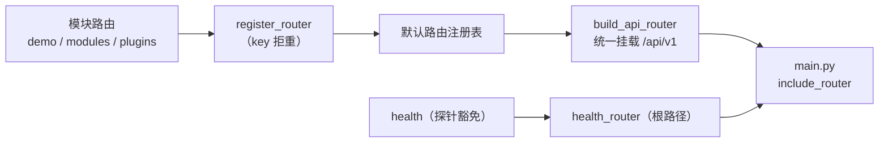

# 接口路由基座详细设计

> 项目骨架 · 02 后端基座 · 06 接口层基座 · 01 接口路由基座 · 详细设计

[文档首页](../../../../../../../文档首页.md) › [02-6-1 接口路由基座](../02_后端基座_06_接口层基座_01_接口路由基座.md) › 01 详细设计　|　[← 父任务](../02_后端基座_06_接口层基座_01_接口路由基座.md)

## 1. 概述 <a id="overview"></a>

- **目标**：落地接口层统一路由基座——`app/api/base.py` 的 `BaseRouter`（继承 FastAPI `APIRouter` + `BaseObject`，统一前缀 / tags / 响应模型 / 统一错误响应文档 / 元信息）、`RouterRegistry`（路由登记唯一性与统一挂载）、参数绑定依赖工厂（`page_query` / `sort_query` / `cursor_query`，复用 `BasePageQuery` / `BaseSortQuery` / `BaseCursorQuery`）与鉴权依赖占位（`require_auth`，真实随认证阶段）；既有模块路由（demo / modules / plugins / health）改经基座，`api/router.py` 由手工 `include_router` 改为基座统一挂载。
- **范围**：`app/api/base.py`（新增）、`app/api/router.py`、`app/api/demo.py`、`app/api/modules.py`、`app/api/plugins.py`、`app/api/health.py`、`app/main.py`（挂载前缀归基座）、单测；架构 09「公共约定」/ 04「基类清单与继承链」、《后端基类清单》/《后端开发规范》/ 计划 / 需求 02-55 登记。
- **不含**（归后续阶段）：真实登录态解析与权限校验（`require_auth` / `require_permission` 真实实现随**认证 / RBAC 阶段**）；筛选契约 `FilterSpec` / `BaseFilterQuery`（归 [02-4-20 列表查询与偏好契约基座](../../../02_后端基座_04_跨阶段基座/02_后端基座_04_跨阶段基座_20_列表查询与偏好契约基座/02_后端基座_04_跨阶段基座_20_列表查询与偏好契约基座.md)）；开放接口 `/api/open` 独立前缀与限流（随开放接口阶段）；响应压缩 / 版本化（`/api/v2`）等。
- **依据**：需求 [02-55](../../../../../需求/02_需求_后端基座.md#r02-55)、《[架构设计 · 接口与集成](../../../../../../../设计/架构设计/09_架构设计_接口与集成.md)》「公共约定」节、《[架构设计 · 后端基础类体系](../../../../../../../设计/架构设计/04_架构设计_后端基础类体系.md)》「各层基类与模块约定」节、《[后端开发规范](../../../../../../../规范/后端开发规范.md)》「分层职责」「后端基座体系」节、《[API接口规范](../../../../../../../规范/API接口规范.md)》「统一响应」「参数与分页」节、《[命名规范](../../../../../../../规范/命名规范.md)》「后端命名」节。

## 2. 现状与差距 <a id="gap"></a>

| 现状 | 差距 |
| --- | --- |
| 各模块路由直接 `APIRouter(prefix=..., tags=[...])`（`demo.py` / `modules.py` / `plugins.py` / `health.py`）；`api/router.py` 手工 `include_router`；`main.py` 加 `/api/v1` 前缀 | 无统一路由基类：前缀 / tags / 响应模型 / 错误响应文档 / 元信息各处自定；新增模块路由挂载靠手工改 `router.py`，与「主体内建必须继承」铁律不对称 |
| `ApiResponse`、全局异常处理器（`api/errors.py`：`BizError` / 校验 / 未捕获）、`dept` 提供者汇总（`api/deps.py`）已就位 | 统一响应 / 异常口径分散在处理器，路由侧无「统一错误响应文档」入口，OpenAPI 契约不含统一错误响应 |
| `BasePageQuery` / `BaseSortQuery` / `BaseCursorQuery` 请求契约已就位（02-2-5） | 分页 / 排序参数无统一 `Depends` 绑定工厂，各列表路由重复声明 `page` / `size` / `order_by` / `order` |
| `require_permission(code)` 依赖工厂已就位（02-3-9）；无登录态依赖 | 鉴权依赖（登录态）无占位落点，路由无法统一挂接；真实实现随认证阶段 |
| 筛选参数序列化口径已在《API接口规范》「参数与分页」节定案（字段直传 / 多值逗号 / 区间 `*_start`·`*_end` / 布尔 1·0） | 筛选契约类归 02-4-20；本任务只落通用参数绑定机制，不重复定义筛选契约 |

## 3. 交付物清单 <a id="tree"></a>

```text
backend/
├── app/api/base.py                        # 新增：API_PREFIX / DEFAULT_RESPONSES / BaseRouter / RouterRegistry / register_router / build_api_router / page_query·sort_query·cursor_query / require_auth
├── app/api/router.py                      # 修改：改经 register_router + build_api_router 统一挂载（health 单独挂根）
├── app/api/demo.py                        # 修改：router 改 BaseRouter（key=demo）
├── app/api/modules.py                     # 修改：router 改 BaseRouter（key=modules）
├── app/api/plugins.py                     # 修改：router 改 BaseRouter（key=plugins）
├── app/api/health.py                      # 修改：router 改 BaseRouter（key=health，探针豁免统一前缀）
├── app/main.py                            # 修改：include api_router（前缀归基座）/ health_router
└── tests/
    └── api/test_router_base.py            # 新增：Kiwi 779（基类继承 / 默认响应 / 注册唯一性 / 统一挂载 / 参数绑定 / 鉴权占位）

bms文档/
├── 设计/架构设计/09_架构设计_接口与集成.md          # 修改：「公共约定」补接口路由基座口径
├── 设计/架构设计/04_架构设计_后端基础类体系.md      # 修改：§4 基类清单 + §9 接口层基座登记
├── 后端基类清单.md                                  # 修改：新增「接口层基座」节 + §10 继承链 / 目录
├── 规范/后端开发规范.md                              # 修改：「后端基座体系」节补路由基座强制口径
├── 项目/01_项目骨架/计划/01_计划_项目骨架.md        # 修改：§3.1 后续阶段待办（真实鉴权行，已在立项登记）+ 02_06 偏差跟踪
├── 项目/01_项目骨架/需求/02_需求_后端基座.md        # 修改：需求 02-55 补实现期要点注块（实施后）
├── 项目/01_项目骨架/需求/00_需求_项目骨架.md        # 修改：需求总览 02-55 状态（实施后）
├── 项目/…/02_后端基座_06_接口层基座/…06….md         # 修改：参考文档补本设计 / 实施 / 测试链接（实施后）
└── 项目/…/02_后端基座/02_后端基座.md                # 修改：子任务清单 06 状态 / 完成日期回写（实施后）
```

## 4. 接口路由基座（`app/api/base.py`） <a id="router-base"></a>

| 成员 | 形态 | 说明 |
| --- | --- | --- |
| `API_PREFIX` | `str` 常量，`"/api/v1"` | 内部接口统一前缀（单一登记；`main.py` 不再重复传前缀） |
| `DEFAULT_RESPONSES` | `Mapping[int, dict[str, object]]` | 统一错误响应文档（401 / 403 / 404 / 429 / 500 → `ApiResponse` 形态），供 OpenAPI 与路由默认 `responses` |
| `BaseRouter` | 类（继承 `APIRouter` + `BaseObject`） | 统一模块路由基类：抽象类属性 `key`（路由模块标识）+ 统一前缀 / tags / 默认错误响应 / 元信息 |
| `BaseRouter.__init__(*, key="", prefix="", tags=(), dependencies=None, responses=None, **kwargs)` | 构造 | `key` 缺省取类属性；`responses` 与 `DEFAULT_RESPONSES` 合并（调用方优先）；其余透传 `APIRouter` |
| `BaseRouter.describe()` | 方法 | 元信息：`{key}（{N} 条路由）` |
| `RouterRegistry` | 类（继承 `BaseObject`） | 路由登记表：`register`（重复键拒重）/ `routers` / `keys` / `mount(parent, *, prefix="")` |
| `register_router(router)` / `router_registry()` | 模块函数 | 登记到进程级默认注册表 / 取默认注册表 |
| `build_api_router(*, prefix=API_PREFIX)` | 模块函数 | 新建父 `APIRouter`，把默认注册表全部路由挂到 `prefix` 下（**统一挂载**） |
| `page_query(...)` / `sort_query(...)` / `cursor_query(...)` | `Depends` 工厂 | 复用 `BasePageQuery` / `BaseSortQuery` / `BaseCursorQuery` 统一绑定分页 / 排序 / 游标参数 |
| `require_auth()` | 依赖（占位） | 登录态依赖占位：当前**恒定放行**（不解析 Bearer），真实随认证阶段；供路由统一挂接 |

**口径**：

| 情形 | 处置 |
| --- | --- |
| 继承链 | `BaseRouter → APIRouter + BaseObject`（混合第三方 Web 框架，与 `BaseSchema → pydantic.BaseModel + BaseObject` 同类先行）；`RouterRegistry → BaseObject` |
| 路由标识 | `BaseRouter.key` 路由模块唯一键（`demo` / `modules` / `plugins` / `health`）；注册表以 `key` 拒重（`ConflictError` 10003） |
| 统一前缀 | 业务路由统一挂 `/api/v1`（`API_PREFIX`）；探针路由（`health`）豁免前缀、挂根路径（《API接口规范》「探针豁免」） |
| 默认错误响应 | `responses` 默认合并 `DEFAULT_RESPONSES`；调用方可覆盖同名状态码 |
| 参数绑定 | 分页 / 排序 / 游标参数统一经 `Depends(page_query)` / `Depends(sort_query)` / `Depends(cursor_query)`；筛选参数按《API接口规范》字段直传口径（契约类归 02-4-20） |
| 统一响应 / 异常 | 沿用 02-3-1 已落地的 `ApiResponse` + `api/errors.py` 全局处理器（**不重复实现**）；路由基座只补统一错误响应文档 |
| 鉴权占位 | `require_auth` 恒定放行（占位）；权限码校验沿用 `require_permission(code)`（02-3-9）；真实登录态随认证阶段 |
| 挂载时机 | `api/router.py` 导入模块路由 → `register_router` 登记 → `build_api_router()` 统一挂载；应用工厂 `main.py` 仅 `include_router(api_router)` / `include_router(health_router)` |



## 5. 应用装配与依赖注入 <a id="di"></a>

| 位置 | 变更 |
| --- | --- |
| `app/api/demo.py` / `modules.py` / `plugins.py` | `router = BaseRouter(key=..., prefix=..., tags=[...])`（行为不变，仅换基类） |
| `app/api/health.py` | `router = BaseRouter(key="health")`（无前缀；探针豁免统一前缀，单独挂根） |
| `app/api/router.py` | 导入模块路由并 `register_router(...)`；`api_router = build_api_router()`；`health_router` 单独 `include_router(health.router)` |
| `app/main.py` | `app.include_router(api_router)`（前缀已归基座）+ `app.include_router(health_router)` |

- 本任务**不新增 DI 提供者**（`get_demo_service` / `get_module_registry` 等既有依赖不变；`api/deps.py` 无需新增导出）。
- `require_auth` 为普通依赖函数（读请求态，占位无 IO）；真实认证阶段替换为 token 解析依赖时调用面零改动。

## 6. 继承与分层 <a id="base"></a>

- `BaseRouter → APIRouter + BaseObject`；`RouterRegistry → BaseObject`。
- 混合第三方 Web 框架与 `BaseSchema → (pydantic.BaseModel, BaseObject)` 同类（《后端开发规范》「多重继承克制」节例外口径需同步补「接口路由基类」）。
- 无新增数据契约（统一响应沿用 `ApiResponse`；参数绑定沿用既有分页 / 排序契约）。

## 7. 登记落点 <a id="register"></a>

| 落点 | 登记内容 |
| --- | --- |
| 《架构设计 · 接口与集成》「公共约定」节 | 补「接口路由基座」口径：模块路由一律继承 `BaseRouter`，统一前缀 + 统一挂载 + 统一参数绑定 + 统一错误响应文档；探针豁免 |
| 《架构设计 · 后端基础类体系》§4 基类清单与继承链 | 新增 `BaseRouter` / `RouterRegistry` 行（`api/base.py`，职责与状态）+ 继承链；接口层基座登记 |
| 《后端基类清单》 | 新增「接口层基座」节（`BaseRouter` / `RouterRegistry` / 参数绑定工厂 / `require_auth`）+ §10 继承链与目录补 `app/api/base.py` |
| 《后端开发规范》「后端基座体系」节 | 补强制口径：模块路由一律继承 `BaseRouter` 并登记默认注册表，禁止裸建 `APIRouter` / 手工拼前缀；分页 / 排序参数走统一 Depends 工厂 |
| 计划《01_计划_项目骨架》§3.1 + 02_06 偏差跟踪 | 「接口路由基座真实实现（登录态 / 权限依赖接入）」行（已在立项登记）；02_06 表「偏差与遗留」补 02-6-1 |
| 需求 [02-55](../../../../../需求/02_需求_后端基座.md#r02-55) / 需求总览 | 参考文档后补 `> 注：实现期要点` 块；实施完成后回写状态 / 完成日期 |
| 02-6-1 / 02_06 任务文档 | 参考文档补本设计 / 实施 / 测试链接；实施后回写状态 / 完成日期 |

## 8. 测试设计（Kiwi 779 先行） <a id="tests"></a>

用例**先登记 Kiwi TCMS 再编码**；本任务新分配 **Kiwi 779**（平台登记后回填编号，题面与平台一致）：

| Kiwi | 用例 | 断言要点 | 自动化文件 |
| --- | --- | --- | --- |
| 779 | 契约继承与标识 | `BaseRouter → APIRouter` 且 `→ BaseObject`；`RouterRegistry → BaseObject`；`key` / `describe()` | `tests/api/test_router_base.py` |
| 779 | 默认错误响应 | `BaseRouter()` 的 `responses` 含 `DEFAULT_RESPONSES`；调用方 `responses` 覆盖同名状态码 | 同上 |
| 779 | 注册与唯一性 | `register` 同 `key` 拒重（`ConflictError`）；`keys` / `routers` 保序 | 同上 |
| 779 | 统一挂载 | `build_api_router()` 把注册路由挂到 `API_PREFIX`；探针路由（health）根路径可达 | 同上 |
| 779 | 参数绑定 | `Depends(page_query)` / `sort_query` / `cursor_query` 正确解析 `page` / `size` / `order_by` / `order` / `cursor` / `limit` 并回带请求契约 | 同上 |
| 779 | 统一响应 / 异常 | 路由返回 `ApiResponse` 包裹；不存在抛 `NotFoundError` → 404 统一响应 | 同上 |
| 779 | 鉴权占位 | `require_auth` 可解析、恒定放行；`require_permission` 可挂路由级依赖 | 同上 |
| — | 回归 | 既有 `tests/api` / `tests/integration` 全绿（路径前缀不变） | 既有 |

回归：全量 `pytest`（含接口冒烟）；`/docs` 与 `/openapi.json` 可访问。

## 9. 实施步骤 <a id="steps"></a>

1. 新增 `app/api/base.py`（`API_PREFIX` / `DEFAULT_RESPONSES` / `BaseRouter` / `RouterRegistry` / `register_router` / `build_api_router` / `page_query`·`sort_query`·`cursor_query` / `require_auth`）。
2. `demo.py` / `modules.py` / `plugins.py` / `health.py` 路由改 `BaseRouter`。
3. `api/router.py` 改统一登记 + `build_api_router` 挂载；`main.py` 去掉手工前缀。
4. 测试：先登记 Kiwi 779，再写 `tests/api/test_router_base.py`。
5. 登记：架构 09 / 04、《后端基类清单》、《后端开发规范》、计划 §3.1、需求 02-55 注块、需求总览、任务 / 父任务状态。
6. 验证：`uv run pytest --cov=app -q`、`uv run ruff check .`、`uv run ruff format --check .`、`uv run pyright` 全绿；`python3 scripts/tools/base-check/check-base.py` 与 `check-backend-base.py` 通过。
7. 回写：实施 / 测试记录 + 任务（02-6-1、02_06）与需求 02-55 状态、计划表。
8. 收尾：按「处理偏差与遗留」套路闭环后提交（推送另议）。

## 10. 验收映射 <a id="accept-map"></a>

| 完成标准（需求 02-55 / 任务 02-6-1） | 验证方式 |
| --- | --- |
| 路由基类与注册 / 统一挂载就位、现有模块路由改经基座 | `BaseRouter` / `RouterRegistry` 落地 + 既有路由改基座 + Kiwi 779 |
| 分页 / 排序 / 筛选参数绑定口径可核对 | `page_query` / `sort_query` / `cursor_query` 用例（筛选口径登记《API接口规范》） |
| 统一响应 / 异常口径收口 | `ApiResponse` + 全局处理器断言 + 默认错误响应文档 |
| 依赖注入可解析、应用可启动不报错 | 应用冒烟 + `/api/v1/demos`、`/modules`、`/plugins`、`/healthz`、`/docs` 可达 |
| 不实现真实鉴权 | `require_auth` 恒定放行；无 token 解析实现 |
| 登记齐备 | 架构 09 / 04、《后端基类清单》、《后端开发规范》、计划 §3.1 |
| 无 lint / 类型错误 | `ruff check` / `ruff format --check` / `pyright` |

## 11. 边界与开放项 <a id="boundary"></a>

- **真实鉴权 / 权限**（登录态 token 解析、`require_permission` 真实判定、路由级权限码注入）→ **认证 / RBAC 阶段**；已登记计划 §3.1。
- **筛选契约** `FilterSpec` / `BaseFilterQuery` → **02-4-20 列表查询与偏好契约基座**（本任务只落通用参数绑定工厂）。
- **开放接口 `/api/open`** 独立前缀 / 限流 / 防重放 / scope → 开放接口阶段。
- **响应压缩 / 版本化（`/api/v2`）** → 接口版本演进阶段。
- **探针豁免**：`/healthz` `/readyz` 不纳入 `/api/v1` 前缀与统一响应包裹（既有约定，本任务保持）。
- **测试**：真实鉴权用例随认证阶段补充。

## 12. 对齐记录 <a id="align"></a>

| # | 事项 | 结论 |
| --- | --- | --- |
| 1 | 代码落点 | `app/api/base.py`（接口层基座一域一文件）（用户拍板） |
| 2 | 路由基类 | `BaseRouter` 继承 FastAPI `APIRouter` + `BaseObject`（用户拍板；混合第三方 Web 框架，同类先行） |
| 3 | 注册与挂载 | `RouterRegistry` + `register_router` + `build_api_router` 统一挂载，替换手工 `include_router`（用户拍板） |
| 4 | 参数绑定 | `page_query` / `sort_query` / `cursor_query` 复用既有分页 / 排序契约；筛选契约归 02-4-20（用户拍板） |
| 5 | 统一响应 / 异常 | 沿用 02-3-1 已落地的 `ApiResponse` + 全局处理器，只补默认错误响应文档（用户拍板） |
| 6 | 鉴权 / 权限占位 | `require_auth` 恒定放行占位；权限沿用 `require_permission`；真实随认证 / RBAC 阶段（用户拍板） |
| 7 | 探针路由 | `health` 走 `BaseRouter` 但豁免统一前缀，挂根路径（既有约定） |
| 8 | 既有路由迁移 | demo / modules / plugins / health 全部改经基座，行为与路径不变 |
| 9 | 登记落点 | 架构 09 / 04、《后端基类清单》新增「接口层基座」节、《后端开发规范》、计划 §3.1、需求 02-55 注块、需求总览 |
| 10 | 测试 | 新分配 Kiwi 779（平台登记 + `@pytest.mark.kiwi_id(779)`） |
| 11 | 工时 / 窗口 | 4h；阶段一补做窗口序 0（2026-09-20） |
| 12 | 交付范围 | 一条龙（设计 / 实施 / 测试 / 登记 / 记录 / 提交 / 偏差遗留 / 收尾） |

> 本文档依《文档生成规范》编写 · 关键决策逐项确认
