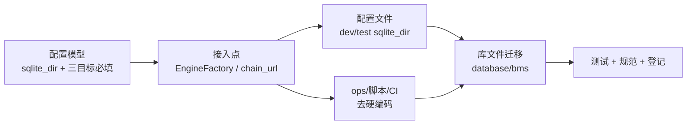

# 数据库落点与配置唯一来源实施记录

> 项目骨架 · 03 后端基础能力 · 01 配置管理 · 03-1-1 数据库落点与配置唯一来源 · 实施记录

[文档首页](../../../../../../../文档首页.md) › [03 后端基础能力](../../../03_后端基础能力.md) › [01 配置管理](../../03_后端基础能力_01_配置管理.md) › [数据库落点与配置唯一来源](../03_后端基础能力_01_配置管理_01_数据库落点与配置唯一来源.md) › 实施　|　[← 父任务](../../03_后端基础能力_01_配置管理.md)

## 1. 实施信息 <a id="meta"></a>

| 项 | 值 |
| --- | --- |
| 任务 | [03-1-1 数据库落点与配置唯一来源](../03_后端基础能力_01_配置管理_01_数据库落点与配置唯一来源.md) |
| 对应需求 | [03-4](../../../../../需求/03_需求_后端基础能力.md#r03-4) |
| 详细设计 | [01_详细设计_01_数据库落点与配置唯一来源](../设计/01_详细设计_01_数据库落点与配置唯一来源.md) |
| 实施日期 | 2026-10-05 |
| 实施人 | minjian |
| 实施环境 | 开发机（Ubuntu，Python 3.14 / uv） |
| 提交 | 详细设计 / 代码 / 文档待提交（经用户指令后执行） |
| 结论 | 完成 |

## 2. 实施概览 <a id="overview"></a>



结果小结：新增 `[database].sqlite_dir` 基址并接入引擎 / 迁移解析出口，移除代码兜底默认 URL；dev / test 库目录分别订到工作区根 `database/bms`（/test）；ops / 开发脚本 / CI 去硬编码；本地库文件（含两个备份目录）迁移到位、子目录重复副本按拍板删除；《AI开发规范》三处固化纪律。受影响的 `bms_core` 定向用例、`ruff`、`pyright`、`preflight --fast` 全绿。

## 3. 实施过程 <a id="process"></a>

1. **Kiwi 先登记**：在 Kiwi TCMS 登记用例 **2244**（产品「BMS 基础管理系统」/ 分类「平台骨架」/ 优先级 P2 / 状态 CONFIRMED / 标签「自动化」），覆盖 `sqlite_dir` 解析、三目标必填、引擎 / 迁移接入、ops 缺省读配置与库落点。
2. **配置模型**：`core/config.py` 新增模块级 `resolve_sqlite_dir(url, sqlite_dir)` 与 `DatabaseSettings.sqlite_dir` / `apply_sqlite_dir()`；`tenants` / `archive` 由 `default_factory` 改为必填，移除代码兜底默认 URL。
3. **接入点**：`db/engine.py::EngineFactory._target_url` 三个返回分支统一经 `apply_sqlite_dir`；`db/migration.py::chain_url` 的归档 / 租户回落分支同样归一。
4. **配置文件**：`config.toml` 基线 `sqlite_dir = ""`；`config.dev.toml` `../../database/bms`；`config.test.toml` `../../database/bms/test`；`.env.example` 列入该键。
5. **ops**：`check_tables` / `check_modules` 缺省读配置解析（复用 `ops.seed_tenant.resolve_url(service=PLATFORM_SERVICE_KEY)`），`--url` 可选覆盖，新增 `--offline`；`seed_*` / `check_*` 文档串示例去除写死库路径。
6. **开发脚本**：`本地全套.sh` 新增 `DB_DIR`，`cmd_seed` 去 `--url` 走配置、`reset_db` 扫 `database/bms` 备份到同目录、`cmd_unlock` 经 `EngineFactory` 解析库文件路径。
7. **CI**：`backend-modules` job 增 `BMS_ENV=test`，去除 `-x url` / `--url`，编排为「`--offline` 离线断言 → 迁移 → 种子 → 缺省接库校验」。
8. **忽略与迁移**：工作区根 `.gitignore` 与 `bms/.gitignore` 加 `database/`；backend 根 12 库文件 + 两个 `.db-backup-*` 移入 `database/bms`，子目录 6 个同名重复副本按拍板删除；`backend/README.md` 同步。
9. **规范与文档**：《AI开发规范》「红线与纪律」/「数据库与表设计的处理方式」/「检查清单」写入；需求 03-4、任务 03-1-1、父任务 03-1 子任务清单、域总览状态、需求总览计数与补充记录回写。
10. **测试**：新增 `tests/db/test_sqlite_dir.py`，更新 `tests/core/test_config.py`（最小配置补三目标 + `sqlite_dir` 用例）与 `tests/ops/test_check_{modules,tables}.py`（`--offline` 与缺省读配置用例）。

关键命令：

```bash
uv run pytest libs/bms_core/tests -q
uv run ruff check . && uv run ruff format --check .
uv run pyright
python3 scripts/tools/preflight/check-preflight.py --fast
```

## 4. 问题与处置 <a id="issues"></a>

| 问题 / 现象 | 原因 | 处置与落点 |
| --- | --- | --- |
| ops 校验用例失败（离线默认变接库） | `check_tables` / `check_modules` 缺省语义由「离线」改「读配置接库」 | 用例改传 `--offline`；补「缺省读配置接库」新用例（`_fake_url` 替身 + 种库） |
| pyright 严格模式对 lambda 报未知类型 | `monkeypatch.setattr(..., lambda *args, **kwargs: ...)` 参数部分未知 | 改为具名类型化替身函数 `_fake_url(_url: str = "", *, service: str = "")` |
| 最小配置用例缺租户 / 归档目标 | 三目标改必填（移除代码兜底） | `test_config.py` 最小配置夹具补 `[database.tenants]` / `[database.archive]` |
| 子目录与根同名库文件冲突 | 历史以服务目录为 CWD 运行残留的杂散副本 | 按用户拍板「根为权威」删除子目录重复副本；迁移后不再生成 |

## 5. 验证结果 <a id="verify"></a>

| 完成标准 | 验证方法 | 实测结果 |
| --- | --- | --- |
| 改 `sqlite_dir` 一处即切库、全链路跟随 | 配置解析实测 + 单测 | 通过（`EngineFactory.resolve_url` / `chain_url` 落 `database/bms`） |
| 全仓无写死 SQLite 连接串 / 库路径 | `rg` 检索（排除测试与文档） | 通过（仅剩测试夹具与文档说明） |
| `bms/backend` 下无 `*.db`、统一 `database/bms` | `find` 核对 | 通过（backend 下无库文件） |
| dev / test 分别落 `database/bms`(`/test`) | 配置核对 | 通过 |
| CI 无写死 URL | `.gitlab-ci.yml` 核对 | 通过（走 `BMS_ENV=test` + 配置） |
| 定向用例 / 静态门禁 / 预检 | pytest / ruff / pyright / preflight --fast | 通过（`preflight --fast` 仅「界面：check-prototype-review」一项失败，系本地领先 `origin/main` 的既有前端改动（非本次改动）所致；其余全绿。详见[测试记录](../测试/01_测试_01_数据库落点与配置唯一来源.md)） |

## 6. 偏差与遗留 <a id="deviations"></a>

- **范围外拍板**：子目录同名库副本处理为范围外破坏性取舍，经用户确认「根为权威、删除副本」。
- **CI 语义变更**：`backend-modules` 由「临时库 `bms_ci_catalog.db`」改为「`config.test.toml` 解析到 `database/bms/test`」，属设计预期；CI 该 job 需按路径触发或手动跑一次验证。
- **迁移仅本地生效**：库文件被忽略、不入库，其他开发机需各自平移（文档已写明映射关系与目录锚点）。
- **结论**：本任务偏差已记录、无未闭环遗留。
