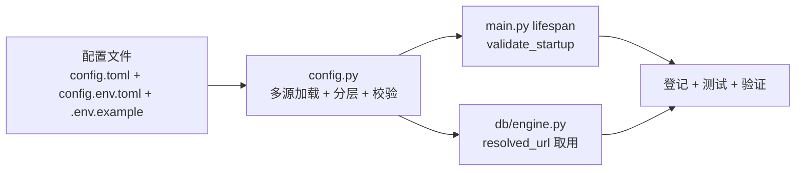

# 配置管理实施记录

> 项目骨架 · 03 后端基础能力 · 01 配置管理 · 实施记录

[文档首页](../../../../../../文档首页.md) › [03-1 配置管理](../03_后端基础能力_01_配置管理.md) › 实施　|　[← 父任务](../03_后端基础能力_01_配置管理.md)

## 1. 实施信息 <a id="meta"></a>

| 项 | 值 |
| --- | --- |
| 任务 | [01 配置管理](../03_后端基础能力_01_配置管理.md) |
| 对应需求 | [03-1](../../../../需求/03_需求_后端基础能力.md#r03-1) |
| 详细设计 | [01_详细设计_01_配置管理](../设计/01_详细设计_01_配置管理.md) |
| 实施日期 | 2026-09-14 |
| 实施人 | minjian |
| 实施环境 | 开发机（Ubuntu，Python 3.14 / uv） |
| 提交 | 详细设计 `ad04253`；实施 `9b548c7`；ConfigError 系列 `2db6d40` / `241a6dc`；偏差闭环代码 `25837ec`；闭环文档随后续提交 |
| 结论 | 完成 |

## 2. 实施概览 <a id="overview"></a>



结果小结：`app/core/config.py` 落 pydantic-settings 多源加载（基线 `config.toml` → 环境覆盖 `config.{env}.toml` → `backend/.env` → `BMS_` 环境变量）、四类启动失败路径与 `validate_startup`（prod 密钥 + WorkerId 接线）；`pytest` / `ruff` / `pyright` / `base-check` 全绿，`config.py` 覆盖率 100%（Kiwi 62）。

## 3. 实施过程 <a id="process"></a>

1. **Kiwi 先登记**：在 Kiwi TCMS 登记 03-1 用例一条并取得编号 **62**（产品「BMS 基础管理系统」/ 分类「平台骨架」/ 优先级 P2 / 状态 CONFIRMED / 标签「自动化」），覆盖加载、分层、覆盖、四类失败路径、prod 校验与 WorkerId 接线。
2. **配置文件**：`config.toml` 填基线分区与关键键（逐项中文注释、无密钥）；新增 `config.dev.toml` / `config.test.toml` / `config.prod.toml` 三份环境覆盖；新增 `.env.example` 列全部 `BMS_` 应用键（密钥占位留空）。
3. **配置实现**：重写 `app/core/config.py`——`Settings` 多重继承 `pydantic_settings.BaseSettings` + 本地 `BaseSettings`；`_EnvSelectorSource` 强制回写 `app.env`；`settings_customise_sources` 组装源并 `deep_merge`；`_resolve_environment` 解析生效环境；`load_settings` / `get_settings`（首次取用即加载校验）；`validate_startup`（prod 密钥 + `configure_id_generator`）；`DatabaseTargetSettings.resolved_url()` 兼容密码分字段。
4. **依赖**：`pyproject.toml` 显式声明 `python-dotenv>=1.0`（读取 `backend/.env` 的 `BMS_ENV`；原为 pydantic-settings 传递依赖）并 `uv lock`。
5. **集成**：`main.py` lifespan 调 `validate_startup(get_settings())`；`db/engine.py` 改用 `target.resolved_url()`。
6. **测试**：`tests/conftest.py` 增 autouse 隔离夹具（清 `BMS_` 环境变量、置 `env_file=None`、清配置缓存）；`tests/core/test_config.py` 保留 Kiwi 32 结构回归并新增 Kiwi 62 真实加载用例。
7. **登记回写**：《架构设计 · 后端基础类体系》§4 表行与 §6 配置基座条目、《后端基类清单》配置基座状态、需求 02-10 注块、`backend/README.md` 目录树、任务 / 需求 / 计划状态。
8. **验证**：`uv run pytest --cov=app -q`、`uv run ruff check .`、`uv run ruff format --check .`、`uv run pyright`、`python3 scripts/tools/base-check/check-base.py` 全绿（详见[测试记录](../测试/01_测试_01_配置管理.md)）。

关键命令：

```bash
uv run pytest --cov=app -q
uv run ruff check .
uv run ruff format --check .
uv run pyright
python3 scripts/tools/base-check/check-base.py
```

## 4. 问题与处置 <a id="issues"></a>

| 问题 / 现象 | 原因 | 处置与落点 |
| --- | --- | --- |
| pyright 严格模式对 `Settings()` 报「缺少必填构造实参」 | 必填模型字段被 pydantic 插件合成为构造必传参数，pydantic-settings 实际从源装配 | `Settings` 内加 `if TYPE_CHECKING` 的 `__init__(**data)` 存根（仅类型检查期生效） |
| `ConfigError` 游离于统一异常体系 | 初版继承内建 `RuntimeError`，未纳入 `BizError` | 纳入统一体系：`core/exceptions.py` 新增 `ConfigError(BizError)`（`ErrorCode.CONFIG=40001`，4xxxx 段，`http_status=500`），`config.py` 改为复用；错误码登记《架构设计 · 接口与集成》「错误码分段」节 |
| `Settings.model_config` 与基类类型不兼容告警 | 本地 `BaseSettings` 用 `ConfigDict`，顶层用 `SettingsConfigDict` | 类定义行加 `# pyright: ignore[reportIncompatibleVariableOverride]` |
| `tomllib.loads().get("app")` 收窄后类型未知 | `isinstance(app, dict)` 收窄为 `dict[Unknown, Unknown]` | 用 `cast("dict[str, Any]", app)` 收窄 |
| `dotenv_values` 返回值类型检查告警（后判定为多余 cast，已移除） | 类型存根解析差异 | 直接 `.get`，运行时类型正确 |
| 私有夹具函数被 pyright 判未使用 | `reportUnusedFunction` 仅报下划线私有函数 | 夹具改名 `isolate_settings`（公共） |
| 旧 Kiwi 32 用例直接构造 `AppSettings(env=...)` | `name` 改为必填后缺参 | 用例补 `name` 实参（结构回归保留） |
| `_EnvSelectorSource.get_field_value` 未被覆盖 | 该源统一在 `__call__` 返回，协议方法运行期不经 | 标 `# pragma: no cover`（协议要求实现） |

## 5. 验证结果 <a id="verify"></a>

| 完成标准 | 验证方法 | 实测结果 |
| --- | --- | --- |
| 三环境按分层覆盖正确加载（缺省 dev） | Kiwi 62 用例 | 通过（dev/test/prod） |
| `BMS_DATABASE__PLATFORM__URL` 覆盖生效 | Kiwi 62 用例 | 通过 |
| 缺必填键 / 类型取值非法 / `BMS_ENV` 非法 / 未知拼错键四类启动失败并指出键名 | Kiwi 62 用例 | 通过 |
| 三环境差异（日志级别、CORS）加载正确 | Kiwi 62 用例 | 通过 |
| 密钥不出现在 `config.toml`、`.env.example`、报错信息 | 代码核对（`_summarize` 不含输入值） | 通过 |
| 全量门禁 | pytest / ruff / pyright / base-check | 374 passed / 2 skipped；All checks passed；0 errors；base-integrity 通过 |

## 6. 偏差与遗留 <a id="deviations"></a>

- **设计补充**：环境覆盖文件 `config.{env}.toml` 与 `.env.example` 为详细设计对需求的补充（需求只锁 `config.toml` 分区与关键键，允许详细设计补充结构），已记录于设计 §14。
- **依赖新增**：`python-dotenv>=1.0` 显式声明（原为 pydantic-settings 传递依赖），用于读取 `backend/.env` 的 `BMS_ENV`；`uv.lock` 已更新。
- **类型检查存根**：`Settings.__init__` 的 `TYPE_CHECKING` 存根为应对 pydantic-settings 与 pyright 严格模式的已知交互，运行期不生效。
- **遗留（已归口）**：prod `security.secret_key` 非空校验与认证阶段密钥形态复核 → 计划 §3.1「安全原语真实实现与依赖注入」行（认证阶段按真实密钥形态复核，当前按非空校验兜底）。
- **处理偏差与遗留（2026-09-14 闭环）**：
  - **WorkerId 旧名移除（用户拍板直接移除）**：删除 `app/core/id.py` 的 `initial_worker_id()` 与 `BMS_WORKER_ID` 导入期兜底，WorkerId 统一经配置 `app.worker_id`（`BMS_APP__WORKER_ID`）启动期 `configure_id_generator` 注入（导入期默认 0）；Kiwi 30 用例调整为「导入期默认 0」；02-4-04 设计 / 实施 / 测试记录与架构 04、《后端基类清单》措辞同步回写。
  - **prod 密钥形态复核**：计划 §3.1「安全原语真实实现与依赖注入」行补注（出处 03-1）；需求 03-1 `> 注：` 块登记。
  - **消费方标注**：[03_02 日志体系](../../03_后端基础能力_02_日志体系/03_后端基础能力_02_日志体系.md)、[03_03 健康检查](../../03_后端基础能力_03_健康检查/03_后端基础能力_03_健康检查.md) 任务文档补「前置契约（已交付）」（配置读取取本任务 `get_settings()`）。
  - **一致性修正**：需求总览 03-1 状态 / 02·03 域计数与 `文档首页.md` 过期状态一并修正。
- **结论**：本任务偏差已记录、遗留已全部登记去向或闭环，偏差与遗留处理完成。
- **跨任务回写（2026-09-14，03-2 日志体系实施期）**：三环境覆盖文件补 `[log].slow_request_ms`（dev 500 / test 1000 / prod 2000）落实「dev 严、prod 松」；设计 §4.4 与 §14 已同步。

> 本文档依《文档生成规范》编写
